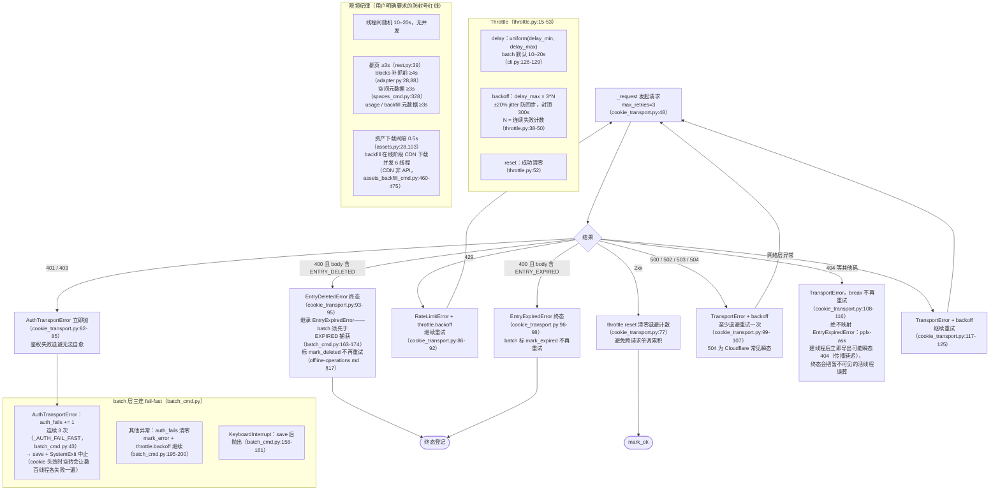

# 속도 제한 및 오류 처리

## 속도 제한 및 오류 처리

두 계층의 속도 제한: `Throttle`(core/throttle.py:15) + `CookieTransport._request`
(core/http/cookie_transport.py:63-126)의 오류 분기; 배치 계층에 추가로 fail-fast.

- **WebBridgeTransport**는 429 백오프 정렬, 성공 시 `throttle.reset()` 초기화
  (bridge_transport.py); 오류 분류는 CookieTransport에 맞춰 정렬됨—401/403 →
  `AuthTransportError`, 400 및 body에 ENTRY_EXPIRED 포함 → `EntryExpiredError`,
  5xx 백오프 재시도, 배치의 인증 fail-fast와 만료 최종 상태는
  `--transport webbridge`에서도 동일하게 적용; 데몬의 비-JSON 응답은
  TransportError로 수렴(URLError/JSONDecodeError/OSError 통합 캐치); 나머지 200이 아닌 응답은 직접
  TransportError.
- **공유 Throttle**: 배치는 동일 인스턴스를 CookieTransport에 전달(cli.py:280-282),
  전송 계층과 배치 계층의 백오프 카운트가 통일됨; **계정 자동 전환 후 재구축해도 손실되지 않음**
  (common.py:139에도 동일하게 전달); 단일 명령 시 전달하지 않으면 CookieTransport가 기본 인스턴스 자체 생성
  (cookie_transport.py:49).
- **하트비트(기본 설정)**. 세 가지 긴 대기—`Throttle.backoff` 수면, 중단된 진행 중 요청
  (`CookieTransport._open_read`), 유휴 `pplx-ask` SSE 스트림(`ask_api.post_stream`)
  —이제 모두 INFO "아직 대기 중" 하트비트를 출력하여 대기를 중단으로 오인하지 않도록 함. 백오프는 분할 수면
  (`Throttle._sleep_with_heartbeat`)으로 수행되며, 각 분할의 합은 동일한 총 시간이므로 리스크 관리
  리듬/예산은 변경되지 않고 가시성만 향상됨; `-v`는 여전히 전체 DEBUG 추적을 포함.
- **`--skip-auth-check` + 지연 검증**. 시작 시 계정 소유 세션 탐지(`common.py`,
  `make_transport`)를 건너뛸 수 있어 네트워크 상태가 나쁠 때 초기 장시간 대기를 방지. 안전망으로 `batch`는
  일반 오류가 누적된 후 일회성 `report_account_status`(`common.py`; `batch_cmd.py`)을 수행하여
  쿠키 만료/계정 불일치/계정 정상(즉, 오류가 네트워크 또는 속도 제한으로 인한 경우)을 알림.
