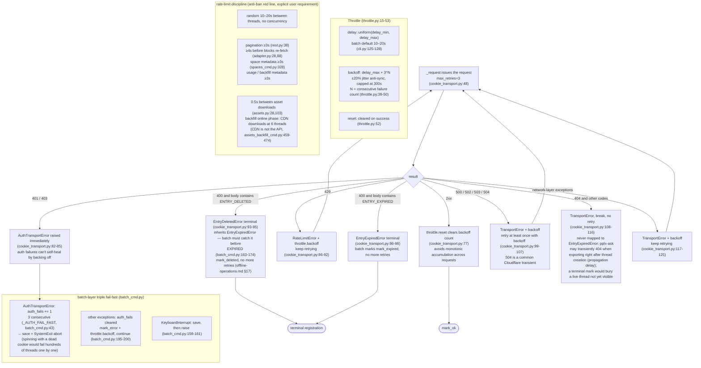

# Rate limiting and error handling

## Rate limiting and error handling

Two layers: `Throttle` (core/throttle.py:15) + error routing in `CookieTransport._request`
(core/http/cookie_transport.py:63-126); plus fail-fast at the batch layer.

- **WebBridgeTransport** aligns 429 backoff and `throttle.reset()` on success
  (bridge_transport.py); error classification aligned with CookieTransport — 401/403 →
  `AuthTransportError`, 400 with body containing ENTRY_EXPIRED → `EntryExpiredError`,
  5xx backoff-retry; batch's auth fail-fast and expired terminal states also apply under
  `--transport webbridge`; daemon non-JSON responses collapse into
  TransportError (URLError/JSONDecodeError/OSError uniformly caught); other non-200s go straight to
  TransportError.
- **Shared Throttle**: batch passes the same instance to CookieTransport (cli.py:279-281),
  unifying backoff counts between transport and batch layers; **rebuilds after account auto-switching don't lose it either**
  (common.py:139 passes it too); single-shot commands that don't pass one get a default instance built by CookieTransport
  (cookie_transport.py:49).
- **Heartbeats (default verbosity).** The three long waits — a `Throttle.backoff`
  sleep, a stalled in-flight request (`CookieTransport._open_read`), and an idle
  `pplx-ask` SSE stream (`ask_api.post_stream`) — now emit INFO "still waiting"
  heartbeats so a wait is never mistaken for a hang. Backoff sleeps in chunks
  (`Throttle._sleep_with_heartbeat`) whose sum equals the same total, so the
  anti-ban pacing/budget is unchanged — only made visible; `-v` still adds the
  full DEBUG trace.
- **`--skip-auth-check` + deferred check.** The startup account-attribution
  session probe (`common.py`, `make_transport`) can be skipped to avoid a long
  startup wait on a poor network. As a safety net, `batch` runs a one-time
  `report_account_status` (`common.py`) once generic errors accumulate
  (`batch_cmd.py`), warning whether the cookie is expired, the account
  mismatches, or the account is fine (so errors are network / rate-limit).
