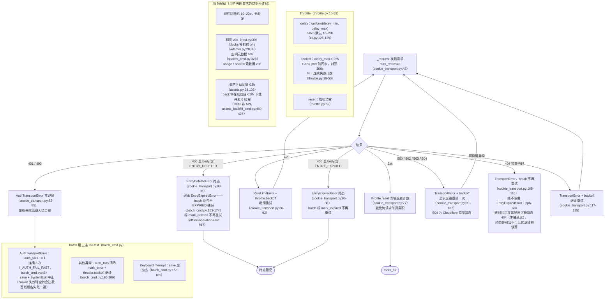

# 限频与错误处理

## 限频与错误处理

两层限频：`Throttle`（core/throttle.py:15）+ `CookieTransport._request`
（core/http/cookie_transport.py:63-126）的错误分流；批量层再加 fail-fast。

- **WebBridgeTransport** 对齐 429 退避、成功 `throttle.reset()` 清零
  （bridge_transport.py）；错误分类已对齐 CookieTransport——401/403 →
  `AuthTransportError`、400 且 body 含 ENTRY_EXPIRED → `EntryExpiredError`、
  5xx 退避重试，batch 的鉴权 fail-fast 与 expired 终态在
  `--transport webbridge` 下同样生效；daemon 非 JSON 响应收敛为
  TransportError（URLError/JSONDecodeError/OSError 统一捕获）；其余非 200 直接
  TransportError。
- **共享 Throttle**：batch 把同一实例传给 CookieTransport（cli.py:280-282），
  传输层与批量层的退避计数统一；**账户自动切换后重建也不丢**
  （common.py:139 同样传入）；单条命令不传时 CookieTransport 自建默认实例
  （cookie_transport.py:49）。
