<a id="subagents-and-interruptions" data-pplx-source-anchor="true"></a>
# الوكلاء الفرعيون والمقاطعات

---

<a id="attribution-waterfall-deterministic-attribution-of-background-subagent-payloads" data-pplx-source-anchor="true"></a>
## شلال الإسناد (الإسناد الحتمي لحمولات الوكلاء الفرعيين الخلفية)

يتم عرض كل `workflow_payload` خلفي متداخل في مكان واحد بالضبط، وليس مرتين أبدًا؛ هنا يتم تأسيسه في دوال القرار وهياكل البيانات. تعيش المستويات الثلاثة جميعها في `parsers.py`؛ نقطة التثبيت هي
`adapter.get_thread` (adapter.py:150-157، computer/council فقط):

```mermaid
flowchart TD
    BG["top-level nested workflow_payload of background_entries<br/>(_iter_top_wf_payloads, parsers.py:343<br/>top level only, no recursion — nested payloads render with their parent, preventing double counting)"]

    BG --> L1{"① main-entry anchor hit?<br/>_anchored_payload_ids (parsers.py:369)<br/>run_subagent steps of main entries<br/>carry a workflow_payload with the same id"}
    L1 -->|"yes"| R1["rendered inside the initiating turn<br/>adapter.sub_agents builds sub_map (adapter.py:207-270)<br/>render_wf_step → render_subagent (render.py:404,363)<br/>prompt=objective_chunks concatenation<br/>steps/answer/sources from plain background_entries"]
    L1 -->|"no"| L2{"② subagent_result stub-turn 10s window hit?<br/>match_stub_workflows (parsers.py:385)"}
    L2 -->|"yes"| R2["the stub turn's \"## 子代理工作\" (Subagent work) section<br/>turn.stub_wfs (models.py:131)<br/>_render_nested_wf collapsible block (render.py:46)<br/>answer not backfilled; Answer stays （无）(none)"]
    L2 -->|"no"| R3["③ thread-appendix fallback<br/>collect_unconsumed_background (parsers.py:491)<br/>conv.unconsumed_bgs (models.py:170)<br/>end of conversation.md, \"## 后台任务（未归入轮次）\"<br/>(Background tasks (unassigned to turns))<br/>render_bg_appendix (render.py:601)"]

    R1 -.-> ONE(["each payload lands in exactly one place<br/>never rendered twice"])
    R2 -.-> ONE
    R3 -.-> ONE
```

تفاصيل المستوى:

- **① المرساة**: يستخدم `_anchored_payload_ids` `_iter_wf_payloads` (parsers.py:327،
  نزول تكراري) لجمع جميع معرفات الحمولة المرساة بالفعل بواسطة الإدخالات الرئيسية. تأتي الحالة الحقيقية للوكيل الفرعي من الجانب الخلفي —
  يملأ `adapter.sub_agents` `SubAgent.status/locked_reason` من `workflow_block.status`/`locked_reason` للإدخال الخلفي
  (adapter.py:227-244)، لأن حالة جانب المرساة قد تتأخر
  (لوحظ cfca382d: المرساة COMPLETED بينما الخلفية CANCELED).
- **② نافذة الجذع**: دورة جذعية = `trigger=="subagent_result"` ولا تحتوي الكتل على خطوات سير عمل
  (parsers.py:422). المرشحون هم الحمولات عالية المستوى المتبقية بعد ①؛ جميع الأزواج ذات `|background completion time − stub creation time| ≤ 10s`
  يتم مطابقتها جشعًا بترتيب تصاعدي للفارق الزمني؛ تضمن مجموعة `used_cand` **استهلاك كل خلفية مرة واحدة على الأكثر**
  (parsers.py:452-467)؛ يمكن لجذع واحد امتصاص وكلاء متعددين. وقت الإكمال يأخذ `payload.completed_at`،
  مع الرجوع إلى وقت تحديث الإدخال الخلفي عند فقدانه (التشغيلات المقاطعة ليس لديها بالضرورة إشعار إكمال، parsers.py:444-446).
- **③ الملحق**: يؤرشف `collect_unconsumed_background` حرفيًا كل حمولة عالية المستوى متبقية بعد الاستبعاد المزدوج لـ
  ① المرساة و ② المستهلكة (parsers.py:491-532) — المهام الخلفية المقاطعة
  لا تنتج إشعار إكمال subagent_result، لذا فإن المستويين الأولين يفتقدانها بالضرورة؛ الحالة غير مقيدة
  (AWAITING/CANCELED/COMPLETED/قيم مستقبلية). الموضع ثابت في نهاية conversation.md،
  لا تخمين إسناد زمني، لا شيء ملحق بـ turns/ (الملحق على مستوى الخيط، render.py:601-638).

---

<a id="interruption-semantics-state-diagram" data-pplx-source-anchor="true"></a>
## رسم بياني لحالات دلالات المقاطعة

مصدر الحقيقة الموحد `parsers.classify_wf_status` (parsers.py:263-284): حالة سير العمل +
locked_reason → خمس فئات. ثلاثة مسارات استهلاك تشترك في نفس نتيجة التصنيف؛ COMPLETED لا يتم شرحها أبدًا
(الخيوط السليمة تحصل على فرق صفري).

```mermaid
stateDiagram-v2
    state "completed" as c1
    state "limit_interrupted" as c2
    state "awaiting" as c3
    state "canceled" as c4
    state "other (unknown value)" as c5
    state "silent: no annotation / no registration / no alert" as quiet
    state "annotation: wf_status_tag (parsers.py:294-299)" as tag
    state "render consumption: work-process headings (render.py:540-541) / subagent headings (render.py:367-368) / nested details summary (render.py:116-119)" as consume1
    state "registration consumption: thread.json.interruptions (parsers.py:535; written fs_writer.py:242-244; key absent without interruptions)" as consume2
    state "alert consumption: scan_wf_anomalies → log.warning (parsers.py:646; adapter.py:131-134)" as consume3
    state "resume overwrite: lastUpdated change → plan_incremental judges updated → incremental re-fetch (no special-case code)" as cont

    [*] --> c1 : status empty / COMPLETED / WORKFLOW_COMPLETED (parsers.py:278-279)
    [*] --> c2 : WORKFLOW_AWAITING_NEXT_STEPS + locked_reason=spending_limit_exceeded (parsers.py:280-281)
    [*] --> c3 : WORKFLOW_AWAITING_NEXT_STEPS without locked_reason
    [*] --> c4 : WORKFLOW_CANCELED (parsers.py:282-283)
    [*] --> c5 : other unknown values (parsers.py:284)

    c1 --> quiet
    c5 --> quiet : no annotation (enum uncovered; rendering undisturbed)
    c2 --> tag : ⏸ limit-interrupted (content stops at the interruption point)
    c3 --> tag : ⏸ interrupted, pending continuation
    c4 --> tag : ⛔ canceled
    tag --> consume1
    tag --> consume2
    c2 --> consume3
    c3 --> consume3
    c4 --> consume3
    c5 --> consume3
    consume2 --> cont : continued by the user after interruption
```



مصادر البيانات والتوزيع الملاحظ (انظر [../reference/api/api-responses-errors.md](../reference/api/api-responses-errors.md) §5.1):

- يظهر `locked_reason` على ثلاثة مستويات: thread_metadata / entries / background_entries؛
  القيمة الوحيدة الملاحظة هي `spending_limit_exceeded`؛ يخزن `parse_turn` القيمة على مستوى الإدخال في
  `turn.metadata["locked_reason"]` (parsers.py:205-208).
- **مصادر الحالة** لنقاط الشرح: مستوى الدورة يستخدم `turn.metadata["wf_status"]`
  (مثبت بواسطة attach_workflow_blocks، parsers.py:256)؛ الوكلاء الفرعيون يستخدمون الحالة الحقيقية من الجانب الخلفي
  (`SubAgent.status`، adapter.py:257-260)؛ إدخالات الملحق تستخدم حالة الحمولة نفسها.
- كل إدخال `thread.json.interruptions` هو `{location, kind, headline, status}`؛
  الموقع على شكل `turn_0007` / `turn_0011/subagent` / `turn_0024/subagent_stub` /
  `background_unassigned` (parsers.py:535-583).
- يمكن لإعادة العرض `--thread-json` إضافة/إزالة هذا المفتاح دون اتصال في المكان (rerender_cmd.py:141-169، انظر [§12](offline-operations.md)).
