<a id="subagents-and-interruptions" data-pplx-source-anchor="true"></a>
# Subagents und Unterbrechungen

---

<a id="attribution-waterfall-deterministic-attribution-of-background-subagent-payloads" data-pplx-source-anchor="true"></a>
## Attributions-Wasserfall (deterministische Zuordnung von Hintergrund-Subagent-Payloads)

Jeder hintergrundverschachtelte `workflow_payload` wird an genau einer Stelle gerendert, nie zweimal; hier ist er in Entscheidungsfunktionen und Datenstrukturen verankert. Alle drei Ebenen befinden sich in `parsers.py`; der Einhängepunkt ist
`adapter.get_thread` (adapter.py:150-157, nur computer/council):

```mermaid
flowchart TD
    BG["top-level nested workflow_payload of background_entries<br/>(_iter_top_wf_payloads, parsers.py:343<br/>top level only, no recursion — nested payloads render with their parent, preventing double counting)"]

    BG --> L1{"① main-entry anchor hit?<br/>_anchored_payload_ids (parsers.py:369)<br/>run_subagent steps of main entries<br/>carry a workflow_payload with the same id"}
    L1 -->|"yes"| R1["rendered inside the initiating turn<br/>adapter.sub_agents builds sub_map (adapter.py:207-270)<br/>render_wf_step → render_subagent (render.py:404,363)<br/>prompt=objective_chunks concatenation<br/>steps/answer/sources from plain background_entries"]
    L1 -->|"no"| L2{"② subagent_result stub-turn 10s window hit?<br/>match_stub_workflows (parsers.py:385)"}
    L2 -->|"yes"| R2["the stub turn's \"## 子代理工作\" (Subagent work) section<br/>turn.stub_wfs (models.py:131)<br/>_render_nested_wf collapsible block (render.py:46)<br/>answer not backfilled; Answer stays （无）(none)"]
    L2 -->|"no"| R3["③ thread-appendix fallback<br/>collect_unconsumed_background (parsers.py:491)<br/>conv.unconsumed_bgs (models.py:170)<br/>end of conversation.md, \"## 后台任务（未归入轮次）\"<br/>(Background tasks (unassigned to turns))<br/>render_bg_appendix (render.py:601)"]

    R1 -.-> ONE(["each payload lands in exactly one place<br/>never rendered twice"])
    R2 -.-> ONE
    R3 -.-> ONE
```

Ebenendetails:

- **① Anker**: `_anchored_payload_ids` verwendet `_iter_wf_payloads` (parsers.py:327,
  rekursiver Abstieg), um alle bereits durch die Haupteinträge verankerten Payload-IDs zu sammeln. Der wahre Status eines Subagents kommt von der Hintergrundseite —
  `adapter.sub_agents` füllt `SubAgent.status/locked_reason` aus dem `workflow_block.status`/`locked_reason` des Hintergrundseintrags
  (adapter.py:227-244), da der Ankerseitenstatus nachhinken kann
  (beobachtet cfca382d: Anker COMPLETED während Hintergrund CANCELED).
- **② Stub-Fenster**: ein Stub-Turn = `trigger=="subagent_result"` und Blöcke enthalten keine Workflow-Schritte
  (parsers.py:422). Kandidaten sind die nach ① verbleibenden Top-Level-Payloads; alle Paare mit `|background completion time − stub creation time| ≤ 10s`
  werden gierig in aufsteigender Zeitdifferenz-Reihenfolge abgeglichen; die `used_cand`-Menge garantiert, dass **jeder Hintergrund höchstens einmal verbraucht wird**
  (parsers.py:452-467); ein Stub kann mehrere Agents absorbieren. Die Abschlusszeit nimmt `payload.completed_at`,
  fallback auf die Aktualisierungszeit des Hintergrundseintrags, falls fehlend (unterbrochene Läufe haben notwendigerweise keine Abschlussbenachrichtigung, parsers.py:444-446).
- **③ Anhang**: `collect_unconsumed_background` archiviert wörtlich jeden verbleibenden Top-Level-Payload nach doppeltem Ausschluss von
  ① verankerten und ② verbrauchten (parsers.py:491-532) — unterbrochene Hintergrundaufgaben
  erzeugen keine subagent_result-Abschlussbenachrichtigung, daher verpassen die ersten beiden Ebenen diese notwendigerweise; Status uneingeschränkt
  (AWAITING/CANCELED/COMPLETED/zukünftige Werte). Position fest am Ende von conversation.md,
  keine Zeitattributionsschätzung, nichts an turns/ angehängt (der Anhang ist Thread-Ebene, render.py:601-638).

---

<a id="interruption-semantics-state-diagram" data-pplx-source-anchor="true"></a>
## Zustandsdiagramm der Unterbrechungssemantik

Einheitliche Quelle der Wahrheit `parsers.classify_wf_status` (parsers.py:263-284): Workflow-Status +
locked_reason → fünf Klassen. Drei Konsumpfade teilen sich dasselbe Klassifikationsergebnis; COMPLETED wird nie annotiert
(gesunde Threads erhalten null Diff).

```mermaid
stateDiagram-v2
    state "completed" as c1
    state "limit_interrupted" as c2
    state "awaiting" as c3
    state "canceled" as c4
    state "other (unknown value)" as c5
    state "silent: no annotation / no registration / no alert" as quiet
    state "annotation: wf_status_tag (parsers.py:294-299)" as tag
    state "render consumption: work-process headings (render.py:540-541) / subagent headings (render.py:367-368) / nested details summary (render.py:116-119)" as consume1
    state "registration consumption: thread.json.interruptions (parsers.py:535; written fs_writer.py:242-244; key absent without interruptions)" as consume2
    state "alert consumption: scan_wf_anomalies → log.warning (parsers.py:646; adapter.py:131-134)" as consume3
    state "resume overwrite: lastUpdated change → plan_incremental judges updated → incremental re-fetch (no special-case code)" as cont

    [*] --> c1 : status empty / COMPLETED / WORKFLOW_COMPLETED (parsers.py:278-279)
    [*] --> c2 : WORKFLOW_AWAITING_NEXT_STEPS + locked_reason=spending_limit_exceeded (parsers.py:280-281)
    [*] --> c3 : WORKFLOW_AWAITING_NEXT_STEPS without locked_reason
    [*] --> c4 : WORKFLOW_CANCELED (parsers.py:282-283)
    [*] --> c5 : other unknown values (parsers.py:284)

    c1 --> quiet
    c5 --> quiet : no annotation (enum uncovered; rendering undisturbed)
    c2 --> tag : ⏸ limit-interrupted (content stops at the interruption point)
    c3 --> tag : ⏸ interrupted, pending continuation
    c4 --> tag : ⛔ canceled
    tag --> consume1
    tag --> consume2
    c2 --> consume3
    c3 --> consume3
    c4 --> consume3
    c5 --> consume3
    consume2 --> cont : continued by the user after interruption
```



Datenquellen und beobachtete Verteilung (siehe [../reference/api/api-responses-errors.md](../reference/api/api-responses-errors.md) §5.1):

- `locked_reason` erscheint auf drei Ebenen: thread_metadata / entries / background_entries;
  der einzige beobachtete Wert ist `spending_limit_exceeded`; `parse_turn` speichert den Eintragsebenenwert in
  `turn.metadata["locked_reason"]` (parsers.py:205-208).
- **Statusquellen** für Annotationspunkte: Turn-Ebene verwendet `turn.metadata["wf_status"]`
  (eingehängt durch attach_workflow_blocks, parsers.py:256); Subagents verwenden den wahren Hintergrundseitenstatus
  (`SubAgent.status`, adapter.py:257-260); Anhangseinträge verwenden den eigenen Status des Payloads.
- Jeder `thread.json.interruptions`-Eintrag ist `{location, kind, headline, status}`;
  Ort geformt wie `turn_0007` / `turn_0011/subagent` / `turn_0024/subagent_stub` /
  `background_unassigned` (parsers.py:535-583).
- Neu-Rendering `--thread-json` kann diesen Schlüssel offline an Ort und Stelle hinzufügen/entfernen (rerender_cmd.py:141-169, siehe [§12](offline-operations.md)).
