<a id="subagents-and-interruptions" data-pplx-source-anchor="true"></a>
# Sous-agents et interruptions

---

<a id="attribution-waterfall-deterministic-attribution-of-background-subagent-payloads" data-pplx-source-anchor="true"></a>
## Cascade d'attribution (attribution déterministe des charges utiles des sous-agents en arrière-plan)

Chaque `workflow_payload` imbriqué en arrière-plan est rendu à un seul endroit, jamais deux ; ici, il est ancré dans des fonctions de décision et des structures de données. Les trois niveaux résident dans `parsers.py` ; le point de montage est
`adapter.get_thread` (adapter.py:150-157, computer/council uniquement) :

```mermaid
flowchart TD
    BG["top-level nested workflow_payload of background_entries<br/>(_iter_top_wf_payloads, parsers.py:343<br/>top level only, no recursion — nested payloads render with their parent, preventing double counting)"]

    BG --> L1{"① main-entry anchor hit?<br/>_anchored_payload_ids (parsers.py:369)<br/>run_subagent steps of main entries<br/>carry a workflow_payload with the same id"}
    L1 -->|"yes"| R1["rendered inside the initiating turn<br/>adapter.sub_agents builds sub_map (adapter.py:207-270)<br/>render_wf_step → render_subagent (render.py:404,363)<br/>prompt=objective_chunks concatenation<br/>steps/answer/sources from plain background_entries"]
    L1 -->|"no"| L2{"② subagent_result stub-turn 10s window hit?<br/>match_stub_workflows (parsers.py:385)"}
    L2 -->|"yes"| R2["the stub turn's \"## 子代理工作\" (Subagent work) section<br/>turn.stub_wfs (models.py:131)<br/>_render_nested_wf collapsible block (render.py:46)<br/>answer not backfilled; Answer stays （无）(none)"]
    L2 -->|"no"| R3["③ thread-appendix fallback<br/>collect_unconsumed_background (parsers.py:491)<br/>conv.unconsumed_bgs (models.py:170)<br/>end of conversation.md, \"## 后台任务（未归入轮次）\"<br/>(Background tasks (unassigned to turns))<br/>render_bg_appendix (render.py:601)"]

    R1 -.-> ONE(["each payload lands in exactly one place<br/>never rendered twice"])
    R2 -.-> ONE
    R3 -.-> ONE
```

Détails des niveaux :

- **① Ancre** : `_anchored_payload_ids` utilise `_iter_wf_payloads` (parsers.py:327,
  descente récursive) pour collecter tous les identifiants de charge utile déjà ancrés par les entrées principales. Le véritable statut d'un sous-agent provient du côté arrière-plan —
  `adapter.sub_agents` remplit `SubAgent.status/locked_reason` à partir du `workflow_block.status`/`locked_reason` de l'entrée d'arrière-plan
  (adapter.py:227-244), car le statut côté ancre peut être en retard
  (observé cfca382d : ancre COMPLETED alors qu'arrière-plan CANCELED).
- **② Fenêtre stub** : un tour stub = `trigger=="subagent_result"` et les blocs ne contiennent aucune étape de workflow
  (parsers.py:422). Les candidats sont les charges utiles de premier niveau restantes après ① ; toutes les paires avec `|background completion time − stub creation time| ≤ 10s`
  sont appariées de manière gloutonne par ordre croissant de différence temporelle ; l'ensemble `used_cand` garantit que **chaque arrière-plan est consommé au plus une fois**
  (parsers.py:452-467) ; un stub peut absorber plusieurs agents. Le temps de complétion prend `payload.completed_at`,
  en se repliant sur le temps de mise à jour de l'entrée d'arrière-plan lorsqu'il est manquant (les exécutions interrompues n'ont nécessairement pas de notification de complétion, parsers.py:444-446).
- **③ Annexe** : `collect_unconsumed_background` archive textuellement chaque charge utile de premier niveau restante après la double exclusion de
  celles ancrées en ① et consommées en ② (parsers.py:491-532) — les tâches d'arrière-plan interrompues
  ne produisent pas de notification de complétion subagent_result, donc les deux premiers niveaux les manquent nécessairement ; statut sans restriction
  (AWAITING/CANCELED/COMPLETED/valeurs futures). Position fixée à la fin de conversation.md,
  pas de devinette d'attribution temporelle, rien n'est ajouté aux tours/ (l'annexe est au niveau du fil, render.py:601-638).

---

<a id="interruption-semantics-state-diagram" data-pplx-source-anchor="true"></a>
## Diagramme d'état de la sémantique d'interruption

Source de vérité unifiée `parsers.classify_wf_status` (parsers.py:263-284) : statut du workflow +
locked_reason → cinq classes. Trois chemins de consommation partagent le même résultat de classification ; COMPLETED n'est jamais annoté
(les fils sains obtiennent une différence nulle).

```mermaid
stateDiagram-v2
    state "completed" as c1
    state "limit_interrupted" as c2
    state "awaiting" as c3
    state "canceled" as c4
    state "other (unknown value)" as c5
    state "silent: no annotation / no registration / no alert" as quiet
    state "annotation: wf_status_tag (parsers.py:294-299)" as tag
    state "render consumption: work-process headings (render.py:540-541) / subagent headings (render.py:367-368) / nested details summary (render.py:116-119)" as consume1
    state "registration consumption: thread.json.interruptions (parsers.py:535; written fs_writer.py:242-244; key absent without interruptions)" as consume2
    state "alert consumption: scan_wf_anomalies → log.warning (parsers.py:646; adapter.py:131-134)" as consume3
    state "resume overwrite: lastUpdated change → plan_incremental judges updated → incremental re-fetch (no special-case code)" as cont

    [*] --> c1 : status empty / COMPLETED / WORKFLOW_COMPLETED (parsers.py:278-279)
    [*] --> c2 : WORKFLOW_AWAITING_NEXT_STEPS + locked_reason=spending_limit_exceeded (parsers.py:280-281)
    [*] --> c3 : WORKFLOW_AWAITING_NEXT_STEPS without locked_reason
    [*] --> c4 : WORKFLOW_CANCELED (parsers.py:282-283)
    [*] --> c5 : other unknown values (parsers.py:284)

    c1 --> quiet
    c5 --> quiet : no annotation (enum uncovered; rendering undisturbed)
    c2 --> tag : ⏸ limit-interrupted (content stops at the interruption point)
    c3 --> tag : ⏸ interrupted, pending continuation
    c4 --> tag : ⛔ canceled
    tag --> consume1
    tag --> consume2
    c2 --> consume3
    c3 --> consume3
    c4 --> consume3
    c5 --> consume3
    consume2 --> cont : continued by the user after interruption
```



Sources de données et distribution observée (voir [../reference/api/api-responses-errors.md](../reference/api/api-responses-errors.md) §5.1) :

- `locked_reason` apparaît à trois niveaux : thread_metadata / entries / background_entries ;
  la seule valeur observée est `spending_limit_exceeded` ; `parse_turn` stocke la valeur au niveau de l'entrée dans
  `turn.metadata["locked_reason"]` (parsers.py:205-208).
- **Sources de statut** pour les points d'annotation : au niveau du tour, utilise `turn.metadata["wf_status"]`
  (monté par attach_workflow_blocks, parsers.py:256) ; les sous-agents utilisent le vrai statut côté arrière-plan
  (`SubAgent.status`, adapter.py:257-260) ; les entrées d'annexe utilisent le propre statut de la charge utile.
- Chaque entrée `thread.json.interruptions` est `{location, kind, headline, status}` ;
  l'emplacement est de la forme `turn_0007` / `turn_0011/subagent` / `turn_0024/subagent_stub` /
  `background_unassigned` (parsers.py:535-583).
- Le re-rendu `--thread-json` peut ajouter/supprimer cette clé hors ligne sur place (rerender_cmd.py:141-169, voir [§12](offline-operations.md)).
