<a id="subagents-and-interruptions" data-pplx-source-anchor="true"></a>
# Sottoagenti e interruzioni

---

<a id="attribution-waterfall-deterministic-attribution-of-background-subagent-payloads" data-pplx-source-anchor="true"></a>
## Cascata di attribuzione (attribuzione deterministica dei payload dei sottoagenti in background)

Ogni `workflow_payload` annidato in background viene renderizzato in un unico punto, mai due; qui è ancorato a funzioni decisionali e strutture dati. Tutti e tre i livelli risiedono in `parsers.py`; il punto di montaggio è
`adapter.get_thread` (adapter.py:150-157, solo computer/council):

```mermaid
flowchart TD
    BG["top-level nested workflow_payload of background_entries<br/>(_iter_top_wf_payloads, parsers.py:343<br/>top level only, no recursion — nested payloads render with their parent, preventing double counting)"]

    BG --> L1{"① main-entry anchor hit?<br/>_anchored_payload_ids (parsers.py:369)<br/>run_subagent steps of main entries<br/>carry a workflow_payload with the same id"}
    L1 -->|"yes"| R1["rendered inside the initiating turn<br/>adapter.sub_agents builds sub_map (adapter.py:207-270)<br/>render_wf_step → render_subagent (render.py:404,363)<br/>prompt=objective_chunks concatenation<br/>steps/answer/sources from plain background_entries"]
    L1 -->|"no"| L2{"② subagent_result stub-turn 10s window hit?<br/>match_stub_workflows (parsers.py:385)"}
    L2 -->|"yes"| R2["the stub turn's \"## 子代理工作\" (Subagent work) section<br/>turn.stub_wfs (models.py:131)<br/>_render_nested_wf collapsible block (render.py:46)<br/>answer not backfilled; Answer stays （无）(none)"]
    L2 -->|"no"| R3["③ thread-appendix fallback<br/>collect_unconsumed_background (parsers.py:491)<br/>conv.unconsumed_bgs (models.py:170)<br/>end of conversation.md, \"## 后台任务（未归入轮次）\"<br/>(Background tasks (unassigned to turns))<br/>render_bg_appendix (render.py:601)"]

    R1 -.-> ONE(["each payload lands in exactly one place<br/>never rendered twice"])
    R2 -.-> ONE
    R3 -.-> ONE
```

Dettagli dei livelli:

- **① Ancoraggio**: `_anchored_payload_ids` usa `_iter_wf_payloads` (parsers.py:327,
  discesa ricorsiva) per raccogliere tutti gli ID dei payload già ancorati dalle voci principali. Lo stato reale di un sottoagente proviene dal lato background —
  `adapter.sub_agents` riempie `SubAgent.status/locked_reason` da `workflow_block.status`/`locked_reason` della voce background
  (adapter.py:227-244), perché lo stato lato ancoraggio potrebbe essere in ritardo
  (osservato cfca382d: ancoraggio COMPLETED mentre background CANCELED).
- **② Finestra stub**: un turno stub = `trigger=="subagent_result"` e i blocchi non contengono passaggi di workflow
  (parsers.py:422). I candidati sono i payload di primo livello rimasti dopo ①; tutte le coppie con `|background completion time − stub creation time| ≤ 10s`
  vengono abbinate greedy in ordine crescente di differenza temporale; l'insieme `used_cand` garantisce che **ogni background sia consumato al massimo una volta**
  (parsers.py:452-467); uno stub può assorbire più agenti. Il tempo di completamento prende `payload.completed_at`,
  ricadendo al tempo di aggiornamento della voce background quando mancante (le esecuzioni interrotte non hanno necessariamente notifica di completamento, parsers.py:444-446).
- **③ Appendice**: `collect_unconsumed_background` archivia verbatim ogni payload di primo livello rimanente dopo la doppia esclusione di
  ① ancorati e ② consumati (parsers.py:491-532) — le attività background interrotte
  non producono notifica di completamento subagent_result, quindi i primi due livelli necessariamente le perdono; stato senza restrizioni
  (AWAITING/CANCELED/COMPLETED/valori futuri). Posizione fissa alla fine di conversation.md,
  nessuna ipotesi di attribuzione temporale, nulla aggiunto a turns/ (l'appendice è a livello di thread, render.py:601-638).

---

<a id="interruption-semantics-state-diagram" data-pplx-source-anchor="true"></a>
## Diagramma di stato della semantica delle interruzioni

Fonte di verità unificata `parsers.classify_wf_status` (parsers.py:263-284): stato del workflow +
locked_reason → cinque classi. Tre percorsi di consumo condividono lo stesso risultato di classificazione; COMPLETED non viene mai annotato
(thread sani ottengono zero diff).

```mermaid
stateDiagram-v2
    state "completed" as c1
    state "limit_interrupted" as c2
    state "awaiting" as c3
    state "canceled" as c4
    state "other (unknown value)" as c5
    state "silent: no annotation / no registration / no alert" as quiet
    state "annotation: wf_status_tag (parsers.py:294-299)" as tag
    state "render consumption: work-process headings (render.py:540-541) / subagent headings (render.py:367-368) / nested details summary (render.py:116-119)" as consume1
    state "registration consumption: thread.json.interruptions (parsers.py:535; written fs_writer.py:242-244; key absent without interruptions)" as consume2
    state "alert consumption: scan_wf_anomalies → log.warning (parsers.py:646; adapter.py:131-134)" as consume3
    state "resume overwrite: lastUpdated change → plan_incremental judges updated → incremental re-fetch (no special-case code)" as cont

    [*] --> c1 : status empty / COMPLETED / WORKFLOW_COMPLETED (parsers.py:278-279)
    [*] --> c2 : WORKFLOW_AWAITING_NEXT_STEPS + locked_reason=spending_limit_exceeded (parsers.py:280-281)
    [*] --> c3 : WORKFLOW_AWAITING_NEXT_STEPS without locked_reason
    [*] --> c4 : WORKFLOW_CANCELED (parsers.py:282-283)
    [*] --> c5 : other unknown values (parsers.py:284)

    c1 --> quiet
    c5 --> quiet : no annotation (enum uncovered; rendering undisturbed)
    c2 --> tag : ⏸ limit-interrupted (content stops at the interruption point)
    c3 --> tag : ⏸ interrupted, pending continuation
    c4 --> tag : ⛔ canceled
    tag --> consume1
    tag --> consume2
    c2 --> consume3
    c3 --> consume3
    c4 --> consume3
    c5 --> consume3
    consume2 --> cont : continued by the user after interruption
```



Fonti dati e distribuzione osservata (vedi [../reference/api/api-responses-errors.md](../reference/api/api-responses-errors.md) §5.1):

- `locked_reason` appare a tre livelli: thread_metadata / entries / background_entries;
  l'unico valore osservato è `spending_limit_exceeded`; `parse_turn` memorizza il valore a livello di voce in
  `turn.metadata["locked_reason"]` (parsers.py:205-208).
- **Fonti di stato** per i punti di annotazione: a livello di turno usa `turn.metadata["wf_status"]`
  (montato da attach_workflow_blocks, parsers.py:256); i sottoagenti usano lo stato reale lato background
  (`SubAgent.status`, adapter.py:257-260); le voci dell'appendice usano lo stato proprio del payload.
- Ogni voce `thread.json.interruptions` è `{location, kind, headline, status}`;
  posizione con forma simile a `turn_0007` / `turn_0011/subagent` / `turn_0024/subagent_stub` /
  `background_unassigned` (parsers.py:535-583).
- Il re-render `--thread-json` può aggiungere/rimuovere questa chiave offline sul posto (rerender_cmd.py:141-169, vedi [§12](offline-operations.md)).
