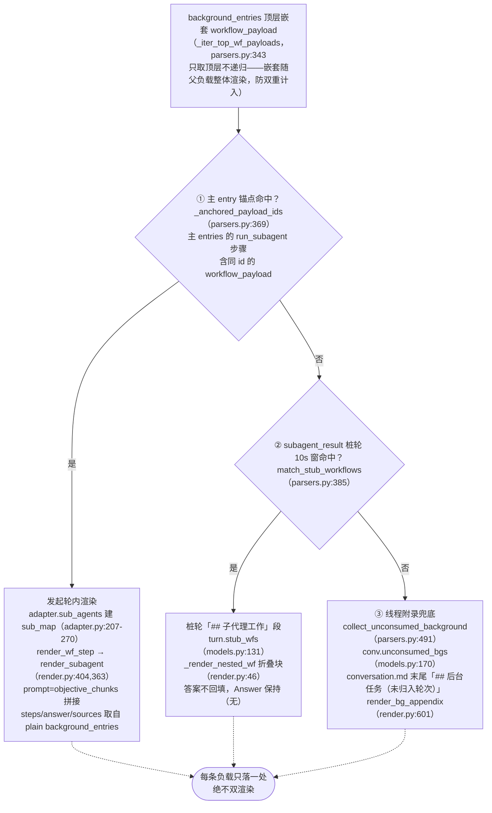
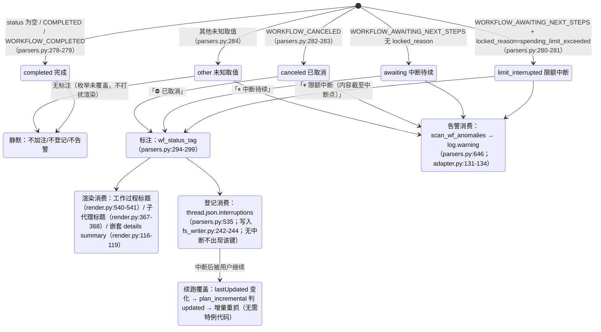

# サブエージェントと中断

---

## 帰属ウォーターフォール図（バックグラウンドサブエージェント負荷の決定論的帰属）

各バックグラウンドネスト `workflow_payload` は1箇所のみレンダリングされ、二重レンダリングは決して行われません。ここでは判定関数とデータ構造に焦点を当てます。3レベルすべてが `parsers.py` 内にあり、マウントポイントは
`adapter.get_thread`（adapter.py:150-157、computer/council のみ実行）です：

各レベルの判定詳細：

- **① アンカー**：`_anchored_payload_ids` は `_iter_wf_payloads`（parsers.py:327、
  再帰的ドリルダウン）を使用して、メインエントリにアンカーされたすべてのペイロードIDを収集します。サブエージェントの実際のステータスはバックエンド側を基準とします——
  `adapter.sub_agents` はバックエンドエントリの `workflow_block.status`/`locked_reason` を使用して
  `SubAgent.status/locked_reason`（adapter.py:227-244）を埋めます。アンカー側のステータスは遅延する可能性があるためです（実測では cfca382d でアンカーが COMPLETED でもバックエンドは CANCELED）。
- **② スタブウィンドウ**：スタブラウンド = `trigger=="subagent_result"` かつブロックにワークフローステップが存在しない（parsers.py:422）。候補は①を除外したトップレベルペイロードです。`|后台完成时间 − 桩创建时间| ≤ 10s`
  のすべてのペアは時間差の昇順で貪欲にマッチングされ、`used_cand` 集合により**各バックエンドは1回のみ消費される**ことを保証します（parsers.py:452-467）。1つのスタブが複数のエージェントを受け取ることができます。完了時間は `payload.completed_at` を使用し、欠落時はバックエンドエントリの更新時刻にフォールバックします（中断シナリオでは完了通知が存在しないため、parsers.py:444-446）。
- **③ 付録**：`collect_unconsumed_background` は、①のアンカーと②の消費済みの両方を除外した後、残ったすべてのトップレベルペイロードをそのままアーカイブします（parsers.py:491-532）——中断されたバックグラウンドタスクは subagent_result 完了通知を生成しないため、最初の2レベルは必ず失敗します。ステータスは問いません（AWAITING/CANCELED/COMPLETED/将来の値）。位置は常に conversation.md の末尾、時間帰属の推測は行わず、turns/ には追加しません（付録はスレッドレベル、render.py:601-638）。

---

## 中断セマンティクス状態図

統一真実源 `parsers.classify_wf_status`（parsers.py:263-284）：workflow status +
locked_reason → 5つのカテゴリ。3つの消費パスは同じ分類結果を共有し、COMPLETED には注釈を追加しません（正常スレッドでは差分ゼロ）。

データソースと実測分布（詳細は [../reference/api/api-responses-errors.md](../reference/api/api-responses-errors.md) §5.1 を参照）：

- `locked_reason` は thread_metadata / entries / background_entries の3層に出現し、
  実測で唯一の値は `spending_limit_exceeded`；`parse_turn` はエントリレベルの値を
  `turn.metadata["locked_reason"]`（parsers.py:205-208）に格納します。
- 中断注釈の**ステータスソース**：ラウンドレベルでは `turn.metadata["wf_status"]`
  （attach_workflow_blocks によりマウント、parsers.py:256）；サブエージェントではバックエンド側の実際のステータス
  （`SubAgent.status`、adapter.py:257-260）；付録エントリではペイロード自身の status。
- `thread.json.interruptions` 各 `{location, kind, headline, status}`、
  location は `turn_0007` / `turn_0011/subagent` / `turn_0024/subagent_stub` /
  `background_unassigned` の形式（parsers.py:535-583）。
- 再レンダリング `--thread-json` はオフラインでその場でキーを追加/削除できます（rerender_cmd.py:141-169、[§12](offline-operations.md) 参照）。
