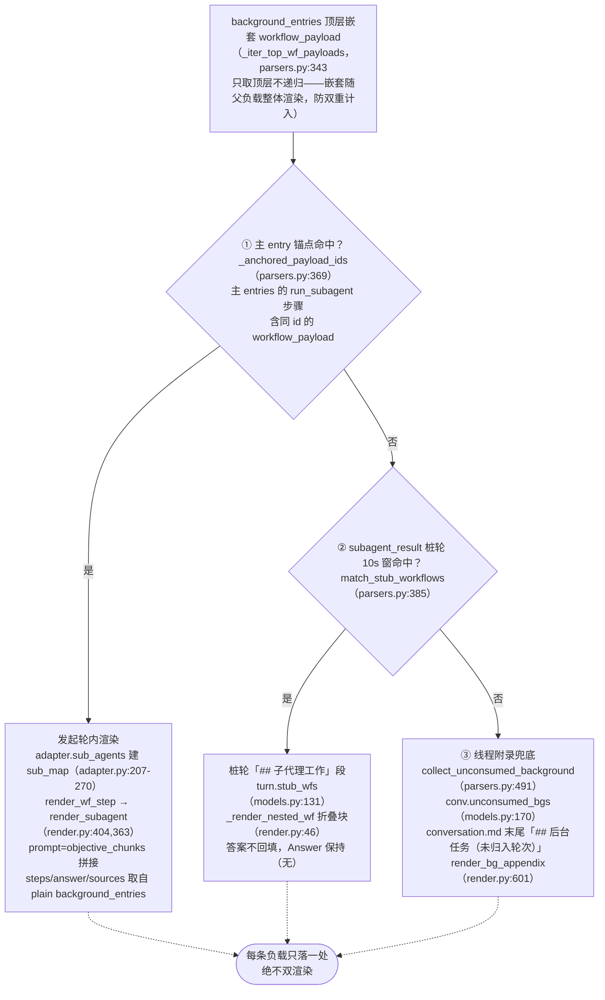
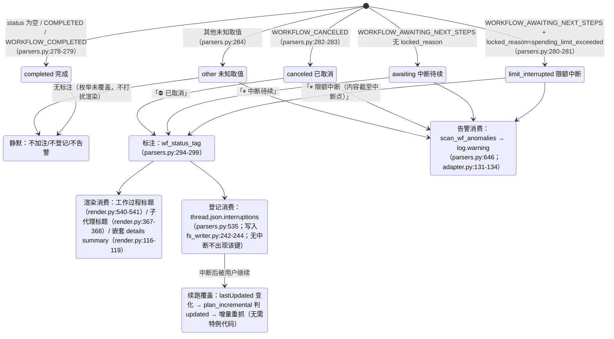

# 하위 에이전트와 중단

---

## 귀속 폭포수 차트 (백그라운드 하위 에이전트 부하의 결정적 귀속)

각 백그라운드 중첩 `workflow_payload`는 한 곳에서만 렌더링되며, 절대 이중 렌더링되지 않습니다. 여기서는 판정 함수와 데이터 구조에 해당합니다. 세 수준 모두 `parsers.py`에 있으며, 마운트 지점은
`adapter.get_thread`(adapter.py:150-157, computer/council만 실행):

각 수준 판정 세부 사항:

- **① 앵커**: `_anchored_payload_ids`는 `_iter_wf_payloads`(parsers.py:327,
  재귀적 하향)를 사용하여 메인 항목이 이미 앵커링한 모든 페이로드 ID를 수집합니다. 하위 에이전트의 실제 상태는 백그라운드 측을 기준으로 합니다——
  `adapter.sub_agents`는 백그라운드 항목의 `workflow_block.status`/`locked_reason`를 사용하여
  `SubAgent.status/locked_reason`(adapter.py:227-244)을 채웁니다. 앵커 측 상태는 지연될 수 있기 때문입니다(실측 cfca382d에서 앵커는 COMPLETED, 백그라운드는 CANCELED).
- **② 말뚝 창**: 말뚝 라운드 = `trigger=="subagent_result"`이고 블록에 워크플로 단계가 없음(parsers.py:422). 후보는 ①을 제외한 최상위 페이로드입니다. `|后台完成时间 − 桩创建时间| ≤ 10s`의
  모든 쌍은 시간 차이 오름차순으로 탐욕적으로 매칭되며, `used_cand` 집합은 **각 백그라운드가 한 번만 소비되도록** 보장합니다(parsers.py:452-467). 하나의 말뚝이 여러 에이전트를 수용할 수 있습니다. 완료 시간은 `payload.completed_at`를 사용하며, 없으면 백그라운드 항목 업데이트 시간으로 대체합니다(중단 시나리오에서는 완료 알림이 없음, parsers.py:444-446).
- **③ 부록**: `collect_unconsumed_background`는 ①의 앵커링과 ②의 소비를 모두 제외한 후, 남은 최상위 부하는 모두 그대로 기록됩니다(parsers.py:491-532)——중단된 백그라운드 작업은 subagent_result 완료 알림을 생성하지 않으므로, 처음 두 수준은 반드시 실패합니다. 상태는 제한 없음(AWAITING/CANCELED/COMPLETED/미래 값). 위치는 conversation.md 끝에 고정되며, 시간 귀속 추측 없음, turns/에 추가되지 않음(부록은 스레드 수준, render.py:601-638).

---

## 중단 의미 상태 다이어그램

통일된 진실 소스 `parsers.classify_wf_status`(parsers.py:263-284): workflow status +
locked_reason → 다섯 가지 유형. 세 가지 소비 경로가 동일한 분류 결과를 공유하며, COMPLETED는 절대 주석을 추가하지 않음(정상 스레드는 diff 없음).

데이터 출처 및 실측 분포(자세한 내용은 [../reference/api/api-responses-errors.md](../reference/api/api-responses-errors.md) §5.1 참조):

- `locked_reason`는 thread_metadata / entries / background_entries 세 수준에서 나타나며,
  실측 유일 값은 `spending_limit_exceeded`입니다. `parse_turn`는 항목 수준 값을
  `turn.metadata["locked_reason"]`(parsers.py:205-208)에 저장합니다.
- 중단 표시 추가 지점의 **상태 출처**: 라운드 수준은 `turn.metadata["wf_status"]`
  (attach_workflow_blocks 마운트, parsers.py:256); 하위 에이전트는 백그라운드 측 실제 상태
  (`SubAgent.status`, adapter.py:257-260); 부록 항목은 페이로드 자체 status.
- `thread.json.interruptions` 각 `{location, kind, headline, status}`,
  location 형식은 `turn_0007` / `turn_0011/subagent` / `turn_0024/subagent_stub` /
  `background_unassigned`(parsers.py:535-583).
- re-render `--thread-json`는 오프라인에서 해당 키를 추가/삭제할 수 있습니다(rerender_cmd.py:141-169, [§12](offline-operations.md) 참조).
