# Subagents and interruptions

---

## Attribution waterfall (deterministic attribution of background subagent payloads)

Each background nested `workflow_payload` is rendered in exactly one place, never twice; here it is grounded in decision functions and data structures. All three levels live in `parsers.py`; the mounting point is
`adapter.get_thread` (adapter.py:150-157, computer/council only):

```mermaid
flowchart TD
    BG["top-level nested workflow_payload of background_entries<br/>(_iter_top_wf_payloads, parsers.py:342<br/>top level only, no recursion — nested payloads render with their parent, preventing double counting)"]

    BG --> L1{"① main-entry anchor hit?<br/>_anchored_payload_ids (parsers.py:368)<br/>run_subagent steps of main entries<br/>carry a workflow_payload with the same id"}
    L1 -->|"yes"| R1["rendered inside the initiating turn<br/>adapter.sub_agents builds sub_map (adapter.py:210-273)<br/>render_wf_step → render_subagent (render.py:404,363)<br/>prompt=objective_chunks concatenation<br/>steps/answer/sources from plain background_entries"]
    L1 -->|"no"| L2{"② subagent_result stub-turn 10s window hit?<br/>match_stub_workflows (parsers.py:384)"}
    L2 -->|"yes"| R2["the stub turn's \"## 子代理工作\" (Subagent work) section<br/>turn.stub_wfs (models.py:131)<br/>_render_nested_wf collapsible block (render.py:46)<br/>answer not backfilled; Answer stays （无）(none)"]
    L2 -->|"no"| R3["③ thread-appendix fallback<br/>collect_unconsumed_background (parsers.py:490)<br/>conv.unconsumed_bgs (models.py:170)<br/>end of conversation.md, \"## 后台任务（未归入轮次）\"<br/>(Background tasks (unassigned to turns))<br/>render_bg_appendix (render.py:601)"]

    R1 -.-> ONE(["each payload lands in exactly one place<br/>never rendered twice"])
    R2 -.-> ONE
    R3 -.-> ONE
```

Level details:

- **① Anchor**: `_anchored_payload_ids` uses `_iter_wf_payloads` (parsers.py:326,
  recursive descent) to collect all payload ids already anchored by the main entries. A subagent's true status comes from the background side —
  `adapter.sub_agents` fills `SubAgent.status/locked_reason` from the background entry's `workflow_block.status`/`locked_reason`
  (adapter.py:230-247), because the anchor-side status may lag
  (observed cfca382d: anchor COMPLETED while background CANCELED).
- **② Stub window**: a stub turn = `trigger=="subagent_result"` and blocks contain no workflow steps
  (parsers.py:421). Candidates are the top-level payloads left after ①; all pairs with `|background completion time − stub creation time| ≤ 10s`
  are greedily matched in ascending time-delta order; the `used_cand` set guarantees **each background is consumed at most once**
  (parsers.py:451-466); one stub can absorb multiple agents. Completion time takes `payload.completed_at`,
  falling back to the background entry's update time when missing (interrupted runs necessarily have no completion notification, parsers.py:443-445).
- **③ Appendix**: `collect_unconsumed_background` archives verbatim every remaining top-level payload after the double exclusion of
  ①'s anchored and ②'s consumed (parsers.py:490-531) — interrupted background tasks
  produce no subagent_result completion notification, so the first two levels necessarily miss; status unrestricted
  (AWAITING/CANCELED/COMPLETED/future values). Position fixed at the end of conversation.md,
  no time-attribution guessing, nothing appended to turns/ (the appendix is thread-level, render.py:601-638).

---

## Interruption semantics state diagram

Unified source of truth `parsers.classify_wf_status` (parsers.py:262-283): workflow status +
locked_reason → five classes. Three consumption paths share the same classification result; COMPLETED is never annotated
(healthy threads get zero diff).

```mermaid
stateDiagram-v2
    state "completed" as c1
    state "limit_interrupted" as c2
    state "awaiting" as c3
    state "canceled" as c4
    state "other (unknown value)" as c5
    state "silent: no annotation / no registration / no alert" as quiet
    state "annotation: wf_status_tag (parsers.py:293-298)" as tag
    state "render consumption: work-process headings (render.py:540-541) / subagent headings (render.py:367-368) / nested details summary (render.py:116-119)" as consume1
    state "registration consumption: thread.json.interruptions (parsers.py:534; written fs_writer.py:242-244; key absent without interruptions)" as consume2
    state "alert consumption: scan_wf_anomalies → log.warning (parsers.py:645; adapter.py:131-134)" as consume3
    state "resume overwrite: lastUpdated change → plan_incremental judges updated → incremental re-fetch (no special-case code)" as cont

    [*] --> c1 : status empty / COMPLETED / WORKFLOW_COMPLETED (parsers.py:277-278)
    [*] --> c2 : WORKFLOW_AWAITING_NEXT_STEPS + locked_reason=spending_limit_exceeded (parsers.py:279-280)
    [*] --> c3 : WORKFLOW_AWAITING_NEXT_STEPS without locked_reason
    [*] --> c4 : WORKFLOW_CANCELED (parsers.py:281-282)
    [*] --> c5 : other unknown values (parsers.py:283)

    c1 --> quiet
    c5 --> quiet : no annotation (enum uncovered; rendering undisturbed)
    c2 --> tag : ⏸ limit-interrupted (content stops at the interruption point)
    c3 --> tag : ⏸ interrupted, pending continuation
    c4 --> tag : ⛔ canceled
    tag --> consume1
    tag --> consume2
    c2 --> consume3
    c3 --> consume3
    c4 --> consume3
    c5 --> consume3
    consume2 --> cont : continued by the user after interruption
```



Data sources and observed distribution (see [../reference/api/api-responses-errors.md](../reference/api/api-responses-errors.md) §5.1):

- `locked_reason` appears at three levels: thread_metadata / entries / background_entries;
  the only observed value is `spending_limit_exceeded`; `parse_turn` stores the entry-level value in
  `turn.metadata["locked_reason"]` (parsers.py:204-207).
- **Status sources** for annotation points: turn-level uses `turn.metadata["wf_status"]`
  (mounted by attach_workflow_blocks, parsers.py:255); subagents use the background-side true status
  (`SubAgent.status`, adapter.py:260-263); appendix entries use the payload's own status.
- Each `thread.json.interruptions` entry is `{location, kind, headline, status}`;
  location shaped like `turn_0007` / `turn_0011/subagent` / `turn_0024/subagent_stub` /
  `background_unassigned` (parsers.py:534-582).
- re-render `--thread-json` can add/remove this key offline in place (rerender_cmd.py:141-169, see [§12](offline-operations.md)).
