<a id="subagents-and-interruptions" data-pplx-source-anchor="true"></a>
# Subagentes e interrupções

---

<a id="attribution-waterfall-deterministic-attribution-of-background-subagent-payloads" data-pplx-source-anchor="true"></a>
## Cascata de atribuição (atribuição determinística de cargas de subagentes em segundo plano)

Cada `workflow_payload` aninhado em segundo plano é renderizado em exatamente um lugar, nunca duas vezes; aqui ele é fundamentado em funções de decisão e estruturas de dados. Todos os três níveis residem em `parsers.py`; o ponto de montagem é
`adapter.get_thread` (adapter.py:150-157, apenas computer/council):

```mermaid
flowchart TD
    BG["top-level nested workflow_payload of background_entries<br/>(_iter_top_wf_payloads, parsers.py:343<br/>top level only, no recursion — nested payloads render with their parent, preventing double counting)"]

    BG --> L1{"① main-entry anchor hit?<br/>_anchored_payload_ids (parsers.py:369)<br/>run_subagent steps of main entries<br/>carry a workflow_payload with the same id"}
    L1 -->|"yes"| R1["rendered inside the initiating turn<br/>adapter.sub_agents builds sub_map (adapter.py:207-270)<br/>render_wf_step → render_subagent (render.py:404,363)<br/>prompt=objective_chunks concatenation<br/>steps/answer/sources from plain background_entries"]
    L1 -->|"no"| L2{"② subagent_result stub-turn 10s window hit?<br/>match_stub_workflows (parsers.py:385)"}
    L2 -->|"yes"| R2["the stub turn's \"## 子代理工作\" (Subagent work) section<br/>turn.stub_wfs (models.py:131)<br/>_render_nested_wf collapsible block (render.py:46)<br/>answer not backfilled; Answer stays （无）(none)"]
    L2 -->|"no"| R3["③ thread-appendix fallback<br/>collect_unconsumed_background (parsers.py:491)<br/>conv.unconsumed_bgs (models.py:170)<br/>end of conversation.md, \"## 后台任务（未归入轮次）\"<br/>(Background tasks (unassigned to turns))<br/>render_bg_appendix (render.py:601)"]

    R1 -.-> ONE(["each payload lands in exactly one place<br/>never rendered twice"])
    R2 -.-> ONE
    R3 -.-> ONE
```

Detalhes dos níveis:

- **① Âncora**: `_anchored_payload_ids` usa `_iter_wf_payloads` (parsers.py:327,
  descida recursiva) para coletar todos os IDs de carga já ancorados pelas entradas principais. O status real de um subagente vem do lado do segundo plano —
  `adapter.sub_agents` preenche `SubAgent.status/locked_reason` a partir do `workflow_block.status`/`locked_reason` da entrada em segundo plano
  (adapter.py:227-244), porque o status do lado da âncora pode estar desatualizado
  (observado cfca382d: âncora COMPLETED enquanto segundo plano CANCELED).
- **② Janela de stub**: uma turno stub = `trigger=="subagent_result"` e blocos não contêm etapas de fluxo de trabalho
  (parsers.py:422). Candidatos são as cargas de nível superior restantes após ①; todos os pares com `|background completion time − stub creation time| ≤ 10s`
  são correspondidos greedy em ordem crescente de diferença de tempo; o conjunto `used_cand` garante que **cada segundo plano é consumido no máximo uma vez**
  (parsers.py:452-467); um stub pode absorver múltiplos agentes. O tempo de conclusão usa `payload.completed_at`,
  recorrendo ao tempo de atualização da entrada em segundo plano quando ausente (execuções interrompidas necessariamente não têm notificação de conclusão, parsers.py:444-446).
- **③ Apêndice**: `collect_unconsumed_background` arquiva literalmente cada carga de nível superior restante após a dupla exclusão
  das âncoras de ① e dos consumidos de ② (parsers.py:491-532) — tarefas em segundo plano interrompidas
  não produzem notificação de conclusão subagent_result, então os dois primeiros níveis necessariamente as perdem; status irrestrito
  (AWAITING/CANCELED/COMPLETED/valores futuros). Posição fixa no final de conversation.md,
  sem adivinhação de atribuição de tempo, nada anexado a turns/ (o apêndice é no nível da thread, render.py:601-638).

---

<a id="interruption-semantics-state-diagram" data-pplx-source-anchor="true"></a>
## Diagrama de estados de semântica de interrupção

Fonte única de verdade `parsers.classify_wf_status` (parsers.py:263-284): status do fluxo de trabalho +
locked_reason → cinco classes. Três caminhos de consumo compartilham o mesmo resultado de classificação; COMPLETED nunca é anotado
(threads saudáveis obtêm diff zero).

```mermaid
stateDiagram-v2
    state "completed" as c1
    state "limit_interrupted" as c2
    state "awaiting" as c3
    state "canceled" as c4
    state "other (unknown value)" as c5
    state "silent: no annotation / no registration / no alert" as quiet
    state "annotation: wf_status_tag (parsers.py:294-299)" as tag
    state "render consumption: work-process headings (render.py:540-541) / subagent headings (render.py:367-368) / nested details summary (render.py:116-119)" as consume1
    state "registration consumption: thread.json.interruptions (parsers.py:535; written fs_writer.py:242-244; key absent without interruptions)" as consume2
    state "alert consumption: scan_wf_anomalies → log.warning (parsers.py:646; adapter.py:131-134)" as consume3
    state "resume overwrite: lastUpdated change → plan_incremental judges updated → incremental re-fetch (no special-case code)" as cont

    [*] --> c1 : status empty / COMPLETED / WORKFLOW_COMPLETED (parsers.py:278-279)
    [*] --> c2 : WORKFLOW_AWAITING_NEXT_STEPS + locked_reason=spending_limit_exceeded (parsers.py:280-281)
    [*] --> c3 : WORKFLOW_AWAITING_NEXT_STEPS without locked_reason
    [*] --> c4 : WORKFLOW_CANCELED (parsers.py:282-283)
    [*] --> c5 : other unknown values (parsers.py:284)

    c1 --> quiet
    c5 --> quiet : no annotation (enum uncovered; rendering undisturbed)
    c2 --> tag : ⏸ limit-interrupted (content stops at the interruption point)
    c3 --> tag : ⏸ interrupted, pending continuation
    c4 --> tag : ⛔ canceled
    tag --> consume1
    tag --> consume2
    c2 --> consume3
    c3 --> consume3
    c4 --> consume3
    c5 --> consume3
    consume2 --> cont : continued by the user after interruption
```



Fontes de dados e distribuição observada (veja [../reference/api/api-responses-errors.md](../reference/api/api-responses-errors.md) §5.1):

- `locked_reason` aparece em três níveis: thread_metadata / entries / background_entries;
  o único valor observado é `spending_limit_exceeded`; `parse_turn` armazena o valor no nível da entrada em
  `turn.metadata["locked_reason"]` (parsers.py:205-208).
- **Fontes de status** para pontos de anotação: nível de turno usa `turn.metadata["wf_status"]`
  (montado por attach_workflow_blocks, parsers.py:256); subagentes usam o status real do lado do segundo plano
  (`SubAgent.status`, adapter.py:257-260); entradas do apêndice usam o próprio status da carga.
- Cada entrada `thread.json.interruptions` é `{location, kind, headline, status}`;
  localização com formato `turn_0007` / `turn_0011/subagent` / `turn_0024/subagent_stub` /
  `background_unassigned` (parsers.py:535-583).
- re-renderização `--thread-json` pode adicionar/remover esta chave offline no lugar (rerender_cmd.py:141-169, veja [§12](offline-operations.md)).
