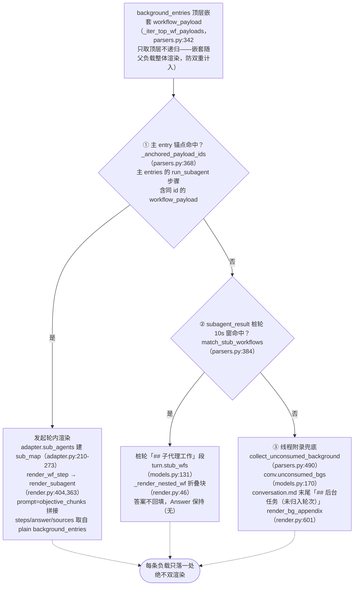
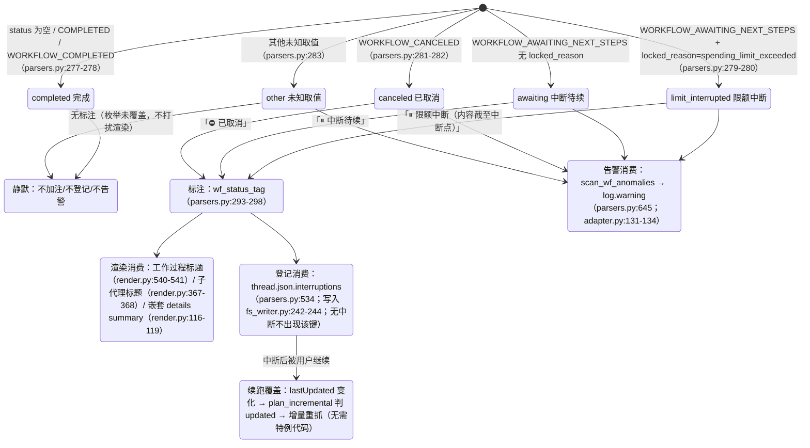

# 子代理与中断

---

## 归属瀑布图（后台子代理负载的确定性归属）

每条后台嵌套 `workflow_payload` 只渲染一处、绝不双渲染；此处落到判定函数与数据结构。三级全部在 `parsers.py`，挂载点在
`adapter.get_thread`（adapter.py:150-157，仅 computer/council 执行）：

各级判定细节：

- **① 锚点**：`_anchored_payload_ids` 用 `_iter_wf_payloads`（parsers.py:326，
  递归下钻）收集主 entry 已锚定的全部 payload id。子代理的真实状态以后台侧为准——
  `adapter.sub_agents` 用后台 entry 的 `workflow_block.status`/`locked_reason`
  填 `SubAgent.status/locked_reason`（adapter.py:230-247），因为锚点侧 status 可能
  滞后（实测 cfca382d 锚点 COMPLETED 而后台 CANCELED）。
- **② 桩窗**：桩轮 = `trigger=="subagent_result"` 且 blocks 无任何 workflow steps
  （parsers.py:421）。候选为排除①后的顶层 payload；`|后台完成时间 − 桩创建时间| ≤ 10s`
  的全部配对按时间差升序贪心，`used_cand` 集合保证**每个后台只被消费一次**
  （parsers.py:451-466），一桩可收多代理。完成时间取 `payload.completed_at`，
  缺失退后台 entry 更新时间（中断场景必然没有完成通知，parsers.py:443-445）。
- **③ 附录**：`collect_unconsumed_background` 在①的 anchored 与②的 consumed
  双排除后，凡剩余顶层负载一律如实归档（parsers.py:490-531）——中断的后台任务
  不产生 subagent_result 完成通知，前两级必然落空；状态不限
  （AWAITING/CANCELED/COMPLETED/未来取值）。位置恒定在 conversation.md 末尾、
  不做时间归属猜测、turns/ 不追加（附录属线程级，render.py:601-638）。

---

## 中断语义状态图

统一真源 `parsers.classify_wf_status`（parsers.py:262-283）：workflow status +
locked_reason → 五类。三条消费路径共用同一分类结果，COMPLETED 一律不加注
（健康线程零 diff）。

数据来源与实测分布（详见 [../reference/api/api-responses-errors.md](../reference/api/api-responses-errors.md) §5.1）：

- `locked_reason` 出现于 thread_metadata / entries / background_entries 三层，
  实测唯一取值 `spending_limit_exceeded`；`parse_turn` 把 entry 级值存入
  `turn.metadata["locked_reason"]`（parsers.py:204-207）。
- 中断标注加注点的**状态来源**：轮级用 `turn.metadata["wf_status"]`
  （attach_workflow_blocks 挂载，parsers.py:255）；子代理用后台侧真实状态
  （`SubAgent.status`，adapter.py:260-263）；附录条目用 payload 自身 status。
- `thread.json.interruptions` 每条 `{location, kind, headline, status}`，
  location 形如 `turn_0007` / `turn_0011/subagent` / `turn_0024/subagent_stub` /
  `background_unassigned`（parsers.py:534-582）。
- re-render `--thread-json` 可离线就地增删该键（rerender_cmd.py:141-169，见 [§12](offline-operations.md)）。
