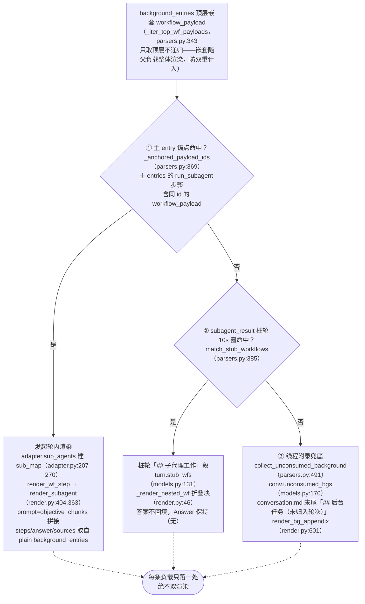
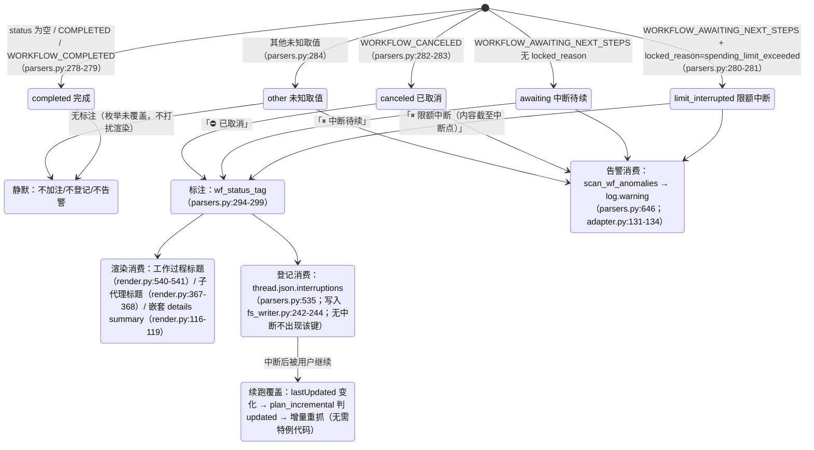

# 子代理與中斷

---

## 歸屬瀑布圖（後台子代理負載的確定性歸屬）

每條後台巢狀 `workflow_payload` 只渲染一處、絕不雙渲染；此處落到判定函數與資料結構。三級全部在 `parsers.py`，掛載點在
`adapter.get_thread`（adapter.py:150-157，僅 computer/council 執行）：

各級判定細節：

- **① 錨點**：`_anchored_payload_ids` 用 `_iter_wf_payloads`（parsers.py:327，
  遞迴下鑽）收集主 entry 已錨定的全部 payload id。子代理的真實狀態以後台側為準——
  `adapter.sub_agents` 用後台 entry 的 `workflow_block.status`/`locked_reason`
  填 `SubAgent.status/locked_reason`（adapter.py:227-244），因為錨點側 status 可能
  滯後（實測 cfca382d 錨點 COMPLETED 而後台 CANCELED）。
- **② 樁窗**：樁輪 = `trigger=="subagent_result"` 且 blocks 無任何 workflow steps
  （parsers.py:422）。候選為排除①後的頂層 payload；`|后台完成时间 − 桩创建时间| ≤ 10s`
  的全部配對按時間差升序貪心，`used_cand` 集合保證**每個後台只被消費一次**
  （parsers.py:452-467），一樁可收多代理。完成時間取 `payload.completed_at`，
  缺失退後台 entry 更新時間（中斷場景必然沒有完成通知，parsers.py:444-446）。
- **③ 附錄**：`collect_unconsumed_background` 在①的 anchored 與②的 consumed
  雙排除後，凡剩餘頂層負載一律如實歸檔（parsers.py:491-532）——中斷的後台任務
  不產生 subagent_result 完成通知，前兩級必然落空；狀態不限
  （AWAITING/CANCELED/COMPLETED/未來取值）。位置恆定在 conversation.md 末尾、
  不做時間歸屬猜測、turns/ 不追加（附錄屬執行緒級，render.py:601-638）。

---

## 中斷語義狀態圖

統一真源 `parsers.classify_wf_status`（parsers.py:263-284）：workflow status +
locked_reason → 五類。三條消費路徑共用同一分類結果，COMPLETED 一律不加註
（健康執行緒零 diff）。

資料來源與實測分佈（詳見 [../reference/api/api-responses-errors.md](../reference/api/api-responses-errors.md) §5.1）：

- `locked_reason` 出現於 thread_metadata / entries / background_entries 三層，
  實測唯一取值 `spending_limit_exceeded`；`parse_turn` 把 entry 級值存入
  `turn.metadata["locked_reason"]`（parsers.py:205-208）。
- 中斷標註加註點的**狀態來源**：輪級用 `turn.metadata["wf_status"]`
  （attach_workflow_blocks 掛載，parsers.py:256）；子代理用後台側真實狀態
  （`SubAgent.status`，adapter.py:257-260）；附錄條目用 payload 自身 status。
- `thread.json.interruptions` 每條 `{location, kind, headline, status}`，
  location 形如 `turn_0007` / `turn_0011/subagent` / `turn_0024/subagent_stub` /
  `background_unassigned`（parsers.py:535-583）。
- re-render `--thread-json` 可離線就地增刪該鍵（rerender_cmd.py:141-169，見 [§12](offline-operations.md)）。
