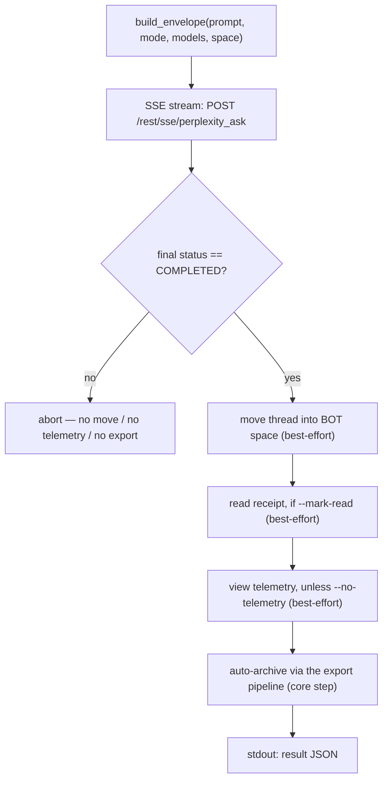

<a id="pplx-ask-interactive-queries" data-pplx-source-anchor="true"></a>
# pplx-ask: الاستعلامات التفاعلية

`pplx-ask` هي نقطة الدخول الثانية لواجهة الأوامر (CLI) للمشروع: تطرح أسئلة على Perplexity
بشكل تفاعلي عبر تدفق SSE، ثم تعالج المحادثة الناتجة — وتنقلها
إلى مساحة BOT، وترسل إيصال قراءة اختياريًا وبيانات تتبع عرض شبيهة بالبشر، وتؤرشفها
تلقائيًا باستخدام نفس خط التصدير الخاص بـ `pplx-export`. تشارك النواة (النقل / الكوكيز / الحالة / التسجيل) مع `pplx-export`، ويتم التحقق من جميع أشكال واجهة برمجة التطبيقات (API) مقابل المنصة الحية.

المصدر: `pplx_export/ask_cli.py` (CLI)، `pplx_export/sites/perplexity/ask_api.py` (طبقة API).

```bash
pplx-ask models                                  # list the authoritative model table
pplx-ask ask "What is the time resolution of an example parameter?"   # search mode (default)
pplx-ask ask "<long prompt>" --mode council      # model council (default three models)
pplx-ask ask "<prompt>" --mode council --models gpt55_thinking,claude48opusthinking
pplx-ask ask "<prompt>" --mode deep-research     # deep research (fixed pplx_alpha)
pplx-ask ask "<prompt>" --space some-space-slug  # create inside a space, then move into BOT
pplx-ask ask "<prompt>" --mark-read              # send a read receipt after completion
pplx-ask mark-read <thread_url|uuid>             # standalone read receipt
pplx-ask space-create "My Space"                 # create a space
```

<a id="subcommands" data-pplx-source-anchor="true"></a>
## الأوامر الفرعية

### `models`

يطبع جدول النماذج المباشر والموثوق من
`GET https://www.perplexity.ai/rest/models/config/v2` (`pplx_export/ask_cli.py:51`):
النماذج الافتراضية لكل وضع، والنماذج الثلاثة الافتراضية للمجلس، والنماذج القابلة للتحديد في
وضع البحث، والأوضاع الخاصة (`research` / `study` / `agentic_research` / `studio`).
بدون خيارات.

### `ask`

يطرح سؤالاً (`pplx_export/ask_cli.py:86`). يقوم ببث SSE إلى وحدة التحكم،
ويشغل خط المعالجة اللاحقة (انظر [تدفق الطلب](#the-ask-flow))، ويطبع كائن JSON
قابل للقراءة آليًا على المخرجات القياسية في النهاية.

| الخيار | الافتراضي | الوصف |
|---|---|---|
| `prompt` (موضعي) | — | السؤال. تعمل الاستفسارات الطويلة وذات المعنى بشكل أفضل. |
| `--mode` | `search` | `search` = بحث عادي (نموذج قابل للتحديد)؛ `deep-research` = بحث عميق (نموذج ثابت)؛ `council` = مجلس النماذج (2-3 نماذج بالتوازي + توليف)؛ `study` = دراسة خطوة بخطوة |
| `--models` | لا شيء | `council`: معرفات نماذج مفصولة بفواصل 2-3 (الافتراضي `gpt55_thinking,claude48opusthinking,gemini31pro_high`)؛ `search`: معرف نموذج واحد؛ يتم تجاهله بواسطة `deep-research` / `study` |
| `--space` | `home` | `home` = الإنشاء من الصفحة الرئيسية، ثم النقل إلى مساحة BOT؛ `<slug>` = الإنشاء مباشرة داخل تلك المساحة، ثم النقل إلى مساحة BOT |
| `--mark-read` | إيقاف | إرسال إيصال قراءة (`mark_viewed`) بعد الاكتمال |
| `--no-telemetry` | إيقاف | عدم إرسال بيانات تتبع عرض شبيهة بالبشر (الافتراضي: إرسال — `ask context pane viewed` / `thread viewed` / `thread entry exited` مع توقيت عشوائي) |
| `--no-export` | إيقاف | عدم الأرشفة التلقائية في `web_archive` |
| `--timeout` | `600` | مهلة تدفق SSE بالثواني |

تلميحات أخطاء HTTP الصادرة عن `ask` (`pplx_export/ask_cli.py:124`): `401`/`403` = انتهت صلاحية
الكوكيز أو تم التحكم فيها بالمخاطرة (قم بتحديث الكوكيز)، `429` = تم تحديد المعدل (أعد المحاولة
لاحقًا)، `5xx` = خطأ في الخادم (أعد المحاولة لاحقًا). انظر [استكشاف الأخطاء وإصلاحها](troubleshooting.md).

### `mark-read`

يرسل إيصال قراءة لمحادثة موجودة (`pplx_export/ask_cli.py:201`): يقبل عنوان URL للمحادثة أو UUID مجرد، ويحل `context_uuid` الخاص بالمحادثة عبر
`GET /rest/thread/<uuid>`، ثم يستدعي `POST /rest/thread/mark_viewed` مع
`{"context_uuids": [ctx]}` (`pplx_export/sites/perplexity/ask_api.py:190`). يتم قلب علامة
غير المقروء على الفور. يطبع `{"uuid", "context_uuid", "result"}` كـ JSON.

ملاحظة: حدث التحليلات `thread viewed` **لا** يقلب غير المقروء — إيصال القراءة الحقيقي
هو نقطة النهاية هذه.

### `space-create`

ينشئ مساحة عبر `POST /rest/collections/create_collection`
(`pplx_export/sites/perplexity/ask_api.py:179`) مع الحقول الثابتة التي تم التحقق منها
(`emoji: "1f4c1"`، `access: 1`). يطبع `{"uuid", "slug", "url"}` كـ JSON.

| الخيار | الافتراضي | الوصف |
|---|---|---|
| `title` (موضعي) | — | عنوان المساحة |
| `--description` | `""` | وصف المساحة |

لاستخدام المساحة الجديدة كمساحة BOT، سجل `uuid`/`slug` الخاص بها تحت `[bot_space]`
في تكوين مستوى المستخدم (انظر [التكوين](configuration.md)).

<a id="common-options" data-pplx-source-anchor="true"></a>
## الخيارات المشتركة

مشتركة مع `pplx-export` (أسماء وقيم افتراضية متطابقة، `pplx_export/commands/common.py:232`):

| الخيار | الافتراضي | الوصف |
|---|---|---|
| `--account` | تكوين `default_account` | الحساب المستهدف؛ عند عدم تطابق الكوكيز/البريد الإلكتروني، يتم تعداد رموز جلسة الحساب لكل متصفح وتبديلها تلقائيًا |
| `--config PATH` | `~/.config/pplx-export/config.toml` | تكوين مستوى المستخدم (سجل الحسابات / مساحة BOT)؛ الأولوية: `--config` > متغير البيئة `PPLX_EXPORT_CONFIG` > المسار الافتراضي |
| `--out` | `./web_archive` | جذر مخرجات الأرشفة |
| `--cookies-from BROWSER` | كشف تلقائي | استيراد الكوكيز من المتصفح المسمى (`edge`/`chrome`/`firefox`/`safari`/`brave`…) |
| `--cookies FILE` | — | ملف كوكيز بتنسيق Netscape أو ملف كوكيز JSON |
| `-v` / `--verbose` | إيقاف | مخرجات DEBUG (تتبع الطلب / القرارات الداخلية) |
| `--log-file [PATH]` | إيقاف | سجل DEBUG كامل إلى ملف؛ بدون قيمة يتم وضعه في `<out>/index/logs/<cmd>-<timestamp>.log` |

أولوية مصدر الكوكيز: `--cookies-from` / `--cookies` > ذاكرة تخزين مؤقت جديدة
(`<out>/index/.cookies.json`، 12 ساعة) > كشف المتصفح التلقائي. انظر
[البدء](getting-started.md) للإعداد الأولي.

<a id="the-ask-flow" data-pplx-source-anchor="true"></a>
## تدفق الطلب



1. **تجميع المغلف** — `build_envelope` (`pplx_export/sites/perplexity/ask_api.py:71`)
   يملأ قالب المعلمات الذي تم التحقق منه: `mode` دائمًا `"copilot"` و
   `query_source` هو `"home"` (كل `ask` يبدأ محادثة **جديدة**؛ المتابعة
   غير متاحة عبر CLI). مع `--space <slug>`، يتم حل slug المساحة إلى uuid أولاً، ويحمل المغلف `target_collection_uuid` +
   `target_thread_access_level: 1`.
2. **تدفق SSE** — `sse_ask` (`pplx_export/sites/perplexity/ask_api.py:153`) يرسل POST إلى
   `https://www.perplexity.ai/rest/sse/perplexity_ask` ويستهلك تدفق الأحداث،
   مسجلاً إنشاء المحادثة (`https://www.perplexity.ai/search/<uuid>`)، وتحولات
   الحالة، وتقدم التوليد. ينتهي التدفق عند `final_sse_message`.
   عندما يصبح التدفق خاملاً لفترة (يمكن أن يكون البحث العميق / المجلس صامتًا
   لدقائق؛ المهلة المفتوحة هي 600 ثانية)، يصدر `post_stream` نبضة قلب INFO "لا يزال ينتظر
   تدفق الاستجابة" بمستوى الإفصاح الافتراضي بحيث لا يُخلط أبدًا بين التشغيل المباشر والتعليق.
3. **بوابة الاكتمال** — تعمل المعالجة اللاحقة فقط عندما تكون الحالة النهائية `COMPLETED`
   (`pplx_export/ask_cli.py:134`). عند انتهاء التدفق بشكل غير طبيعي، يتم تخطي كل شيء بعد هذه
   النقطة (لا نقل، لا تتبع، لا تصدير) بحيث لا تتسرب الحالة غير المكتملة أبدًا إلى الأرشيف.
4. **النقل إلى مساحة BOT** (أفضل جهد) — `batch_move_threads` مع `context_uuid` الخاص بالمحادثة
   إلى uuid `[bot_space]` المكون. يتم تخطيه عندما لا تكون مساحة BOT مكونة،
   أو عندما تم إنشاء المحادثة بالفعل داخل مساحة BOT.
5. **إيصال القراءة** (أفضل جهد، `--mark-read`) — `POST /rest/thread/mark_viewed`؛
   يتم قلب علامة غير المقروء على الفور.
6. **بيانات تتبع عرض شبيهة بالبشر** (أفضل جهد، افتراضيًا تشغيل) —
   `send_view_telemetry` (`pplx_export/sites/perplexity/ask_api.py:234`) يحاكي توقيت
   التصفح الحقيقي: `ask context pane viewed` → `thread viewed` → `ask context pane
   viewed` → `thread entry exited` (random `timeOnEntryMs` من 12–45 ثانية، فترات توقف 0.6–2.4 ثانية
   بين الأحداث، جهاز يتم اختياره عشوائيًا من مجموعة صغيرة).
7. **الأرشفة التلقائية** (خطوة أساسية، ما لم `--no-export`) — يتم تصدير المحادثة
   من خلال نفس خط أنابيب `pplx-export export` (وضع القوة)، وتوضع تحت
   `<out>/<account>/<mode>/<date>_<title>_<uuid8>/` — انظر
   [تخطيط الأرشيف](archive-layout.md) و[خط أنابيب التصدير](../architecture/export-pipeline.md).
   على عكس خطوات أفضل جهد، فإن فشل الأرشفة ينتشر ويفشل الأمر.

**عزل الفشل**: الخطوات 4–6 معزولة كأفضل جهد (`pplx_export/ask_cli.py:36`):
يسجل الفشل تحذيرًا، ويضبط مفتاح JSON للخطوة على `false`، ويسجل التفاصيل تحت
`step_errors`، ولا يمنع الأرشفة أبدًا. الأرشفة (الخطوة 7) هي الخطوة الأساسية ولا يتم ابتلاع
إخفاقاتها أبدًا.

<a id="modes-and-model-selection" data-pplx-source-anchor="true"></a>
## الأوضاع واختيار النموذج

جدول النماذج الموثوق للمنصة هو `GET /rest/models/config/v2` (ما
يطبعه `pplx-ask models`). يعيش التمييز في حقل `model_preference` — `mode` الخاص بالمغلف
هو دائمًا `"copilot"`.

| الوضع | قيمة `--mode` | `model_preference` | اختيار النموذج |
|---|---|---|---|
| بحث | `search` | `pplx_pro` ("الأفضل" في واجهة المستخدم) افتراضيًا | معرف نموذج واحد عبر `--models` (انظر `pplx-ask models` للقائمة القابلة للتحديد) |
| بحث عميق | `deep-research` | `pplx_alpha` | ثابت — لا محدد |
| مجلس النماذج | `council` | `pplx_agentic_research` + `compare_model_preferences` | 2-3 معرفات مفصولة بفواصل عبر `--models`؛ الافتراضي `gpt55_thinking,claude48opusthinking,gemini31pro_high` |
| دراسة خطوة بخطوة | `study` | `pplx_study` | ثابت — لا محدد |
| الكمبيوتر | *(غير معروض)* | عائلة `pplx_asi*` | غير مدعوم بواسطة `pplx-ask` |

ملاحظات:

- يدير المجلس النماذج بالتوازي ويولف؛ يمكن أن يتجاوز زمن الوصول للرمز الأول
  3 دقائق، لذا ارفع `--timeout` لتشغيل المجلس / البحث العميق.
- تصنيف الوضع في جانب الأرشيف (كيف يتم تصنيف المحادثات المصدرة، بما في ذلك
  `computer`) موثق في [الأوضاع](modes.md)؛ تفاصيل مغلف الطلب موجودة في
  [نقاط نهاية REST](../reference/api/api-rest-endpoints.md).

<a id="using-pplx-ask-from-other-agents" data-pplx-source-anchor="true"></a>
## استخدام pplx-ask من وكلاء آخرين

تم بناء `pplx-ask` بحيث يمكن للوكلاء الآخرين جلب المعلومات في الوقت الفعلي: يطرح سؤالاً،
وينتظر الاكتمال، ويؤرشف المحادثة، ويصدر عقدًا قابلًا للقراءة آليًا.

- **يحمل المخرجات القياسية كائن JSON واحدًا بالضبط** (السطر الأخير)؛ تذهب جميع السجلات إلى الخطأ القياسي، لذا
  يمكن للمتصلين توجيه المخرجات القياسية مباشرة إلى محلل JSON.
- **حالة الخروج**: `0` عند النجاح؛ حالات الفشل تخرج بقيمة غير صفرية مع رسالة خطأ على
  الخطأ القياسي — حالات فشل مرحلة الطلب تتسبب في إنهاء عبر `SystemExit` مع رسالة `[ask][ERROR]`،
  بينما تنتشر حالات فشل الأرشفة كما هي (انظر الخطوة 7).

شكل JSON الناتج (`pplx_export/ask_cli.py:194`):

| المفتاح | النوع | المعنى |
|---|---|---|
| `thread_uuid` | سلسلة نصية | uuid الخلفي للمحادثة التي تم إنشاؤها |
| `thread_url` | سلسلة نصية | `https://www.perplexity.ai/search/<thread_uuid>` |
| `context_uuid` | سلسلة نصية | `context_uuid` الخاص بالمحادثة (يستخدم للنقل / وضع علامة مقروء / التتبع) |
| `moved_to_bot` | منطقي | `true` = تم تنفيذ النقل إلى مساحة BOT ونجح؛ `false` = لم يتم تنفيذه أو فشل |
| `mark_read` | منطقي | نفس العقد لإيصال القراءة |
| `telemetry` | منطقي | نفس العقد لتتبع العرض |
| `step_errors` | كائن | تفاصيل الفشل لكل خطوة؛ تظهر الخطوات الفاشلة فقط |
| `exported` | سلسلة نصية \| فارغ | `"见上方 [export] 输出"` عند تشغيل الأرشفة؛ `null` مع `--no-export` |

نصائح الأتمتة:

- تعامل مع القيم المنطقية للخطوات بدقة — لا يتم تمثيل الفشل أبدًا بقيمة صحيحة؛
  تحقق من `step_errors` للحصول على التفاصيل.
- `--no-telemetry` يتخطى فترة المكوث الشبيهة بالبشر التي تتراوح بين 12-45 ثانية عندما تكون الإجابة فقط مهمة.
- بدون مساحة BOT مكونة (الوضع المنخفض)، يبقى `moved_to_bot` `false` و
  كل شيء آخر لا يزال يعمل — انظر [استكشاف الأخطاء وإصلاحها](troubleshooting.md).
- لإعداد الحساب/الكوكيز، يجب على الوكلاء غير المأهولين قراءة
  [مصادقة API](../reference/api/api-authentication.md)؛ سلوك الحسابات المتعددة موجود في
  [الطلب والحسابات](../architecture/ask-and-accounts.md).

<a id="see-also" data-pplx-source-anchor="true"></a>
## انظر أيضًا

- [البدء](getting-started.md) — التثبيت، الكوكيز، التشغيل الأول
- [التكوين](configuration.md) — الحسابات، مساحة BOT، الوضع المنخفض
- [pplx-export](pplx-export.md) — واجهة الأوامر للأرشفة
- [استكشاف الأخطاء وإصلاحها](troubleshooting.md) — 401/403، حساب خاطئ، السجلات
