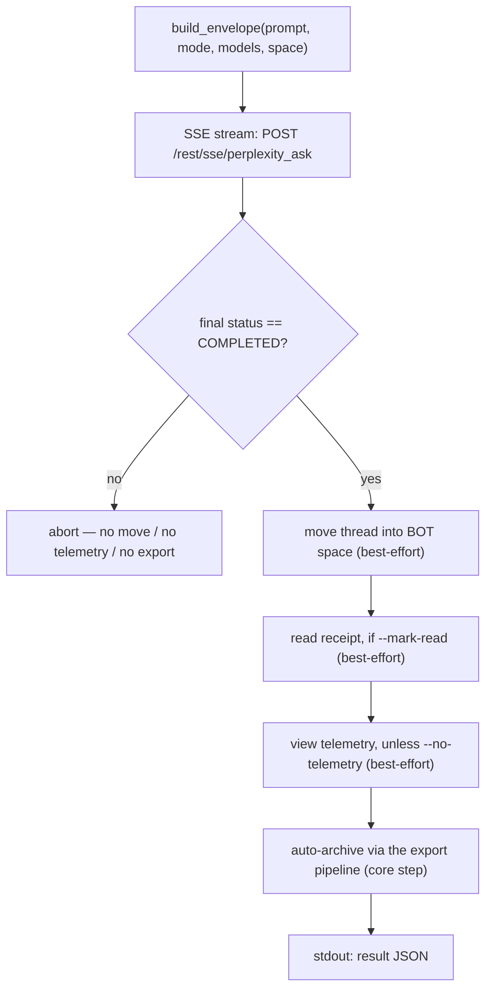

<a id="pplx-ask-interactive-queries" data-pplx-source-anchor="true"></a>
# pplx-ask: Interaktive Abfragen

`pplx-ask` ist der zweite CLI-Einstiegspunkt des Projekts: Es stellt Perplexity Fragen
interaktiv über SSE-Streaming, verarbeitet den resultierenden Thread nach – verschiebt ihn
in den BOT-Bereich, sendet optional eine Lesebestätigung und menschenähnliche Ansichts-Telemetrie und
archiviert ihn automatisch mit derselben Export-Pipeline wie `pplx-export`. Es teilt sich den
Kern (Transport / Cookies / Zustand / Logging) mit `pplx-export`, und alle API-Formen werden
gegen die Live-Plattform verifiziert.

Quelle: `pplx_export/ask_cli.py` (CLI), `pplx_export/sites/perplexity/ask_api.py` (API-Ebene).

```bash
pplx-ask models                                  # list the authoritative model table
pplx-ask models --refresh                         # refresh + persist the catalog into config.toml [models]
pplx-ask ask "What is the time resolution of an example parameter?"   # search mode (default)
pplx-ask ask "<long prompt>" --mode council      # model council (default three models)
pplx-ask ask "<prompt>" --mode council --models gpt56_sol_thinking,claude50opusthinking
pplx-ask ask "<prompt>" --mode deep-research     # deep research (fixed pplx_alpha)
pplx-ask ask "<prompt>" --space some-space-slug  # create inside a space, then move into BOT
pplx-ask ask "<prompt>" --mark-read              # send a read receipt after completion
pplx-ask mark-read <thread_url|uuid>             # standalone read receipt
pplx-ask space-create "My Space"                 # create a space
```

<a id="subcommands" data-pplx-source-anchor="true"></a>
## Unterbefehle

### `models`

Gibt die live, maßgebliche Modelltabelle aus von
`GET https://www.perplexity.ai/rest/models/config/v2` (`pplx_export/ask_cli.py`,
`cmd_models`): Standardmodelle pro Modus, die drei Standardmodelle des Councils, die
im Suchmodus auswählbaren Modelle und die speziellen Modi (`research` / `study` /
`agentic_research` / `studio`).

| Option | Standard | Beschreibung |
|---|---|---|
| `--refresh` | aus | Den abgerufenen Katalog in die `[models]`-Tabelle der Konfiguration persistieren (automatisch verwaltet): `last_refreshed`, `mode_defaults`, `council_defaults`, `search_models` und die vollständige `[models.catalog]`. `pplx-ask` erstellt dann Anfragen aus `[models]` und fällt auf die festgelegte Basislinie in `pplx_export/sites/perplexity/platform.py` zurück. Erfordert eine geladene Konfigurationsdatei (zuerst `pplx-export init` ausführen). Siehe [Konfiguration](configuration.md). |

### `ask`

Stellt eine Frage (`pplx_export/ask_cli.py:86`). Streamt den Fortschritt per SSE an die Konsole,
führt die Nachverarbeitungspipeline aus (siehe [Der Ask-Ablauf](#the-ask-flow)) und gibt am Ende ein
maschinenlesbares JSON-Objekt auf stdout aus.

| Option | Standard | Beschreibung |
|---|---|---|
| `prompt` (positionsabhängig) | — | Die Frage. Lange, aussagekräftige Eingabeaufforderungen funktionieren besser. |
| `--mode` | `search` | `search` = normale Suche (Modell auswählbar); `deep-research` = Deep Research (festes Modell); `council` = Modell-Council (2–3 Modelle parallel + Synthese); `study` = Schritt-für-Schritt-Studie |
| `--models` | keine | `council`: Komma-getrennte 2–3 Modell-IDs (Standard: die Council-Modelle aus dem `[models]`-Katalog oder die festgelegte `platform.py`-Fallback; aktualisieren mit `pplx-ask models --refresh`); `search`: eine einzelne Modell-ID; wird von `deep-research` / `study` ignoriert |
| `--space` | `home` | `home` = von der Startseite aus erstellen, dann in den BOT-Bereich verschieben; `<slug>` = direkt in diesem Bereich erstellen, dann in den BOT-Bereich verschieben |
| `--mark-read` | aus | Eine Lesebestätigung senden (`mark_viewed`) nach Abschluss |
| `--no-telemetry` | aus | Keine menschenähnliche Ansichts-Telemetrie senden (Standard: senden — `ask context pane viewed` / `thread viewed` / `thread entry exited` mit zufälligem Timing) |
| `--no-export` | aus | Nicht automatisch in `web_archive` archivieren |
| `--timeout` | `600` | SSE-Stream-Timeout in Sekunden |

Die Modellauflösung erfolgt offline: Die `model_preference` pro Modus und die Council-Vergleichsmodelle
stammen aus der `[models]`-Tabelle der Konfiguration, falls vorhanden, andernfalls aus der festgelegten
Basislinie in `pplx_export/sites/perplexity/platform.py` (die Anfrageerstellung greift nie auf das
Netzwerk zu). Wenn `[models]` fehlt oder älter als 7 Tage ist
(`platform.MODELS_REFRESH_TTL_DAYS`), warnt `ask` Sie, `pplx-ask models --refresh` auszuführen
(Standard) – oder aktualisiert automatisch, wenn das `[models].auto_refresh`-Flag auf `true` gesetzt ist.

HTTP-Fehlerhinweise von `ask` (`pplx_export/ask_cli.py:124`): `401`/`403` = das
Cookie ist abgelaufen oder risikokontrolliert (Cookie aktualisieren), `429` = Ratenbegrenzung (später
wiederholen), `5xx` = Serverfehler (später wiederholen). Siehe [Fehlerbehebung](troubleshooting.md).

### `mark-read`

Sendet eine Lesebestätigung für einen vorhandenen Thread (`pplx_export/ask_cli.py:201`): Akzeptiert eine
Thread-URL oder eine reine UUID, löst die `context_uuid` des Threads über
`GET /rest/thread/<uuid>` auf und ruft dann `POST /rest/thread/mark_viewed` mit
`{"context_uuids": [ctx]}` auf (`pplx_export/sites/perplexity/ask_api.py:190`). Das ungelesene
Flag wird sofort umgeschaltet. Gibt `{"uuid", "context_uuid", "result"}` als JSON aus.

Hinweis: Das Analytics `thread viewed`-Ereignis schaltet **nicht** ungelesen um – die echte
Lesebestätigung ist dieser Endpunkt.

### `space-create`

Erstellt einen Bereich über `POST /rest/collections/create_collection`
(`pplx_export/sites/perplexity/ask_api.py:179`) mit den verifizierten festen Feldern
(`emoji: "1f4c1"`, `access: 1`). Gibt `{"uuid", "slug", "url"}` als JSON aus.

| Option | Standard | Beschreibung |
|---|---|---|
| `title` (positionsabhängig) | — | Bereichstitel |
| `--description` | `""` | Bereichsbeschreibung |

Um den neuen Bereich als BOT-Bereich zu verwenden, registrieren Sie seine `uuid`/`slug` unter `[bot_space]`
in der Benutzerkonfiguration (siehe [Konfiguration](configuration.md)).

<a id="common-options" data-pplx-source-anchor="true"></a>
## Gemeinsame Optionen

Geteilt mit `pplx-export` (identische Namen und Standardwerte, `pplx_export/commands/common.py:232`):

| Option | Standard | Beschreibung |
|---|---|---|
| `--account` | Konfiguration `default_account` | Zielkonto; bei Cookie/E-Mail-Konflikt werden die Sitzungstoken des Browsers pro Konto aufgelistet und automatisch umgeschaltet |
| `--config PATH` | `~/.config/pplx-export/config.toml` | Benutzerkonfiguration (Kontoregistrierung / BOT-Bereich); Priorität: `--config` > `PPLX_EXPORT_CONFIG` Umgebungsvariable > Standardpfad |
| `--out` | `./web_archive` | Archivausgabeverzeichnis |
| `--cookies-from BROWSER` | automatisch erkennen | Cookies aus dem benannten Browser importieren (`edge`/`chrome`/`firefox`/`safari`/`brave`…) |
| `--cookies FILE` | — | Netscape-Cookie-Datei oder JSON-Cookie-Datei |
| `-v` / `--verbose` | aus | DEBUG-Ausgabe (Anfrageverfolgung / interne Entscheidungen) |
| `--log-file [PATH]` | aus | Vollständiges DEBUG-Protokoll in Datei; ohne Wert landet es unter `<out>/index/logs/<cmd>-<timestamp>.log` |

Cookie-Quellpriorität: `--cookies-from` / `--cookies` > frischer Cache
(`<out>/index/.cookies.json`, 12 h) > Browser-Automatik. Siehe
[Erste Schritte](getting-started.md) für die Ersteinrichtung.

<a id="the-ask-flow" data-pplx-source-anchor="true"></a>
## Der Ask-Ablauf



1. **Umschlagserstellung** — `build_envelope` (`pplx_export/sites/perplexity/ask_api.py:71`)
   füllt die verifizierte Parametervorlage: `mode` ist immer `"copilot"` und
   `query_source` ist `"home"` (jede `ask` startet ein **neues** Gespräch; Folge-
   Fortsetzung wird von der CLI nicht bereitgestellt). Mit `--space <slug>` wird der Bereichs-Slug
   zuerst in eine UUID aufgelöst, und der Umschlag trägt `target_collection_uuid` +
   `target_thread_access_level: 1`.
2. **SSE-Streaming** — `sse_ask` (`pplx_export/sites/perplexity/ask_api.py:153`) sendet POST an
   `https://www.perplexity.ai/rest/sse/perplexity_ask` und konsumiert den Ereignisstrom,
   protokolliert Thread-Erstellung (`https://www.perplexity.ai/search/<uuid>`), Status-
   Übergänge und Generierungsfortschritt. Der Strom endet bei `final_sse_message`.
   Wenn der Strom für ein Intervall inaktiv wird (Deep-Research / Council können für
   Minuten still sein; das offene Timeout beträgt 600 s), gibt `post_stream` einen "warte noch auf
   den Antwortstrom" INFO-Herzschlag bei Standard-Ausführlichkeit aus, sodass ein laufender Durchlauf nie
   mit einem Hänger verwechselt wird.
3. **Abschluss-Gate** — Die Nachverarbeitung läuft nur, wenn der endgültige Status `COMPLETED` ist
   (`pplx_export/ask_cli.py:134`). Bei einem abnormalen Stromende wird alles nach
   diesem Punkt übersprungen (keine Verschiebung, keine Telemetrie, kein Export), sodass ein halbfertiger Zustand nie
   in das Archiv gelangt.
4. **Verschieben in den BOT-Bereich** (Best-Effort) — `batch_move_threads` mit der `context_uuid` des Threads
   in die konfigurierte `[bot_space]`-UUID. Übersprungen, wenn kein BOT-Bereich
   konfiguriert ist oder wenn der Thread bereits im BOT-Bereich erstellt wurde.
5. **Lesebestätigung** (Best-Effort, `--mark-read`) — `POST /rest/thread/mark_viewed`;
   das ungelesene Flag wird sofort umgeschaltet.
6. **Menschenähnliche Ansichts-Telemetrie** (Best-Effort, standardmäßig an) —
   `send_view_telemetry` (`pplx_export/sites/perplexity/ask_api.py:234`) ahmt reale
   Browsing-Zeitsteuerung nach: `ask context pane viewed` → `thread viewed` → `ask context pane
   viewed` → `thread entry exited` (random `timeOnEntryMs` von 12–45 s, 0,6–2,4 s Pausen
   zwischen Ereignissen, Gerät zufällig aus einem kleinen Pool ausgewählt).
7. **Automatische Archivierung** (Kernschritt, es sei denn `--no-export`) — Der Thread wird exportiert
   durch dieselbe Pipeline wie `pplx-export export` (Force-Modus) und landet unter
   `<out>/<account>/<mode>/<date>_<title>_<uuid8>/` — siehe
   [Archiv-Layout](archive-layout.md) und [Export-Pipeline](../architecture/export-pipeline.md).
   Anders als die Best-Effort-Schritte pflanzt sich ein Archivierungsfehler fort und lässt den Befehl fehlschlagen.

**Fehlerisolierung**: Schritte 4–6 sind als Best-Effort isoliert (`pplx_export/ask_cli.py:36`):
Ein Fehler protokolliert eine Warnung, setzt den JSON-Schlüssel des Schritts auf `false`, zeichnet das Detail unter
`step_errors` auf und blockiert niemals die Archivierung. Die Archivierung (Schritt 7) ist der Kernschritt und ihre
Fehler werden niemals geschluckt.

<a id="modes-and-model-selection" data-pplx-source-anchor="true"></a>
## Modi und Modellauswahl

Die maßgebliche Modelltabelle der Plattform ist `GET /rest/models/config/v2` (was
`pplx-ask models` ausgibt). Die Unterscheidung liegt im `model_preference`-Feld — der
Umschlag `mode` ist immer `"copilot"`.

| Modus | `--mode`-Wert | `model_preference` | Modellauswahl |
|---|---|---|---|
| Suche | `search` | `pplx_pro` ("Best" in der UI) standardmäßig | Einzelne Modell-ID über `--models` (siehe `pplx-ask models` für die auswählbare Liste) |
| Deep Research | `deep-research` | `pplx_alpha` | Fest — kein Auswahlfeld |
| Modell-Council | `council` | `pplx_agentic_research` + `compare_model_preferences` | 2–3 Komma-getrennte IDs über `--models`; Standard aus dem `[models]`-Katalog (oder dem `platform.py`-Fallback), aktualisierbar über `pplx-ask models --refresh` |
| Schritt-für-Schritt-Studie | `study` | `pplx_study` | Fest — kein Auswahlfeld |
| Computer | *(nicht verfügbar)* | `pplx_asi*`-Familie | Nicht unterstützt von `pplx-ask` |

Hinweise:

- Council führt die Modelle parallel aus und synthetisiert; beobachtete Latenz bis zum ersten Token kann
  3 Minuten überschreiten, daher `--timeout` für Council / Deep-Research-Läufe erhöhen.
- Die modusseitige Taxonomie des Archivs (wie exportierte Threads klassifiziert werden, einschließlich
  `computer`) ist dokumentiert in [Modi](modes.md); die Details des Anfrageumschlags befinden sich in
  [REST-Endpunkte](../reference/api/api-rest-endpoints.md).

<a id="using-pplx-ask-from-other-agents" data-pplx-source-anchor="true"></a>
## Verwendung von pplx-ask durch andere Agenten

`pplx-ask` ist so gebaut, dass andere Agenten Echtzeitinformationen abrufen können: Es stellt eine
Frage, wartet auf Abschluss, archiviert den Thread und gibt einen maschinenlesbaren
Vertrag aus.

- **stdout enthält genau ein JSON-Objekt** (die letzte Zeile); alle Protokolle gehen nach stderr, sodass
  Aufrufer stdout direkt in einen JSON-Parser leiten können.
- **Exit-Status**: `0` bei Erfolg; Fehler beenden mit einem Nicht-Null-Exit-Code und einer Fehlermeldung auf
  stderr — Fehler in der Ask-Phase brechen ab über `SystemExit` mit einer `[ask][ERROR]`-Nachricht,
  während Archivierungsfehler unverändert weitergegeben werden (siehe Schritt 7).

Ergebnis-JSON-Form (`pplx_export/ask_cli.py:194`):

| Schlüssel | Typ | Bedeutung |
|---|---|---|
| `thread_uuid` | string | Backend-UUID des erstellten Threads |
| `thread_url` | string | `https://www.perplexity.ai/search/<thread_uuid>` |
| `context_uuid` | string | Die `context_uuid` des Threads (verwendet für Verschieben / Als gelesen markieren / Telemetrie) |
| `moved_to_bot` | boolean | `true` = die Verschiebung in den BOT-Bereich wurde ausgeführt und war erfolgreich; `false` = nicht ausgeführt oder fehlgeschlagen |
| `mark_read` | boolean | Gleicher Vertrag für die Lesebestätigung |
| `telemetry` | boolean | Gleicher Vertrag für Ansichts-Telemetrie |
| `step_errors` | object | Fehlerdetails pro Schritt; nur fehlgeschlagene Schritte erscheinen |
| `exported` | string \| null | `"见上方 [export] 输出"`, wenn die Archivierung lief; `null` mit `--no-export` |

Automatisierungstipps:

- Behandeln Sie die Schritt-Booleans strikt — ein Fehler wird niemals durch einen Wahrheitswert dargestellt;
  prüfen Sie `step_errors` für Details.
- `--no-telemetry` überspringt die 12–45 s menschenähnliche Verweildauer, wenn nur die Antwort zählt.
- Ohne konfigurierten BOT-Bereich (abgesenkter Modus) bleibt `moved_to_bot` `false` und
  alles andere funktioniert trotzdem — siehe [Fehlerbehebung](troubleshooting.md).
- Für die Konto-/Cookie-Einrichtung sollten kopflose Agenten
  [API-Authentifizierung](../reference/api/api-authentication.md) lesen; das Verhalten bei mehreren Konten ist beschrieben in
  [Ask und Konten](../architecture/ask-and-accounts.md).

<a id="see-also" data-pplx-source-anchor="true"></a>
## Siehe auch

- [Erste Schritte](getting-started.md) — Installation, Cookies, erster Durchlauf
- [Konfiguration](configuration.md) — Konten, BOT-Bereich, abgesenkter Modus
- [pplx-export](pplx-export.md) — die Archivierungs-CLI
- [Fehlerbehebung](troubleshooting.md) — 401/403, falsches Konto, Protokolle
