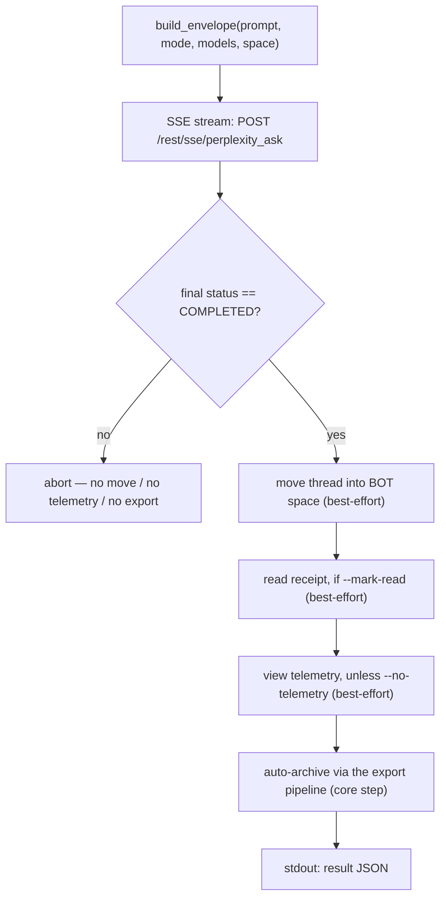

<a id="pplx-ask-interactive-queries" data-pplx-source-anchor="true"></a>
# pplx-ask: Consultas interactivas

`pplx-ask` es el segundo punto de entrada CLI del proyecto: hace preguntas a Perplexity
de forma interactiva a través de streaming SSE, luego procesa el hilo resultante — moviéndolo
al espacio BOT, enviando un recibo de lectura opcional y telemetría de vista similar a la humana, y
archivándolo automáticamente con el mismo pipeline de exportación que `pplx-export`. Comparte el
núcleo (transporte / cookies / estado / registro) con `pplx-export`, y todas las formas de API son
verificadas contra la plataforma en vivo.

Fuente: `pplx_export/ask_cli.py` (CLI), `pplx_export/sites/perplexity/ask_api.py` (capa API).

```bash
pplx-ask models                                  # list the authoritative model table
pplx-ask ask "What is the time resolution of an example parameter?"   # search mode (default)
pplx-ask ask "<long prompt>" --mode council      # model council (default three models)
pplx-ask ask "<prompt>" --mode council --models gpt55_thinking,claude48opusthinking
pplx-ask ask "<prompt>" --mode deep-research     # deep research (fixed pplx_alpha)
pplx-ask ask "<prompt>" --space some-space-slug  # create inside a space, then move into BOT
pplx-ask ask "<prompt>" --mark-read              # send a read receipt after completion
pplx-ask mark-read <thread_url|uuid>             # standalone read receipt
pplx-ask space-create "My Space"                 # create a space
```

<a id="subcommands" data-pplx-source-anchor="true"></a>
## Subcomandos

### `models`

Imprime la tabla de modelos autoritativa y en vivo desde
`GET https://www.perplexity.ai/rest/models/config/v2` (`pplx_export/ask_cli.py:51`):
modelos predeterminados por modo, los tres modelos predeterminados del consejo, los modelos seleccionables en
modo de búsqueda y los modos especiales (`research` / `study` / `agentic_research` / `studio`).
Sin opciones.

### `ask`

Hace una pregunta (`pplx_export/ask_cli.py:86`). Transmite el progreso por SSE a la consola,
ejecuta el pipeline de posprocesamiento (ver [El flujo de consulta](#the-ask-flow)) e imprime un
objeto JSON legible por máquina en la salida estándar al final.

| Opción | Predeterminado | Descripción |
|---|---|---|
| `prompt` (posicional) | — | La pregunta. Los mensajes largos y significativos funcionan mejor. |
| `--mode` | `search` | `search` = búsqueda normal (modelo seleccionable); `deep-research` = investigación profunda (modelo fijo); `council` = consejo de modelos (2–3 modelos en paralelo + síntesis); `study` = estudio paso a paso |
| `--models` | ninguno | `council`: IDs de modelo separados por comas (2–3) (predeterminado `gpt55_thinking,claude48opusthinking,gemini31pro_high`); `search`: un solo ID de modelo; ignorado por `deep-research` / `study` |
| `--space` | `home` | `home` = crear desde la página de inicio, luego mover al espacio BOT; `<slug>` = crear directamente dentro de ese espacio, luego mover al espacio BOT |
| `--mark-read` | desactivado | Enviar un recibo de lectura (`mark_viewed`) después de la finalización |
| `--no-telemetry` | desactivado | No enviar telemetría de vista similar a la humana (predeterminado: enviar — `ask context pane viewed` / `thread viewed` / `thread entry exited` con tiempos aleatorios) |
| `--no-export` | desactivado | No archivar automáticamente en `web_archive` |
| `--timeout` | `600` | Tiempo de espera del stream SSE en segundos |

Pistas de error HTTP emitidas por `ask` (`pplx_export/ask_cli.py:124`): `401`/`403` = la
cookie ha expirado o está controlada por riesgo (actualizar la cookie), `429` = límite de tasa alcanzado (reintentar
más tarde), `5xx` = error del servidor (reintentar más tarde). Ver [Solución de problemas](troubleshooting.md).

### `mark-read`

Envía un recibo de lectura para un hilo existente (`pplx_export/ask_cli.py:201`): acepta una
URL de hilo o un UUID simple, resuelve el `context_uuid` del hilo a través de
`GET /rest/thread/<uuid>`, luego llama a `POST /rest/thread/mark_viewed` con
`{"context_uuids": [ctx]}` (`pplx_export/sites/perplexity/ask_api.py:190`). La bandera de no leído
cambia inmediatamente. Imprime `{"uuid", "context_uuid", "result"}` como JSON.

Nota: el evento de análisis `thread viewed` **no** cambia el estado de no leído — el recibo de lectura real
es este endpoint.

### `space-create`

Crea un espacio a través de `POST /rest/collections/create_collection`
(`pplx_export/sites/perplexity/ask_api.py:179`) con los campos fijos verificados
(`emoji: "1f4c1"`, `access: 1`). Imprime `{"uuid", "slug", "url"}` como JSON.

| Opción | Predeterminado | Descripción |
|---|---|---|
| `title` (posicional) | — | Título del espacio |
| `--description` | `""` | Descripción del espacio |

Para usar el nuevo espacio como espacio BOT, registre su `uuid`/`slug` bajo `[bot_space]`
en la configuración a nivel de usuario (ver [Configuración](configuration.md)).

<a id="common-options" data-pplx-source-anchor="true"></a>
## Opciones comunes

Compartidas con `pplx-export` (nombres y valores predeterminados idénticos, `pplx_export/commands/common.py:232`):

| Opción | Predeterminado | Descripción |
|---|---|---|
| `--account` | config `default_account` | Cuenta objetivo; en caso de discrepancia cookie/correo, los tokens de sesión por cuenta del navegador se enumeran y cambian automáticamente |
| `--config PATH` | `~/.config/pplx-export/config.toml` | Configuración a nivel de usuario (registro de cuentas / espacio BOT); prioridad: `--config` > variable de entorno `PPLX_EXPORT_CONFIG` > ruta predeterminada |
| `--out` | `./web_archive` | Raíz de salida del archivo |
| `--cookies-from BROWSER` | detección automática | Importar cookies del navegador nombrado (`edge`/`chrome`/`firefox`/`safari`/`brave`…) |
| `--cookies FILE` | — | Archivo de cookies en formato Netscape o JSON |
| `-v` / `--verbose` | desactivado | Salida DEBUG (seguimiento de solicitudes / decisiones internas) |
| `--log-file [PATH]` | desactivado | Registro DEBUG completo en archivo; sin valor, se guarda en `<out>/index/logs/<cmd>-<timestamp>.log` |

Prioridad de fuente de cookies: `--cookies-from` / `--cookies` > caché reciente
(`<out>/index/.cookies.json`, 12 h) > detección automática del navegador. Ver
[Primeros pasos](getting-started.md) para la configuración inicial.

<a id="the-ask-flow" data-pplx-source-anchor="true"></a>
## El flujo de consulta



1. **Ensamblaje del sobre** — `build_envelope` (`pplx_export/sites/perplexity/ask_api.py:71`)
   llena la plantilla de parámetros verificada: `mode` es siempre `"copilot"` y
   `query_source` es `"home"` (cada `ask` inicia una conversación **nueva**; la continuación
   de seguimiento no está expuesta por la CLI). Con `--space <slug>`, el slug del espacio se
   resuelve a un uuid primero, y el sobre lleva `target_collection_uuid` +
   `target_thread_access_level: 1`.
2. **Streaming SSE** — `sse_ask` (`pplx_export/sites/perplexity/ask_api.py:153`) hace POST a
   `https://www.perplexity.ai/rest/sse/perplexity_ask` y consume el flujo de eventos,
   registrando la creación del hilo (`https://www.perplexity.ai/search/<uuid>`), transiciones de
   estado y progreso de generación. El flujo termina en `final_sse_message`.
3. **Puerta de finalización** — el posprocesamiento solo se ejecuta cuando el estado final es `COMPLETED`
   (`pplx_export/ask_cli.py:134`). En caso de finalización anormal del flujo, todo después de este
   punto se omite (sin movimiento, sin telemetría, sin exportación) para que un estado a medio terminar nunca
   se filtre al archivo.
4. **Mover al espacio BOT** (mejor esfuerzo) — `batch_move_threads` con el `context_uuid` del hilo
   al uuid de `[bot_space]` configurado. Se omite cuando no hay espacio BOT
   configurado, o cuando el hilo ya fue creado dentro del espacio BOT.
5. **Recibo de lectura** (mejor esfuerzo, `--mark-read`) — `POST /rest/thread/mark_viewed`;
   la bandera de no leído cambia inmediatamente.
6. **Telemetría de vista similar a la humana** (mejor esfuerzo, activada por defecto) —
   `send_view_telemetry` (`pplx_export/sites/perplexity/ask_api.py:234`) imita los tiempos de
   navegación reales: `ask context pane viewed` → `thread viewed` → `ask context pane
   viewed` → `thread entry exited` (random `timeOnEntryMs` de 12–45 s, pausas de 0.6–2.4 s
   entre eventos, dispositivo elegido aleatoriamente de un grupo pequeño).
7. **Archivado automático** (paso central, a menos que `--no-export`) — el hilo se exporta
   a través del mismo pipeline que `pplx-export export` (modo forzado), guardándose en
   `<out>/<account>/<mode>/<date>_<title>_<uuid8>/` — ver
   [Estructura del archivo](archive-layout.md) y [Pipeline de exportación](../architecture/export-pipeline.md).
   A diferencia de los pasos de mejor esfuerzo, un fallo de archivado se propaga y hace fallar el comando.

**Aislamiento de fallos**: los pasos 4–6 están aislados como mejor esfuerzo (`pplx_export/ask_cli.py:36`):
un fallo registra una advertencia, establece la clave JSON del paso a `false`, registra el detalle bajo
`step_errors` y nunca bloquea el archivado. El archivado (paso 7) es el paso central y sus
fallos nunca se omiten.

<a id="modes-and-model-selection" data-pplx-source-anchor="true"></a>
## Modos y selección de modelo

La tabla de modelos autoritativa de la plataforma es `GET /rest/models/config/v2` (lo que
`pplx-ask models` imprime). La discriminación reside en el campo `model_preference` — el
`mode` del sobre es siempre `"copilot"`.

| Modo | Valor de `--mode` | `model_preference` | Selección de modelo |
|---|---|---|---|
| Búsqueda | `search` | `pplx_pro` ("Mejor" en la interfaz) por defecto | ID de modelo único a través de `--models` (ver `pplx-ask models` para la lista seleccionable) |
| Investigación profunda | `deep-research` | `pplx_alpha` | Fijo — sin selector |
| Consejo de modelos | `council` | `pplx_agentic_research` + `compare_model_preferences` | 2–3 IDs separados por comas a través de `--models`; predeterminado `gpt55_thinking,claude48opusthinking,gemini31pro_high` |
| Estudio paso a paso | `study` | `pplx_study` | Fijo — sin selector |
| Computer | *(no expuesto)* | Familia `pplx_asi*` | No compatible con `pplx-ask` |

Notas:

- El consejo ejecuta los modelos en paralelo y sintetiza; la latencia observada del primer token puede
  superar los 3 minutos, por lo tanto aumente `--timeout` para ejecuciones de consejo / investigación profunda.
- La taxonomía de modos del lado del archivo (cómo se clasifican los hilos exportados, incluyendo
  `computer`) está documentada en [Modos](modes.md); los detalles del sobre de solicitud están en
  [Endpoints REST](../reference/api/api-rest-endpoints.md).

<a id="using-pplx-ask-from-other-agents" data-pplx-source-anchor="true"></a>
## Uso de pplx-ask desde otros agentes

`pplx-ask` está construido para que otros agentes puedan obtener información en tiempo real: hace una
pregunta, espera la finalización, archiva el hilo y emite un contrato
legible por máquina.

- **stdout lleva exactamente un objeto JSON** (la última línea); todos los registros van a stderr, por lo que
  los llamadores pueden canalizar stdout directamente a un analizador JSON.
- **Estado de salida**: `0` en éxito; los fallos salen con código distinto de cero y un mensaje de error en
  stderr — los fallos en la etapa de consulta abortan a través de `SystemExit` con un mensaje `[ask][ERROR]`,
  mientras que los fallos de archivado se propagan tal cual (ver paso 7).

Forma del JSON de resultado (`pplx_export/ask_cli.py:194`):

| Clave | Tipo | Significado |
|---|---|---|
| `thread_uuid` | string | UUID del hilo creado en el backend |
| `thread_url` | string | `https://www.perplexity.ai/search/<thread_uuid>` |
| `context_uuid` | string | El `context_uuid` del hilo (usado por mover/marcar-leído/telemetría) |
| `moved_to_bot` | boolean | `true` = el movimiento al espacio BOT se ejecutó y tuvo éxito; `false` = no se ejecutó o falló |
| `mark_read` | boolean | Mismo contrato para el recibo de lectura |
| `telemetry` | boolean | Mismo contrato para la telemetría de vista |
| `step_errors` | object | Detalles de fallo por paso; solo aparecen los pasos fallidos |
| `exported` | string \| null | `"见上方 [export] 输出"` cuando se ejecutó el archivado; `null` con `--no-export` |

Consejos de automatización:

- Trate los booleanos de paso estrictamente — un fallo nunca se representa con un valor verdadero;
  verifique `step_errors` para detalles.
- `--no-telemetry` omite la pausa similar a la humana de 12–45 s cuando solo importa la respuesta.
- Sin un espacio BOT configurado (modo degradado), `moved_to_bot` permanece `false` y
  todo lo demás sigue funcionando — ver [Solución de problemas](troubleshooting.md).
- Para la configuración de cuenta/cookie, los agentes sin cabeza deben leer
  [Autenticación de API](../reference/api/api-authentication.md); el comportamiento de múltiples cuentas está en
  [Consultas y cuentas](../architecture/ask-and-accounts.md).

<a id="see-also" data-pplx-source-anchor="true"></a>
## Ver también

- [Primeros pasos](getting-started.md) — instalación, cookies, primera ejecución
- [Configuración](configuration.md) — cuentas, espacio BOT, modo degradado
- [pplx-export](pplx-export.md) — la CLI de archivado
- [Solución de problemas](troubleshooting.md) — 401/403, cuenta incorrecta, registros
