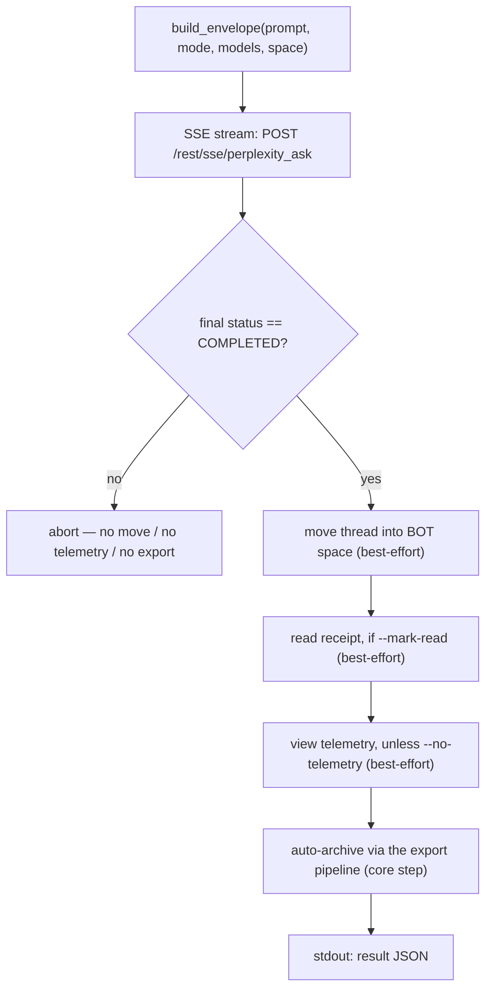

<a id="pplx-ask-interactive-queries" data-pplx-source-anchor="true"></a>
# pplx-ask : Requêtes interactives

`pplx-ask` est le deuxième point d'entrée CLI du projet : il pose des questions à Perplexity
de manière interactive via le streaming SSE, puis post-traite le fil résultant — le déplaçant
dans l'espace BOT, envoyant un accusé de lecture facultatif et une télémétrie de type humain, et
l'archivant automatiquement avec le même pipeline d'exportation que `pplx-export`. Il partage le
noyau (transport / cookies / état / journalisation) avec `pplx-export`, et toutes les formes d'API sont
vérifiées par rapport à la plateforme en direct.

Source : `pplx_export/ask_cli.py` (CLI), `pplx_export/sites/perplexity/ask_api.py` (couche API).

```bash
pplx-ask models                                  # list the authoritative model table
pplx-ask ask "What is the time resolution of an example parameter?"   # search mode (default)
pplx-ask ask "<long prompt>" --mode council      # model council (default three models)
pplx-ask ask "<prompt>" --mode council --models gpt55_thinking,claude48opusthinking
pplx-ask ask "<prompt>" --mode deep-research     # deep research (fixed pplx_alpha)
pplx-ask ask "<prompt>" --space some-space-slug  # create inside a space, then move into BOT
pplx-ask ask "<prompt>" --mark-read              # send a read receipt after completion
pplx-ask mark-read <thread_url|uuid>             # standalone read receipt
pplx-ask space-create "My Space"                 # create a space
```

<a id="subcommands" data-pplx-source-anchor="true"></a>
## Sous-commandes

### `models`

Affiche la table des modèles faisant autorité et en direct depuis
`GET https://www.perplexity.ai/rest/models/config/v2` (`pplx_export/ask_cli.py:51`) :
modèles par défaut par mode, les trois modèles par défaut du conseil, les modèles sélectionnables en
mode recherche, et les modes spéciaux (`research` / `study` / `agentic_research` / `studio`).
Aucune option.

### `ask`

Pose une question (`pplx_export/ask_cli.py:86`). Diffuse la progression SSE vers la console,
exécute le pipeline de post-traitement (voir [Le flux ask](#the-ask-flow)), et affiche un
objet JSON lisible par machine sur stdout à la fin.

| Option | Défaut | Description |
|---|---|---|
| `prompt` (positionnel) | — | La question. Les invites longues et significatives fonctionnent mieux. |
| `--mode` | `search` | `search` = recherche normale (modèle sélectionnable) ; `deep-research` = recherche approfondie (modèle fixe) ; `council` = conseil de modèles (2–3 modèles en parallèle + synthèse) ; `study` = étude pas à pas |
| `--models` | aucun | `council` : 2–3 identifiants de modèles séparés par des virgules (défaut `gpt55_thinking,claude48opusthinking,gemini31pro_high`) ; `search` : un seul identifiant de modèle ; ignoré par `deep-research` / `study` |
| `--space` | `home` | `home` = créer depuis la page d'accueil, puis déplacer dans l'espace BOT ; `<slug>` = créer directement dans cet espace, puis déplacer dans l'espace BOT |
| `--mark-read` | désactivé | Envoyer un accusé de lecture (`mark_viewed`) après la fin |
| `--no-telemetry` | désactivé | Ne pas envoyer de télémétrie de type humain (défaut : envoyer — `ask context pane viewed` / `thread viewed` / `thread entry exited` avec temporisation aléatoire) |
| `--no-export` | désactivé | Ne pas archiver automatiquement dans `web_archive` |
| `--timeout` | `600` | Délai d'attente du flux SSE en secondes |

Indications d'erreur HTTP émises par `ask` (`pplx_export/ask_cli.py:124`) : `401`/`403` = le
cookie est expiré ou contrôlé par les risques (mettre à jour le cookie), `429` = limite de débit atteinte (réessayer
plus tard), `5xx` = erreur serveur (réessayer plus tard). Voir [Dépannage](troubleshooting.md).

### `mark-read`

Envoie un accusé de lecture pour un fil existant (`pplx_export/ask_cli.py:201`) : accepte une
URL de fil ou un UUID brut, résout le `context_uuid` du fil via
`GET /rest/thread/<uuid>`, puis appelle `POST /rest/thread/mark_viewed` avec
`{"context_uuids": [ctx]}` (`pplx_export/sites/perplexity/ask_api.py:190`). Le drapeau
non lu bascule immédiatement. Affiche `{"uuid", "context_uuid", "result"}` au format JSON.

Remarque : l'événement analytique `thread viewed` ne **bascule pas** le non lu — le véritable accusé de
lecture est ce point de terminaison.

### `space-create`

Crée un espace via `POST /rest/collections/create_collection`
(`pplx_export/sites/perplexity/ask_api.py:179`) avec les champs fixes vérifiés
(`emoji: "1f4c1"`, `access: 1`). Affiche `{"uuid", "slug", "url"}` au format JSON.

| Option | Défaut | Description |
|---|---|---|
| `title` (positionnel) | — | Titre de l'espace |
| `--description` | `""` | Description de l'espace |

Pour utiliser le nouvel espace comme espace BOT, enregistrez son `uuid`/`slug` sous `[bot_space]`
dans la configuration au niveau utilisateur (voir [Configuration](configuration.md)).

<a id="common-options" data-pplx-source-anchor="true"></a>
## Options communes

Partagées avec `pplx-export` (noms et valeurs par défaut identiques, `pplx_export/commands/common.py:232`) :

| Option | Défaut | Description |
|---|---|---|
| `--account` | config `default_account` | Compte cible ; en cas de non-concordance cookie/email, les jetons de session par compte du navigateur sont énumérés et commutés automatiquement |
| `--config PATH` | `~/.config/pplx-export/config.toml` | Configuration au niveau utilisateur (registre de comptes / espace BOT) ; priorité : `--config` > variable d'environnement `PPLX_EXPORT_CONFIG` > chemin par défaut |
| `--out` | `./web_archive` | Racine de sortie d'archive |
| `--cookies-from BROWSER` | détection auto | Importer les cookies depuis le navigateur nommé (`edge`/`chrome`/`firefox`/`safari`/`brave`…) |
| `--cookies FILE` | — | Fichier cookie au format Netscape ou JSON |
| `-v` / `--verbose` | désactivé | Sortie DEBUG (traçage des requêtes / décisions internes) |
| `--log-file [PATH]` | désactivé | Journal DEBUG complet dans un fichier ; sans valeur, il atterrit dans `<out>/index/logs/<cmd>-<timestamp>.log` |

Priorité de la source de cookies : `--cookies-from` / `--cookies` > cache frais
(`<out>/index/.cookies.json`, 12 h) > détection automatique du navigateur. Voir
[Premiers pas](getting-started.md) pour la configuration initiale.

<a id="the-ask-flow" data-pplx-source-anchor="true"></a>
## Le flux ask



1. **Assemblage de l'enveloppe** — `build_envelope` (`pplx_export/sites/perplexity/ask_api.py:71`)
   remplit le modèle de paramètres vérifié : `mode` est toujours `"copilot"` et
   `query_source` est `"home"` (chaque `ask` démarre une **nouvelle** conversation ; la
   continuation de suivi n'est pas exposée par la CLI). Avec `--space <slug>`, le slug de l'espace est
   résolu en un uuid d'abord, et l'enveloppe porte `target_collection_uuid` +
   `target_thread_access_level: 1`.
2. **Streaming SSE** — `sse_ask` (`pplx_export/sites/perplexity/ask_api.py:153`) POSTe vers
   `https://www.perplexity.ai/rest/sse/perplexity_ask` et consomme le flux d'événements,
   enregistrant la création du fil (`https://www.perplexity.ai/search/<uuid>`), les transitions
   d'état et la progression de la génération. Le flux se termine sur `final_sse_message`.
3. **Porte d'achèvement** — le post-traitement ne s'exécute que lorsque l'état final est `COMPLETED`
   (`pplx_export/ask_cli.py:134`). En cas de fin anormale du flux, tout après ce
   point est ignoré (pas de déplacement, pas de télémétrie, pas d'exportation) afin qu'un état à moitié terminé ne
   fuie jamais dans l'archive.
4. **Déplacement dans l'espace BOT** (au mieux) — `batch_move_threads` avec le
   `context_uuid` du fil dans l'uuid `[bot_space]` configuré. Ignoré lorsqu'aucun espace BOT n'est
   configuré, ou lorsque le fil a déjà été créé dans l'espace BOT.
5. **Accusé de lecture** (au mieux, `--mark-read`) — `POST /rest/thread/mark_viewed` ;
   le drapeau non lu bascule immédiatement.
6. **Télémétrie de type humain** (au mieux, activée par défaut) —
   `send_view_telemetry` (`pplx_export/sites/perplexity/ask_api.py:234`) imite le timing de
   navigation réel : `ask context pane viewed` → `thread viewed` → `ask context pane
   viewed` → `thread entry exited` (random `timeOnEntryMs` de 12–45 s, pauses de 0,6–2,4 s
   entre les événements, appareil choisi aléatoirement dans un petit pool).
7. **Archivage automatique** (étape centrale, sauf `--no-export`) — le fil est exporté
   via le même pipeline que `pplx-export export` (mode forcé), atterrissant sous
   `<out>/<account>/<mode>/<date>_<title>_<uuid8>/` — voir
   [Structure de l'archive](archive-layout.md) et [Pipeline d'exportation](../architecture/export-pipeline.md).
   Contrairement aux étapes au mieux, un échec d'archivage se propage et fait échouer la commande.

**Isolation des échecs** : les étapes 4–6 sont isolées comme au mieux (`pplx_export/ask_cli.py:36`) :
un échec enregistre un avertissement, définit la clé JSON de l'étape sur `false`, enregistre le détail sous
`step_errors`, et ne bloque jamais l'archivage. L'archivage (étape 7) est l'étape centrale et ses
échecs ne sont jamais avalés.

<a id="modes-and-model-selection" data-pplx-source-anchor="true"></a>
## Modes et sélection de modèle

La table des modèles faisant autorité de la plateforme est `GET /rest/models/config/v2` (ce que
`pplx-ask models` affiche). La discrimination réside dans le champ `model_preference` — le
`mode` de l'enveloppe est toujours `"copilot"`.

| Mode | Valeur `--mode` | `model_preference` | Sélection de modèle |
|---|---|---|---|
| Recherche | `search` | `pplx_pro` ("Meilleur" dans l'interface) par défaut | Identifiant de modèle unique via `--models` (voir `pplx-ask models` pour la liste sélectionnable) |
| Recherche approfondie | `deep-research` | `pplx_alpha` | Fixe — pas de sélecteur |
| Conseil de modèles | `council` | `pplx_agentic_research` + `compare_model_preferences` | 2–3 identifiants séparés par des virgules via `--models` ; défaut `gpt55_thinking,claude48opusthinking,gemini31pro_high` |
| Étude pas à pas | `study` | `pplx_study` | Fixe — pas de sélecteur |
| Computer | *(non exposé)* | Famille `pplx_asi*` | Non pris en charge par `pplx-ask` |

Remarques :

- Le conseil exécute les modèles en parallèle et synthétise ; la latence observée du premier jeton peut
  dépasser 3 minutes, donc augmentez `--timeout` pour les exécutions de conseil / recherche approfondie.
- La taxonomie des modes côté archive (comment les fils exportés sont classifiés, y compris
  `computer`) est documentée dans [Modes](modes.md) ; les détails de l'enveloppe de requête se trouvent dans
  [Points de terminaison REST](../reference/api/api-rest-endpoints.md).

<a id="using-pplx-ask-from-other-agents" data-pplx-source-anchor="true"></a>
## Utilisation de pplx-ask depuis d'autres agents

`pplx-ask` est conçu pour que d'autres agents puissent récupérer des informations en temps réel : il pose une
question, attend la fin, archive le fil et émet un contrat lisible par machine.

- **stdout contient exactement un objet JSON** (la dernière ligne) ; tous les journaux vont sur stderr, donc
  les appelants peuvent rediriger stdout directement vers un analyseur JSON.
- **Code de sortie** : `0` en cas de succès ; les échecs se terminent avec un code non nul et un message d'erreur sur
  stderr — les échecs au stade de la question abandonnent via `SystemExit` avec un message `[ask][ERROR]`,
  tandis que les échecs d'archivage se propagent tels quels (voir étape 7).

Forme du JSON de résultat (`pplx_export/ask_cli.py:194`) :

| Clé | Type | Signification |
|---|---|---|
| `thread_uuid` | chaîne | UUID backend du fil créé |
| `thread_url` | chaîne | `https://www.perplexity.ai/search/<thread_uuid>` |
| `context_uuid` | chaîne | `context_uuid` du fil (utilisé par déplacement / marquer comme lu / télémétrie) |
| `moved_to_bot` | booléen | `true` = le déplacement dans l'espace BOT a été exécuté et a réussi ; `false` = non exécuté ou a échoué |
| `mark_read` | booléen | Même contrat pour l'accusé de lecture |
| `telemetry` | booléen | Même contrat pour la télémétrie de vue |
| `step_errors` | objet | Détails d'échec par étape ; seules les étapes ayant échoué apparaissent |
| `exported` | chaîne \| null | `"见上方 [export] 输出"` lorsque l'archivage a été exécuté ; `null` avec `--no-export` |

Conseils d'automatisation :

- Traitez les booléens d'étape strictement — un échec n'est jamais représenté par une valeur vraie ;
  vérifiez `step_errors` pour les détails.
- `--no-telemetry` ignore la temporisation humaine de 12–45 s lorsque seule la réponse importe.
- Sans espace BOT configuré (mode dégradé), `moved_to_bot` reste `false` et
  tout le reste fonctionne toujours — voir [Dépannage](troubleshooting.md).
- Pour la configuration du compte/cookie, les agents sans tête devraient lire
  [Authentification API](../reference/api/api-authentication.md) ; le comportement multi-compte est dans
  [Ask et comptes](../architecture/ask-and-accounts.md).

<a id="see-also" data-pplx-source-anchor="true"></a>
## Voir aussi

- [Premiers pas](getting-started.md) — installation, cookies, première exécution
- [Configuration](configuration.md) — comptes, espace BOT, mode dégradé
- [pplx-export](pplx-export.md) — la CLI d'archivage
- [Dépannage](troubleshooting.md) — 401/403, mauvais compte, journaux
