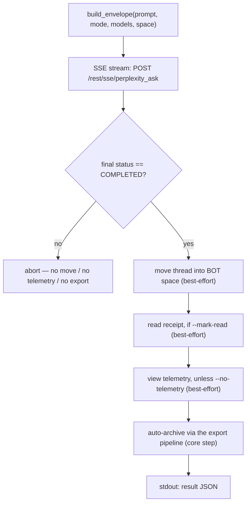

<a id="pplx-ask-interactive-queries" data-pplx-source-anchor="true"></a>
# pplx-ask: Query interattive

`pplx-ask` è il secondo punto di ingresso CLI del progetto: pone domande a Perplexity
in modo interattivo tramite streaming SSE, quindi post-elabora il thread risultante — spostandolo
nello spazio BOT, inviando una ricevuta di lettura opzionale e telemetria di visualizzazione simile a quella umana, e
archiviandolo automaticamente con la stessa pipeline di esportazione di `pplx-export`. Condivide il
core (trasporto / cookie / stato / logging) con `pplx-export`, e tutte le forme API sono
verificate rispetto alla piattaforma live.

Fonte: `pplx_export/ask_cli.py` (CLI), `pplx_export/sites/perplexity/ask_api.py` (livello API).

```bash
pplx-ask models                                  # list the authoritative model table
pplx-ask ask "What is the time resolution of an example parameter?"   # search mode (default)
pplx-ask ask "<long prompt>" --mode council      # model council (default three models)
pplx-ask ask "<prompt>" --mode council --models gpt55_thinking,claude48opusthinking
pplx-ask ask "<prompt>" --mode deep-research     # deep research (fixed pplx_alpha)
pplx-ask ask "<prompt>" --space some-space-slug  # create inside a space, then move into BOT
pplx-ask ask "<prompt>" --mark-read              # send a read receipt after completion
pplx-ask mark-read <thread_url|uuid>             # standalone read receipt
pplx-ask space-create "My Space"                 # create a space
```

<a id="subcommands" data-pplx-source-anchor="true"></a>
## Sottocomandi

### `models`

Stampa la tabella dei modelli live e autorevole da
`GET https://www.perplexity.ai/rest/models/config/v2` (`pplx_export/ask_cli.py:51`):
modelli predefiniti per modalità, i tre modelli predefiniti del council, i modelli selezionabili in
modalità di ricerca e le modalità speciali (`research` / `study` / `agentic_research` / `studio`).
Nessuna opzione.

### `ask`

Pone una domanda (`pplx_export/ask_cli.py:86`). Trasmette in streaming SSE l'avanzamento alla console,
esegue la pipeline di post-elaborazione (vedi [Il flusso ask](#the-ask-flow)) e stampa un
oggetto JSON leggibile dalla macchina su stdout alla fine.

| Opzione | Predefinito | Descrizione |
|---|---|---|
| `prompt` (posizionale) | — | La domanda. Prompt lunghi e significativi funzionano meglio. |
| `--mode` | `search` | `search` = ricerca normale (modello selezionabile); `deep-research` = deep research (modello fisso); `council` = model council (2–3 modelli in parallelo + sintesi); `study` = studio passo-passo |
| `--models` | nessuno | `council`: ID modello separati da virgola, 2–3 (predefinito `gpt55_thinking,claude48opusthinking,gemini31pro_high`); `search`: un singolo ID modello; ignorato da `deep-research` / `study` |
| `--space` | `home` | `home` = crea dalla home page, quindi sposta nello spazio BOT; `<slug>` = crea direttamente all'interno di quello spazio, quindi sposta nello spazio BOT |
| `--mark-read` | off | Invia una ricevuta di lettura (`mark_viewed`) dopo il completamento |
| `--no-telemetry` | off | Non inviare telemetria di visualizzazione simile a quella umana (predefinito: invia — `ask context pane viewed` / `thread viewed` / `thread entry exited` con tempistica randomizzata) |
| `--no-export` | off | Non archiviare automaticamente in `web_archive` |
| `--timeout` | `600` | Timeout del flusso SSE in secondi |

Suggerimenti di errore HTTP emessi da `ask` (`pplx_export/ask_cli.py:124`): `401`/`403` = il
cookie è scaduto o controllato dal rischio (aggiorna il cookie), `429` = limitazione di frequenza (riprova
più tardi), `5xx` = errore del server (riprova più tardi). Vedi [Risoluzione dei problemi](troubleshooting.md).

### `mark-read`

Invia una ricevuta di lettura per un thread esistente (`pplx_export/ask_cli.py:201`): accetta un
URL del thread o un UUID nudo, risolve l'`context_uuid` del thread tramite
`GET /rest/thread/<uuid>`, quindi chiama `POST /rest/thread/mark_viewed` con
`{"context_uuids": [ctx]}` (`pplx_export/sites/perplexity/ask_api.py:190`). Il flag
non letto si capovolge immediatamente. Stampa `{"uuid", "context_uuid", "result"}` come JSON.

Nota: l'evento di analisi `thread viewed` **non** capovolge il non letto — la vera ricevuta di
lettura è questo endpoint.

### `space-create`

Crea uno spazio tramite `POST /rest/collections/create_collection`
(`pplx_export/sites/perplexity/ask_api.py:179`) con i campi fissi verificati
(`emoji: "1f4c1"`, `access: 1`). Stampa `{"uuid", "slug", "url"}` come JSON.

| Opzione | Predefinito | Descrizione |
|---|---|---|
| `title` (posizionale) | — | Titolo dello spazio |
| `--description` | `""` | Descrizione dello spazio |

Per utilizzare il nuovo spazio come spazio BOT, registra il suo `uuid`/`slug` sotto `[bot_space]`
nel file di configurazione a livello utente (vedi [Configurazione](configuration.md)).

<a id="common-options" data-pplx-source-anchor="true"></a>
## Opzioni comuni

Condivise con `pplx-export` (nomi e predefiniti identici, `pplx_export/commands/common.py:232`):

| Opzione | Predefinito | Descrizione |
|---|---|---|
| `--account` | config `default_account` | Account di destinazione; in caso di disallineamento cookie/email, i token di sessione per account del browser vengono enumerati e commutati automaticamente |
| `--config PATH` | `~/.config/pplx-export/config.toml` | Configurazione a livello utente (registro account / spazio BOT); priorità: `--config` > variabile d'ambiente `PPLX_EXPORT_CONFIG` > percorso predefinito |
| `--out` | `./web_archive` | Directory di output dell'archivio |
| `--cookies-from BROWSER` | rilevamento automatico | Importa cookie dal browser nominato (`edge`/`chrome`/`firefox`/`safari`/`brave`…) |
| `--cookies FILE` | — | File cookie Netscape o file cookie JSON |
| `-v` / `--verbose` | off | Output DEBUG (tracciamento richieste / decisioni interne) |
| `--log-file [PATH]` | off | Log DEBUG completo su file; senza valore finisce in `<out>/index/logs/<cmd>-<timestamp>.log` |

Priorità fonte cookie: `--cookies-from` / `--cookies` > cache recente
(`<out>/index/.cookies.json`, 12 h) > rilevamento automatico browser. Vedi
[Per iniziare](getting-started.md) per la configurazione iniziale.

<a id="the-ask-flow" data-pplx-source-anchor="true"></a>
## Il flusso ask



1. **Assemblaggio busta** — `build_envelope` (`pplx_export/sites/perplexity/ask_api.py:71`)
   riempie il modello di parametri verificato: `mode` è sempre `"copilot"` e
   `query_source` è `"home"` (ogni `ask` avvia una **nuova** conversazione; la continuazione
   di follow-up non è esposta dalla CLI). Con `--space <slug>`, lo slug dello spazio viene
   prima risolto in un uuid, e la busta trasporta `target_collection_uuid` +
   `target_thread_access_level: 1`.
2. **Streaming SSE** — `sse_ask` (`pplx_export/sites/perplexity/ask_api.py:153`) invia una POST a
   `https://www.perplexity.ai/rest/sse/perplexity_ask` e consuma il flusso di eventi,
   registrando la creazione del thread (`https://www.perplexity.ai/search/<uuid>`), le transizioni
   di stato e l'avanzamento della generazione. Il flusso termina su `final_sse_message`.
   Quando il flusso rimane inattivo per un intervallo (deep-research / council può essere silenzioso
   per minuti; il timeout aperto è 600 s), `post_stream` emette un heartbeat INFO "ancora in attesa del
   flusso di risposta" alla verbosità predefinita in modo che un'esecuzione live non venga mai
   scambiata per un blocco.
3. **Cancello di completamento** — la post-elaborazione viene eseguita solo quando lo stato finale è `COMPLETED`
   (`pplx_export/ask_cli.py:134`). In caso di terminazione anomala del flusso, tutto ciò che segue questo
   punto viene saltato (nessuno spostamento, nessuna telemetria, nessuna esportazione) in modo che uno stato
   non finito non venga mai introdotto nell'archivio.
4. **Spostamento nello spazio BOT** (best-effort) — `batch_move_threads` con l'`context_uuid` del thread
   nell'uuid `[bot_space]` configurato. Saltato quando nessuno spazio BOT è
   configurato, o quando il thread è già stato creato all'interno dello spazio BOT.
5. **Ricevuta di lettura** (best-effort, `--mark-read`) — `POST /rest/thread/mark_viewed`;
   il flag non letto si capovolge immediatamente.
6. **Telemetria di visualizzazione simile a quella umana** (best-effort, attiva per impostazione predefinita) —
   `send_view_telemetry` (`pplx_export/sites/perplexity/ask_api.py:234`) imita la tempistica di
   navigazione reale: `ask context pane viewed` → `thread viewed` → `ask context pane
   viewed` → `thread entry exited` (random `timeOnEntryMs` di 12–45 s, pause di 0,6–2,4 s
   tra gli eventi, dispositivo scelto casualmente da un piccolo pool).
7. **Archiviazione automatica** (passaggio principale, a meno che `--no-export`) — il thread viene esportato
   attraverso la stessa pipeline di `pplx-export export` (modalità forzata), finendo sotto
   `<out>/<account>/<mode>/<date>_<title>_<uuid8>/` — vedi
   [Struttura dell'archivio](archive-layout.md) e [Pipeline di esportazione](../architecture/export-pipeline.md).
   A differenza dei passaggi best-effort, un fallimento di archiviazione si propaga e fa fallire il comando.

**Isolamento dei fallimenti**: i passaggi 4–6 sono isolati come best-effort (`pplx_export/ask_cli.py:36`):
un fallimento registra un avviso, imposta la chiave JSON del passaggio su `false`, registra il dettaglio sotto
`step_errors` e non blocca mai l'archiviazione. L'archiviazione (passaggio 7) è il passaggio principale e i suoi
fallimenti non vengono mai ignorati.

<a id="modes-and-model-selection" data-pplx-source-anchor="true"></a>
## Modalità e selezione del modello

La tabella dei modelli autorevole della piattaforma è `GET /rest/models/config/v2` (ciò che
`pplx-ask models` stampa). La discriminazione risiede nel campo `model_preference` — la
`mode` della busta è sempre `"copilot"`.

| Modalità | Valore `--mode` | `model_preference` | Selezione modello |
|---|---|---|---|
| Ricerca | `search` | `pplx_pro` ("Migliore" nell'interfaccia) per impostazione predefinita | Singolo ID modello tramite `--models` (vedi `pplx-ask models` per l'elenco selezionabile) |
| Deep research | `deep-research` | `pplx_alpha` | Fisso — nessun selettore |
| Model council | `council` | `pplx_agentic_research` + `compare_model_preferences` | 2–3 ID separati da virgola tramite `--models`; predefinito `gpt55_thinking,claude48opusthinking,gemini31pro_high` |
| Studio passo-passo | `study` | `pplx_study` | Fisso — nessun selettore |
| Computer | *(non esposta)* | Famiglia `pplx_asi*` | Non supportato da `pplx-ask` |

Note:

- Il council esegue i modelli in parallelo e sintetizza; la latenza osservata del primo token può
  superare i 3 minuti, quindi aumenta `--timeout` per esecuzioni council / deep-research.
- La tassonomia delle modalità lato archivio (come vengono classificati i thread esportati, inclusi
  `computer`) è documentata in [Modalità](modes.md); i dettagli della busta di richiesta si trovano in
  [Endpoint REST](../reference/api/api-rest-endpoints.md).

<a id="using-pplx-ask-from-other-agents" data-pplx-source-anchor="true"></a>
## Utilizzo di pplx-ask da altri agenti

`pplx-ask` è costruito in modo che altri agenti possano recuperare informazioni in tempo reale: pone una
domanda, attende il completamento, archivia il thread ed emette un contratto
leggibile dalla macchina.

- **stdout trasporta esattamente un oggetto JSON** (l'ultima riga); tutti i log vanno su stderr, quindi
  i chiamanti possono inviare stdout direttamente a un parser JSON.
- **Stato di uscita**: `0` in caso di successo; i fallimenti escono con codice non zero e un messaggio di errore su
  stderr — i fallimenti in fase ask vengono interrotti tramite `SystemExit` con un messaggio `[ask][ERROR]`,
  mentre i fallimenti di archiviazione si propagano così come sono (vedi passaggio 7).

Forma JSON del risultato (`pplx_export/ask_cli.py:194`):

| Chiave | Tipo | Significato |
|---|---|---|
| `thread_uuid` | stringa | UUID backend del thread creato |
| `thread_url` | stringa | `https://www.perplexity.ai/search/<thread_uuid>` |
| `context_uuid` | stringa | L'`context_uuid` del thread (usato da sposta / segna-come-letto / telemetria) |
| `moved_to_bot` | booleano | `true` = lo spostamento nello spazio BOT è stato eseguito e ha avuto successo; `false` = non eseguito o fallito |
| `mark_read` | booleano | Stesso contratto per la ricevuta di lettura |
| `telemetry` | booleano | Stesso contratto per la telemetria di visualizzazione |
| `step_errors` | oggetto | Dettagli del fallimento per passaggio; appaiono solo i passaggi falliti |
| `exported` | stringa \| null | `"见上方 [export] 输出"` quando l'archiviazione è stata eseguita; `null` con `--no-export` |

Suggerimenti per l'automazione:

- Tratta i booleani dei passaggi in modo rigoroso — un fallimento non è mai rappresentato da un valore truthy;
  controlla `step_errors` per i dettagli.
- `--no-telemetry` salta la sosta simile a quella umana di 12–45 s quando conta solo la risposta.
- Senza uno spazio BOT configurato (modalità degradata), `moved_to_bot` rimane `false` e
  tutto il resto funziona comunque — vedi [Risoluzione dei problemi](troubleshooting.md).
- Per la configurazione account/cookie, gli agenti headless dovrebbero leggere
  [Autenticazione API](../reference/api/api-authentication.md); il comportamento multi-account è in
  [Ask e account](../architecture/ask-and-accounts.md).

<a id="see-also" data-pplx-source-anchor="true"></a>
## Vedi anche

- [Per iniziare](getting-started.md) — installazione, cookie, primo avvio
- [Configurazione](configuration.md) — account, spazio BOT, modalità degradata
- [pplx-export](pplx-export.md) — la CLI di archiviazione
- [Risoluzione dei problemi](troubleshooting.md) — 401/403, account sbagliato, log
