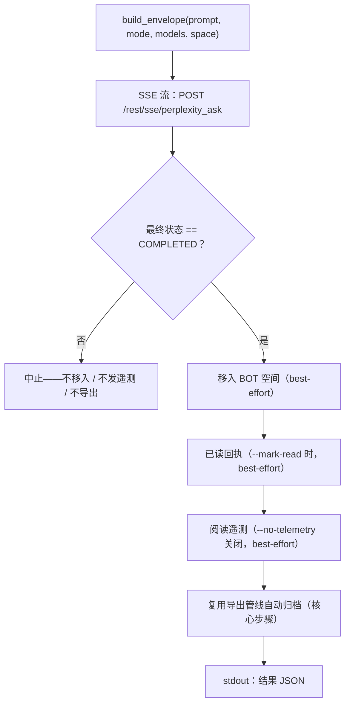

<a id="pplx-ask交互式查询" data-pplx-source-anchor="true"></a>
# pplx-ask：インタラクティブクエリ

`pplx-ask` は本プロジェクトの2つ目のCLIエントリポイントです。SSEストリームを介して Perplexity に質問を送信し、生成されたスレッドに対して後処理（BOTスペースへの移動、既読通知のオプション送信、人間らしい読み取りテレメトリの送信）を実行し、`pplx-export` と同じエクスポートパイプラインを使用して自動アーカイブします。`pplx-export` とコア（transport / cookies / state / logging）を共有し、すべてのAPI形式は実測済みです。

ソースコード：`pplx_export/ask_cli.py`（CLI）、`pplx_export/sites/perplexity/ask_api.py`（API層）。

```bash
pplx-ask models                                  # 列出权威模型总表
pplx-ask models --refresh                         # 刷新并把目录写入 config.toml 的 [models]
pplx-ask ask "示例参数的时间分辨率是多少？"   # 搜索模式（默认）
pplx-ask ask "<long prompt>" --mode council      # 模型委员会（默认三模型）
pplx-ask ask "<prompt>" --mode council --models gpt56_sol_thinking,claude50opusthinking
pplx-ask ask "<prompt>" --mode deep-research     # 深度研究（固定 pplx_alpha）
pplx-ask ask "<prompt>" --space some-space-slug  # 在该空间创建，完成后移入 BOT
pplx-ask ask "<prompt>" --mark-read              # 完成后发已读回执
pplx-ask mark-read <thread_url|uuid>             # 单独发已读回执
pplx-ask space-create "My Space"                 # 创建空间
```

<a id="子命令" data-pplx-source-anchor="true"></a>
## サブコマンド

### `models`

`GET https://www.perplexity.ai/rest/models/config/v2` からリアルタイムの権威モデル一覧を出力します（`pplx_export/ask_cli.py`、`cmd_models`）：各モードのデフォルトモデル、委員会のデフォルト3モデル、検索モードの選択可能モデル、および特殊モード（`research` / `study` / `agentic_research` / `studio`）。

| パラメータ | デフォルト | 説明 |
|---|---|---|
| `--refresh` | オフ | 取得したカタログを設定の `[models]` テーブル（マシン管理）に書き込みます：`last_refreshed`、`mode_defaults`、`council_defaults`、`search_models` および完全な `[models.catalog]`。その後、`pplx-ask` は `[models]` からリクエストを組み立て、`pplx_export/sites/perplexity/platform.py` の固定フォールバックにフォールバックします。設定ファイルがロードされている必要があります（最初に `pplx-export init`）。[設定](configuration.md)を参照。 |

### `ask`

質問を送信します（`pplx_export/ask_cli.py:86`）。SSEストリームで進捗を表示し、完了後に後処理パイプラインを実行します（[質問フロー](#发问流程)を参照）。stdoutの末尾に機械可読なJSONオブジェクトを出力します。

| オプション | デフォルト値 | 説明 |
|---|---|---|
| `prompt`（位置引数） | — | 質問内容。長く意味のあるプロンプトほど効果的です。 |
| `--mode` | `search` | `search` = 通常検索（モデル選択可）；`deep-research` = ディープリサーチ（モデル固定）；`council` = モデル委員会（2～3モデル並列＋統合）；`study` = ステップラーニング |
| `--models` | なし | `council`：カンマ区切りで2～3のモデルID（デフォルトは `[models]` カタログの委員会モデル、または `platform.py` の固定フォールバック；`pplx-ask models --refresh` で更新）；`search`：単一モデルID；`deep-research` / `study` ではこの項目は無視されます |
| `--space` | `home` | `home` = ホームから作成後BOTスペースに移動；`<slug>` = そのスペースに直接作成し、完了後もBOTスペースに移動 |
| `--mark-read` | オフ | 完了後に既読通知を送信（`mark_viewed`） |
| `--no-telemetry` | オフ | 人間らしい読み取りテレメトリを送信しない（デフォルトで送信：`ask context pane viewed` / `thread viewed` / `thread entry exited`、ランダムなタイミング） |
| `--no-export` | オフ | `web_archive` に自動アーカイブしない |
| `--timeout` | `600` | SSEストリームのタイムアウト秒数 |

モデル解決はオフラインで行われます：各モードの `model_preference` と委員会比較モデルは、設定の `[models]` テーブルを優先し、欠落時は `pplx_export/sites/perplexity/platform.py` の固定フォールバックにフォールバックします（リクエスト組み立て中は一切ネットワーク接続しません）。
`[models]` が欠落しているか7日以上経過している場合（`platform.MODELS_REFRESH_TTL_DAYS`）、`ask` は `pplx-ask models --refresh` の実行を促します（デフォルト）——または `[models].auto_refresh = true` 時に自動更新します。

`ask` が出力するHTTPエラー（`pplx_export/ask_cli.py:124`）：`401`/`403` = cookieが無効またはリスク検出（cookieを更新してください）、`429` = レート制限（後で再試行）、`5xx` = サーバーエラー（後で再試行）。[トラブルシューティング](troubleshooting.md)を参照。

### `mark-read`

既存のスレッドに既読通知を送信します（`pplx_export/ask_cli.py:201`）：スレッドURLまたはベアUUIDを受け取り、まず `GET /rest/thread/<uuid>` でスレッドの `context_uuid` を解決し、次に `{"context_uuids": [ctx]}` で `POST /rest/thread/mark_viewed` を呼び出します（`pplx_export/sites/perplexity/ask_api.py:190`）。unreadは即座に反転します。JSON `{"uuid", "context_uuid", "result"}` を出力します。

注意：analyticsの `thread viewed` イベントはunreadを**反転しません**——真の既読通知はこのエンドポイントです。

### `space-create`

`POST /rest/collections/create_collection` を介してスペースを作成します（`pplx_export/sites/perplexity/ask_api.py:179`）。実測済みの固定フィールドを使用します（`emoji: "1f4c1"`、`access: 1`）。JSON `{"uuid", "slug", "url"}` を出力します。

| オプション | デフォルト値 | 説明 |
|---|---|---|
| `title`（位置引数） | — | スペースのタイトル |
| `--description` | `""` | スペースの説明 |

新しいスペースをBOTスペースとして使用するには、その `uuid`/`slug` をユーザー設定の `[bot_space]` テーブルに登録します（[設定](configuration.md)を参照）。

<a id="通用选项" data-pplx-source-anchor="true"></a>
## 共通オプション

`pplx-export` と共有（名前とデフォルト値が完全に一致、`pplx_export/commands/common.py:232`）：

| オプション | デフォルト値 | 説明 |
|---|---|---|
| `--account` | 設定 `default_account` | ターゲットアカウント；cookieの所有者と登録メールが一致しない場合、ブラウザ内のアカウントセッショントークンを自動列挙して切り替え |
| `--config PATH` | `~/.config/pplx-export/config.toml` | ユーザー設定（アカウントレジストリ / BOTスペース）；優先順位：`--config` > 環境変数 `PPLX_EXPORT_CONFIG` > デフォルトパス |
| `--out` | `./web_archive` | アーカイブ出力ルートディレクトリ |
| `--cookies-from BROWSER` | 自動検出 | 指定されたブラウザからcookieをインポート（`edge`/`chrome`/`firefox`/`safari`/`brave`…） |
| `--cookies FILE` | — | Netscape cookieファイルまたはJSON cookieファイル |
| `-v` / `--verbose` | オフ | DEBUG出力（リクエストトレース / 内部判定） |
| `--log-file [PATH]` | オフ | 完全DEBUGログをファイルに出力；値なしの場合は `<out>/index/logs/<cmd>-<timestamp>.log` に出力 |

cookieの優先順位：`--cookies-from` / `--cookies` > フレッシュキャッシュ（`<out>/index/.cookies.json`、12時間）> ブラウザ自動検出。初回設定は[クイックスタート](getting-started.md)を参照。

<a id="发问流程" data-pplx-source-anchor="true"></a>
## 質問フロー



1. **envelopeの組み立て** —— `build_envelope`（`pplx_export/sites/perplexity/ask_api.py:71`）
   実測済みパラメータテンプレートを埋めます：`mode` は常に `"copilot"`、`query_source` は `"home"`
   （毎回 `ask` で**新しい会話**を開始；CLIはフォローアップ質問を公開しません）。`--space <slug>` が指定されている場合、まずslugをuuidに解決し、envelopeは `target_collection_uuid` +
   `target_thread_access_level: 1` を保持します。
2. **SSEストリーム質問** —— `sse_ask`（`pplx_export/sites/perplexity/ask_api.py:153`）がPOSTを
   `https://www.perplexity.ai/rest/sse/perplexity_ask` に送信し、イベントごとに消費します。スレッド作成（`https://www.perplexity.ai/search/<uuid>`）、状態遷移、生成進捗を記録します。ストリームは
   `final_sse_message` で終了します。ストリームが一定時間アイドル状態の場合（深層研究/委員会は数分間静かになる可能性あり；openタイムアウト600秒）、`post_stream` はデフォルトレベルで「まだ応答ストリームを待機中」INFOハートビートを出力し、アクティブな実行をハングアップと誤認するのを防ぎます。
3. **完了ゲート** —— 最終状態が `COMPLETED` の場合のみ後処理を実行
   （`pplx_export/ask_cli.py:134`）。ストリームが異常終了した場合、後続のアクションはすべてスキップ（移動なし、テレメトリ送信なし、エクスポートなし）、中途半端な状態がアーカイブに漏れることはありません。
4. **BOTスペースへの移動**（best-effort）—— スレッドの `context_uuid` を使用して
   `batch_move_threads` を呼び出し、設定された `[bot_space]` uuidに移動します。BOTスペースが設定されていない場合、またはスレッドが既にBOTスペースに作成されている場合はスキップされます。
5. **既読通知**（best-effort、`--mark-read`）—— `POST /rest/thread/mark_viewed`；
   unreadは即座に反転します。
6. **人間らしい読み取りテレメトリ**（best-effort、デフォルトオン）——
   `send_view_telemetry`（`pplx_export/sites/perplexity/ask_api.py:234`）が実際のブラウジング
   タイミングをシミュレート：`ask context pane viewed` → `thread viewed` → `ask context pane viewed`
   → `thread entry exited`（ランダム `timeOnEntryMs` 12～45秒、イベント間の間隔0.6～2.4秒、
   デバイスはデバイスプールからランダムに選択）。
7. **自動アーカイブ**（コアステップ、`--no-export` でオフ）—— スレッドは `pplx-export export`
   と同じパイプラインでエクスポート（forceモード）、
   `<out>/<账户>/<模式>/<日期>_<标题>_<uuid8>/` に保存——[アーカイブレイアウト](archive-layout.md)
   と[エクスポートパイプライン](../architecture/export-pipeline.md)を参照。best-effortステップとは異なり、アーカイブの失敗は
   そのまま上に伝播され、コマンドを失敗させます。

**失敗の分離**：ステップ4～6はbest-effortとして個別に分離されています（`pplx_export/ask_cli.py:36`）：いずれかの
失敗はwarningのみを記録し、そのステップのJSONキーを `false` に設定し、詳細を `step_errors` に記録します。アーカイブ（ステップ7）はコアステップであり、失敗が飲み込まれることは決してありません。

<a id="模式与模型选择" data-pplx-source-anchor="true"></a>
## モードとモデル選択

プラットフォームの権威モデル一覧は `GET /rest/models/config/v2`（つまり `pplx-ask models` が出力する内容）です。
モード判別は `model_preference` フィールドに依存します——envelopeの `mode` は常に `"copilot"` です。

| モード | `--mode` 値 | `model_preference` | モデル選択 |
|---|---|---|---|
| 検索 | `search` | デフォルト `pplx_pro`（UI名 "Best"） | `--models` を介して単一モデルIDを指定（選択可能なリストは `pplx-ask models` を参照） |
| 深層研究 | `deep-research` | `pplx_alpha` | 固定——セレクターなし |
| モデル委員会 | `council` | `pplx_agentic_research` + `compare_model_preferences` | `--models` を介して2～3のカンマ区切りIDを指定；デフォルトは `[models]` カタログ（または `platform.py` フォールバック）、`pplx-ask models --refresh` で更新 |
| ステップラーニング | `study` | `pplx_study` | 固定——セレクターなし |
| Computer | *（未公開）* | `pplx_asi*` ファミリー | `pplx-ask` はサポートしていません |

注：

- 委員会の複数モデル並列生成と統合では、実測で最初のトークン遅延が3分を超える可能性があります——council / deep-research では `--timeout` を適宜大きく設定してください。
- アーカイブ側のモード分類（エクスポートされたスレッドがモードをどのように判定するか、`computer` を含む）は[モード](modes.md)を参照；リクエストenvelopeの詳細は [RESTエンドポイント](../reference/api/api-rest-endpoints.md)を参照。

<a id="从其他-agent-调用-pplx-ask" data-pplx-source-anchor="true"></a>
## 他のエージェントから pplx-ask を呼び出す

`pplx-ask` の設計目標の1つは、他のエージェントがリアルタイム情報を取得できるようにすることです：質問の送信、完了待機、スレッドのアーカイブ、そして機械可読な契約の出力。

- **stdoutにはJSONオブジェクトが1つだけ**（最後の行）；すべてのログはstderrに出力されるため、呼び出し側はstdoutを直接JSONパーサーに渡せます。
- **終了コード**：成功は `0`；失敗は非ゼロで終了し、stderrにエラーメッセージを出力——質問フェーズの失敗は `SystemExit` で中止され、`[ask][ERROR]` メッセージが付与されます。アーカイブの失敗はそのまま伝播されます（ステップ7参照）。

結果JSON構造（`pplx_export/ask_cli.py:194`）：

| キー | 型 | 意味 |
|---|---|---|
| `thread_uuid` | string | 作成されたスレッドのバックエンドuuid |
| `thread_url` | string | `https://www.perplexity.ai/search/<thread_uuid>` |
| `context_uuid` | string | スレッドの `context_uuid`（移動 / 既読通知 / テレメトリで使用） |
| `moved_to_bot` | boolean | `true` = BOTスペースへの移動が実行され成功；`false` = 未実行または失敗 |
| `mark_read` | boolean | 既読通知も同様の意味 |
| `telemetry` | boolean | 読み取りテレメトリも同様の意味 |
| `step_errors` | object | 各ステップの失敗詳細；失敗したステップのみ出現 |
| `exported` | string \| null | アーカイブが実行された場合は `"见上方 [export] 输出"`；`--no-export` の場合は `null` |

自動化の推奨事項：

- ブールキーでステップの成否を厳密に判断——失敗がtruthy値で示されることはありません；詳細は `step_errors` を確認。
- プロセスではなく回答のみが必要な場合、`--no-telemetry` で12～45秒の人間らしい待機をスキップできます。
- BOTスペースが設定されていない場合（縮退モード）、`moved_to_bot` は `false` のまま、他の機能は通常通り動作——[トラブルシューティング](troubleshooting.md)を参照。
- ヘッドレスエージェントのアカウント/cookie設定は [API認証](../reference/api/api-authentication.md) を参照；
  複数アカウントの動作は[質問とアカウント](../architecture/ask-and-accounts.md)を参照。

<a id="参见" data-pplx-source-anchor="true"></a>
## 関連項目

- [クイックスタート](getting-started.md) —— インストール、cookie、初回実行
- [設定](configuration.md) —— アカウント、BOTスペース、縮退モード
- [pplx-export](pplx-export.md) —— アーカイブCLI
- [トラブルシューティング](troubleshooting.md) —— 401/403、アカウントの混同、ログの場所
