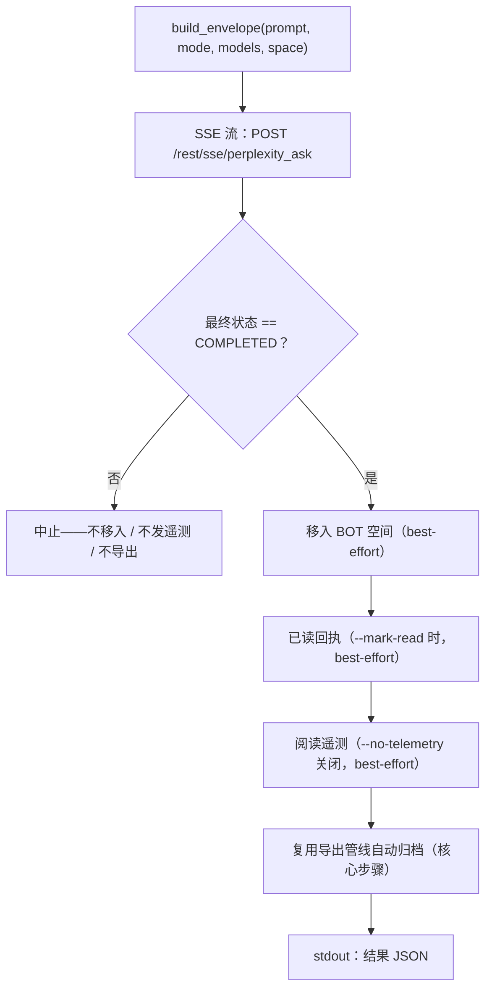

<a id="pplx-ask交互式查询" data-pplx-source-anchor="true"></a>
# pplx-ask：インタラクティブクエリ

`pplx-ask` は本プロジェクトの2つ目のCLIエントリポイントです。SSEストリームを介して Perplexity に質問を送信し、生成されたスレッドに対して後処理（BOTスペースへの移動、既読通知のオプション送信、人間らしい閲覧テレメトリの送信）を実行し、`pplx-export` と同じエクスポートパイプラインで自動アーカイブします。`pplx-export` とコア（transport / cookies / state / logging）を共有し、すべてのAPI形態は実機検証済みです。

ソースコード：`pplx_export/ask_cli.py`（CLI）、`pplx_export/sites/perplexity/ask_api.py`（API層）。

```bash
pplx-ask models                                  # 列出权威模型总表
pplx-ask ask "示例参数的时间分辨率是多少？"   # 搜索模式（默认）
pplx-ask ask "<long prompt>" --mode council      # 模型委员会（默认三模型）
pplx-ask ask "<prompt>" --mode council --models gpt55_thinking,claude48opusthinking
pplx-ask ask "<prompt>" --mode deep-research     # 深度研究（固定 pplx_alpha）
pplx-ask ask "<prompt>" --space some-space-slug  # 在该空间创建，完成后移入 BOT
pplx-ask ask "<prompt>" --mark-read              # 完成后发已读回执
pplx-ask mark-read <thread_url|uuid>             # 单独发已读回执
pplx-ask space-create "My Space"                 # 创建空间
```

<a id="子命令" data-pplx-source-anchor="true"></a>
## サブコマンド

### `models`

`GET https://www.perplexity.ai/rest/models/config/v2` からリアルタイムの公式モデル一覧を表示します（`pplx_export/ask_cli.py:51`）：各モードのデフォルトモデル、委員会のデフォルト3モデル、検索モードで選択可能なモデル、および特殊モード（`research` / `study` / `agentic_research` / `studio`）。オプションはありません。

### `ask`

質問を送信します（`pplx_export/ask_cli.py:86`）。SSEストリームで進捗を表示し、完了後に後処理パイプラインを実行します（[質問フロー](#发问流程)を参照）。stdoutの末尾に機械可読なJSONオブジェクトを出力します。

| オプション | デフォルト値 | 説明 |
|---|---|---|
| `prompt`（位置引数） | — | 質問内容。長くて意味のあるプロンプトほど効果的です。 |
| `--mode` | `search` | `search` = 通常検索（モデル選択可）；`deep-research` = ディープリサーチ（モデル固定）；`council` = モデル委員会（2～3モデル並列＋統合）；`study` = ステップラーニング |
| `--models` | なし | `council`：カンマ区切りで2～3個のモデルID（デフォルト `gpt55_thinking,claude48opusthinking,gemini31pro_high`）；`search`：単一モデルID；`deep-research` / `study` ではこの項目は無視されます |
| `--space` | `home` | `home` = ホームから作成後BOTスペースに移動；`<slug>` = 直接そのスペースに作成し、完了後もBOTスペースに移動 |
| `--mark-read` | オフ | 完了後に既読通知を送信（`mark_viewed`） |
| `--no-telemetry` | オフ | 人間らしい閲覧テレメトリを送信しない（デフォルトで送信：`ask context pane viewed` / `thread viewed` / `thread entry exited`、ランダムなタイミング） |
| `--no-export` | オフ | `web_archive` に自動アーカイブしない |
| `--timeout` | `600` | SSEストリームのタイムアウト秒数 |

`ask` が出力するHTTPエラーヒント（`pplx_export/ask_cli.py:124`）：`401`/`403` = cookieが無効またはリスク検出（cookieを更新してください）、`429` = レート制限（後で再試行）、`5xx` = サーバーエラー（後で再試行）。[トラブルシューティング](troubleshooting.md)を参照してください。

### `mark-read`

既存のスレッドに既読通知を送信します（`pplx_export/ask_cli.py:201`）：スレッドのURLまたはベアUUIDを受け付け、まず `GET /rest/thread/<uuid>` でスレッドの `context_uuid` を解決し、`{"context_uuids": [ctx]}` で `POST /rest/thread/mark_viewed` を呼び出します（`pplx_export/sites/perplexity/ask_api.py:190`）。未読状態は即座に反転します。JSON `{"uuid", "context_uuid", "result"}` を出力します。

注意：analytics の `thread viewed` イベントは未読状態を**反転しません**——本当の既読通知はこのエンドポイントです。

### `space-create`

`POST /rest/collections/create_collection` を介してスペースを作成します（`pplx_export/sites/perplexity/ask_api.py:179`）。実機検証済みの固定フィールドを使用します（`emoji: "1f4c1"`、`access: 1`）。JSON `{"uuid", "slug", "url"}` を出力します。

| オプション | デフォルト値 | 説明 |
|---|---|---|
| `title`（位置引数） | — | スペースのタイトル |
| `--description` | `""` | スペースの説明 |

新しいスペースをBOTスペースとして使用するには、その `uuid`/`slug` をユーザーレベル設定の `[bot_space]` テーブルに登録します（[設定](configuration.md)を参照）。

<a id="通用选项" data-pplx-source-anchor="true"></a>
## 共通オプション

`pplx-export` と共有します（名前とデフォルト値が完全に一致、`pplx_export/commands/common.py:232`）：

| オプション | デフォルト値 | 説明 |
|---|---|---|
| `--account` | 設定 `default_account` | 対象アカウント。cookieの所有者と登録メールが一致しない場合、ブラウザ内のアカウントセッショントークンを自動的に列挙して切り替えます |
| `--config PATH` | `~/.config/pplx-export/config.toml` | ユーザーレベル設定（アカウントレジストリ / BOTスペース）。優先順位：`--config` > 環境変数 `PPLX_EXPORT_CONFIG` > デフォルトパス |
| `--out` | `./web_archive` | アーカイブ出力ルートディレクトリ |
| `--cookies-from BROWSER` | 自動検出 | 指定されたブラウザからcookieをインポート（`edge`/`chrome`/`firefox`/`safari`/`brave`…） |
| `--cookies FILE` | — | Netscape cookieファイルまたはJSON cookieファイル |
| `-v` / `--verbose` | オフ | DEBUG出力（リクエストトレース / 内部判定） |
| `--log-file [PATH]` | オフ | 全量DEBUGログをファイルに出力。値なしの場合は `<out>/index/logs/<cmd>-<timestamp>.log` に出力 |

cookieの優先順位：`--cookies-from` / `--cookies` > フレッシュキャッシュ（`<out>/index/.cookies.json`、12時間）> ブラウザ自動検出。初回設定は[クイックスタート](getting-started.md)を参照してください。

<a id="发问流程" data-pplx-source-anchor="true"></a>
## 質問フロー



1. **エンベロープの組み立て** —— `build_envelope`（`pplx_export/sites/perplexity/ask_api.py:71`）が実機検証済みのパラメータテンプレートを埋めます：`mode` は常に `"copilot"`、`query_source` は `"home"`（毎回 `ask` で**新しい会話**を開始します。CLIはフォローアップ質問を公開しません）。`--space <slug>` が指定されている場合、まずslugをuuidに解決し、エンベロープに `target_collection_uuid` + `target_thread_access_level: 1` を含めます。
2. **SSEストリーム質問** —— `sse_ask`（`pplx_export/sites/perplexity/ask_api.py:153`）が `https://www.perplexity.ai/rest/sse/perplexity_ask` にPOSTし、イベントごとに消費します。スレッド作成（`https://www.perplexity.ai/search/<uuid>`）、状態遷移、生成進捗を記録します。ストリームは `final_sse_message` で終了します。ストリームが一定時間アイドル状態になると（ディープリサーチ/委員会では数分間静かになることがあります。openタイムアウト600秒）、`post_stream` はデフォルトレベルで「まだ応答ストリームを待機中」というINFOハートビートを出力し、アクティブな実行を誤ってハングアップと判断するのを防ぎます。
3. **完了ゲート** —— 最終状態が `COMPLETED` の場合のみ後処理を実行します（`pplx_export/ask_cli.py:134`）。ストリームが異常終了した場合、後続のアクションはすべてスキップされます（移動なし、テレメトリ送信なし、エクスポートなし）。未完了の成果物がアーカイブに漏洩することは絶対にありません。
4. **BOTスペースへの移動**（ベストエフォート）—— スレッドの `context_uuid` を使用して `batch_move_threads` を呼び出し、設定された `[bot_space]` uuid に移動します。BOTスペースが設定されていない場合、またはスレッドがすでにBOTスペースに作成されている場合はスキップされます。
5. **既読通知**（ベストエフォート、`--mark-read`）—— `POST /rest/thread/mark_viewed`。未読状態は即座に反転します。
6. **人間らしい閲覧テレメトリ**（ベストエフォート、デフォルトでオン）—— `send_view_telemetry`（`pplx_export/sites/perplexity/ask_api.py:234`）が実際の閲覧タイミングをシミュレートします：`ask context pane viewed` → `thread viewed` → `ask context pane viewed` → `thread entry exited`（ランダムな `timeOnEntryMs` 12～45秒、イベント間の一時停止0.6～2.4秒、デバイスはデバイスプールからランダムに選択）。
7. **自動アーカイブ**（コアステップ、`--no-export` でオフ）—— スレッドは `pplx-export export` と同じパイプライン（forceモード）でエクスポートされ、`<out>/<账户>/<模式>/<日期>_<标题>_<uuid8>/` に保存されます。[アーカイブレイアウト](archive-layout.md)と[エクスポートパイプライン](../architecture/export-pipeline.md)を参照してください。ベストエフォートのステップとは異なり、アーカイブの失敗はそのまま上位に伝播され、コマンドを失敗させます。

**障害分離**：ステップ4～6はベストエフォートとして個別に分離されます（`pplx_export/ask_cli.py:36`）。いずれかの失敗はwarningを記録し、そのステップのJSONキーを `false` に設定し、詳細を `step_errors` に記録します。アーカイブ（ステップ7）はコアステップであり、失敗が握りつぶされることは決してありません。

<a id="模式与模型选择" data-pplx-source-anchor="true"></a>
## モードとモデル選択

プラットフォームの公式モデル一覧は `GET /rest/models/config/v2` です（`pplx-ask models` が出力する内容）。モードの判別は `model_preference` フィールドで行われます——エンベロープの `mode` は常に `"copilot"` です。

| モード | `--mode` の値 | `model_preference` | モデル選択 |
|---|---|---|---|
| 検索 | `search` | デフォルト `pplx_pro`（UI名「Best」） | `--models` を介して単一モデルIDを指定（選択可能なリストは `pplx-ask models` を参照） |
| ディープリサーチ | `deep-research` | `pplx_alpha` | 固定——セレクターなし |
| モデル委員会 | `council` | `pplx_agentic_research` + `compare_model_preferences` | `--models` を介してカンマ区切りで2～3個のIDを指定。デフォルト `gpt55_thinking,claude48opusthinking,gemini31pro_high` |
| ステップラーニング | `study` | `pplx_study` | 固定——セレクターなし |
| Computer | *（未公開）* | `pplx_asi*` ファミリー | `pplx-ask` は未サポート |

注：

- 委員会は複数モデルを並列生成してから統合するため、実測では最初のトークン遅延が3分を超えることがあります。council / deep-research の場合は、それに応じて `--timeout` を大きく設定してください。
- アーカイブ側のモード分類（スレッドのエクスポート時にモードを判定する方法、`computer` を含む）は[モード](modes.md)を参照。リクエストエンベロープの詳細は [RESTエンドポイント](../reference/api/api-rest-endpoints.md)を参照。

<a id="从其他-agent-调用-pplx-ask" data-pplx-source-anchor="true"></a>
## 他のエージェントから pplx-ask を呼び出す

`pplx-ask` の設計目標の1つは、他のエージェントがリアルタイム情報を取得できるようにすることです：質問を送信し、完了を待ち、スレッドをアーカイブし、機械可読な契約を出力します。

- **stdoutには正確に1つのJSONオブジェクトのみ**（最終行）。すべてのログはstderrに出力されるため、呼び出し側はstdoutをそのままJSONパーサーに渡すことができます。
- **終了コード**：成功は `0`。失敗は非ゼロで終了し、stderrにエラーメッセージを出力します——質問フェーズの失敗は `SystemExit` で中断され、`[ask][ERROR]` メッセージが表示されます。アーカイブの失敗はそのまま上位に伝播されます（ステップ7参照）。

結果JSONの構造（`pplx_export/ask_cli.py:194`）：

| キー | 型 | 意味 |
|---|---|---|
| `thread_uuid` | string | 作成されたスレッドのバックエンドUUID |
| `thread_url` | string | `https://www.perplexity.ai/search/<thread_uuid>` |
| `context_uuid` | string | スレッドの `context_uuid`（移動/既読通知/テレメトリで使用） |
| `moved_to_bot` | boolean | `true` = BOTスペースへの移動が実行され成功；`false` = 未実行または失敗 |
| `mark_read` | boolean | 既読通知も同様の意味 |
| `telemetry` | boolean | 閲覧テレメトリも同様の意味 |
| `step_errors` | object | 各ステップの失敗詳細。失敗したステップのみ出現 |
| `exported` | string \| null | アーカイブが実行された場合は `"见上方 [export] 输出"`；`--no-export` の場合は `null` |

自動化の推奨事項：

- ブールキーでステップの成否を厳密に判断してください——失敗をtruthy値で表現することは絶対にありません。詳細は `step_errors` を確認してください。
- 回答のみが必要でプロセスが不要な場合、`--no-telemetry` で12～45秒の人間らしい待機をスキップできます。
- BOTスペースが設定されていない場合（縮退モード）、`moved_to_bot` は `false` のままですが、その他の機能は通常通り動作します。[トラブルシューティング](troubleshooting.md)を参照してください。
- ヘッドレスエージェントのアカウント/cookie設定は [API認証](../reference/api/api-authentication.md)を参照。マルチアカウントの動作は[質問とアカウント](../architecture/ask-and-accounts.md)を参照。

<a id="参见" data-pplx-source-anchor="true"></a>
## 関連項目

- [クイックスタート](getting-started.md) —— インストール、cookie、初回実行
- [設定](configuration.md) —— アカウント、BOTスペース、縮退モード
- [pplx-export](pplx-export.md) —— アーカイブCLI
- [トラブルシューティング](troubleshooting.md) —— 401/403、アカウントの混在、ログの場所
