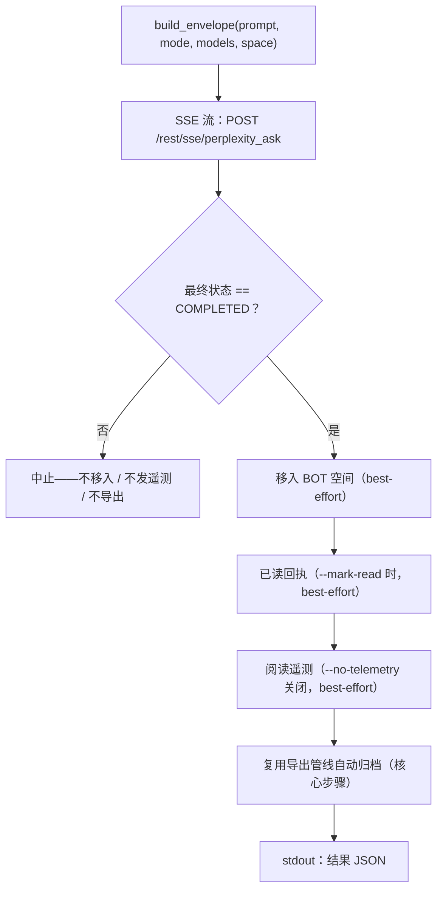

<a id="pplx-ask交互式查询" data-pplx-source-anchor="true"></a>
# pplx-ask: 대화형 질의

`pplx-ask`는 이 프로젝트의 두 번째 CLI 진입점입니다. SSE 스트리밍을 통해 Perplexity에 질문하고, 생성된
스레드를 후처리합니다. BOT 공간으로 이동, 선택적 읽음 확인 전송 및 인간다운 읽기 원격 측정, 그리고
`pplx-export`와 동일한 내보내기 파이프라인을 사용한 자동 보관이 포함됩니다. `pplx-export`와 코어
(transport / cookies / state / logging)를 공유하며, 모든 API 형태는 실제 테스트를 거쳤습니다.

소스 코드: `pplx_export/ask_cli.py` (CLI), `pplx_export/sites/perplexity/ask_api.py` (API 계층).

```bash
pplx-ask models                                  # 列出权威模型总表
pplx-ask ask "示例参数的时间分辨率是多少？"   # 搜索模式（默认）
pplx-ask ask "<long prompt>" --mode council      # 模型委员会（默认三模型）
pplx-ask ask "<prompt>" --mode council --models gpt55_thinking,claude48opusthinking
pplx-ask ask "<prompt>" --mode deep-research     # 深度研究（固定 pplx_alpha）
pplx-ask ask "<prompt>" --space some-space-slug  # 在该空间创建，完成后移入 BOT
pplx-ask ask "<prompt>" --mark-read              # 完成后发已读回执
pplx-ask mark-read <thread_url|uuid>             # 单独发已读回执
pplx-ask space-create "My Space"                 # 创建空间
```

<a id="子命令" data-pplx-source-anchor="true"></a>
## 하위 명령어

### `models`

`GET https://www.perplexity.ai/rest/models/config/v2`의 실시간 공식 모델 전체 목록을 출력합니다
(`pplx_export/ask_cli.py:51`): 각 모드의 기본 모델, 위원회 기본 세 모델, 검색 모드 선택 가능 모델,
및 특수 모드 (`research` / `study` / `agentic_research` / `studio`). 옵션 없음.

### `ask`

질문합니다 (`pplx_export/ask_cli.py:86`). SSE 스트리밍으로 진행 상황을 표시하고, 완료 후 후처리 파이프라인을 실행합니다
([질문 흐름](#发问流程) 참조), 그리고 stdout 끝에 기계 판독 가능 JSON 객체를 출력합니다.

| 옵션 | 기본값 | 설명 |
|---|---|---|
| `prompt` (위치 인수) | — | 질문 내용. 길고 의미 있는 프롬프트가 더 좋은 결과를 냅니다. |
| `--mode` | `search` | `search` = 일반 검색 (선택 가능 모델); `deep-research` = 심층 연구 (고정 모델); `council` = 모델 위원회 (2–3개 모델 병렬 + 종합); `study` = 단계별 학습 |
| `--models` | 없음 | `council`: 쉼표로 구분된 2–3개 모델 ID (기본값 `gpt55_thinking,claude48opusthinking,gemini31pro_high`); `search`: 단일 모델 ID; `deep-research` / `study`는 이 항목을 무시합니다 |
| `--space` | `home` | `home` = 홈페이지에서 생성 후 BOT 공간으로 이동; `<slug>` = 해당 공간에 직접 생성, 완료 후 BOT 공간으로 이동 |
| `--mark-read` | 꺼짐 | 완료 후 읽음 확인 전송 (`mark_viewed`) |
| `--no-telemetry` | 꺼짐 | 인간다운 읽기 원격 측정을 보내지 않음 (기본값: 전송 `ask context pane viewed` / `thread viewed` / `thread entry exited`, 무작위 타이밍) |
| `--no-export` | 꺼짐 | `web_archive`에 자동 보관하지 않음 |
| `--timeout` | `600` | SSE 스트림 제한 시간 (초) |

`ask`가 출력하는 HTTP 오류 힌트 (`pplx_export/ask_cli.py:124`): `401`/`403` = 쿠키
만료 또는 차단됨 (쿠키 업데이트 필요), `429` = 속도 제한 트리거 (잠시 후 재시도), `5xx` = 서버 오류
(잠시 후 재시도). [문제 해결](troubleshooting.md) 참조.

### `mark-read`

기존 스레드에 읽음 확인 전송 (`pplx_export/ask_cli.py:201`): 스레드 URL 또는 원시 UUID를 받아, 먼저
`GET /rest/thread/<uuid>`를 통해 스레드의 `context_uuid`를 구문 분석한 후,
`{"context_uuids": [ctx]}`를 사용하여 `POST /rest/thread/mark_viewed`를 호출합니다
(`pplx_export/sites/perplexity/ask_api.py:190`). unread가 즉시 전환됩니다. JSON `{"uuid", "context_uuid", "result"}`을 출력합니다.

참고: analytics의 `thread viewed` 이벤트는 unread를 **전환하지 않습니다** — 실제 읽음 확인은 이 엔드포인트입니다.

### `space-create`

`POST /rest/collections/create_collection`를 통해 공간을 생성합니다
(`pplx_export/sites/perplexity/ask_api.py:179`), 실제 테스트된 고정 필드 사용
(`emoji: "1f4c1"`, `access: 1`). JSON `{"uuid", "slug", "url"}`을 출력합니다.

| 옵션 | 기본값 | 설명 |
|---|---|---|
| `title` (위치 인수) | — | 공간 제목 |
| `--description` | `""` | 공간 설명 |

새 공간을 BOT 공간으로 사용하려면, 해당 공간의 `uuid`/`slug`을 사용자 수준 구성의 `[bot_space]`
테이블에 등록하십시오 ([구성](configuration.md) 참조).

<a id="通用选项" data-pplx-source-anchor="true"></a>
## 공통 옵션

`pplx-export`와 공유 (이름과 기본값이 완전히 동일, `pplx_export/commands/common.py:232`):

| 옵션 | 기본값 | 설명 |
|---|---|---|
| `--account` | 구성 `default_account` | 대상 계정; 쿠키 소유자와 등록된 이메일이 일치하지 않을 때 브라우저의 계정 세션 토큰을 자동으로 열거하여 전환 |
| `--config PATH` | `~/.config/pplx-export/config.toml` | 사용자 수준 구성 (계정 레지스트리 / BOT 공간); 우선순위: `--config` > 환경 변수 `PPLX_EXPORT_CONFIG` > 기본 경로 |
| `--out` | `./web_archive` | 보관 출력 루트 디렉터리 |
| `--cookies-from BROWSER` | 자동 감지 | 지정된 브라우저에서 쿠키 가져오기 (`edge`/`chrome`/`firefox`/`safari`/`brave`…) |
| `--cookies FILE` | — | Netscape 쿠키 파일 또는 JSON 쿠키 파일 |
| `-v` / `--verbose` | 꺼짐 | DEBUG 출력 (요청 추적 / 내부 판단) |
| `--log-file [PATH]` | 꺼짐 | 전체 DEBUG 로그를 파일에 기록; 값 없이 사용 시 `<out>/index/logs/<cmd>-<timestamp>.log`에 기록 |

쿠키 소스 우선순위: `--cookies-from` / `--cookies` > 신규 캐시
(`<out>/index/.cookies.json`, 12시간) > 브라우저 자동 감지. 초기 설정은
[빠른 시작](getting-started.md)을 참조하십시오.

<a id="发问流程" data-pplx-source-anchor="true"></a>
## 질문 흐름



1. **envelope 조립** — `build_envelope` (`pplx_export/sites/perplexity/ask_api.py:71`)
   실제 테스트된 매개변수 템플릿 채움: `mode`는 항상 `"copilot"`, `query_source`는 `"home"`
   (매번 `ask`는 **새 대화**를 시작합니다; CLI는 후속 질문을 노출하지 않음). `--space <slug>`이 있을 때 먼저
   slug를 uuid로 구문 분석하고, envelope에 `target_collection_uuid` +
   `target_thread_access_level: 1`을 포함합니다.
2. **SSE 스트리밍 질문** — `sse_ask` (`pplx_export/sites/perplexity/ask_api.py:153`)가 POST를
   `https://www.perplexity.ai/rest/sse/perplexity_ask`에 보내고 이벤트를 소비하며, 스레드 생성 기록
   (`https://www.perplexity.ai/search/<uuid>`), 상태 전환 및 생성 진행 상황을 기록합니다. 스트림은
   `final_sse_message`에서 종료됩니다. 스트림이 유휴 상태로 일정 간격을 초과하면 (심층 연구 / 위원회는 몇 분 동안 조용할 수 있음;
   open 제한 시간 600초), `post_stream`는 기본 로그에 "아직 응답 스트림을 기다리는 중" INFO 하트비트를 기록하여
   활성 실행을 중단된 것으로 오인하지 않도록 합니다.
3. **완료 게이트** — 최종 상태가 `COMPLETED`인 경우에만 후처리 실행
   (`pplx_export/ask_cli.py:134`). 스트림이 비정상적으로 종료되면 후속 작업을 모두 건너뜁니다 (이동 안 함, 원격 측정 전송 안 함,
   내보내기 안 함), 미완성 상태가 보관에 유출되지 않습니다.
4. **BOT 공간으로 이동** (best-effort) — 스레드의 `context_uuid`를 사용하여
   `batch_move_threads`를 호출하여 구성된 `[bot_space]` uuid로 이동합니다. BOT 공간이 구성되지 않았거나 스레드가
   이미 BOT 공간에 생성된 경우 건너뜁니다.
5. **읽음 확인** (best-effort, `--mark-read`) — `POST /rest/thread/mark_viewed`;
   unread가 즉시 전환됩니다.
6. **인간다운 읽기 원격 측정** (best-effort, 기본값 켜짐) —
   `send_view_telemetry` (`pplx_export/sites/perplexity/ask_api.py:234`)가 실제 브라우징
   타이밍을 시뮬레이션합니다: `ask context pane viewed` → `thread viewed` → `ask context pane viewed`
   → `thread entry exited` (무작위 `timeOnEntryMs` 12–45초, 이벤트 간 지연 0.6–2.4초,
   장치는 장치 풀에서 무작위로 선택).
7. **자동 보관** (핵심 단계, `--no-export`가 꺼져 있음) — 스레드가 `pplx-export export`와
   동일한 파이프라인을 통해 내보내기 (force 모드), 다음 위치에 저장
   `<out>/<账户>/<模式>/<日期>_<标题>_<uuid8>/` — [보관 레이아웃](archive-layout.md)
   및 [내보내기 파이프라인](../architecture/export-pipeline.md) 참조. best-effort 단계와 달리, 보관 실패는
   그대로 전파되어 명령을 실패하게 만듭니다.

**실패 격리**: 4–6단계는 각각 best-effort로 격리됩니다 (`pplx_export/ask_cli.py:36`): 어느
   하나가 실패하면 경고만 기록하고, 해당 단계의 JSON 키를 `false`로 설정하고, 세부 정보를 `step_errors`에 기록하며, 보관을 절대 차단하지 않습니다.
   보관(7단계)은 핵심 단계이며 실패가 절대 무시되지 않습니다.

<a id="模式与模型选择" data-pplx-source-anchor="true"></a>
## 모드 및 모델 선택

플랫폼 공식 모델 전체 목록은 `GET /rest/models/config/v2`입니다 (즉, `pplx-ask models`가 출력하는 내용).
모드 판별은 `model_preference` 필드에 있습니다 — envelope의 `mode`는 항상 `"copilot"`입니다.

| 모드 | `--mode` 값 | `model_preference` | 모델 선택 |
|---|---|---|---|
| 검색 | `search` | 기본값 `pplx_pro` (UI 이름 "Best") | `--models`를 통해 단일 모델 ID 제공 (선택 가능 목록은 `pplx-ask models` 참조) |
| 심층 연구 | `deep-research` | `pplx_alpha` | 고정 — 선택기 없음 |
| 모델 위원회 | `council` | `pplx_agentic_research` + `compare_model_preferences` | `--models`를 통해 2–3개의 쉼표로 구분된 ID 제공; 기본값 `gpt55_thinking,claude48opusthinking,gemini31pro_high` |
| 단계별 학습 | `study` | `pplx_study` | 고정 — 선택기 없음 |
| Computer | * (노출되지 않음)* | `pplx_asi*` 계열 | `pplx-ask`는 지원하지 않음 |

참고:

- 위원회는 여러 모델을 병렬로 생성한 후 종합하며, 실제 테스트에서 첫 토큰 지연 시간이 3분을 초과할 수 있습니다 — council /
  deep-research의 경우 `--timeout`를 적절히 늘리십시오.
- 보관 측의 모드 분류 (스레드 내보내기 시 모드 판별 방법, `computer` 포함)는 [모드](modes.md)를 참조하십시오; 요청
  envelope 세부 정보는 [REST 엔드포인트](../reference/api/api-rest-endpoints.md)를 참조하십시오.

<a id="从其他-agent-调用-pplx-ask" data-pplx-source-anchor="true"></a>
## 다른 에이전트에서 pplx-ask 호출

`pplx-ask`의 설계 목표 중 하나는 다른 에이전트가 실시간 정보를 얻을 수 있도록 하는 것입니다: 질문, 완료 대기, 스레드 보관,
및 기계 판독 가능 계약 출력.

- **stdout에는 정확히 하나의 JSON 객체만 있습니다** (마지막 줄); 모든 로그는 stderr로 이동하므로, 호출자는
  stdout을 JSON 파서에 직접 전달할 수 있습니다.
- **종료 코드**: 성공 시 `0`; 실패 시 0이 아닌 값으로 종료하고 stderr에 오류 메시지를 출력합니다 — 질문 단계 실패 시
  `SystemExit`를 통해 중단되고 `[ask][ERROR]` 메시지가 표시되며, 보관 실패 시 그대로 전파됩니다 (7단계 참조).

결과 JSON 구조 (`pplx_export/ask_cli.py:194`):

| 키 | 유형 | 의미 |
|---|---|---|
| `thread_uuid` | string | 생성된 스레드의 backend uuid |
| `thread_url` | string | `https://www.perplexity.ai/search/<thread_uuid>` |
| `context_uuid` | string | 스레드의 `context_uuid` (이동 / 읽음 확인 / 원격 측정에 사용됨) |
| `moved_to_bot` | boolean | `true` = BOT 공간으로 이동이 실행되어 성공함; `false` = 실행되지 않았거나 실패함 |
| `mark_read` | boolean | 읽음 확인도 동일한 의미 |
| `telemetry` | boolean | 읽기 원격 측정도 동일한 의미 |
| `step_errors` | object | 각 단계의 실패 세부 정보; 실패한 단계만 나타남 |
| `exported` | string \| null | 보관이 실행된 경우 `"见上方 [export] 输出"`; `--no-export`인 경우 `null` |

자동화 권장 사항:

- 불리언 키를 엄격히 사용하여 단계 성공/실패를 판단하십시오 — 실패는 절대 truthy 값으로 표시되지 않음; 세부 정보는 `step_errors`를 확인하십시오.
- 답변만 필요하고 과정이 필요하지 않은 경우, `--no-telemetry`를 사용하여 12–45초의 인간다운 대기 시간을 건너뛸 수 있습니다.
- BOT 공간이 구성되지 않은 경우 (저하 모드) `moved_to_bot`는 `false`로 유지되며, 나머지 기능은 정상 작동합니다 —
  [문제 해결](troubleshooting.md) 참조.
- 헤드리스 에이전트의 계정/쿠키 설정은 [API 인증](../reference/api/api-authentication.md)을 참조하십시오;
  다중 계정 동작은 [질문과 계정](../architecture/ask-and-accounts.md)을 참조하십시오.

<a id="参见" data-pplx-source-anchor="true"></a>
## 참조

- [빠른 시작](getting-started.md) — 설치, 쿠키, 첫 실행
- [구성](configuration.md) — 계정, BOT 공간, 저하 모드
- [pplx-export](pplx-export.md) — 보관 CLI
- [문제 해결](troubleshooting.md) — 401/403, 계정 혼동, 로그 위치
