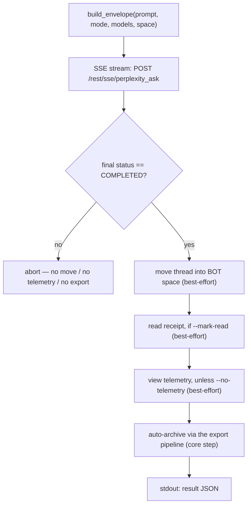

# pplx-ask: Interactive Queries

`pplx-ask` is the second CLI entry point of the project: it asks Perplexity questions
interactively over SSE streaming, then post-processes the resulting thread — moving it
into the BOT space, sending an optional read receipt and human-like view telemetry, and
automatically archiving it with the same export pipeline as `pplx-export`. It shares the
core (transport / cookies / state / logging) with `pplx-export`, and all API shapes are
verified against the live platform.

Source: `pplx_export/ask_cli.py` (CLI), `pplx_export/sites/perplexity/ask_api.py` (API layer).

```bash
pplx-ask models                                  # list the authoritative model table
pplx-ask models --refresh                         # refresh + persist the catalog into config.toml [models]
pplx-ask ask "What is the time resolution of an example parameter?"   # search mode (default)
pplx-ask ask "<long prompt>" --mode council      # model council (default three models)
pplx-ask ask "<prompt>" --mode council --models gpt56_sol_thinking,claude50opusthinking
pplx-ask ask "<prompt>" --mode deep-research     # deep research (fixed pplx_alpha)
pplx-ask ask "<prompt>" --space some-space-slug  # create inside a space, then move into BOT
pplx-ask ask "<prompt>" --mark-read              # send a read receipt after completion
pplx-ask mark-read <thread_url|uuid>             # standalone read receipt
pplx-ask space-create "My Space"                 # create a space
```

## Subcommands

### `models`

Prints the live, authoritative model table from
`GET https://www.perplexity.ai/rest/models/config/v2` (`pplx_export/ask_cli.py`,
`cmd_models`): per-mode default models, the council default three models, the models
selectable in search mode, and the special modes (`research` / `study` /
`agentic_research` / `studio`).

| Option | Default | Description |
|---|---|---|
| `--refresh` | off | Persist the fetched catalog into the config's `[models]` table (auto-managed): `last_refreshed`, `mode_defaults`, `council_defaults`, `search_models`, and the full `[models.catalog]`. `pplx-ask` then builds requests from `[models]`, falling back to the pinned baseline in `pplx_export/sites/perplexity/platform.py`. Requires a loaded config file (run `pplx-export init` first). See [Configuration](configuration.md). |

### `ask`

Asks a question (`pplx_export/ask_cli.py:86`). SSE-streams progress to the console,
runs the post-processing pipeline (see [The ask flow](#the-ask-flow)), and prints a
machine-readable JSON object on stdout at the end.

| Option | Default | Description |
|---|---|---|
| `prompt` (positional) | — | The question. Long, meaningful prompts work better. |
| `--mode` | `search` | `search` = normal search (model selectable); `deep-research` = deep research (fixed model); `council` = model council (2–3 models in parallel + synthesis); `study` = step-by-step study |
| `--models` | none | `council`: comma-separated 2–3 model ids (default: the council models from the `[models]` catalog, or the pinned `platform.py` fallback; refresh with `pplx-ask models --refresh`); `search`: a single model id; ignored by `deep-research` / `study` |
| `--space` | `home` | `home` = create from the home page, then move into the BOT space; `<slug>` = create directly inside that space, then move into the BOT space |
| `--mark-read` | off | Send a read receipt (`mark_viewed`) after completion |
| `--no-telemetry` | off | Do not send human-like view telemetry (default: send — `ask context pane viewed` / `thread viewed` / `thread entry exited` with randomized timing) |
| `--no-export` | off | Do not auto-archive into `web_archive` |
| `--timeout` | `600` | SSE stream timeout in seconds |

Model resolution is offline: the per-mode `model_preference` and the council compare
models come from the config's `[models]` table when present, falling back to the pinned
baseline in `pplx_export/sites/perplexity/platform.py` (request assembly never hits the
network). When `[models]` is missing or older than 7 days
(`platform.MODELS_REFRESH_TTL_DAYS`), `ask` warns you to run `pplx-ask models --refresh`
(default) — or refreshes automatically when the `[models].auto_refresh` flag is `true`.

HTTP error hints emitted by `ask` (`pplx_export/ask_cli.py:124`): `401`/`403` = the
cookie is expired or risk-controlled (update the cookie), `429` = rate limited (retry
later), `5xx` = server error (retry later). See [Troubleshooting](troubleshooting.md).

### `mark-read`

Sends a read receipt for an existing thread (`pplx_export/ask_cli.py:201`): accepts a
thread URL or a bare UUID, resolves the thread's `context_uuid` via
`GET /rest/thread/<uuid>`, then calls `POST /rest/thread/mark_viewed` with
`{"context_uuids": [ctx]}` (`pplx_export/sites/perplexity/ask_api.py:190`). The unread
flag flips immediately. Prints `{"uuid", "context_uuid", "result"}` as JSON.

Note: the analytics `thread viewed` event does **not** flip unread — the real read
receipt is this endpoint.

### `space-create`

Creates a space via `POST /rest/collections/create_collection`
(`pplx_export/sites/perplexity/ask_api.py:179`) with the verified fixed fields
(`emoji: "1f4c1"`, `access: 1`). Prints `{"uuid", "slug", "url"}` as JSON.

| Option | Default | Description |
|---|---|---|
| `title` (positional) | — | Space title |
| `--description` | `""` | Space description |

To use the new space as the BOT space, register its `uuid`/`slug` under `[bot_space]`
in the user-level config (see [Configuration](configuration.md)).

## Common options

Shared with `pplx-export` (identical names and defaults, `pplx_export/commands/common.py:232`):

| Option | Default | Description |
|---|---|---|
| `--account` | config `default_account` | Target account; on cookie/email mismatch the browser's per-account session tokens are enumerated and switched automatically |
| `--config PATH` | `~/.config/pplx-export/config.toml` | User-level config (account registry / BOT space); priority: `--config` > `PPLX_EXPORT_CONFIG` env var > default path |
| `--out` | `./web_archive` | Archive output root |
| `--cookies-from BROWSER` | auto-detect | Import cookies from the named browser (`edge`/`chrome`/`firefox`/`safari`/`brave`…) |
| `--cookies FILE` | — | Netscape cookie file or JSON cookie file |
| `-v` / `--verbose` | off | DEBUG output (request tracing / internal decisions) |
| `--log-file [PATH]` | off | Full DEBUG log to file; without a value it lands at `<out>/index/logs/<cmd>-<timestamp>.log` |

Cookie source priority: `--cookies-from` / `--cookies` > fresh cache
(`<out>/index/.cookies.json`, 12 h) > browser auto-detect. See
[Getting started](getting-started.md) for first-time setup.

## The ask flow



1. **Envelope assembly** — `build_envelope` (`pplx_export/sites/perplexity/ask_api.py:71`)
   fills the verified parameter template: `mode` is always `"copilot"` and
   `query_source` is `"home"` (every `ask` starts a **new** conversation; follow-up
   continuation is not exposed by the CLI). With `--space <slug>`, the space slug is
   resolved to a uuid first, and the envelope carries `target_collection_uuid` +
   `target_thread_access_level: 1`.
2. **SSE streaming** — `sse_ask` (`pplx_export/sites/perplexity/ask_api.py:153`) POSTs to
   `https://www.perplexity.ai/rest/sse/perplexity_ask` and consumes the event stream,
   logging thread creation (`https://www.perplexity.ai/search/<uuid>`), status
   transitions, and generation progress. The stream ends on `final_sse_message`.
   When the stream goes idle for an interval (deep-research / council can be silent
   for minutes; the open timeout is 600 s), `post_stream` emits a "still waiting for
   the response stream" INFO heartbeat at default verbosity so a live run is never
   mistaken for a hang.
3. **Completion gate** — post-processing only runs when the final status is `COMPLETED`
   (`pplx_export/ask_cli.py:134`). On an abnormal stream end, everything after this
   point is skipped (no move, no telemetry, no export) so a half-finished state never
   leaks into the archive.
4. **Move into the BOT space** (best-effort) — `batch_move_threads` with the thread's
   `context_uuid` into the configured `[bot_space]` uuid. Skipped when no BOT space is
   configured, or when the thread was already created inside the BOT space.
5. **Read receipt** (best-effort, `--mark-read`) — `POST /rest/thread/mark_viewed`;
   the unread flag flips immediately.
6. **Human-like view telemetry** (best-effort, default on) —
   `send_view_telemetry` (`pplx_export/sites/perplexity/ask_api.py:234`) mimics real
   browsing timing: `ask context pane viewed` → `thread viewed` → `ask context pane
   viewed` → `thread entry exited` (random `timeOnEntryMs` of 12–45 s, 0.6–2.4 s pauses
   between events, device picked randomly from a small pool).
7. **Automatic archiving** (core step, unless `--no-export`) — the thread is exported
   through the same pipeline as `pplx-export export` (force mode), landing under
   `<out>/<account>/<mode>/<date>_<title>_<uuid8>/` — see
   [Archive layout](archive-layout.md) and [Export pipeline](../architecture/export-pipeline.md).
   Unlike the best-effort steps, an archiving failure propagates and fails the command.

**Failure isolation**: steps 4–6 are isolated as best-effort (`pplx_export/ask_cli.py:36`):
a failure logs a warning, sets the step's JSON key to `false`, records the detail under
`step_errors`, and never blocks archiving. Archiving (step 7) is the core step and its
failures are never swallowed.

## Modes and model selection

The platform's authoritative model table is `GET /rest/models/config/v2` (what
`pplx-ask models` prints). Discrimination lives in the `model_preference` field — the
envelope `mode` is always `"copilot"`.

| Mode | `--mode` value | `model_preference` | Model selection |
|---|---|---|---|
| Search | `search` | `pplx_pro` ("Best" in the UI) by default | Single model id via `--models` (see `pplx-ask models` for the selectable list) |
| Deep research | `deep-research` | `pplx_alpha` | Fixed — no selector |
| Model council | `council` | `pplx_agentic_research` + `compare_model_preferences` | 2–3 comma-separated ids via `--models`; default from the `[models]` catalog (or the `platform.py` fallback), refreshable via `pplx-ask models --refresh` |
| Step-by-step study | `study` | `pplx_study` | Fixed — no selector |
| Computer | *(not exposed)* | `pplx_asi*` family | Not supported by `pplx-ask` |

Notes:

- Council runs the models in parallel and synthesizes; observed first-token latency can
  exceed 3 minutes, so raise `--timeout` for council / deep-research runs.
- The archive-side mode taxonomy (how exported threads are classified, including
  `computer`) is documented in [Modes](modes.md); the request-envelope details live in
  [REST endpoints](../reference/api/api-rest-endpoints.md).

## Using pplx-ask from other agents

`pplx-ask` is built so that other agents can fetch real-time information: it asks a
question, waits for completion, archives the thread, and emits a machine-readable
contract.

- **stdout carries exactly one JSON object** (the last line); all logs go to stderr, so
  callers can pipe stdout straight into a JSON parser.
- **Exit status**: `0` on success; failures exit non-zero with an error message on
  stderr — ask-stage failures abort via `SystemExit` with an `[ask][ERROR]` message,
  while archiving failures propagate as-is (see step 7).

Result JSON shape (`pplx_export/ask_cli.py:194`):

| Key | Type | Meaning |
|---|---|---|
| `thread_uuid` | string | Backend uuid of the created thread |
| `thread_url` | string | `https://www.perplexity.ai/search/<thread_uuid>` |
| `context_uuid` | string | The thread's `context_uuid` (used by move / mark-read / telemetry) |
| `moved_to_bot` | boolean | `true` = the move into the BOT space executed and succeeded; `false` = not executed or failed |
| `mark_read` | boolean | Same contract for the read receipt |
| `telemetry` | boolean | Same contract for view telemetry |
| `step_errors` | object | Failure details per step; only failed steps appear |
| `exported` | string \| null | `"见上方 [export] 输出"` when archiving ran; `null` with `--no-export` |

Automation tips:

- Treat the step booleans strictly — a failure is never represented by a truthy value;
  check `step_errors` for details.
- `--no-telemetry` skips the 12–45 s human-like dwell when only the answer matters.
- Without a configured BOT space (degraded mode), `moved_to_bot` stays `false` and
  everything else still works — see [Troubleshooting](troubleshooting.md).
- For account/cookie setup headless agents should read
  [API authentication](../reference/api/api-authentication.md); multi-account behavior is in
  [Ask and accounts](../architecture/ask-and-accounts.md).

## See also

- [Getting started](getting-started.md) — install, cookies, first run
- [Configuration](configuration.md) — accounts, BOT space, degraded mode
- [pplx-export](pplx-export.md) — the archiving CLI
- [Troubleshooting](troubleshooting.md) — 401/403, wrong account, logs
