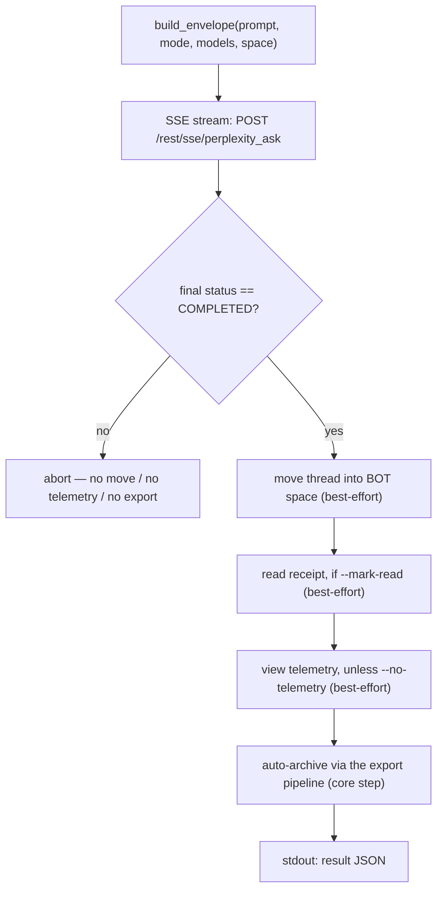

<a id="pplx-ask-interactive-queries" data-pplx-source-anchor="true"></a>
# pplx-ask: Consultas Interativas

`pplx-ask` é o segundo ponto de entrada CLI do projeto: ele faz perguntas ao Perplexity
interativamente via streaming SSE, então pós-processa o thread resultante — movendo-o
para o espaço BOT, enviando um recibo de leitura opcional e telemetria de visualização semelhante à humana, e
arquivando-o automaticamente com o mesmo pipeline de exportação do `pplx-export`. Ele compartilha o
núcleo (transporte / cookies / estado / registro) com `pplx-export`, e todas as formas de API são
verificadas contra a plataforma ativa.

Fonte: `pplx_export/ask_cli.py` (CLI), `pplx_export/sites/perplexity/ask_api.py` (camada de API).

```bash
pplx-ask models                                  # list the authoritative model table
pplx-ask models --refresh                         # refresh + persist the catalog into config.toml [models]
pplx-ask ask "What is the time resolution of an example parameter?"   # search mode (default)
pplx-ask ask "<long prompt>" --mode council      # model council (default three models)
pplx-ask ask "<prompt>" --mode council --models gpt56_sol_thinking,claude50opusthinking
pplx-ask ask "<prompt>" --mode deep-research     # deep research (fixed pplx_alpha)
pplx-ask ask "<prompt>" --space some-space-slug  # create inside a space, then move into BOT
pplx-ask ask "<prompt>" --mark-read              # send a read receipt after completion
pplx-ask mark-read <thread_url|uuid>             # standalone read receipt
pplx-ask space-create "My Space"                 # create a space
```

<a id="subcommands" data-pplx-source-anchor="true"></a>
## Subcomandos

### `models`

Imprime a tabela de modelos autoritativa e ativa de
`GET https://www.perplexity.ai/rest/models/config/v2` (`pplx_export/ask_cli.py`,
`cmd_models`): modelos padrão por modo, os três modelos padrão do conselho, os modelos
selecionáveis no modo de pesquisa e os modos especiais (`research` / `study` /
`agentic_research` / `studio`).

| Opção | Padrão | Descrição |
|---|---|---|
| `--refresh` | desligado | Persiste o catálogo obtido na tabela `[models]` da configuração (gerenciado automaticamente): `last_refreshed`, `mode_defaults`, `council_defaults`, `search_models` e o `[models.catalog]` completo. `pplx-ask` então constrói requisições a partir de `[models]`, recorrendo à linha de base fixada em `pplx_export/sites/perplexity/platform.py`. Requer um arquivo de configuração carregado (execute `pplx-export init` primeiro). Consulte [Configuração](configuration.md). |

### `ask`

Faz uma pergunta (`pplx_export/ask_cli.py:86`). Transmite o progresso via SSE para o console,
executa o pipeline de pós-processamento (consulte [O fluxo ask](#the-ask-flow)) e imprime um
objeto JSON legível por máquina na saída padrão ao final.

| Opção | Padrão | Descrição |
|---|---|---|
| `prompt` (posicional) | — | A pergunta. Prompts longos e significativos funcionam melhor. |
| `--mode` | `search` | `search` = pesquisa normal (modelo selecionável); `deep-research` = pesquisa aprofundada (modelo fixo); `council` = conselho de modelos (2–3 modelos em paralelo + síntese); `study` = estudo passo a passo |
| `--models` | nenhum | `council`: IDs de 2–3 modelos separados por vírgula (padrão: os modelos do conselho do catálogo `[models]`, ou o fallback fixado `platform.py`; atualize com `pplx-ask models --refresh`); `search`: um único ID de modelo; ignorado por `deep-research` / `study` |
| `--space` | `home` | `home` = criar a partir da página inicial e depois mover para o espaço BOT; `<slug>` = criar diretamente dentro desse espaço e depois mover para o espaço BOT |
| `--mark-read` | desligado | Enviar um recibo de leitura (`mark_viewed`) após a conclusão |
| `--no-telemetry` | desligado | Não enviar telemetria de visualização semelhante à humana (padrão: enviar — `ask context pane viewed` / `thread viewed` / `thread entry exited` com temporização aleatória) |
| `--no-export` | desligado | Não arquivar automaticamente em `web_archive` |
| `--timeout` | `600` | Tempo limite do stream SSE em segundos |

A resolução do modelo é offline: o `model_preference` por modo e os modelos de comparação do conselho
vêm da tabela `[models]` da configuração quando presente, recorrendo à linha de base fixada
em `pplx_export/sites/perplexity/platform.py` (a montagem da requisição nunca atinge a
rede). Quando `[models]` está ausente ou mais antigo que 7 dias
(`platform.MODELS_REFRESH_TTL_DAYS`), `ask` avisa você para executar `pplx-ask models --refresh`
(padrão) — ou atualiza automaticamente quando a flag `[models].auto_refresh` está `true`.

Dicas de erro HTTP emitidas por `ask` (`pplx_export/ask_cli.py:124`): `401`/`403` = o
cookie expirou ou está sob controle de risco (atualize o cookie), `429` = limite de taxa excedido (tente
novamente mais tarde), `5xx` = erro do servidor (tente novamente mais tarde). Consulte [Solução de problemas](troubleshooting.md).

### `mark-read`

Envia um recibo de leitura para um thread existente (`pplx_export/ask_cli.py:201`): aceita uma
URL de thread ou um UUID simples, resolve o `context_uuid` do thread via
`GET /rest/thread/<uuid>`, então chama `POST /rest/thread/mark_viewed` com
`{"context_uuids": [ctx]}` (`pplx_export/sites/perplexity/ask_api.py:190`). A flag de não lido
inverte imediatamente. Imprime `{"uuid", "context_uuid", "result"}` como JSON.

Nota: o evento de análise `thread viewed` **não** inverte o não lido — o recibo de leitura real
é este endpoint.

### `space-create`

Cria um espaço via `POST /rest/collections/create_collection`
(`pplx_export/sites/perplexity/ask_api.py:179`) com os campos fixos verificados
(`emoji: "1f4c1"`, `access: 1`). Imprime `{"uuid", "slug", "url"}` como JSON.

| Opção | Padrão | Descrição |
|---|---|---|
| `title` (posicional) | — | Título do espaço |
| `--description` | `""` | Descrição do espaço |

Para usar o novo espaço como espaço BOT, registre seu `uuid`/`slug` em `[bot_space]`
na configuração do nível do usuário (consulte [Configuração](configuration.md)).

<a id="common-options" data-pplx-source-anchor="true"></a>
## Opções comuns

Compartilhadas com `pplx-export` (nomes e padrões idênticos, `pplx_export/commands/common.py:232`):

| Opção | Padrão | Descrição |
|---|---|---|
| `--account` | config `default_account` | Conta alvo; em caso de incompatibilidade de cookie/email, os tokens de sessão por conta do navegador são enumerados e trocados automaticamente |
| `--config PATH` | `~/.config/pplx-export/config.toml` | Configuração do nível do usuário (registro de contas / espaço BOT); prioridade: `--config` > variável de ambiente `PPLX_EXPORT_CONFIG` > caminho padrão |
| `--out` | `./web_archive` | Raiz de saída do arquivo |
| `--cookies-from BROWSER` | detecção automática | Importar cookies do navegador nomeado (`edge`/`chrome`/`firefox`/`safari`/`brave`…) |
| `--cookies FILE` | — | Arquivo de cookies Netscape ou arquivo de cookies JSON |
| `-v` / `--verbose` | desligado | Saída DEBUG (rastreamento de requisição / decisões internas) |
| `--log-file [PATH]` | desligado | Log DEBUG completo para arquivo; sem um valor, ele vai para `<out>/index/logs/<cmd>-<timestamp>.log` |

Prioridade da fonte de cookies: `--cookies-from` / `--cookies` > cache recente
(`<out>/index/.cookies.json`, 12 h) > detecção automática do navegador. Consulte
[Primeiros passos](getting-started.md) para configuração inicial.

<a id="the-ask-flow" data-pplx-source-anchor="true"></a>
## O fluxo ask



1. **Montagem do envelope** — `build_envelope` (`pplx_export/sites/perplexity/ask_api.py:71`)
   preenche o modelo de parâmetros verificado: `mode` é sempre `"copilot"` e
   `query_source` é `"home"` (cada `ask` inicia uma **nova** conversa; continuação
   de acompanhamento não é exposta pela CLI). Com `--space <slug>`, o slug do espaço é
   resolvido para um uuid primeiro, e o envelope carrega `target_collection_uuid` +
   `target_thread_access_level: 1`.
2. **Streaming SSE** — `sse_ask` (`pplx_export/sites/perplexity/ask_api.py:153`) faz POST para
   `https://www.perplexity.ai/rest/sse/perplexity_ask` e consome o fluxo de eventos,
   registrando a criação do thread (`https://www.perplexity.ai/search/<uuid>`), transições de
   status e progresso da geração. O fluxo termina em `final_sse_message`.
   Quando o fluxo fica ocioso por um intervalo (pesquisa aprofundada/conselho pode ficar em silêncio
   por minutos; o tempo limite aberto é 600 s), `post_stream` emite um heartbeat INFO "ainda aguardando
   o fluxo de resposta" na verbosidade padrão para que uma execução ativa nunca seja
   confundida com uma parada.
3. **Portão de conclusão** — o pós-processamento só é executado quando o status final é `COMPLETED`
   (`pplx_export/ask_cli.py:134`). Em um fim de fluxo anormal, tudo depois deste
   ponto é pulado (sem mover, sem telemetria, sem exportação) para que um estado meio concluído nunca
   vaze para o arquivo.
4. **Mover para o espaço BOT** (melhor esforço) — `batch_move_threads` com o `context_uuid` do thread
   para o uuid `[bot_space]` configurado. Pulado quando nenhum espaço BOT está
   configurado, ou quando o thread já foi criado dentro do espaço BOT.
5. **Recibo de leitura** (melhor esforço, `--mark-read`) — `POST /rest/thread/mark_viewed`;
   a flag de não lido inverte imediatamente.
6. **Telemetria de visualização semelhante à humana** (melhor esforço, ativada por padrão) —
   `send_view_telemetry` (`pplx_export/sites/perplexity/ask_api.py:234`) imita a temporização
   real de navegação: `ask context pane viewed` → `thread viewed` → `ask context pane
   viewed` → `thread entry exited` (random `timeOnEntryMs` de 12–45 s, pausas de 0,6–2,4 s
   entre eventos, dispositivo escolhido aleatoriamente de um pequeno conjunto).
7. **Arquivamento automático** (etapa principal, a menos que `--no-export`) — o thread é exportado
   através do mesmo pipeline que `pplx-export export` (modo forçado), indo parar em
   `<out>/<account>/<mode>/<date>_<title>_<uuid8>/` — consulte
   [Estrutura do arquivo](archive-layout.md) e [Pipeline de exportação](../architecture/export-pipeline.md).
   Diferentemente das etapas de melhor esforço, uma falha de arquivamento se propaga e faz o comando falhar.

**Isolamento de falhas**: as etapas 4–6 são isoladas como melhor esforço (`pplx_export/ask_cli.py:36`):
uma falha registra um aviso, define a chave JSON da etapa como `false`, registra o detalhe em
`step_errors` e nunca bloqueia o arquivamento. O arquivamento (etapa 7) é a etapa principal e suas
falhas nunca são engolidas.

<a id="modes-and-model-selection" data-pplx-source-anchor="true"></a>
## Modos e seleção de modelo

A tabela de modelos autoritativa da plataforma é `GET /rest/models/config/v2` (o que
`pplx-ask models` imprime). A discriminação reside no campo `model_preference` — o
`mode` do envelope é sempre `"copilot"`.

| Modo | Valor de `--mode` | `model_preference` | Seleção de modelo |
|---|---|---|---|
| Pesquisa | `search` | `pplx_pro` ("Melhor" na interface) por padrão | ID de modelo único via `--models` (consulte `pplx-ask models` para a lista selecionável) |
| Pesquisa aprofundada | `deep-research` | `pplx_alpha` | Fixo — sem seletor |
| Conselho de modelos | `council` | `pplx_agentic_research` + `compare_model_preferences` | 2–3 IDs separados por vírgula via `--models`; padrão do catálogo `[models]` (ou fallback `platform.py`), atualizável via `pplx-ask models --refresh` |
| Estudo passo a passo | `study` | `pplx_study` | Fixo — sem seletor |
| Modo Computador | *(não exposto)* | Família `pplx_asi*` | Não suportado por `pplx-ask` |

Notas:

- O conselho executa os modelos em paralelo e sintetiza; a latência observada do primeiro token pode
  exceder 3 minutos, então aumente `--timeout` para execuções de conselho / pesquisa aprofundada.
- A taxonomia de modos do lado do arquivo (como os threads exportados são classificados, incluindo
  `computer`) está documentada em [Modos](modes.md); os detalhes do envelope de requisição estão em
  [Endpoints REST](../reference/api/api-rest-endpoints.md).

<a id="using-pplx-ask-from-other-agents" data-pplx-source-anchor="true"></a>
## Usando pplx-ask de outros agentes

`pplx-ask` é construído para que outros agentes possam obter informações em tempo real: ele faz uma
pergunta, aguarda a conclusão, arquiva o thread e emite um
contrato legível por máquina.

- **stdout carrega exatamente um objeto JSON** (a última linha); todos os logs vão para stderr, para que
  chamadores possam canalizar stdout diretamente para um analisador JSON.
- **Status de saída**: `0` em caso de sucesso; falhas saem com código não zero e uma mensagem de erro em
  stderr — falhas na etapa ask abortam via `SystemExit` com uma mensagem `[ask][ERROR]`,
  enquanto falhas de arquivamento se propagam como estão (consulte etapa 7).

Forma do JSON de resultado (`pplx_export/ask_cli.py:194`):

| Chave | Tipo | Significado |
|---|---|---|
| `thread_uuid` | string | UUID do thread criado no backend |
| `thread_url` | string | `https://www.perplexity.ai/search/<thread_uuid>` |
| `context_uuid` | string | O `context_uuid` do thread (usado por mover / marcar como lido / telemetria) |
| `moved_to_bot` | boolean | `true` = a movimentação para o espaço BOT foi executada e bem-sucedida; `false` = não executada ou falhou |
| `mark_read` | boolean | Mesmo contrato para o recibo de leitura |
| `telemetry` | boolean | Mesmo contrato para telemetria de visualização |
| `step_errors` | object | Detalhes da falha por etapa; apenas etapas com falha aparecem |
| `exported` | string \| null | `"见上方 [export] 输出"` quando o arquivamento foi executado; `null` com `--no-export` |

Dicas de automação:

- Trate os booleanos das etapas estritamente — uma falha nunca é representada por um valor verdadeiro;
  verifique `step_errors` para detalhes.
- `--no-telemetry` pula a permanência semelhante à humana de 12–45 s quando apenas a resposta importa.
- Sem um espaço BOT configurado (modo degradado), `moved_to_bot` permanece `false` e
  todo o resto ainda funciona — consulte [Solução de problemas](troubleshooting.md).
- Para configuração de conta/cookie, agentes headless devem ler
  [Autenticação de API](../reference/api/api-authentication.md); o comportamento de múltiplas contas está em
  [Ask e contas](../architecture/ask-and-accounts.md).

<a id="see-also" data-pplx-source-anchor="true"></a>
## Veja também

- [Primeiros passos](getting-started.md) — instalação, cookies, primeira execução
- [Configuração](configuration.md) — contas, espaço BOT, modo degradado
- [pplx-export](pplx-export.md) — a CLI de arquivamento
- [Solução de problemas](troubleshooting.md) — 401/403, conta errada, logs
