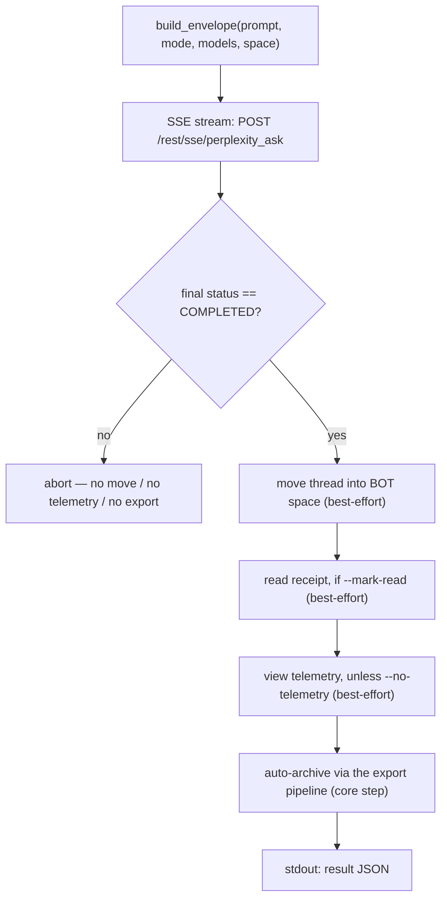

<a id="pplx-ask-interactive-queries" data-pplx-source-anchor="true"></a>
# pplx-ask: Интерактивные запросы

`pplx-ask` — вторая точка входа CLI проекта: он задаёт вопросы Perplexity
интерактивно через SSE-поток, затем постобрабатывает полученную нить — перемещает её
в пространство BOT, отправляет опциональное уведомление о прочтении и телеметрию просмотра,
похожую на человеческую, и автоматически архивирует её с помощью того же конвейера экспорта,
что и `pplx-export`. Он разделяет ядро (транспорт / куки / состояние / логирование) с
`pplx-export`, и все формы API проверяются на соответствие живой платформе.

Источник: `pplx_export/ask_cli.py` (CLI), `pplx_export/sites/perplexity/ask_api.py` (уровень API).

```bash
pplx-ask models                                  # list the authoritative model table
pplx-ask models --refresh                         # refresh + persist the catalog into config.toml [models]
pplx-ask ask "What is the time resolution of an example parameter?"   # search mode (default)
pplx-ask ask "<long prompt>" --mode council      # model council (default three models)
pplx-ask ask "<prompt>" --mode council --models gpt56_sol_thinking,claude50opusthinking
pplx-ask ask "<prompt>" --mode deep-research     # deep research (fixed pplx_alpha)
pplx-ask ask "<prompt>" --space some-space-slug  # create inside a space, then move into BOT
pplx-ask ask "<prompt>" --mark-read              # send a read receipt after completion
pplx-ask mark-read <thread_url|uuid>             # standalone read receipt
pplx-ask space-create "My Space"                 # create a space
```

<a id="subcommands" data-pplx-source-anchor="true"></a>
## Подкоманды

### `models`

Выводит живую, авторитетную таблицу моделей из
`GET https://www.perplexity.ai/rest/models/config/v2` (`pplx_export/ask_cli.py`,
`cmd_models`): модели по умолчанию для каждого режима, три модели совета по умолчанию, модели,
доступные для выбора в режиме поиска, и специальные режимы (`research` / `study` /
`agentic_research` / `studio`).

| Опция | По умолчанию | Описание |
|---|---|---|
| `--refresh` | выкл | Сохранить полученный каталог в таблицу `[models]` конфига (автоуправление): `last_refreshed`, `mode_defaults`, `council_defaults`, `search_models` и полный `[models.catalog]`. Затем `pplx-ask` строит запросы из `[models]`, возвращаясь к фиксированной базовой линии в `pplx_export/sites/perplexity/platform.py`. Требуется загруженный файл конфига (сначала выполните `pplx-export init`). См. [Конфигурация](configuration.md). |

### `ask`

Задаёт вопрос (`pplx_export/ask_cli.py:86`). Поток SSE выводит прогресс в консоль,
запускает конвейер постобработки (см. [Поток ask](#the-ask-flow)) и выводит
машиночитаемый JSON-объект в stdout в конце.

| Опция | По умолчанию | Описание |
|---|---|---|
| `prompt` (позиционная) | — | Вопрос. Длинные, содержательные подсказки работают лучше. |
| `--mode` | `search` | `search` = обычный поиск (модель выбирается); `deep-research` = глубокое исследование (фиксированная модель); `council` = совет моделей (2–3 модели параллельно + синтез); `study` = пошаговое изучение |
| `--models` | нет | `council`: разделённые запятыми 2–3 идентификатора моделей (по умолчанию: модели совета из каталога `[models]` или фиксированный запасной вариант `platform.py`; обновить с помощью `pplx-ask models --refresh`); `search`: один идентификатор модели; игнорируется `deep-research` / `study` |
| `--space` | `home` | `home` = создать с домашней страницы, затем переместить в пространство BOT; `<slug>` = создать непосредственно внутри этого пространства, затем переместить в пространство BOT |
| `--mark-read` | выкл | Отправить уведомление о прочтении (`mark_viewed`) после завершения |
| `--no-telemetry` | выкл | Не отправлять телеметрию просмотра, похожую на человеческую (по умолчанию: отправлять — `ask context pane viewed` / `thread viewed` / `thread entry exited` со случайным временем) |
| `--no-export` | выкл | Не архивировать автоматически в `web_archive` |
| `--timeout` | `600` | Тайм-аут SSE-потока в секундах |

Разрешение модели выполняется офлайн: `model_preference` для каждого режима и модели сравнения
совета берутся из таблицы `[models]` конфига, если она присутствует, с возвратом к фиксированной
базовой линии в `pplx_export/sites/perplexity/platform.py` (сборка запроса никогда не обращается к
сети). Когда `[models]` отсутствует или старше 7 дней
(`platform.MODELS_REFRESH_TTL_DAYS`), `ask` предупреждает вас выполнить `pplx-ask models --refresh`
(по умолчанию) — или обновляется автоматически, когда флаг `[models].auto_refresh` установлен в `true`.

Подсказки об ошибках HTTP, выдаваемые `ask` (`pplx_export/ask_cli.py:124`): `401`/`403` = куки
истекли или контролируются рисками (обновите куки), `429` = превышение лимита запросов (повторите
позже), `5xx` = ошибка сервера (повторите позже). См. [Устранение неполадок](troubleshooting.md).

### `mark-read`

Отправляет уведомление о прочтении для существующей нити (`pplx_export/ask_cli.py:201`): принимает
URL нити или чистый UUID, разрешает `context_uuid` нити через
`GET /rest/thread/<uuid>`, затем вызывает `POST /rest/thread/mark_viewed` с
`{"context_uuids": [ctx]}` (`pplx_export/sites/perplexity/ask_api.py:190`). Флаг непрочитанного
меняется немедленно. Выводит `{"uuid", "context_uuid", "result"}` в формате JSON.

Примечание: событие аналитики `thread viewed` **не** меняет флаг непрочитанного — настоящее
уведомление о прочтении — это данная конечная точка.

### `space-create`

Создаёт пространство через `POST /rest/collections/create_collection`
(`pplx_export/sites/perplexity/ask_api.py:179`) с проверенными фиксированными полями
(`emoji: "1f4c1"`, `access: 1`). Выводит `{"uuid", "slug", "url"}` в формате JSON.

| Опция | По умолчанию | Описание |
|---|---|---|
| `title` (позиционная) | — | Название пространства |
| `--description` | `""` | Описание пространства |

Чтобы использовать новое пространство как пространство BOT, зарегистрируйте его `uuid`/`slug` в разделе `[bot_space]`
в конфиге пользователя (см. [Конфигурация](configuration.md)).

<a id="common-options" data-pplx-source-anchor="true"></a>
## Общие опции

Общие с `pplx-export` (одинаковые имена и значения по умолчанию, `pplx_export/commands/common.py:232`):

| Опция | По умолчанию | Описание |
|---|---|---|
| `--account` | конфиг `default_account` | Целевая учётная запись; при несовпадении куки/email токены сессии браузера для каждой учётной записи перечисляются и переключаются автоматически |
| `--config PATH` | `~/.config/pplx-export/config.toml` | Конфиг пользователя (реестр учётных записей / пространство BOT); приоритет: `--config` > переменная окружения `PPLX_EXPORT_CONFIG` > путь по умолчанию |
| `--out` | `./web_archive` | Корень вывода архива |
| `--cookies-from BROWSER` | автоопределение | Импортировать куки из указанного браузера (`edge`/`chrome`/`firefox`/`safari`/`brave`…) |
| `--cookies FILE` | — | Файл куки в формате Netscape или JSON |
| `-v` / `--verbose` | выкл | Вывод DEBUG (трассировка запросов / внутренние решения) |
| `--log-file [PATH]` | выкл | Полный журнал DEBUG в файл; без значения помещается в `<out>/index/logs/<cmd>-<timestamp>.log` |

Приоритет источника куки: `--cookies-from` / `--cookies` > свежий кеш
(`<out>/index/.cookies.json`, 12 ч) > автоопределение браузера. См.
[Начало работы](getting-started.md) для первоначальной настройки.

<a id="the-ask-flow" data-pplx-source-anchor="true"></a>
## Поток ask



1. **Сборка конверта** — `build_envelope` (`pplx_export/sites/perplexity/ask_api.py:71`)
   заполняет проверенный шаблон параметров: `mode` всегда `"copilot"` и
   `query_source` — `"home"` (каждый `ask` начинает **новый** разговор; продолжение
   не предоставляется CLI). С `--space <slug>` слаг пространства
   разрешается в uuid, и конверт содержит `target_collection_uuid` +
   `target_thread_access_level: 1`.
2. **SSE-поток** — `sse_ask` (`pplx_export/sites/perplexity/ask_api.py:153`) отправляет POST на
   `https://www.perplexity.ai/rest/sse/perplexity_ask` и потребляет поток событий,
   логируя создание нити (`https://www.perplexity.ai/search/<uuid>`), переходы
   статусов и прогресс генерации. Поток заканчивается на `final_sse_message`.
   Когда поток простаивает в течение интервала (глубокое исследование / совет могут молчать
   минутами; тайм-аут открытия 600 с), `post_stream` выводит информационное сообщение "still waiting for
   the response stream" при стандартном уровне подробности, чтобы работающий процесс никогда не был
   ошибочно принят за зависший.
3. **Шлюз завершения** — постобработка запускается только когда финальный статус `COMPLETED`
   (`pplx_export/ask_cli.py:134`). При аномальном завершении потока всё после этой
   точки пропускается (без перемещения, без телеметрии, без экспорта), чтобы незавершённое состояние никогда
   не попало в архив.
4. **Перемещение в пространство BOT** (best-effort) — `batch_move_threads` с `context_uuid` нити
   в настроенный uuid `[bot_space]`. Пропускается, если пространство BOT не
   настроено, или если нить уже была создана внутри пространства BOT.
5. **Уведомление о прочтении** (best-effort, `--mark-read`) — `POST /rest/thread/mark_viewed`;
   флаг непрочитанного меняется немедленно.
6. **Телеметрия просмотра, похожая на человеческую** (best-effort, включена по умолчанию) —
   `send_view_telemetry` (`pplx_export/sites/perplexity/ask_api.py:234`) имитирует реальное
   время просмотра: `ask context pane viewed` → `thread viewed` → `ask context pane
   viewed` → `thread entry exited` (random `timeOnEntryMs` 12–45 с, паузы 0.6–2.4 с
   между событиями, устройство выбирается случайно из небольшого пула).
7. **Автоматическое архивирование** (основной шаг, если не `--no-export`) — нить экспортируется
   через тот же конвейер, что и `pplx-export export` (режим принудительно), попадая в
   `<out>/<account>/<mode>/<date>_<title>_<uuid8>/` — см.
   [Структура архива](archive-layout.md) и [Конвейер экспорта](../architecture/export-pipeline.md).
   В отличие от шагов best-effort, сбой архивирования распространяется и приводит к ошибке команды.

**Изоляция сбоев**: шаги 4–6 изолированы как best-effort (`pplx_export/ask_cli.py:36`):
сбой логирует предупреждение, устанавливает ключ JSON шага в `false`, записывает детали в
`step_errors` и никогда не блокирует архивирование. Архивирование (шаг 7) является основным шагом, и его
сбои никогда не проглатываются.

<a id="modes-and-model-selection" data-pplx-source-anchor="true"></a>
## Режимы и выбор модели

Авторитетная таблица моделей платформы — `GET /rest/models/config/v2` (то, что
выводит `pplx-ask models`). Различие находится в поле `model_preference` —
`mode` конверта всегда `"copilot"`.

| Режим | Значение `--mode` | `model_preference` | Выбор модели |
|---|---|---|---|
| Поиск | `search` | `pplx_pro` ("Лучшая" в интерфейсе) по умолчанию | Один идентификатор модели через `--models` (см. `pplx-ask models` для списка доступных) |
| Глубокое исследование | `deep-research` | `pplx_alpha` | Фиксированная — без выбора |
| Совет моделей | `council` | `pplx_agentic_research` + `compare_model_preferences` | 2–3 разделённых запятыми идентификатора через `--models`; по умолчанию из каталога `[models]` (или запасного варианта `platform.py`), обновляется через `pplx-ask models --refresh` |
| Пошаговое изучение | `study` | `pplx_study` | Фиксированная — без выбора |
| Computer | *(не предоставляется)* | семейство `pplx_asi*` | Не поддерживается `pplx-ask` |

Примечания:

- Совет запускает модели параллельно и синтезирует; наблюдаемая задержка первого токена может
  превышать 3 минуты, поэтому увеличьте `--timeout` для запусков совета / глубокого исследования.
- Таксономия режимов на стороне архива (как экспортированные нити классифицируются, включая
  `computer`) описана в [Режимы](modes.md); детали конверта запроса находятся в
  [REST endpoints](../reference/api/api-rest-endpoints.md).

<a id="using-pplx-ask-from-other-agents" data-pplx-source-anchor="true"></a>
## Использование pplx-ask из других агентов

`pplx-ask` создан так, чтобы другие агенты могли получать информацию в реальном времени: он задаёт
вопрос, ждёт завершения, архивирует нить и выводит машиночитаемый
контракт.

- **stdout содержит ровно один JSON-объект** (последняя строка); все логи идут в stderr, поэтому
  вызывающие программы могут передавать stdout напрямую в JSON-парсер.
- **Код выхода**: `0` при успехе; сбои завершаются с ненулевым кодом и сообщением об ошибке в
  stderr — сбои на этапе ask прерываются через `SystemExit` с сообщением `[ask][ERROR]`,
  в то время как сбои архивирования распространяются как есть (см. шаг 7).

Форма результирующего JSON (`pplx_export/ask_cli.py:194`):

| Ключ | Тип | Значение |
|---|---|---|
| `thread_uuid` | string | Backend uuid созданной нити |
| `thread_url` | string | `https://www.perplexity.ai/search/<thread_uuid>` |
| `context_uuid` | string | `context_uuid` нити (используется для перемещения / отметки о прочтении / телеметрии) |
| `moved_to_bot` | boolean | `true` = перемещение в пространство BOT выполнено и успешно; `false` = не выполнено или не удалось |
| `mark_read` | boolean | Тот же контракт для уведомления о прочтении |
| `telemetry` | boolean | Тот же контракт для телеметрии просмотра |
| `step_errors` | object | Детали сбоя по каждому шагу; появляются только шаги, на которых произошёл сбой |
| `exported` | string \| null | `"见上方 [export] 输出"`, когда архивирование выполнялось; `null` с `--no-export` |

Советы по автоматизации:

- Относитесь к булевым значениям шагов строго — сбой никогда не представляется истинным значением;
  проверяйте `step_errors` для деталей.
- `--no-telemetry` пропускает задержку 12–45 с, имитирующую человеческое поведение, когда важен только ответ.
- Без настроенного пространства BOT (упрощённый режим) `moved_to_bot` остаётся `false`, и
  всё остальное всё равно работает — см. [Устранение неполадок](troubleshooting.md).
- Для настройки учётной записи/куки безголовые агенты должны прочитать
  [API authentication](../reference/api/api-authentication.md); поведение с несколькими учётными записями описано в
  [Ask and accounts](../architecture/ask-and-accounts.md).

<a id="see-also" data-pplx-source-anchor="true"></a>
## См. также

- [Начало работы](getting-started.md) — установка, куки, первый запуск
- [Конфигурация](configuration.md) — учётные записи, пространство BOT, упрощённый режим
- [pplx-export](pplx-export.md) — CLI архивирования
- [Устранение неполадок](troubleshooting.md) — 401/403, не та учётная запись, логи
