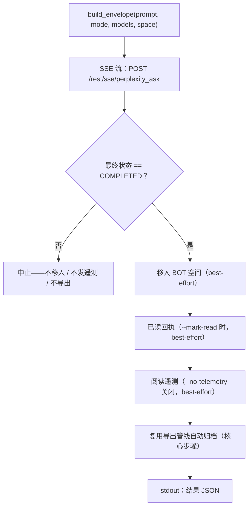

# pplx-ask：交互式查询

`pplx-ask` 是本项目的第二个 CLI 入口：通过 SSE 流式向 Perplexity 发问，然后对生成的
线程做后处理——移入 BOT 空间、可选发送已读回执与人性化阅读遥测，并用与
`pplx-export` 相同的导出管线自动归档。它与 `pplx-export` 共享 core
（transport / cookies / state / logging），所有 API 形态均经实测。

源码：`pplx_export/ask_cli.py`（CLI）、`pplx_export/sites/perplexity/ask_api.py`（API 层）。

```bash
pplx-ask models                                  # 列出权威模型总表
pplx-ask models --refresh                         # 刷新并把目录写入 config.toml 的 [models]
pplx-ask ask "示例参数的时间分辨率是多少？"   # 搜索模式（默认）
pplx-ask ask "<long prompt>" --mode council      # 模型委员会（默认三模型）
pplx-ask ask "<prompt>" --mode council --models gpt56_sol_thinking,claude50opusthinking
pplx-ask ask "<prompt>" --mode deep-research     # 深度研究（固定 pplx_alpha）
pplx-ask ask "<prompt>" --space some-space-slug  # 在该空间创建，完成后移入 BOT
pplx-ask ask "<prompt>" --mark-read              # 完成后发已读回执
pplx-ask mark-read <thread_url|uuid>             # 单独发已读回执
pplx-ask space-create "My Space"                 # 创建空间
```

## 子命令

### `models`

打印来自 `GET https://www.perplexity.ai/rest/models/config/v2` 的实时权威模型总表
（`pplx_export/ask_cli.py`，`cmd_models`）：各模式默认模型、委员会默认三模型、搜索模式可选模型，
以及特殊模式（`research` / `study` / `agentic_research` / `studio`）。

| 参数 | 默认 | 说明 |
|---|---|---|
| `--refresh` | 关 | 把拉取到的目录写入配置的 `[models]` 表（机器托管）：`last_refreshed`、`mode_defaults`、`council_defaults`、`search_models` 及完整 `[models.catalog]`。此后 `pplx-ask` 从 `[models]` 组装请求，回退到 `pplx_export/sites/perplexity/platform.py` 的钉死兜底。需已加载配置文件（先 `pplx-export init`）。见[配置](configuration.md)。 |

### `ask`

发问（`pplx_export/ask_cli.py:86`）。SSE 流式显示进度，完成后执行后处理管线
（见[发问流程](#发问流程)），并在 stdout 末尾输出一个机器可读 JSON 对象。

| 选项 | 默认值 | 说明 |
|---|---|---|
| `prompt`（位置参数） | — | 提问内容。长而有意义的 prompt 效果更好。 |
| `--mode` | `search` | `search` = 普通搜索（可选模型）；`deep-research` = 深度研究（固定模型）；`council` = 模型委员会（2–3 模型并行 + 综合）；`study` = 逐步学习 |
| `--models` | 无 | `council`：逗号分隔 2–3 个模型 id（默认取 `[models]` 目录中的委员会模型，或 `platform.py` 钉死兜底；用 `pplx-ask models --refresh` 刷新）；`search`：单个模型 id；`deep-research` / `study` 忽略此项 |
| `--space` | `home` | `home` = 从首页创建后移入 BOT 空间；`<slug>` = 直接在该空间创建，完成后也移入 BOT 空间 |
| `--mark-read` | 关 | 完成后发已读回执（`mark_viewed`） |
| `--no-telemetry` | 关 | 不发送人性化阅读遥测（默认发送：`ask context pane viewed` / `thread viewed` / `thread entry exited`，随机时序） |
| `--no-export` | 关 | 不自动归档到 `web_archive` |
| `--timeout` | `600` | SSE 流超时秒数 |

模型解析在离线完成：各模式 `model_preference` 与委员会对比模型优先取配置的 `[models]` 表，
缺失时回退到 `pplx_export/sites/perplexity/platform.py` 的钉死兜底（组装请求全程不联网）。
当 `[models]` 缺失或超过 7 天（`platform.MODELS_REFRESH_TTL_DAYS`）时，`ask` 会提醒你运行
`pplx-ask models --refresh`（默认）——或在 `[models].auto_refresh = true` 时自动刷新。

`ask` 输出的 HTTP 错误提示（`pplx_export/ask_cli.py:124`）：`401`/`403` = cookie
失效或被风控（请更新 cookie），`429` = 触发限流（稍后重试），`5xx` = 服务端错误
（稍后重试）。见[故障排查](troubleshooting.md)。

### `mark-read`

给既有线程发已读回执（`pplx_export/ask_cli.py:201`）：接受线程 URL 或裸 UUID，先经
`GET /rest/thread/<uuid>` 解析出线程的 `context_uuid`，再以
`{"context_uuids": [ctx]}` 调用 `POST /rest/thread/mark_viewed`
（`pplx_export/sites/perplexity/ask_api.py:190`）。unread 立即翻转。输出 JSON
`{"uuid", "context_uuid", "result"}`。

注意：analytics 的 `thread viewed` 事件**不翻转** unread——真正的已读回执是本端点。

### `space-create`

经 `POST /rest/collections/create_collection` 创建空间
（`pplx_export/sites/perplexity/ask_api.py:179`），使用实测的固定字段
（`emoji: "1f4c1"`，`access: 1`）。输出 JSON `{"uuid", "slug", "url"}`。

| 选项 | 默认值 | 说明 |
|---|---|---|
| `title`（位置参数） | — | 空间标题 |
| `--description` | `""` | 空间描述 |

要把新空间用作 BOT 空间，把它的 `uuid`/`slug` 登记到用户级配置的 `[bot_space]`
表中（见[配置](configuration.md)）。

## 通用选项

与 `pplx-export` 共享（名称与默认值完全一致，`pplx_export/commands/common.py:232`）：

| 选项 | 默认值 | 说明 |
|---|---|---|
| `--account` | 配置 `default_account` | 目标账户；cookie 归属与登记 email 不符时自动枚举浏览器中的账户会话令牌切换 |
| `--config PATH` | `~/.config/pplx-export/config.toml` | 用户级配置（账户注册表 / BOT 空间）；优先级：`--config` > 环境变量 `PPLX_EXPORT_CONFIG` > 默认路径 |
| `--out` | `./web_archive` | 归档输出根目录 |
| `--cookies-from BROWSER` | 自动探测 | 从指定浏览器导入 cookie（`edge`/`chrome`/`firefox`/`safari`/`brave`…） |
| `--cookies FILE` | — | Netscape cookie 文件或 JSON cookie 文件 |
| `-v` / `--verbose` | 关 | DEBUG 输出（请求追踪 / 内部判定） |
| `--log-file [PATH]` | 关 | 全量 DEBUG 日志落盘；不带值时落 `<out>/index/logs/<cmd>-<timestamp>.log` |

cookie 来源优先级：`--cookies-from` / `--cookies` > 新鲜缓存
（`<out>/index/.cookies.json`，12 小时）> 浏览器自动探测。首次设置见
[快速上手](getting-started.md)。

## 发问流程



1. **envelope 组装** —— `build_envelope`（`pplx_export/sites/perplexity/ask_api.py:71`）
   填充实测参数模板：`mode` 恒为 `"copilot"`，`query_source` 为 `"home"`
   （每次 `ask` 都开启**新对话**；CLI 不暴露续接追问）。带 `--space <slug>` 时先把
   slug 解析为 uuid，envelope 携带 `target_collection_uuid` +
   `target_thread_access_level: 1`。
2. **SSE 流式发问** —— `sse_ask`（`pplx_export/sites/perplexity/ask_api.py:153`）POST 到
   `https://www.perplexity.ai/rest/sse/perplexity_ask` 并逐事件消费，记录线程创建
   （`https://www.perplexity.ai/search/<uuid>`）、状态迁移与生成进度。流在
   `final_sse_message` 时结束。流空闲超过一个间隔时（深研 / 联席可静默数分钟；
   open 超时 600 s），`post_stream` 会在默认档打一条「仍在等待响应流」INFO 心跳，
   避免把活跃运行误当卡死。
3. **完成闸门** —— 只有最终状态为 `COMPLETED` 才执行后处理
   （`pplx_export/ask_cli.py:134`）。流异常结束时后续动作全部跳过（不移入、不发遥测、
   不导出），半成品状态绝不外泄进归档。
4. **移入 BOT 空间**（best-effort）—— 以线程的 `context_uuid` 调
   `batch_move_threads` 移入配置的 `[bot_space]` uuid。未配置 BOT 空间、或线程本就
   创建于 BOT 空间时跳过。
5. **已读回执**（best-effort，`--mark-read`）—— `POST /rest/thread/mark_viewed`；
   unread 立即翻转。
6. **人性化阅读遥测**（best-effort，默认开）——
   `send_view_telemetry`（`pplx_export/sites/perplexity/ask_api.py:234`）模拟真实浏览
   时序：`ask context pane viewed` → `thread viewed` → `ask context pane viewed`
   → `thread entry exited`（随机 `timeOnEntryMs` 12–45 秒，事件间停顿 0.6–2.4 秒，
   设备从设备池随机选取）。
7. **自动归档**（核心步骤，`--no-export` 关闭）—— 线程经与 `pplx-export export`
   相同的管线导出（force 模式），落盘到
   `<out>/<账户>/<模式>/<日期>_<标题>_<uuid8>/` —— 见[归档布局](archive-layout.md)
   与[导出管线](../architecture/export-pipeline.md)。与 best-effort 步骤不同，归档失败会
   如实上抛并使命令失败。

**失败隔离**：第 4–6 步逐项隔离为 best-effort（`pplx_export/ask_cli.py:36`）：任一
失败只记 warning、把该步骤的 JSON 键置为 `false`、详情记入 `step_errors`，绝不阻断
归档。归档（第 7 步）是核心步骤，失败从不被吞掉。

## 模式与模型选择

平台权威模型总表是 `GET /rest/models/config/v2`（即 `pplx-ask models` 打印的内容）。
模式判别落在 `model_preference` 字段上——envelope 的 `mode` 恒为 `"copilot"`。

| 模式 | `--mode` 值 | `model_preference` | 模型选择 |
|---|---|---|---|
| 搜索 | `search` | 默认 `pplx_pro`（UI 名 "Best"） | 经 `--models` 给单个模型 id（可选列表见 `pplx-ask models`） |
| 深度研究 | `deep-research` | `pplx_alpha` | 固定——无选择器 |
| 模型委员会 | `council` | `pplx_agentic_research` + `compare_model_preferences` | 经 `--models` 给 2–3 个逗号分隔 id；默认取 `[models]` 目录（或 `platform.py` 兜底），用 `pplx-ask models --refresh` 刷新 |
| 逐步学习 | `study` | `pplx_study` | 固定——无选择器 |
| Computer | *（未暴露）* | `pplx_asi*` 家族 | `pplx-ask` 不支持 |

注：

- 委员会多模型并行生成再综合，实测首 token 延迟可超过 3 分钟——council /
  deep-research 请相应调大 `--timeout`。
- 归档侧的模式分类（导出线程如何判定模式，含 `computer`）见[模式](modes.md)；请求
  envelope 细节见 [REST 端点](../reference/api/api-rest-endpoints.md)。

## 从其他 agent 调用 pplx-ask

`pplx-ask` 的设计目标之一就是让其他 agent 获取实时信息：发问、等待完成、归档线程，
并输出机器可读契约。

- **stdout 恰好只有一个 JSON 对象**（最后一行）；全部日志走 stderr，调用方可以把
  stdout 直接喂给 JSON 解析器。
- **退出码**：成功为 `0`；失败以非零退出并在 stderr 给出错误消息——发问阶段失败经
  `SystemExit` 中止并带 `[ask][ERROR]` 消息，归档失败则原样上抛（见第 7 步）。

结果 JSON 结构（`pplx_export/ask_cli.py:194`）：

| 键 | 类型 | 含义 |
|---|---|---|
| `thread_uuid` | string | 所建线程的 backend uuid |
| `thread_url` | string | `https://www.perplexity.ai/search/<thread_uuid>` |
| `context_uuid` | string | 线程的 `context_uuid`（移入 / 已读回执 / 遥测所用） |
| `moved_to_bot` | boolean | `true` = 移入 BOT 空间已执行且成功；`false` = 未执行或失败 |
| `mark_read` | boolean | 已读回执同上语义 |
| `telemetry` | boolean | 阅读遥测同上语义 |
| `step_errors` | object | 各步骤失败详情；仅失败步骤出现 |
| `exported` | string \| null | 归档已执行时为 `"见上方 [export] 输出"`；`--no-export` 时为 `null` |

自动化建议：

- 严格按布尔键判断步骤成败——失败绝不用 truthy 值表示；详情查 `step_errors`。
- 只要答案不要过程时，`--no-telemetry` 可跳过 12–45 秒的人性化停留。
- 未配置 BOT 空间（降级模式）时 `moved_to_bot` 保持 `false`，其余功能照常——见
  [故障排查](troubleshooting.md)。
- 无头 agent 的账户 / cookie 设置见 [API 认证](../reference/api/api-authentication.md)；
  多账户行为见[发问与账户](../architecture/ask-and-accounts.md)。

## 参见

- [快速上手](getting-started.md) —— 安装、cookie、首次运行
- [配置](configuration.md) —— 账户、BOT 空间、降级模式
- [pplx-export](pplx-export.md) —— 归档 CLI
- [故障排查](troubleshooting.md) —— 401/403、账户串号、日志位置
