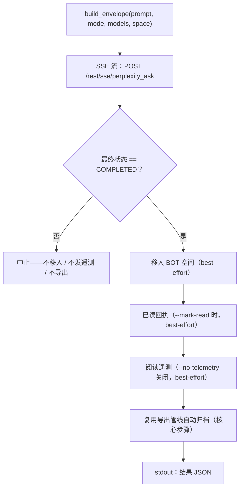

<a id="pplx-ask交互式查询" data-pplx-source-anchor="true"></a>
# pplx-ask：互動式查詢

`pplx-ask` 是本專案的第二個 CLI 入口：透過 SSE 串流向 Perplexity 提問，然後對產生的
執行緒進行後處理——移入 BOT 空間、可選傳送已讀回執與人性化閱讀遙測，並使用與
`pplx-export` 相同的匯出管線自動歸檔。它與 `pplx-export` 共享核心
（transport / cookies / state / logging），所有 API 形態均經實測。

原始碼：`pplx_export/ask_cli.py`（CLI）、`pplx_export/sites/perplexity/ask_api.py`（API 層）。

```bash
pplx-ask models                                  # 列出权威模型总表
pplx-ask ask "示例参数的时间分辨率是多少？"   # 搜索模式（默认）
pplx-ask ask "<long prompt>" --mode council      # 模型委员会（默认三模型）
pplx-ask ask "<prompt>" --mode council --models gpt55_thinking,claude48opusthinking
pplx-ask ask "<prompt>" --mode deep-research     # 深度研究（固定 pplx_alpha）
pplx-ask ask "<prompt>" --space some-space-slug  # 在该空间创建，完成后移入 BOT
pplx-ask ask "<prompt>" --mark-read              # 完成后发已读回执
pplx-ask mark-read <thread_url|uuid>             # 单独发已读回执
pplx-ask space-create "My Space"                 # 创建空间
```

## 子命令

### `models`

列印來自 `GET https://www.perplexity.ai/rest/models/config/v2` 的即時權威模型總表
（`pplx_export/ask_cli.py:51`）：各模式預設模型、委員會預設三模型、搜尋模式可選模型，
以及特殊模式（`research` / `study` / `agentic_research` / `studio`）。無選項。

### `ask`

提問（`pplx_export/ask_cli.py:86`）。SSE 串流顯示進度，完成後執行後處理管線
（見[提問流程](#发问流程)），並在 stdout 結尾輸出一個機器可讀 JSON 物件。

| 選項 | 預設值 | 說明 |
|---|---|---|
| `prompt`（位置參數） | — | 提問內容。長而有意義的 prompt 效果更好。 |
| `--mode` | `search` | `search` = 一般搜尋（可選模型）；`deep-research` = 深度研究（固定模型）；`council` = 模型委員會（2–3 模型並行 + 綜合）；`study` = 逐步學習 |
| `--models` | 無 | `council`：逗號分隔 2–3 個模型 id（預設 `gpt55_thinking,claude48opusthinking,gemini31pro_high`）；`search`：單個模型 id；`deep-research` / `study` 忽略此項 |
| `--space` | `home` | `home` = 從首頁建立後移入 BOT 空間；`<slug>` = 直接在該空間建立，完成後也移入 BOT 空間 |
| `--mark-read` | 關 | 完成後傳送已讀回執（`mark_viewed`） |
| `--no-telemetry` | 關 | 不傳送人性化閱讀遙測（預設傳送：`ask context pane viewed` / `thread viewed` / `thread entry exited`，隨機時序） |
| `--no-export` | 關 | 不自動歸檔到 `web_archive` |
| `--timeout` | `600` | SSE 串流逾時秒數 |

`ask` 輸出的 HTTP 錯誤提示（`pplx_export/ask_cli.py:124`）：`401`/`403` = cookie
失效或被風控（請更新 cookie），`429` = 觸發速率限制（稍後重試），`5xx` = 伺服器端錯誤
（稍後重試）。見[故障排除](troubleshooting.md)。

### `mark-read`

給既有執行緒傳送已讀回執（`pplx_export/ask_cli.py:201`）：接受執行緒 URL 或裸 UUID，先經
`GET /rest/thread/<uuid>` 解析出執行緒的 `context_uuid`，再以
`{"context_uuids": [ctx]}` 呼叫 `POST /rest/thread/mark_viewed`
（`pplx_export/sites/perplexity/ask_api.py:190`）。unread 立即翻轉。輸出 JSON
`{"uuid", "context_uuid", "result"}`。

注意：analytics 的 `thread viewed` 事件**不翻轉** unread——真正的已讀回執是此端點。

### `space-create`

經 `POST /rest/collections/create_collection` 建立空間
（`pplx_export/sites/perplexity/ask_api.py:179`），使用實測的固定欄位
（`emoji: "1f4c1"`，`access: 1`）。輸出 JSON `{"uuid", "slug", "url"}`。

| 選項 | 預設值 | 說明 |
|---|---|---|
| `title`（位置參數） | — | 空間標題 |
| `--description` | `""` | 空間描述 |

要把新空間用作 BOT 空間，把它的 `uuid`/`slug` 登記到使用者層級設定的 `[bot_space]`
表中（見[設定](configuration.md)）。

<a id="通用选项" data-pplx-source-anchor="true"></a>
## 通用選項

與 `pplx-export` 共享（名稱與預設值完全一致，`pplx_export/commands/common.py:232`）：

| 選項 | 預設值 | 說明 |
|---|---|---|
| `--account` | 設定 `default_account` | 目標帳戶；cookie 歸屬與登記 email 不符時自動列舉瀏覽器中的帳戶階段權杖切換 |
| `--config PATH` | `~/.config/pplx-export/config.toml` | 使用者層級設定（帳戶註冊表 / BOT 空間）；優先順序：`--config` > 環境變數 `PPLX_EXPORT_CONFIG` > 預設路徑 |
| `--out` | `./web_archive` | 歸檔輸出根目錄 |
| `--cookies-from BROWSER` | 自動偵測 | 從指定瀏覽器匯入 cookie（`edge`/`chrome`/`firefox`/`safari`/`brave`…） |
| `--cookies FILE` | — | Netscape cookie 檔案或 JSON cookie 檔案 |
| `-v` / `--verbose` | 關 | DEBUG 輸出（請求追蹤 / 內部判定） |
| `--log-file [PATH]` | 關 | 完整 DEBUG 日誌寫入磁碟；不帶值時寫入 `<out>/index/logs/<cmd>-<timestamp>.log` |

cookie 來源優先順序：`--cookies-from` / `--cookies` > 新鮮快取
（`<out>/index/.cookies.json`，12 小時）> 瀏覽器自動偵測。首次設定見
[快速入門](getting-started.md)。

<a id="发问流程" data-pplx-source-anchor="true"></a>
## 提問流程



1. **envelope 組裝** —— `build_envelope`（`pplx_export/sites/perplexity/ask_api.py:71`）
   填入實測參數範本：`mode` 恆為 `"copilot"`，`query_source` 為 `"home"`
   （每次 `ask` 都開啟**新對話**；CLI 不暴露接續追問）。帶 `--space <slug>` 時先把
   slug 解析為 uuid，envelope 攜帶 `target_collection_uuid` +
   `target_thread_access_level: 1`。
2. **SSE 串流提問** —— `sse_ask`（`pplx_export/sites/perplexity/ask_api.py:153`）POST 到
   `https://www.perplexity.ai/rest/sse/perplexity_ask` 並逐事件消費，記錄執行緒建立
   （`https://www.perplexity.ai/search/<uuid>`）、狀態遷移與生成進度。串流在
   `final_sse_message` 時結束。
3. **完成閘門** —— 只有最終狀態為 `COMPLETED` 才執行後處理
   （`pplx_export/ask_cli.py:134`）。串流異常結束時後續動作全部跳過（不移入、不發遙測、
   不匯出），半成品狀態絕不外洩進歸檔。
4. **移入 BOT 空間**（best-effort）—— 以執行緒的 `context_uuid` 呼叫
   `batch_move_threads` 移入設定的 `[bot_space]` uuid。未設定 BOT 空間、或執行緒本就
   建立於 BOT 空間時跳過。
5. **已讀回執**（best-effort，`--mark-read`）—— `POST /rest/thread/mark_viewed`；
   unread 立即翻轉。
6. **人性化閱讀遙測**（best-effort，預設開）——
   `send_view_telemetry`（`pplx_export/sites/perplexity/ask_api.py:234`）模擬真實瀏覽
   時序：`ask context pane viewed` → `thread viewed` → `ask context pane viewed`
   → `thread entry exited`（隨機 `timeOnEntryMs` 12–45 秒，事件間停頓 0.6–2.4 秒，
   裝置從裝置池隨機選取）。
7. **自動歸檔**（核心步驟，`--no-export` 關閉）—— 執行緒經與 `pplx-export export`
   相同的管線匯出（force 模式），寫入磁碟到
   `<out>/<账户>/<模式>/<日期>_<标题>_<uuid8>/` —— 見[歸檔佈局](archive-layout.md)
   與[匯出管線](../architecture/export-pipeline.md)。與 best-effort 步驟不同，歸檔失敗會
   如實上拋並使命令失敗。

**失敗隔離**：第 4–6 步逐項隔離為 best-effort（`pplx_export/ask_cli.py:36`）：任一
失敗只記錄 warning、把該步驟的 JSON 鍵設為 `false`、詳情記入 `step_errors`，絕不阻斷
歸檔。歸檔（第 7 步）是核心步驟，失敗從不被吞掉。

<a id="模式与模型选择" data-pplx-source-anchor="true"></a>
## 模式與模型選擇

平台權威模型總表是 `GET /rest/models/config/v2`（即 `pplx-ask models` 列印的內容）。
模式判別落在 `model_preference` 欄位上——envelope 的 `mode` 恆為 `"copilot"`。

| 模式 | `--mode` 值 | `model_preference` | 模型選擇 |
|---|---|---|---|
| 搜尋 | `search` | 預設 `pplx_pro`（UI 名 "Best"） | 經 `--models` 給單個模型 id（可選列表見 `pplx-ask models`） |
| 深度研究 | `deep-research` | `pplx_alpha` | 固定——無選擇器 |
| 模型委員會 | `council` | `pplx_agentic_research` + `compare_model_preferences` | 經 `--models` 給 2–3 個逗號分隔 id；預設 `gpt55_thinking,claude48opusthinking,gemini31pro_high` |
| 逐步學習 | `study` | `pplx_study` | 固定——無選擇器 |
| Computer | *（未暴露）* | `pplx_asi*` 家族 | `pplx-ask` 不支援 |

註：

- 委員會多模型並行生成再綜合，實測首 token 延遲可超過 3 分鐘——council /
  deep-research 請相應調大 `--timeout`。
- 歸檔側的模式分類（匯出執行緒如何判定模式，含 `computer`）見[模式](modes.md)；請求
  envelope 細節見 [REST 端點](../reference/api/api-rest-endpoints.md)。

<a id="从其他-agent-调用-pplx-ask" data-pplx-source-anchor="true"></a>
## 從其他 agent 呼叫 pplx-ask

`pplx-ask` 的設計目標之一就是讓其他 agent 取得即時資訊：提問、等待完成、歸檔執行緒，
並輸出機器可讀契約。

- **stdout 恰好只有一個 JSON 物件**（最後一行）；全部日誌走 stderr，呼叫方可以把
  stdout 直接餵給 JSON 解析器。
- **退出碼**：成功為 `0`；失敗以非零退出並在 stderr 給出錯誤訊息——提問階段失敗經
  `SystemExit` 中止並帶 `[ask][ERROR]` 訊息，歸檔失敗則原樣上拋（見第 7 步）。

結果 JSON 結構（`pplx_export/ask_cli.py:194`）：

| 鍵 | 類型 | 含義 |
|---|---|---|
| `thread_uuid` | string | 所建執行緒的 backend uuid |
| `thread_url` | string | `https://www.perplexity.ai/search/<thread_uuid>` |
| `context_uuid` | string | 執行緒的 `context_uuid`（移入 / 已讀回執 / 遙測所用） |
| `moved_to_bot` | boolean | `true` = 移入 BOT 空間已執行且成功；`false` = 未執行或失敗 |
| `mark_read` | boolean | 已讀回執同上語意 |
| `telemetry` | boolean | 閱讀遙測同上語意 |
| `step_errors` | object | 各步驟失敗詳情；僅失敗步驟出現 |
| `exported` | string \| null | 歸檔已執行時為 `"见上方 [export] 输出"`；`--no-export` 時為 `null` |

自動化建議：

- 嚴格按布林鍵判斷步驟成敗——失敗絕不用 truthy 值表示；詳情查 `step_errors`。
- 只要答案不要過程時，`--no-telemetry` 可跳過 12–45 秒的人性化停留。
- 未設定 BOT 空間（降級模式）時 `moved_to_bot` 保持 `false`，其餘功能照常——見
  [故障排除](troubleshooting.md)。
- 無頭 agent 的帳戶 / cookie 設定見 [API 認證](../reference/api/api-authentication.md)；
  多帳戶行為見[提問與帳戶](../architecture/ask-and-accounts.md)。

<a id="参见" data-pplx-source-anchor="true"></a>
## 參見

- [快速入門](getting-started.md) —— 安裝、cookie、首次執行
- [設定](configuration.md) —— 帳戶、BOT 空間、降級模式
- [pplx-export](pplx-export.md) —— 歸檔 CLI
- [故障排除](troubleshooting.md) —— 401/403、帳戶串號、日誌位置
