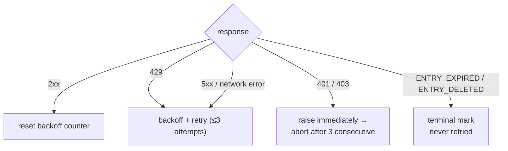

<a id="rate-limiting" data-pplx-source-anchor="true"></a>
# تحديد المعدل

كل رقم في سياسة التحديد يخدم هدفًا واحدًا: يجب أن يبدو حركة مرور الأرشفة مثل التصفح العادي. تكلف عملية التصدير ذات الخيط الواحد 1–2 طلبًا — تقريبًا عرض صفحة واحدة — وتوزع عمليات التشغيل المجمعة هذه الطلبات على فترات عشوائية دون تزامن. هذا مطلب صريح لمكافحة المخاطر (`pplx_export/core/throttle.py:1-2`)، وليس مقبض أداء قابل للضبط.

<a id="the-numbers" data-pplx-source-anchor="true"></a>
## الأرقام

| أين | التحديد | الكود |
|---|---|---|
| `batch`: بين الخيوط | عشوائي منتظم 10–20 ثانية (`--delay-min` / `--delay-max`) | `pplx_export/cli.py:126-129`, `pplx_export/core/throttle.py:33-36` |
| `sync-deleted --online`: بين المرشحين | عشوائي منتظم 10–20 ثانية | `pplx_export/cli.py:164-167`, `pplx_export/commands/sync_deleted_cmd.py:368-369` |
| `search-mode-backfill`: احتياطي عبر الإنترنت | عشوائي منتظم 10–20 ثانية | `pplx_export/cli.py:144-147` |
| الترقيم داخل خيط / قائمة مساحة | ≥3 ثوانٍ بين الصفحات | `pplx_export/sites/perplexity/rest.py:39,56`, `pplx_export/sites/perplexity/adapter.py:285-309` |
| التعبئة الخلفية للكتل المخططة (computer / deep-research / council / study) | ≥4 ثوانٍ انتظار قبل الجلب الثاني | `pplx_export/sites/perplexity/adapter.py:27-32,88` |
| `spaces --fetch-meta` | 3 ثوانٍ لكل مساحة | `pplx_export/commands/spaces_cmd.py:328` |
| `usage-backfill` | 3 ثوانٍ لكل خيط | `pplx_export/commands/usage_backfill_cmd.py:77` |
| `assets-backfill` المراحل عبر الإنترنت | 3 ثوانٍ لكل خيط | `pplx_export/commands/assets_backfill_cmd.py:215,456` |
| تنزيلات الأصول داخل خيط | 0.5 ثانية | `pplx_export/sites/perplexity/assets.py:28,103` |
| `assets-backfill` مرحلة CDN | 6 تنزيلات متوازية، بدون تأخير | `pplx_export/commands/assets_backfill_cmd.py:460-475` |
| تزامن API | لا شيء — أبدًا | — |

<a id="why-these-numbers" data-pplx-source-anchor="true"></a>
## لماذا هذه الأرقام

- **تصدير واحد = 1–2 طلب ≈ عرض صفحة واحدة.** خيط بحث يكلف `GET /rest/thread/<uuid>` واحدًا؛ computer / deep-research / council / study يضيف جلب كتل مخططة واحدًا بالضبط (`pplx_export/sites/perplexity/adapter.py:87-89`). هذا تقريبًا ما يفعله المتصفح عند فتح الصفحة مرة واحدة — لا يضيف الأرشيف أي حمل ذي معنى فوق الاستخدام العادي.
- **فاصل عشوائي 10–20 ثانية، بدون تزامن.** إيقاع القراءة البشرية، والتوزيع العشوائي يتجنب التوقيت المثالي للميترونوم. الطلبات التسلسلية تحافظ على المعدل أقل مما ينتجه التصفح العادي بالفعل.
- **≥3 ثوانٍ لقلب الصفحات.** الترقيم داخل خيط طويل يحاكي وقت التمرير والقراءة.
- **≥4 ثوانٍ قبل جلب الكتل.** إعادة الجلب المخطط كان سيضرب API متتاليًا مع الجلب العادي؛ التوقف يحاكي التأخير قبل تحميل الصفحة الثقيلة حمولتها الكاملة.
- **0.5 ثانية لتنزيلات الأصول.** ملفات ثابتة صغيرة، أرخص بكثير من استدعاءات API — ولكنها لا تزال محددة.
- **مرحلة CDN هي الاسترخاء الوحيد.** تنزيلات URL الموقعة تصل إلى شبكة توصيل المحتوى، وليس API Perplexity، لذا 6 اتصالات متوازية مقبولة هناك فقط.

<a id="error-handling-and-backoff" data-pplx-source-anchor="true"></a>
## معالجة الأخطاء والتراجع

يتم كل التصنيف في `CookieTransport._request` (`pplx_export/core/http/cookie_transport.py:63-126`)؛ يحصل كل طلب على ما يصل إلى `max_retries=3` محاولة (`cookie_transport.py:48`).



| الاستجابة | التصنيف | المعالجة |
|---|---|---|
| 2xx | نجاح | إعادة تعيين عداد التراجع (`cookie_transport.py:77`) — لا تتراكم العدادات عبر الطلبات |
| 429 | تحديد معدل | التراجع وإعادة المحاولة (`cookie_transport.py:86-92`) |
| 500 / 502 / 503 / 504 | خطأ خادم عابر (504 غالبًا وميض Cloudflare) | التراجع وإعادة المحاولة مرة واحدة على الأقل قبل الاستسلام (`cookie_transport.py:99-107`) |
| خطأ شبكة | عابر | التراجع وإعادة المحاولة (`cookie_transport.py:117-125`) |
| 401 / 403 | فشل مصادقة | رفع `AuthTransportError` فورًا — بدون تراجع (`cookie_transport.py:82-85`) |
| 400 + `ENTRY_EXPIRED` | مسح منصة | `EntryExpiredError` — نهائي، لا يعاد المحاولة أبدًا (`cookie_transport.py:96-98`) |
| 400 + `ENTRY_DELETED` | حذف مستخدم/عن بعد | `EntryDeletedError` — نهائي، لا يعاد المحاولة أبدًا (`cookie_transport.py:93-95`) |
| 404 / رموز أخرى | خطأ عادي | لا إعادة محاولة على مستوى النقل؛ **لا** يُعيّن أبدًا إلى حالة نهائية (`cookie_transport.py:108-116`) |

**صيغة التراجع** (`pplx_export/core/throttle.py:38-50`):
`delay_max × 3^N`، حيث `N` هو عدد الإخفاقات المتتالية (الأس مقيد عند 8)، مع تمويه ±20% ضد التزامن، وبحد أقصى 300 ثانية. لا يوجد نوم لا طائل منه بعد المحاولة الفاشلة الأخيرة، و`throttle.reset()` يمسح العداد عند أول نجاح (`throttle.py:52`).

لماذا توجد كل قاعدة:

- **تراجع 429** — طلب الخادم صراحةً الإبطاء؛ تكريمه أسيًا.
- **إعادة محاولة 5xx** — وميض بوابة واحد يجب ألا يفشل خيطًا.
- **401/403 بدون تراجع** — الانتظار لا يمكنه شفاء ملف تعريف ارتباط ميت.
- **`ENTRY_EXPIRED` بدون إعادة محاولة** — مسح المنصة (نافذة ~3 أشهر) دائم؛ إعادة المحاولة تحرق الطلبات وميزانية التراجع فقط.
- **404 ليس نهائيًا أبدًا** — خيط تم إنشاؤه بواسطة `pplx-ask` يمكن أن يظهر 404 بشكل عابر بعد الإنشاء مباشرة (تأخير الانتشار)؛ علامة نهائية كانت ستدفن خيطًا حيًا غير مرئي لفترة وجيزة فقط.

<a id="runtime-budget-for-callers" data-pplx-source-anchor="true"></a>
## ميزانية وقت التشغيل للمتصلين

انضباط التراجع أعلاه يقايض وقت الحائط بسلامة الحساب، ويجب على المتصلين تخصيص ميزانية لذلك الوقت: طلب واحد يقوم بما يصل إلى 3 محاولات مع نوم تراجع بينها — حتى 300 ثانية لكل منها (`pplx_export/core/throttle.py:38-50`) — لذا بينما تتقلب الشبكة، يمكن لطلب واحد أن يشغل بشكل مشروع حوالي 10 دقائق. `index` / `batch` يبدأان أيضًا بفحص جلسة يتبع نفس القواعد (`pplx_export/commands/common.py:126`). الصمت الطويل يعني أن انتظار التراجع قيد التقدم، وليس تعليقًا.

ثلاث قواعد للوكلاء ووظائف cron ومغلفات CI:

1. **حساب واحد لكل استدعاء.** تشغيل الحسابات بشكل تسلسلي كعمليات منفصلة؛ لا تربطها أبدًا بـ `&&` داخل مهمة خارجية تفرض مهلة زمنية صارمة — سلسلة التراجع للحساب الأول تستهلك الميزانية بأكملها والحساب المرتبط لا يعمل أبدًا.
2. **ميزانية ≥ 15 دقيقة، أو افصل.** أعطِ المغلفات مهلة زمنية سخية، أو قم بتشغيلها في الخلفية وشاهد السجل (`-v` / `--log-file`) لتمييز انتظارات التراجع عن التعليقات الحقيقية.
3. **المقاطعة آمنة دائمًا.** الحالة تُكتب بشكل ذري؛ إعادة التشغيل عديمة التأثير وتصلح أي فجوة تركتها المقاطعة (دلالات الإيقاف المبكر والاستئناف: [المزامنة المتزايدة](incremental-sync.md)).

<a id="auth-fail-fast" data-pplx-source-anchor="true"></a>
## فشل المصادقة السريع

طبقة الدفعة تحسب إخفاقات المصادقة المتتالية (`_AUTH_FAIL_FAST = 3`, `pplx_export/commands/batch_cmd.py:43`). أي استجابة وصلت إلى الخادم — بما في ذلك `ENTRY_DELETED` / `ENTRY_EXPIRED` — تثبت أن ملف تعريف الارتباط يعمل وتعيد تعيين العداد (`batch_cmd.py:170-182`). ثلاث 401/403 متتالية ويحفظ التشغيل ملف الحالة الخاص به، ثم يلغي (`batch_cmd.py:190-194`): الاستمرار بملف تعريف ارتباط ميت كان سيجعل مئات الخيوط تفشل كل منها مرة واحدة — ساعات مهدرة. `sync-deleted` يطبق نفس الانضباط (`pplx_export/commands/sync_deleted_cmd.py:111,333-337`). الحل هو تحديث ملف تعريف الارتباط وإعادة التشغيل؛ كل شيء تم تصديره بالفعل يتم تخطيه.

`batch` والنقل يشتركان في مثيل `Throttle` واحد (`pplx_export/cli.py:280-282`, `batch_cmd.py:101-105`)، لذا فإن عد التراجع لا ينقسم أبدًا بين الطبقات — والمثيل المشترك يبقى على قيد الحياة عند التبديل التلقائي للحساب.

<a id="scheduling-periodic-sync" data-pplx-source-anchor="true"></a>
## جدولة المزامنة الدورية

`pplx-export schedule` يحسب الخطة المتزايدة الحالية (عدد الجديد/المحدث) ويكتب مقتطف cron إلى `<out>/index/cron_snippet.txt` (`pplx_export/commands/misc_cmd.py:86-96`, `pplx_export/hooks/scheduler.py:48-77`):

```bash
pplx-export schedule --account alice
```

```cron
17 3 * * * cd '<out-parent>' && '/abs/path/to/pplx-export' batch --account 'alice' --out '<out>'
```

- عمليات التشغيل الدورية **متزايدة فقط** (إيقاف مبكر) — لا إعادة جلب كاملة (`scheduler.py:4-9`).
- يستخدم المقتطف مسارات مطلقة ومقتبسة لأن دليل عمل cron و`PATH` غير متوقعين (`scheduler.py:63-75`).
- قم بتثبيته باستخدام `crontab -e` واضبط الوقت حسب الرغبة؛ قم بتوزيع حسابات متعددة على فتحات مختلفة.
- شبكة أمان اختيارية: أضف مسحًا يدويًا أسبوعيًا أو شهريًا باستخدام `pplx-export batch --account alice --full` (انظر [incremental-sync.md](incremental-sync.md)).

<a id="see-also" data-pplx-source-anchor="true"></a>
## انظر أيضًا

- [incremental-sync.md](incremental-sync.md) — ما يصدره كل تشغيل مجدول فعليًا
- [pplx-export.md](pplx-export.md) — `--delay-min` / `--delay-max` وخيارات الأوامر الأخرى
- [troubleshooting.md](troubleshooting.md) — ماذا تفعل بعد إلغاء فشل المصادقة السريع
- [../architecture/rate-limiting-errors.md](../architecture/rate-limiting-errors.md) — التصنيف الكامل للأخطاء
- [../reference/api/api-responses-errors.md](../reference/api/api-responses-errors.md) — دلالات الأخطاء من جانب المنصة (`ENTRY_EXPIRED`, `ENTRY_DELETED`, Cloudflare)
- [../reference/api/api-authentication.md](../reference/api/api-authentication.md) — ملفات تعريف الارتباط وتبديل الحسابات المتعددة
