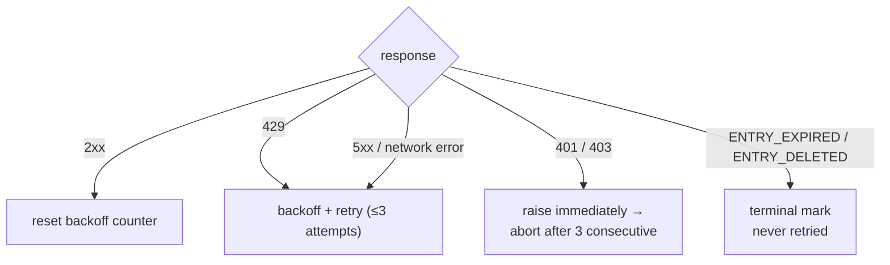

<a id="rate-limiting" data-pplx-source-anchor="true"></a>
# Ratenbegrenzung

Jede Zahl in der Taktungsrichtlinie dient einem Ziel: Archiv-Traffic muss wie normales Surfen aussehen. Ein Single-Thread-Export kostet 1–2 Anfragen – etwa ein Seitenaufruf – und Batch-Läufe verteilen diese Anfragen über randomisierte Intervalle ohne Parallelität. Dies ist eine explizite Anti-Risikokontroll-Anforderung (`pplx_export/core/throttle.py:1-2`), kein einstellbarer Leistungsregler.

<a id="the-numbers" data-pplx-source-anchor="true"></a>
## Die Zahlen

| wo | Taktung | Code |
|---|---|---|
| `batch`: zwischen Threads | zufällig gleichverteilt 10–20 s (`--delay-min` / `--delay-max`) | `pplx_export/cli.py:126-129`, `pplx_export/core/throttle.py:33-36` |
| `sync-deleted --online`: zwischen Kandidaten | zufällig gleichverteilt 10–20 s | `pplx_export/cli.py:164-167`, `pplx_export/commands/sync_deleted_cmd.py:368-369` |
| `search-mode-backfill`: Online-Fallback | zufällig gleichverteilt 10–20 s | `pplx_export/cli.py:144-147` |
| Paginierung innerhalb eines Threads / einer Space-Liste | ≥3 s zwischen Seiten | `pplx_export/sites/perplexity/rest.py:39,56`, `pplx_export/sites/perplexity/adapter.py:285-309` |
| Schema-Blöcke-Nachfüllung (Computer / Deep Research / Council / Study) | ≥4 s Wartezeit vor dem zweiten Abruf | `pplx_export/sites/perplexity/adapter.py:27-32,88` |
| `spaces --fetch-meta` | 3 s pro Space | `pplx_export/commands/spaces_cmd.py:328` |
| `usage-backfill` | 3 s pro Thread | `pplx_export/commands/usage_backfill_cmd.py:77` |
| `assets-backfill` Online-Phasen | 3 s pro Thread | `pplx_export/commands/assets_backfill_cmd.py:215,456` |
| Asset-Downloads innerhalb eines Threads | 0,5 s | `pplx_export/sites/perplexity/assets.py:28,103` |
| `assets-backfill` CDN-Phase | 6 parallele Downloads, keine Verzögerung | `pplx_export/commands/assets_backfill_cmd.py:460-475` |
| API-Parallelität | keine – niemals | — |

<a id="why-these-numbers" data-pplx-source-anchor="true"></a>
## Warum diese Zahlen

- **Einzelner Export = 1–2 Anfragen ≈ ein Seitenaufruf.** Ein Such-Thread kostet eine `GET /rest/thread/<uuid>`; Computer / Deep Research / Council / Study fügen genau einen Schema-Blöcke-Abruf hinzu (`pplx_export/sites/perplexity/adapter.py:87-89`). Das entspricht etwa dem, was ein Browser tut, wenn Sie die Seite einmal öffnen – das Archiv fügt keine nennenswerte Last zusätzlich zur normalen Nutzung hinzu.
- **10–20 s zufälliges Intervall, keine Parallelität.** Menschlicher Leserhythmus, und die Randomisierung vermeidet metronom-perfekte Zeitabstände. Serielle Anfragen halten die Rate unter dem, was normales Surven bereits produziert.
- **≥3 s Seitenwechsel.** Paginierung innerhalb eines langen Threads simuliert Scroll- und Lesezeit.
- **≥4 s vor dem Blöcke-Abruf.** Der schematisierte Neuabruf würde sonst die API direkt nach dem einfachen Abruf treffen; die Pause simuliert die Verzögerung, bevor eine schwere Seite ihre vollständige Nutzlast lädt.
- **0,5 s Asset-Downloads.** Kleine statische Dateien, weitaus günstiger als API-Aufrufe – aber dennoch getaktet.
- **Die CDN-Phase ist die einzige Lockerung.** Downloads mit signierten URLs treffen das Content Delivery Network, nicht die Perplexity-API, daher sind 6 parallele Verbindungen dort und nur dort akzeptabel.

<a id="error-handling-and-backoff" data-pplx-source-anchor="true"></a>
## Fehlerbehandlung und Backoff

Die gesamte Klassifizierung erfolgt in `CookieTransport._request` (`pplx_export/core/http/cookie_transport.py:63-126`); jede Anfrage erhält bis zu `max_retries=3` Versuche (`cookie_transport.py:48`).



| Antwort | Klassifizierung | Behandlung |
|---|---|---|
| 2xx | Erfolg | Backoff-Zähler zurücksetzen (`cookie_transport.py:77`) – Zähler akkumulieren nie über Anfragen hinweg |
| 429 | Ratenbegrenzung | Backoff und Wiederholung (`cookie_transport.py:86-92`) |
| 500 / 502 / 503 / 504 | Temporärer Serverfehler (504 ist häufig ein Cloudflare-Aussetzer) | Backoff und mindestens einmal wiederholen, bevor aufgegeben wird (`cookie_transport.py:99-107`) |
| Netzwerkfehler | Temporär | Backoff und Wiederholung (`cookie_transport.py:117-125`) |
| 401 / 403 | Authentifizierungsfehler | `AuthTransportError` sofort ausgelöst – kein Backoff (`cookie_transport.py:82-85`) |
| 400 + `ENTRY_EXPIRED` | Plattform-Bereinigung | `EntryExpiredError` – endgültig, niemals wiederholt (`cookie_transport.py:96-98`) |
| 400 + `ENTRY_DELETED` | Benutzer-/Remote-Löschung | `EntryDeletedError` – endgültig, niemals wiederholt (`cookie_transport.py:93-95`) |
| 404 / andere Codes | Gewöhnlicher Fehler | Keine Wiederholung auf Transportebene; **niemals** einem Endzustand zugeordnet (`cookie_transport.py:108-116`) |

**Backoff-Formel** (`pplx_export/core/throttle.py:38-50`):
`delay_max × 3^N`, wobei `N` die Anzahl aufeinanderfolgender Fehler ist (Exponent bei 8 begrenzt), mit ±20 % Jitter gegen Synchronisation, gedeckelt bei 300 s. Es gibt keinen sinnlosen Schlaf nach dem letzten fehlgeschlagenen Versuch, und `throttle.reset()` löscht den Zähler beim ersten Erfolg (`throttle.py:52`).

**Herzschläge (sichtbar bei Standard-Ausführlichkeit).** Ein Backoff wartet nicht mehr still: Er gibt eine vorausgehende Zeile und dann alle `Throttle.heartbeat_interval` (Standard 10 s) einen Countdown-Tick aus, wobei in Blöcken geschlafen wird, deren Summe der gleichen Gesamtzeit entspricht – Taktung und Anti-Risikokontroll-Budget bleiben unverändert, werden nur sichtbar gemacht (`pplx_export/core/throttle.py`, `Throttle._sleep_with_heartbeat`). Die gleiche Idee deckt zwei weitere lange Wartezeiten ab: Jede laufende Anfrage gibt einen „warte noch auf Antwort“-Tick aus, während sie auf eine Antwort wartet (`CookieTransport._open_read`), und `pplx-ask`-Streams geben einen „warte noch auf den Antwortstream“-Tick aus, während ein Deep-Research-/Council-Lauf still ist (`ask_api.post_stream`). Keines davon erfordert `-v`.

Warum jede Regel existiert:

- **429 Backoff** – der Server hat explizit um Verlangsamung gebeten; befolge dies exponentiell.
- **5xx Wiederholung** – ein einzelner Gateway-Aussetzer darf keinen Thread zum Scheitern bringen.
- **401/403 ohne Backoff** – Warten kann kein totes Cookie heilen.
- **`ENTRY_EXPIRED` ohne Wiederholung** – die Plattform-Bereinigung (~3-Monats-Fenster) ist dauerhaft; Wiederholung verbrennt nur Anfragen und Backoff-Budget.
- **404 niemals endgültig** – ein von `pplx-ask` erstellter Thread kann direkt nach der Erstellung vorübergehend 404 liefern (Ausbreitungsverzögerung); eine endgültige Markierung würde einen live Thread begraben, der nur kurz unsichtbar ist.

<a id="runtime-budget-for-callers" data-pplx-source-anchor="true"></a>
## Laufzeitbudget für Aufrufer

Die obige Backoff-Disziplin tauscht Wanduhrzeit gegen Kontosicherheit, und Aufrufer müssen diese Zeit einplanen: Eine einzelne Anfrage macht bis zu 3 Versuche mit einem Backoff-Schlaf dazwischen – bis zu 300 s jeder (`pplx_export/core/throttle.py:38-50`) – so dass eine Anfrage bei Netzwerkflackern legitimerweise in der Größenordnung von 10 Minuten beanspruchen kann. `index` / `batch` beginnen ebenfalls mit einer Sitzungssonde, die denselben Regeln folgt (`pplx_export/commands/common.py`, `make_transport`); übergeben Sie `--skip-auth-check`, um diese Sonde zu überspringen und sofort mit der Arbeit zu beginnen (siehe [Konfiguration](configuration.md)).
Eine lange Stille bedeutet, dass ein Warten im Gange ist, kein Hängen – und dieses Warten wird nun durch INFO-Herzschläge bei Standard-Ausführlichkeit sichtbar gemacht (Backoff-Countdown, laufende Anfrage und SSE-Stream).

Drei Regeln für Agenten, Cron-Jobs und CI-Wrapper:

1. **Ein Konto pro Aufruf.** Führen Sie Konten seriell als separate Prozesse aus; verketten Sie sie niemals mit `&&` innerhalb einer äußeren Aufgabe, die ein hartes Timeout erzwingt – die Backoff-Kaskade des ersten Kontos verbraucht das gesamte Budget und das verkettete Konto wird nie ausgeführt.
2. **Budget ≥ 15 Minuten, oder trennen.** Geben Sie Wrappern ein großzügiges Timeout, oder führen Sie sie im Hintergrund aus und beobachten Sie die Herzschläge (jetzt bei Standard-Ausführlichkeit; `-v` / `--log-file` fügen die vollständige Ablaufverfolgung hinzu), um Backoff-Wartezeiten von echten Hängern zu unterscheiden.
3. **Unterbrechen ist immer sicher.** Der Zustand wird atomar geschrieben; eine erneute Ausführung ist idempotent und repariert jede Lücke, die die Unterbrechung hinterlassen hat (Frühstopp- und Fortsetzungssemantik: [Inkrementelle Synchronisation](incremental-sync.md)).

## Auth-Fail-Fast

Die Batch-Ebene zählt aufeinanderfolgende Authentifizierungsfehler (`_AUTH_FAIL_FAST = 3`, `pplx_export/commands/batch_cmd.py:43`). Jede Antwort, die den Server erreicht hat – einschließlich `ENTRY_DELETED` / `ENTRY_EXPIRED` – beweist, dass das Cookie funktioniert, und setzt den Zähler zurück (`batch_cmd.py:170-182`). Drei aufeinanderfolgende 401/403 und der Lauf speichert seine Zustandsdatei und bricht dann ab (`batch_cmd.py:190-194`): Mit einem toten Cookie weiterzumachen, würde Hunderte von Threads jeweils einmal scheitern lassen – Stunden verschwendet. `sync-deleted` wendet dieselbe Disziplin an (`pplx_export/commands/sync_deleted_cmd.py:111,333-337`). Die Lösung ist, das Cookie zu erneuern und erneut auszuführen; alles bereits Exportierte wird übersprungen.

`batch` und der Transport teilen sich eine `Throttle`-Instanz (`pplx_export/cli.py:280-282`, `batch_cmd.py:101-105`), so dass die Backoff-Zählung niemals zwischen Ebenen aufgeteilt wird – und die gemeinsame Instanz überlebt automatischen Kontowechsel.

<a id="scheduling-periodic-sync" data-pplx-source-anchor="true"></a>
## Planung der periodischen Synchronisation

`pplx-export schedule` berechnet den aktuellen inkrementellen Plan (neue/aktualisierte Zählungen) und schreibt einen Cron-Ausschnitt nach `<out>/index/cron_snippet.txt` (`pplx_export/commands/misc_cmd.py:86-96`, `pplx_export/hooks/scheduler.py:48-77`):

```bash
pplx-export schedule --account alice
```

```cron
17 3 * * * cd '<out-parent>' && '/abs/path/to/pplx-export' batch --account 'alice' --out '<out>'
```

- Periodische Läufe sind **nur inkrementell** (Frühstopp) – keine vollständigen Neuabrufe (`scheduler.py:4-9`).
- Der Ausschnitt verwendet absolute, in Anführungszeichen gesetzte Pfade, da das Arbeitsverzeichnis von Cron und `PATH` unvorhersehbar sind (`scheduler.py:63-75`).
- Installieren Sie es mit `crontab -e` und passen Sie die Zeit nach Geschmack an; staffeln Sie mehrere Konten auf verschiedene Slots.
- Optionaler Rückhalt: Fügen Sie einen wöchentlichen oder monatlichen manuellen Durchlauf mit `pplx-export batch --account alice --full` hinzu (siehe [incremental-sync.md](incremental-sync.md)).

<a id="see-also" data-pplx-source-anchor="true"></a>
## Siehe auch

- [incremental-sync.md](incremental-sync.md) – was jeder geplante Lauf tatsächlich exportiert
- [pplx-export.md](pplx-export.md) – `--delay-min` / `--delay-max` und die anderen Befehlsoptionen
- [troubleshooting.md](troubleshooting.md) – was nach einem Auth-Fail-Fast-Abbruch zu tun ist
- [../architecture/rate-limiting-errors.md](../architecture/rate-limiting-errors.md) – die vollständige Fehlertaxonomie
- [../reference/api/api-responses-errors.md](../reference/api/api-responses-errors.md) – plattformseitige Fehlersemantik (`ENTRY_EXPIRED`, `ENTRY_DELETED`, Cloudflare)
- [../reference/api/api-authentication.md](../reference/api/api-authentication.md) – Cookies und Multi-Konto-Wechsel
