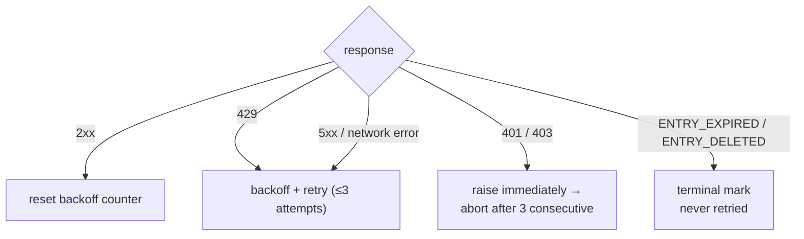

<a id="rate-limiting" data-pplx-source-anchor="true"></a>
# Limitación de tasa

Cada número en la política de ritmo sirve a un objetivo: el tráfico de archivo debe parecer navegación normal. Una exportación de un solo hilo cuesta 1–2 solicitudes — aproximadamente una vista de página — y las ejecuciones por lotes distribuyen esas solicitudes en intervalos aleatorios sin concurrencia. Esto es un requisito explícito de control de riesgo (`pplx_export/core/throttle.py:1-2`), no un parámetro de rendimiento ajustable.

<a id="the-numbers" data-pplx-source-anchor="true"></a>
## Los números

| dónde | ritmo | código |
|---|---|---|
| `batch`: entre hilos | uniforme aleatorio 10–20 s (`--delay-min` / `--delay-max`) | `pplx_export/cli.py:126-129`, `pplx_export/core/throttle.py:33-36` |
| `sync-deleted --online`: entre candidatos | uniforme aleatorio 10–20 s | `pplx_export/cli.py:164-167`, `pplx_export/commands/sync_deleted_cmd.py:368-369` |
| `search-mode-backfill`: respaldo en línea | uniforme aleatorio 10–20 s | `pplx_export/cli.py:144-147` |
| paginación dentro de un hilo / listado de espacios | ≥3 s entre páginas | `pplx_export/sites/perplexity/rest.py:39,56`, `pplx_export/sites/perplexity/adapter.py:285-309` |
| relleno de bloques esquematizados (computer / deep-research / council / study) | ≥4 s de espera antes de la segunda obtención | `pplx_export/sites/perplexity/adapter.py:27-32,88` |
| `spaces --fetch-meta` | 3 s por espacio | `pplx_export/commands/spaces_cmd.py:328` |
| `usage-backfill` | 3 s por hilo | `pplx_export/commands/usage_backfill_cmd.py:77` |
| `assets-backfill` fases en línea | 3 s por hilo | `pplx_export/commands/assets_backfill_cmd.py:215,456` |
| descargas de activos dentro de un hilo | 0.5 s | `pplx_export/sites/perplexity/assets.py:28,103` |
| `assets-backfill` fase CDN | 6 descargas paralelas, sin demora | `pplx_export/commands/assets_backfill_cmd.py:460-475` |
| concurrencia de API | ninguna — nunca | — |

<a id="why-these-numbers" data-pplx-source-anchor="true"></a>
## Por qué estos números

- **Exportación única = 1–2 solicitudes ≈ una vista de página.** Un hilo de búsqueda cuesta una `GET /rest/thread/<uuid>`; computer / deep-research / council / study añaden exactamente una obtención de bloques esquematizados (`pplx_export/sites/perplexity/adapter.py:87-89`). Eso es aproximadamente lo que hace un navegador cuando abres la página una vez — el archivo no añade carga significativa sobre el uso normal.
- **Intervalo aleatorio de 10–20 s, sin concurrencia.** Ritmo de lectura humana, y la aleatorización evita tiempos perfectos de metrónomo. Las solicitudes en serie mantienen la tasa por debajo de lo que la navegación normal ya produce.
- **≥3 s entre páginas.** La paginación dentro de un hilo largo imita el tiempo de desplazamiento y lectura.
- **≥4 s antes de la obtención de bloques.** La reobtención esquematizada golpearía la API consecutivamente con la obtención simple; la pausa imita la demora antes de que una página pesada cargue su carga completa.
- **0.5 s descargas de activos.** Archivos estáticos pequeños, mucho más baratos que las llamadas API — pero aún así con ritmo.
- **La fase CDN es la única relajación.** Las descargas de URL firmadas golpean la red de entrega de contenido, no la API de Perplexity, por lo que 6 conexiones paralelas son aceptables allí y solo allí.

<a id="error-handling-and-backoff" data-pplx-source-anchor="true"></a>
## Manejo de errores y retroceso

Toda la clasificación ocurre en `CookieTransport._request` (`pplx_export/core/http/cookie_transport.py:63-126`); cada solicitud obtiene hasta `max_retries=3` intentos (`cookie_transport.py:48`).



| respuesta | clasificación | manejo |
|---|---|---|
| 2xx | éxito | reinicio del contador de retroceso (`cookie_transport.py:77`) — los contadores nunca se acumulan entre solicitudes |
| 429 | limitado por tasa | retroceder y reintentar (`cookie_transport.py:86-92`) |
| 500 / 502 / 503 / 504 | error de servidor transitorio (504 es comúnmente un parpadeo de Cloudflare) | retroceder y reintentar al menos una vez antes de rendirse (`cookie_transport.py:99-107`) |
| error de red | transitorio | retroceder y reintentar (`cookie_transport.py:117-125`) |
| 401 / 403 | fallo de autenticación | `AuthTransportError` lanzado inmediatamente — sin retroceso (`cookie_transport.py:82-85`) |
| 400 + `ENTRY_EXPIRED` | purga de plataforma | `EntryExpiredError` — terminal, nunca reintentado (`cookie_transport.py:96-98`) |
| 400 + `ENTRY_DELETED` | eliminación de usuario/remota | `EntryDeletedError` — terminal, nunca reintentado (`cookie_transport.py:93-95`) |
| 404 / otros códigos | error ordinario | sin reintento a nivel de transporte; **nunca** mapeado a un estado terminal (`cookie_transport.py:108-116`) |

**Fórmula de retroceso** (`pplx_export/core/throttle.py:38-50`):
`delay_max × 3^N`, donde `N` es el conteo de fallos consecutivos (exponente limitado a 8), con ±20% de jitter contra sincronización, limitado a 300 s. No hay espera inútil después del último intento fallido, y `throttle.reset()` reinicia el contador en el primer éxito (`throttle.py:52`).

Por qué existe cada regla:

- **Retroceso 429** — el servidor pidió explícitamente reducir la velocidad; respetarlo exponencialmente.
- **Reintento 5xx** — un parpadeo de puerta de enlace no debe fallar un hilo.
- **401/403 sin retroceso** — esperar no puede curar una cookie muerta.
- **`ENTRY_EXPIRED` sin reintento** — la purga de plataforma (~ventana de 3 meses) es permanente; reintentar solo quema solicitudes y presupuesto de retroceso.
- **404 nunca terminal** — un hilo creado por `pplx-ask` puede dar 404 transitoriamente justo después de la creación (retardo de propagación); una marca terminal enterraría un hilo vivo que solo es brevemente invisible.

<a id="auth-fail-fast" data-pplx-source-anchor="true"></a>
## Fallo de autenticación rápido

La capa de lotes cuenta los fallos de autenticación consecutivos (`_AUTH_FAIL_FAST = 3`, `pplx_export/commands/batch_cmd.py:43`). Cualquier respuesta que llegó al servidor — incluyendo `ENTRY_DELETED` / `ENTRY_EXPIRED` — prueba que la cookie funciona y reinicia el contador (`batch_cmd.py:170-182`). Tres 401/403 consecutivos y la ejecución guarda su archivo de estado, luego aborta (`batch_cmd.py:190-194`): seguir con una cookie muerta haría que cientos de hilos fallaran cada uno una vez — horas perdidas. `sync-deleted` aplica la misma disciplina (`pplx_export/commands/sync_deleted_cmd.py:111,333-337`). La solución es refrescar la cookie y re-ejecutar; todo lo ya exportado se omite.

`batch` y el transporte comparten una instancia de `Throttle` (`pplx_export/cli.py:280-282`, `batch_cmd.py:101-105`), por lo que el conteo de retroceso nunca se divide entre capas — y la instancia compartida sobrevive al cambio automático de cuenta.

<a id="scheduling-periodic-sync" data-pplx-source-anchor="true"></a>
## Programación de sincronización periódica

`pplx-export schedule` calcula el plan incremental actual (conteos nuevos/actualizados) y escribe un fragmento de cron en `<out>/index/cron_snippet.txt` (`pplx_export/commands/misc_cmd.py:86-96`, `pplx_export/hooks/scheduler.py:48-77`):

```bash
pplx-export schedule --account alice
```

```cron
17 3 * * * cd '<out-parent>' && '/abs/path/to/pplx-export' batch --account 'alice' --out '<out>'
```

- Las ejecuciones periódicas son **solo incrementales** (parada temprana) — sin reobtenciones completas (`scheduler.py:4-9`).
- El fragmento usa rutas absolutas y entrecomilladas porque el directorio de trabajo de cron y `PATH` son impredecibles (`scheduler.py:63-75`).
- Instálelo con `crontab -e` y ajuste la hora al gusto; escalone múltiples cuentas en diferentes espacios.
- Respaldo opcional: añada un barrido manual semanal o mensual con `pplx-export batch --account alice --full` (consulte [incremental-sync.md](incremental-sync.md)).

<a id="see-also" data-pplx-source-anchor="true"></a>
## Véase también

- [incremental-sync.md](incremental-sync.md) — qué exporta realmente cada ejecución programada
- [pplx-export.md](pplx-export.md) — `--delay-min` / `--delay-max` y las otras opciones de comando
- [troubleshooting.md](troubleshooting.md) — qué hacer después de un aborto rápido por fallo de autenticación
- [../architecture/rate-limiting-errors.md](../architecture/rate-limiting-errors.md) — la taxonomía completa de errores
- [../reference/api/api-responses-errors.md](../reference/api/api-responses-errors.md) — semántica de errores del lado de la plataforma (`ENTRY_EXPIRED`, `ENTRY_DELETED`, Cloudflare)
- [../reference/api/api-authentication.md](../reference/api/api-authentication.md) — cookies y cambio de múltiples cuentas
