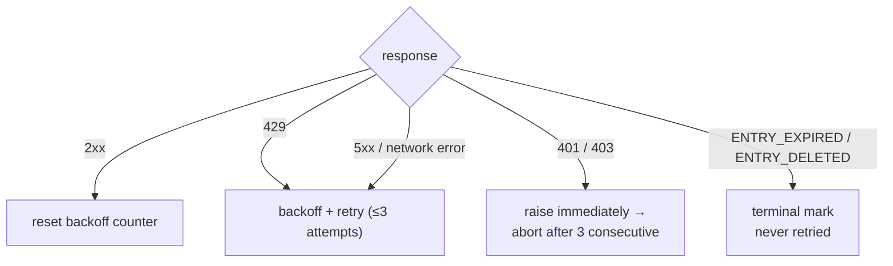

<a id="rate-limiting" data-pplx-source-anchor="true"></a>
# Limitation de débit

Chaque nombre dans la politique de cadencement sert un seul objectif : le trafic d'archivage doit ressembler à une navigation ordinaire. Une exportation mono-thread coûte 1 à 2 requêtes — environ une page vue — et les exécutions par lots répartissent ces requêtes sur des intervalles aléatoires sans concurrence. Il s'agit d'une exigence explicite anti-risque (`pplx_export/core/throttle.py:1-2`), et non d'un paramètre de performance réglable.

<a id="the-numbers" data-pplx-source-anchor="true"></a>
## Les chiffres

| où | cadencement | code |
|---|---|---|
| `batch` : entre les threads | uniforme aléatoire 10–20 s (`--delay-min` / `--delay-max`) | `pplx_export/cli.py:126-129`, `pplx_export/core/throttle.py:33-36` |
| `sync-deleted --online` : entre les candidats | uniforme aléatoire 10–20 s | `pplx_export/cli.py:164-167`, `pplx_export/commands/sync_deleted_cmd.py:368-369` |
| `search-mode-backfill` : repli en ligne | uniforme aléatoire 10–20 s | `pplx_export/cli.py:144-147` |
| pagination dans un thread / liste d'espaces | ≥3 s entre les pages | `pplx_export/sites/perplexity/rest.py:39,56`, `pplx_export/sites/perplexity/adapter.py:285-309` |
| récupération de blocs schématisés (computer / deep-research / council / study) | ≥4 s d'attente avant la deuxième récupération | `pplx_export/sites/perplexity/adapter.py:27-32,88` |
| `spaces --fetch-meta` | 3 s par espace | `pplx_export/commands/spaces_cmd.py:328` |
| `usage-backfill` | 3 s par thread | `pplx_export/commands/usage_backfill_cmd.py:77` |
| `assets-backfill` phases en ligne | 3 s par thread | `pplx_export/commands/assets_backfill_cmd.py:215,456` |
| téléchargements de ressources dans un thread | 0,5 s | `pplx_export/sites/perplexity/assets.py:28,103` |
| `assets-backfill` phase CDN | 6 téléchargements parallèles, sans délai | `pplx_export/commands/assets_backfill_cmd.py:460-475` |
| concurrence API | aucune — jamais | — |

<a id="why-these-numbers" data-pplx-source-anchor="true"></a>
## Pourquoi ces chiffres

- **Exportation unique = 1–2 requêtes ≈ une page vue.** Un thread de recherche coûte une `GET /rest/thread/<uuid>` ; computer / deep-research / council / study ajoutent exactement une récupération de blocs schématisés (`pplx_export/sites/perplexity/adapter.py:87-89`). Cela correspond à peu près à ce qu'un navigateur fait lorsque vous ouvrez la page une fois — l'archive n'ajoute aucune charge significative au-dessus de l'utilisation normale.
- **Intervalle aléatoire de 10–20 s, sans concurrence.** Rythme de lecture humaine, et la randomisation évite un timing parfait de métronome. Les requêtes séquentielles maintiennent le débit en dessous de ce que la navigation ordinaire produit déjà.
- **≥3 s pour les changements de page.** La pagination dans un long thread imite le défilement et le temps de lecture.
- **≥4 s avant la récupération des blocs.** La re-récupération schématisée frapperait sinon l'API dos à dos avec la récupération simple ; la pause imite le délai avant qu'une page lourde ne charge sa charge utile complète.
- **0,5 s pour les téléchargements de ressources.** Petits fichiers statiques, bien moins coûteux que les appels API — mais tout de même cadencés.
- **La phase CDN est la seule relaxation.** Les téléchargements par URL signée frappent le réseau de diffusion de contenu, pas l'API Perplexity, donc 6 connexions parallèles y sont acceptables et uniquement là.

<a id="error-handling-and-backoff" data-pplx-source-anchor="true"></a>
## Gestion des erreurs et backoff

Toute la classification se fait dans `CookieTransport._request` (`pplx_export/core/http/cookie_transport.py:63-126`) ; chaque requête reçoit jusqu'à `max_retries=3` tentatives (`cookie_transport.py:48`).



| réponse | classification | gestion |
|---|---|---|
| 2xx | succès | réinitialisation du compteur de backoff (`cookie_transport.py:77`) — les comptes ne s'accumulent jamais entre les requêtes |
| 429 | limité en débit | backoff et nouvelle tentative (`cookie_transport.py:86-92`) |
| 500 / 502 / 503 / 504 | erreur serveur transitoire (504 est souvent un hoquet Cloudflare) | backoff et nouvelle tentative au moins une fois avant d'abandonner (`cookie_transport.py:99-107`) |
| erreur réseau | transitoire | backoff et nouvelle tentative (`cookie_transport.py:117-125`) |
| 401 / 403 | échec d'authentification | `AuthTransportError` levée immédiatement — pas de backoff (`cookie_transport.py:82-85`) |
| 400 + `ENTRY_EXPIRED` | purge de la plateforme | `EntryExpiredError` — terminal, jamais retenté (`cookie_transport.py:96-98`) |
| 400 + `ENTRY_DELETED` | suppression par l'utilisateur/distance | `EntryDeletedError` — terminal, jamais retenté (`cookie_transport.py:93-95`) |
| 404 / autres codes | erreur ordinaire | pas de nouvelle tentative au niveau transport ; **jamais** mappé à un état terminal (`cookie_transport.py:108-116`) |

**Formule de backoff** (`pplx_export/core/throttle.py:38-50`) :
`delay_max × 3^N`, où `N` est le nombre d'échecs consécutifs (exposant plafonné à 8), avec ±20 % de gigue contre la synchronisation, plafonné à 300 s. Il n'y a pas de sommeil inutile après la dernière tentative échouée, et `throttle.reset()` réinitialise le compteur au premier succès (`throttle.py:52`).

Pourquoi chaque règle existe :

- **Backoff 429** — le serveur a explicitement demandé de ralentir ; respectez-le de manière exponentielle.
- **Nouvelle tentative 5xx** — un hoquet de passerelle unique ne doit pas faire échouer un thread.
- **401/403 sans backoff** — attendre ne peut pas guérir un cookie mort.
- **`ENTRY_EXPIRED` sans nouvelle tentative** — la purge de la plateforme (fenêtre ~3 mois) est permanente ; réessayer ne fait que brûler des requêtes et du budget de backoff.
- **404 jamais terminal** — un thread créé par `pplx-ask` peut être 404 de manière transitoire juste après sa création (délai de propagation) ; une marque terminale enterrerait un thread vivant qui est seulement brièvement invisible.

<a id="runtime-budget-for-callers" data-pplx-source-anchor="true"></a>
## Budget d'exécution pour les appelants

La discipline de backoff ci-dessus échange du temps d'horloge contre la sécurité du compte, et les appelants doivent budgétiser ce temps : une seule requête fait jusqu'à 3 tentatives avec un sommeil de backoff entre elles — jusqu'à 300 s chacune (`pplx_export/core/throttle.py:38-50`) — donc pendant que le réseau fluctue, une requête peut légitimement occuper de l'ordre de 10 minutes. `index` / `batch` commencent également par une sonde de session qui suit les mêmes règles (`pplx_export/commands/common.py:126`). Un long silence signifie qu'une attente de backoff est en cours, pas un blocage.

Trois règles pour les agents, les tâches cron et les wrappers CI :

1. **Un compte par invocation.** Exécutez les comptes en série comme des processus séparés ; ne les enchaînez jamais avec `&&` à l'intérieur d'une tâche externe qui impose un délai d'attente strict — la cascade de backoff du premier compte consomme tout le budget et le compte enchaîné ne s'exécute jamais.
2. **Budget ≥ 15 minutes, ou détachez.** Donnez aux wrappers un délai d'attente généreux, ou exécutez en arrière-plan et surveillez le journal (`-v` / `--log-file`) pour distinguer les attentes de backoff des vrais blocages.
3. **Interrompre est toujours sûr.** L'état est écrit de manière atomique ; une ré-exécution est idempotente et répare toute lacune laissée par l'interruption (sémantique d'arrêt précoce et de reprise : [Synchronisation incrémentielle](incremental-sync.md)).

<a id="auth-fail-fast" data-pplx-source-anchor="true"></a>
## Échec rapide d'authentification

La couche batch compte les échecs d'authentification consécutifs (`_AUTH_FAIL_FAST = 3`, `pplx_export/commands/batch_cmd.py:43`). Toute réponse qui a atteint le serveur — y compris `ENTRY_DELETED` / `ENTRY_EXPIRED` — prouve que le cookie fonctionne et réinitialise le compteur (`batch_cmd.py:170-182`). Trois 401/403 consécutifs et l'exécution sauvegarde son fichier d'état, puis abandonne (`batch_cmd.py:190-194`) : tourner avec un cookie mort ferait échouer des centaines de threads chacun une fois — des heures perdues. `sync-deleted` applique la même discipline (`pplx_export/commands/sync_deleted_cmd.py:111,333-337`). La solution est de rafraîchir le cookie et de ré-exécuter ; tout ce qui est déjà exporté est ignoré.

`batch` et le transport partagent une seule instance `Throttle` (`pplx_export/cli.py:280-282`, `batch_cmd.py:101-105`), donc le comptage de backoff ne se divise jamais entre les couches — et l'instance partagée survit au changement automatique de compte.

<a id="scheduling-periodic-sync" data-pplx-source-anchor="true"></a>
## Planification de la synchronisation périodique

`pplx-export schedule` calcule le plan incrémentiel actuel (comptages nouveaux/mis à jour) et écrit un extrait cron dans `<out>/index/cron_snippet.txt` (`pplx_export/commands/misc_cmd.py:86-96`, `pplx_export/hooks/scheduler.py:48-77`) :

```bash
pplx-export schedule --account alice
```

```cron
17 3 * * * cd '<out-parent>' && '/abs/path/to/pplx-export' batch --account 'alice' --out '<out>'
```

- Les exécutions périodiques sont **incrémentielles uniquement** (arrêt précoce) — pas de re-récupération complète (`scheduler.py:4-9`).
- L'extrait utilise des chemins absolus entre guillemets car le répertoire de travail de cron et `PATH` sont imprévisibles (`scheduler.py:63-75`).
- Installez-le avec `crontab -e` et ajustez l'heure selon vos goûts ; décalez plusieurs comptes vers différents créneaux.
- Filet de sécurité optionnel : ajoutez une analyse manuelle hebdomadaire ou mensuelle avec `pplx-export batch --account alice --full` (voir [incremental-sync.md](incremental-sync.md)).

<a id="see-also" data-pplx-source-anchor="true"></a>
## Voir aussi

- [incremental-sync.md](incremental-sync.md) — ce que chaque exécution planifiée exporte réellement
- [pplx-export.md](pplx-export.md) — `--delay-min` / `--delay-max` et les autres options de commande
- [troubleshooting.md](troubleshooting.md) — que faire après un abandon par échec rapide d'authentification
- [../architecture/rate-limiting-errors.md](../architecture/rate-limiting-errors.md) — la taxonomie complète des erreurs
- [../reference/api/api-responses-errors.md](../reference/api/api-responses-errors.md) — sémantique des erreurs côté plateforme (`ENTRY_EXPIRED`, `ENTRY_DELETED`, Cloudflare)
- [../reference/api/api-authentication.md](../reference/api/api-authentication.md) — cookies et changement de compte multiple
