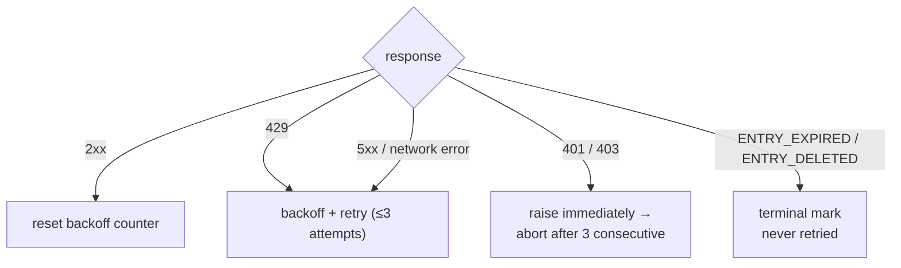

<a id="rate-limiting" data-pplx-source-anchor="true"></a>
# Limitazione della frequenza

Ogni numero nella politica di pacing serve un unico obiettivo: il traffico di archivio deve apparire come una normale navigazione. Un'esportazione a thread singolo costa 1–2 richieste — all'incirca una visualizzazione di pagina — e le esecuzioni batch distribuiscono tali richieste su intervalli randomizzati senza concorrenza. Questo è un requisito esplicito anti-controllo del rischio (`pplx_export/core/throttle.py:1-2`), non una manopola di prestazioni regolabile.

<a id="the-numbers" data-pplx-source-anchor="true"></a>
## I numeri

| dove | pacing | codice |
|---|---|---|
| `batch`: tra thread | uniforme casuale 10–20 s (`--delay-min` / `--delay-max`) | `pplx_export/cli.py:126-129`, `pplx_export/core/throttle.py:33-36` |
| `sync-deleted --online`: tra candidati | uniforme casuale 10–20 s | `pplx_export/cli.py:164-167`, `pplx_export/commands/sync_deleted_cmd.py:368-369` |
| `search-mode-backfill`: fallback online | uniforme casuale 10–20 s | `pplx_export/cli.py:144-147` |
| paginazione all'interno di un thread / elenco spazi | ≥3 s tra pagine | `pplx_export/sites/perplexity/rest.py:39,56`, `pplx_export/sites/perplexity/adapter.py:285-309` |
| backfill di blocchi schematizzati (computer / deep-research / council / study) | ≥4 s di attesa prima del secondo recupero | `pplx_export/sites/perplexity/adapter.py:27-32,88` |
| `spaces --fetch-meta` | 3 s per spazio | `pplx_export/commands/spaces_cmd.py:328` |
| `usage-backfill` | 3 s per thread | `pplx_export/commands/usage_backfill_cmd.py:77` |
| `assets-backfill` fasi online | 3 s per thread | `pplx_export/commands/assets_backfill_cmd.py:215,456` |
| download di asset all'interno di un thread | 0,5 s | `pplx_export/sites/perplexity/assets.py:28,103` |
| `assets-backfill` fase CDN | 6 download paralleli, nessun ritardo | `pplx_export/commands/assets_backfill_cmd.py:460-475` |
| concorrenza API | nessuna — mai | — |

<a id="why-these-numbers" data-pplx-source-anchor="true"></a>
## Perché questi numeri

- **Esportazione singola = 1–2 richieste ≈ una visualizzazione di pagina.** Un thread di ricerca costa una `GET /rest/thread/<uuid>`; computer / deep-research / council / study aggiungono esattamente un recupero di blocchi schematizzati (`pplx_export/sites/perplexity/adapter.py:87-89`). Questo è più o meno ciò che un browser fa quando apri la pagina una volta — l'archivio non aggiunge carico significativo oltre all'uso normale.
- **Intervallo casuale 10–20 s, nessuna concorrenza.** Ritmo di lettura umano e la randomizzazione evita una tempistica perfetta a metronomo. Le richieste seriali mantengono la frequenza al di sotto di ciò che la navigazione ordinaria già produce.
- **≥3 s per cambio pagina.** La paginazione all'interno di un thread lungo imita lo scorrimento e il tempo di lettura.
- **≥4 s prima del recupero dei blocchi.** Il recupero schematizzato altrimenti colpirebbe l'API consecutivamente con il recupero semplice; la pausa imita il ritardo prima che una pagina pesante carichi il suo carico completo.
- **0,5 s per download di asset.** Piccoli file statici, molto più economici delle chiamate API — ma comunque ritmati.
- **La fase CDN è l'unica deroga.** I download con URL firmato colpiscono la rete di distribuzione dei contenuti, non l'API Perplexity, quindi 6 connessioni parallele sono accettabili lì e solo lì.

<a id="error-handling-and-backoff" data-pplx-source-anchor="true"></a>
## Gestione degli errori e backoff

Tutta la classificazione avviene in `CookieTransport._request` (`pplx_export/core/http/cookie_transport.py:63-126`); ogni richiesta ottiene fino a `max_retries=3` tentativi (`cookie_transport.py:48`).



| risposta | classificazione | gestione |
|---|---|---|
| 2xx | successo | contatore di backoff resettato (`cookie_transport.py:77`) — i conteggi non si accumulano mai tra richieste |
| 429 | limitato dalla frequenza | backoff e riprova (`cookie_transport.py:86-92`) |
| 500 / 502 / 503 / 504 | errore server transitorio (504 è comunemente un blip di Cloudflare) | backoff e riprova almeno una volta prima di arrendersi (`cookie_transport.py:99-107`) |
| errore di rete | transitorio | backoff e riprova (`cookie_transport.py:117-125`) |
| 401 / 403 | errore di autenticazione | `AuthTransportError` sollevato immediatamente — nessun backoff (`cookie_transport.py:82-85`) |
| 400 + `ENTRY_EXPIRED` | eliminazione piattaforma | `EntryExpiredError` — terminale, mai riprovato (`cookie_transport.py:96-98`) |
| 400 + `ENTRY_DELETED` | eliminazione utente/remota | `EntryDeletedError` — terminale, mai riprovato (`cookie_transport.py:93-95`) |
| 404 / altri codici | errore ordinario | nessun tentativo a livello di trasporto; **mai** mappato a uno stato terminale (`cookie_transport.py:108-116`) |

**Formula di backoff** (`pplx_export/core/throttle.py:38-50`):
`delay_max × 3^N`, dove `N` è il conteggio di fallimenti consecutivi (esponente bloccato a 8), con jitter ±20% contro la sincronizzazione, limitato a 300 s. Non c'è sleep inutile dopo l'ultimo tentativo fallito e `throttle.reset()` azzera il contatore al primo successo (`throttle.py:52`).

Perché ogni regola esiste:

- **Backoff 429** — il server ha esplicitamente chiesto di rallentare; onoralo esponenzialmente.
- **Riprova 5xx** — un singolo blip del gateway non deve far fallire un thread.
- **401/403 senza backoff** — l'attesa non può guarire un cookie morto.
- **`ENTRY_EXPIRED` senza riprova** — l'eliminazione della piattaforma (finestra di ~3 mesi) è permanente; riprovare brucia solo richieste e budget di backoff.
- **404 mai terminale** — un thread creato da `pplx-ask` può dare 404 transitoriamente subito dopo la creazione (ritardo di propagazione); un marchio terminale seppellirebbe un thread vivo che è solo brevemente invisibile.

## Auth fail-fast

Il livello batch conta i fallimenti di autenticazione consecutivi (`_AUTH_FAIL_FAST = 3`, `pplx_export/commands/batch_cmd.py:43`). Qualsiasi risposta che ha raggiunto il server — incluso `ENTRY_DELETED` / `ENTRY_EXPIRED` — prova che il cookie funziona e azzera il contatore (`batch_cmd.py:170-182`). Tre 401/403 consecutivi e l'esecuzione salva il suo file di stato, poi si interrompe (`batch_cmd.py:190-194`): continuare con un cookie morto farebbe fallire centinaia di thread ciascuno una volta — ore sprecate. `sync-deleted` applica la stessa disciplina (`pplx_export/commands/sync_deleted_cmd.py:111,333-337`). La soluzione è aggiornare il cookie e rieseguire; tutto ciò che è già stato esportato viene saltato.

`batch` e il trasporto condividono una singola istanza `Throttle` (`pplx_export/cli.py:280-282`, `batch_cmd.py:101-105`), quindi il conteggio del backoff non si divide mai tra i livelli — e l'istanza condivisa sopravvive al cambio automatico dell'account.

<a id="scheduling-periodic-sync" data-pplx-source-anchor="true"></a>
## Pianificazione della sincronizzazione periodica

`pplx-export schedule` calcola il piano incrementale corrente (conteggi nuovi/aggiornati) e scrive un frammento cron in `<out>/index/cron_snippet.txt` (`pplx_export/commands/misc_cmd.py:86-96`, `pplx_export/hooks/scheduler.py:48-77`):

```bash
pplx-export schedule --account alice
```

```cron
17 3 * * * cd '<out-parent>' && '/abs/path/to/pplx-export' batch --account 'alice' --out '<out>'
```

- Le esecuzioni periodiche sono **solo incrementali** (arresto anticipato) — nessun recupero completo (`scheduler.py:4-9`).
- Il frammento usa percorsi assoluti tra virgolette perché la directory di lavoro di cron e `PATH` sono imprevedibili (`scheduler.py:63-75`).
- Installalo con `crontab -e` e regola l'ora a piacere; scagliona più account in slot diversi.
- Rete di sicurezza opzionale: aggiungi una scansione manuale settimanale o mensile con `pplx-export batch --account alice --full` (vedi [incremental-sync.md](incremental-sync.md)).

<a id="see-also" data-pplx-source-anchor="true"></a>
## Vedi anche

- [incremental-sync.md](incremental-sync.md) — cosa esporta effettivamente ogni esecuzione pianificata
- [pplx-export.md](pplx-export.md) — `--delay-min` / `--delay-max` e le altre opzioni del comando
- [troubleshooting.md](troubleshooting.md) — cosa fare dopo un'interruzione per auth fail-fast
- [../architecture/rate-limiting-errors.md](../architecture/rate-limiting-errors.md) — la tassonomia completa degli errori
- [../reference/api/api-responses-errors.md](../reference/api/api-responses-errors.md) — semantica degli errori lato piattaforma (`ENTRY_EXPIRED`, `ENTRY_DELETED`, Cloudflare)
- [../reference/api/api-authentication.md](../reference/api/api-authentication.md) — cookie e cambio multi-account
