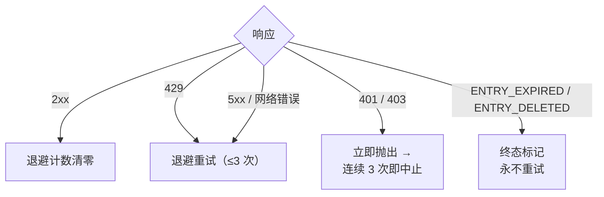

<a id="限频" data-pplx-source-anchor="true"></a>
# レート制限

レート制限戦略のすべての数値は、アーカイブトラフィックを通常のブラウジングに見せるという単一の目標に貢献しています。
シングルスレッドエクスポートはわずか1～2リクエスト（ページビュー1回分に相当）であり、バッチ実行ではこれらのリクエストをランダムな間隔で分散し、同時実行は行いません。これは明確に要求されたアンチボット対策の規律（`pplx_export/core/throttle.py:1-2`）であり、調整可能なパフォーマンスパラメータではありません。

<a id="具体数字" data-pplx-source-anchor="true"></a>
## 具体的な数値

| 場所 | ペース | コード |
|---|---|---|
| `batch`：スレッド間 | 10～20秒のランダムな一様間隔（`--delay-min` / `--delay-max`） | `pplx_export/cli.py:126-129`、`pplx_export/core/throttle.py:33-36` |
| `sync-deleted --online`：候補間 | 10～20秒のランダムな一様間隔 | `pplx_export/cli.py:164-167`、`pplx_export/commands/sync_deleted_cmd.py:368-369` |
| `search-mode-backfill`：ネットワークフォールバック | 10～20秒のランダムな一様間隔 | `pplx_export/cli.py:144-147` |
| スレッド内ページ送り / スペースリストページ送り | ページあたり3秒以上 | `pplx_export/sites/perplexity/rest.py:39,56`、`pplx_export/sites/perplexity/adapter.py:285-309` |
| スキーマ化ブロックの再取得（computer / deep-research / council / study） | 2回目の取得前に4秒以上待機 | `pplx_export/sites/perplexity/adapter.py:27-32,88` |
| `spaces --fetch-meta` | スペースあたり3秒 | `pplx_export/commands/spaces_cmd.py:328` |
| `usage-backfill` | スレッドあたり3秒 | `pplx_export/commands/usage_backfill_cmd.py:77` |
| `assets-backfill` オンライン段階 | スレッドあたり3秒 | `pplx_export/commands/assets_backfill_cmd.py:215,456` |
| スレッド内アセットダウンロード | 0.5秒 | `pplx_export/sites/perplexity/assets.py:28,103` |
| `assets-backfill` CDN段階 | 6並列ダウンロード、間隔なし | `pplx_export/commands/assets_backfill_cmd.py:460-475` |
| API同時実行 | なし – 常に同時実行なし | — |

<a id="为什么是这个数" data-pplx-source-anchor="true"></a>
## なぜこの数値なのか

- **1回のエクスポート = 1～2リクエスト ≈ 1回のページビュー。** searchスレッドは1回の`GET /rest/thread/<uuid>`のみ必要；computer / deep-research / council / studyはさらに1回のスキーマ化ブロック取得（`pplx_export/sites/perplexity/adapter.py:87-89`）を追加するだけです。これはブラウザが1回ページを開くのと同程度のオーバーヘッドであり、アーカイブは日常的な使用に有意義な負荷を追加しません。
- **10～20秒のランダム間隔、同時実行なし。** 人間の読むペースに近く、ランダム化によりメトロノームのような規則的なリクエストを回避；直列化によりリクエストレートは通常のブラウジング自体よりも低くなります。
- **ページ送り3秒以上。** 長いスレッド内のページ送りはスクロールと読む時間をシミュレートします。
- **ブロック再取得前に4秒以上。** そうしないとスキーマ化再取得がプレーン取得と背中合わせにAPIにヒットします；この一時停止は重いページ読み込みの完全な負荷前の遅延をシミュレートします。
- **アセットダウンロード0.5秒。** 静的な小さなファイルで、API呼び出しよりもはるかに低いオーバーヘッドですが、それでもペースがあります。
- **CDN段階は唯一の緩和。** 署名付きURLダウンロードはPerplexity APIではなくコンテンツ配信ネットワークにヒットするため、ここでのみ6並列が許可されます。

<a id="错误处理与退避" data-pplx-source-anchor="true"></a>
## エラー処理とバックオフ

すべての分類は`CookieTransport._request`（`pplx_export/core/http/cookie_transport.py:63-126`）で行われます；各リクエストは最大`max_retries=3`回試行されます（`cookie_transport.py:48`）。



| レスポンス | 分類 | 処理 |
|---|---|---|
| 2xx | 成功 | バックオフカウンタをリセット（`cookie_transport.py:77`） – カウンタはリクエスト間で累積されない |
| 429 | レート制限 | バックオフして再試行（`cookie_transport.py:86-92`） |
| 500 / 502 / 503 / 504 | サーバー一時エラー（504はCloudflareの揺れが多い） | 少なくとも1回バックオフして再試行してから放棄（`cookie_transport.py:99-107`） |
| ネットワークエラー | 一時的 | バックオフして再試行（`cookie_transport.py:117-125`） |
| 401 / 403 | 認証失敗 | 即座に`AuthTransportError`をスロー – バックオフしない（`cookie_transport.py:82-85`） |
| 400 + `ENTRY_EXPIRED` | プラットフォーム削除 | `EntryExpiredError` – 最終状態、決して再試行しない（`cookie_transport.py:96-98`） |
| 400 + `ENTRY_DELETED` | ユーザー/リモート削除 | `EntryDeletedError` – 最終状態、決して再試行しない（`cookie_transport.py:93-95`） |
| 404 / その他のステータスコード | 通常エラー | トランスポート層は再試行しない；**決して**最終状態にマッピングしない（`cookie_transport.py:108-116`） |

**バックオフ式**（`pplx_export/core/throttle.py:38-50`）：
`delay_max × 3^N`、`N`は連続失敗回数（指数関数的に8にクランプ）、±20%のジッターで同期防止、上限300秒。最後の失敗では余分にスリープしない；最初の成功で`throttle.reset()`がリセットされる（`throttle.py:52`）。

各ルールの理由：

- **429バックオフ** – サーバーが明示的に減速を要求しているため、指数関数的に従う。
- **5xx再試行** – 1回のゲートウェイの揺れでスレッドが失敗するべきではない。
- **401/403はバックオフしない** – cookieが無効な場合、待っても自己回復しない。
- **`ENTRY_EXPIRED`は再試行しない** – プラットフォーム削除（約3か月ウィンドウ）は永続的であり、再試行はリクエストとバックオフ予算を無駄にするだけ。
- **404は決して最終状態にしない** – `pplx-ask`で新しく作成されたスレッドは伝搬遅延により一時的に404になる可能性がある；最終状態にすると、一時的に見えないだけで生きているスレッドを誤って葬ることになる。

<a id="调用方运行时预算" data-pplx-source-anchor="true"></a>
## 呼び出し側の実行時予算

上記のバックオフ規律はクロック時間をアカウントの安全性と引き換えにしており、呼び出し側はこの時間の予算を確保する必要があります：単一リクエストは最大3回の試行、試行間のバックオフ待機 – 単一の上限は300秒（`pplx_export/core/throttle.py:38-50`） – ネットワークの問題が発生した場合、1つのリクエストが合理的に10分程度かかる可能性があります。`index` / `batch`の開始時にはセッション検出もあり、これも同じルール（`pplx_export/commands/common.py:126`）に従います。長時間の沈黙はバックオフ待機中であり、ハングアップではありません。

エージェント、cron、CIラッパー層向けの3つのルール：

1. **1回の呼び出しで1つのアカウントのみ実行。** 複数アカウントは順次、それぞれ別のプロセスで実行；`&&`をハードタイムアウト付きの外部タスクに連鎖させない – 最初のアカウントのバックオフカスケードが予算全体を消費し、後続のアカウントが実行する機会を失う。
2. **タイムアウト予算は15分以上、さもなくばフォアグラウンドから切り離す。** ラッパー層に十分なタイムアウトを設定するか、バックグラウンド実行＋ログ監視（`-v` / `--log-file`）でバックオフ待機と真のハングアップを区別する。
3. **いつ中断しても安全。** 状態はアトミックに保存；再実行は冪等で、中断によるギャップは自動修復される（早期停止/再開セマンティクスについては[インクリメンタル同期](incremental-sync.md)を参照）。

<a id="鉴权-fail-fast" data-pplx-source-anchor="true"></a>
## 認証のフェイルファスト

バッチ層は連続認証失敗をカウントする（`_AUTH_FAIL_FAST = 3`、`pplx_export/commands/batch_cmd.py:43`）。サーバーに到達した成功レスポンス – `ENTRY_DELETED` / `ENTRY_EXPIRED`を含む – はcookieが有効であることを証明し、カウンタをリセットする（`batch_cmd.py:170-182`）。連続3回の401/403：状態ファイルを保存した後、実行を中止する（`batch_cmd.py:190-194`） – cookieが無効なのに空回りを続けると、数百のスレッドがそれぞれ失敗し、数時間を無駄にする。`sync-deleted`も同じ規律に従う（`pplx_export/commands/sync_deleted_cmd.py:111,333-337`）。対処法：cookieを更新して再実行すると、既にエクスポートされた部分はすべてスキップされる。

`batch`はトランスポート層と同じ`Throttle`インスタンスを共有し（`pplx_export/cli.py:280-282`、`batch_cmd.py:101-105`）、バックオフカウンタは層間で分割されない – そしてこの共有インスタンスはアカウントの自動切り替え後も保持される。

<a id="定时同步" data-pplx-source-anchor="true"></a>
## 定期同期

`pplx-export schedule`は現在の差分計画（新規/更新数）を計算し、cronスニペットを`<out>/index/cron_snippet.txt`に書き込む（`pplx_export/commands/misc_cmd.py:86-96`、`pplx_export/hooks/scheduler.py:48-77`）：

```bash
pplx-export schedule --account alice
```

```cron
17 3 * * * cd '<out-parent>' && '/abs/path/to/pplx-export' batch --account 'alice' --out '<out>'
```

- 定期実行は**差分のみ実行**（早期停止） – 全量再取得は行わない（`scheduler.py:4-9`）。
- スニペットは引用符で囲まれた絶対パスを使用する。cronの作業ディレクトリは`PATH`と予測できないため（`scheduler.py:63-75`）。
- `crontab -e`でインストール後、必要に応じて時間を調整；複数アカウントは時間帯をずらす。
- オプションのフォールバック：週次または月次で手動で`pplx-export batch --account alice --full`を1回実行（[incremental-sync.md](incremental-sync.md)を参照）。

<a id="另见" data-pplx-source-anchor="true"></a>
## 関連項目

- [incremental-sync.md](incremental-sync.md) – 各定期実行で実際に何がエクスポートされるか
- [pplx-export.md](pplx-export.md) – `--delay-min` / `--delay-max` およびその他のコマンドオプション
- [troubleshooting.md](troubleshooting.md) – 認証フェイルファスト中止後の対処法
- [../architecture/rate-limiting-errors.md](../architecture/rate-limiting-errors.md) – 完全なエラー分類
- [../reference/api/api-responses-errors.md](../reference/api/api-responses-errors.md) – プラットフォーム側のエラーセマンティクス（`ENTRY_EXPIRED`、`ENTRY_DELETED`、Cloudflare）
- [../reference/api/api-authentication.md](../reference/api/api-authentication.md) – cookieと複数アカウント切り替え
