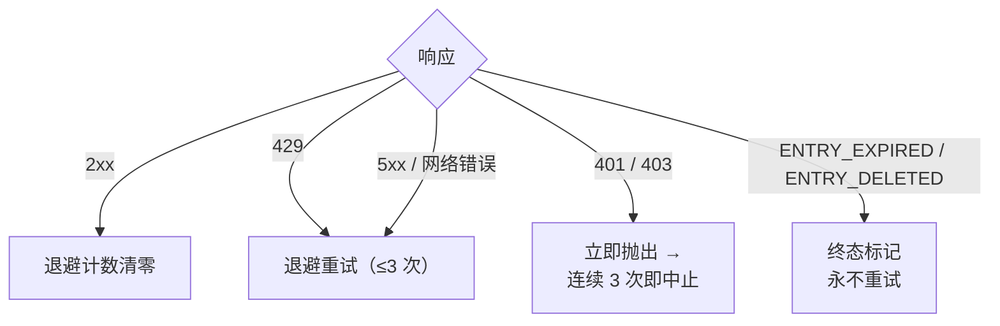

<a id="限频" data-pplx-source-anchor="true"></a>
# レート制限

レート制限戦略のすべての数値は、アーカイブトラフィックを通常のブラウジングのように見せるという単一の目標に貢献しています。
シングルスレッドエクスポートはわずか1～2リクエスト（約1ページビュー相当）であり、バッチ実行ではこれらのリクエストをランダムな間隔で分散し、同時実行は行いません。これは明示的に要求されたアンチボット規律（`pplx_export/core/throttle.py:1-2`）であり、調整可能なパフォーマンスパラメータではありません。

<a id="具体数字" data-pplx-source-anchor="true"></a>
## 具体的な数値

| 場所 | ペース | コード |
|---|---|---|
| `batch`：スレッド間 | 10～20秒のランダム均一間隔（`--delay-min` / `--delay-max`） | `pplx_export/cli.py:126-129`、`pplx_export/core/throttle.py:33-36` |
| `sync-deleted --online`：候補間 | 10～20秒のランダム均一間隔 | `pplx_export/cli.py:164-167`、`pplx_export/commands/sync_deleted_cmd.py:368-369` |
| `search-mode-backfill`：ネットワークフォールバック | 10～20秒のランダム均一間隔 | `pplx_export/cli.py:144-147` |
| スレッド内ページ送り / スペースリストページ送り | ページあたり3秒以上 | `pplx_export/sites/perplexity/rest.py:39,56`、`pplx_export/sites/perplexity/adapter.py:285-309` |
| スキーマ化ブロックの再取得（computer / deep-research / council / study） | 2回目の取得前に4秒以上待機 | `pplx_export/sites/perplexity/adapter.py:27-32,88` |
| `spaces --fetch-meta` | スペースあたり3秒 | `pplx_export/commands/spaces_cmd.py:328` |
| `usage-backfill` | スレッドあたり3秒 | `pplx_export/commands/usage_backfill_cmd.py:77` |
| `assets-backfill` オンライン段階 | スレッドあたり3秒 | `pplx_export/commands/assets_backfill_cmd.py:215,456` |
| スレッド内アセットダウンロード | 0.5秒 | `pplx_export/sites/perplexity/assets.py:28,103` |
| `assets-backfill` CDN段階 | 6並列ダウンロード、間隔なし | `pplx_export/commands/assets_backfill_cmd.py:460-475` |
| API同時実行 | なし – 常に同時実行なし | — |

<a id="为什么是这个数" data-pplx-source-anchor="true"></a>
## なぜこの数値なのか

- **単一エクスポート = 1～2リクエスト ≈ 1ページビュー。** searchスレッドは1回の`GET /rest/thread/<uuid>`のみ必要；computer / deep-research / council / studyはさらに1回のスキーマ化ブロック取得（`pplx_export/sites/perplexity/adapter.py:87-89`）を追加するだけです。これはブラウザで1ページ開くのと同程度の負荷であり、アーカイブは日常的な使用に有意な負荷を追加しません。
- **10～20秒のランダム間隔、同時実行なし。** 人間の読むペースに近く、ランダム化によりメトロノームのような規則的なリクエストを回避；直列化によりリクエストレートは通常のブラウジング自体よりも低くなります。
- **ページ送り3秒以上。** 長いスレッド内のページ送りはスクロールと読了時間をシミュレートします。
- **ブロック再取得前に4秒以上。** そうしないと、スキーマ化再取得がプレーン取得とバックツーバックでAPIにヒットします；この待機は、重いページ読み込みの完全な負荷がかかる前の遅延をシミュレートします。
- **アセットダウンロード0.5秒。** 静的で小さなファイルであり、API呼び出しよりもはるかに負荷が低いですが、それでもペースは守ります。
- **CDN段階のみ緩和。** 署名付きURLダウンロードはPerplexity APIではなくコンテンツ配信ネットワークにヒットするため、ここでのみ6並列を許可します。

<a id="错误处理与退避" data-pplx-source-anchor="true"></a>
## エラー処理とバックオフ

すべての分類は`CookieTransport._request`（`pplx_export/core/http/cookie_transport.py:63-126`）で行われます；各リクエストは最大`max_retries=3`回試行されます（`cookie_transport.py:48`）。



| レスポンス | 分類 | 処理 |
|---|---|---|
| 2xx | 成功 | バックオフカウンタをリセット（`cookie_transport.py:77`） – カウンタはリクエスト間で累積されません |
| 429 | レート制限 | バックオフして再試行（`cookie_transport.py:86-92`） |
| 500 / 502 / 503 / 504 | サーバー一時エラー（504はCloudflareの揺れが多い） | 少なくとも1回バックオフして再試行してから諦める（`cookie_transport.py:99-107`） |
| ネットワークエラー | 一時的 | バックオフして再試行（`cookie_transport.py:117-125`） |
| 401 / 403 | 認証失敗 | 即座に`AuthTransportError`をスロー – バックオフしない（`cookie_transport.py:82-85`） |
| 400 + `ENTRY_EXPIRED` | プラットフォーム削除 | `EntryExpiredError` – 最終状態、決して再試行しない（`cookie_transport.py:96-98`） |
| 400 + `ENTRY_DELETED` | ユーザー/リモート削除 | `EntryDeletedError` – 最終状態、決して再試行しない（`cookie_transport.py:93-95`） |
| 404 / その他のステータスコード | 一般エラー | トランスポート層で再試行しない；**決して**最終状態にマッピングしない（`cookie_transport.py:108-116`） |

**バックオフ式**（`pplx_export/core/throttle.py:38-50`）：
`delay_max × 3^N`、`N`は連続失敗回数（指数関数的に8にクランプ）、±20%のジッターで同期防止、最大300秒。最後の失敗では無駄にスリープしない；最初の成功で`throttle.reset()`がリセットされる（`throttle.py:52`）。

**ハートビート（デフォルトレベルで表示可能）。** バックオフはもはや静かに待機しない：最初に開始行を出力し、その後`Throttle.heartbeat_interval`（デフォルト10秒）ごとにカウントダウンを出力し、分割スリープの合計は同じ総時間になる – したがってペースとアンチボット予算は変わらず、ただ可視化されるだけ（`pplx_export/core/throttle.py`、`Throttle._sleep_with_heartbeat`）。同じ考え方が他の2つの長時間待機をカバーする：各進行中のリクエストは応答前に詰まると「まだ応答を待っています」を出力（`CookieTransport._open_read`）、`pplx-ask`は深層研究/共同作業のサイレント期間中に「まだ応答ストリームを待っています」を出力（`ask_api.post_stream`）。これらは`-v`を必要としません。

各ルールの理由：

- **429バックオフ** – サーバーが明示的に減速を要求、指数関数的に従う。
- **5xx再試行** – 1回のゲートウェイの揺れでスレッドが失敗するべきではない。
- **401/403はバックオフしない** – Cookieが無効な場合、待機しても自己回復しない。
- **`ENTRY_EXPIRED`は再試行しない** – プラットフォーム削除（約3ヶ月ウィンドウ）は永続的であり、再試行はリクエストとバックオフ予算を無駄にするだけ。
- **404は決して最終状態にしない** – `pplx-ask`で新しく作成されたスレッドは伝搬遅延により一時的に404になる可能性がある；最終状態にすると、一時的に見えないだけで生きているスレッドを誤って葬ることになる。

<a id="调用方运行时预算" data-pplx-source-anchor="true"></a>
## 呼び出し側のランタイム予算

上記のバックオフ規律は、アカウントの安全性を確保するためにクロック時間を犠牲にしています。呼び出し側はこの時間の予算を確保する必要があります：単一リクエストは最大3回試行、試行間にバックオフ待機 – 1回あたり最大300秒（`pplx_export/core/throttle.py:38-50`） – ネットワークの問題が発生した場合、1リクエストが妥当に10分程度かかる可能性があります。`index` / `batch`の開始時にはセッションプローブもあり、これも同じルールに従います（`pplx_export/commands/common.py`、`make_transport`）；`--skip-auth-check`を渡すとプローブをスキップして即座に開始できます（[設定](configuration.md)を参照）。
長時間のサイレントは待機中であり、ハングではありません – そしてその待機は現在、デフォルトレベルのINFOハートビート（バックオフカウントダウン、進行中のリクエスト、SSEストリーム）によって可視化されています。

エージェント、cron、CIラッパー層向けの3つのルール：

1. **1回の呼び出しで1アカウントのみ実行。** 複数アカウントは逐次実行し、それぞれ別のプロセスで；`&&`をハードタイムアウト付きの外部タスクに連鎖させない – 最初のアカウントのバックオフカスケードが予算全体を消費し、後続のアカウントは実行できなくなる。
2. **タイムアウト予算は15分以上、さもなくばフォアグラウンドから切り離す。** ラッパー層に十分なタイムアウトを設定するか、バックグラウンド実行＋ハートビート監視（現在デフォルトレベルで利用可能；`-v` / `--log-file`に完全なトレースあり）でバックオフ待機と真のハングを区別する。
3. **いつ中断しても安全。** 状態はアトミックにディスクに書き込まれる；再実行は冪等であり、中断によって残されたギャップは自動的に修復される（早期停止/再開セマンティクスについては[インクリメンタル同期](incremental-sync.md)を参照）。

<a id="鉴权-fail-fast" data-pplx-source-anchor="true"></a>
## 認証のフェイルファスト

バッチ層は連続した認証失敗をカウントします（`_AUTH_FAIL_FAST = 3`、`pplx_export/commands/batch_cmd.py:43`）。サーバーに到達した任意のレスポンス – `ENTRY_DELETED` / `ENTRY_EXPIRED`を含む – はCookieが有効であることを証明し、カウンタをリセットします（`batch_cmd.py:170-182`）。連続3回の401/403：状態ファイルを保存した後、実行を中止します（`batch_cmd.py:190-194`） – Cookieが無効な状態で空回りを続けると、数百のスレッドがそれぞれ失敗し、数時間を無駄にします。`sync-deleted`も同じ規律に従います（`pplx_export/commands/sync_deleted_cmd.py:111,333-337`）。対処法：Cookieを更新して再実行すると、既にエクスポートされた部分はすべてスキップされます。

`batch`はトランスポート層と同じ`Throttle`インスタンスを共有します（`pplx_export/cli.py:280-282`、`batch_cmd.py:101-105`）。バックオフカウンタは層間で分割されません – そしてこの共有インスタンスはアカウントの自動切り替え後も保持されます。

<a id="定时同步" data-pplx-source-anchor="true"></a>
## 定期同期

`pplx-export schedule`は現在のインクリメンタル計画（新規/更新数）を計算し、cronフラグメントを`<out>/index/cron_snippet.txt`に書き込みます（`pplx_export/commands/misc_cmd.py:86-96`、`pplx_export/hooks/scheduler.py:48-77`）：

```bash
pplx-export schedule --account alice
```

```cron
17 3 * * * cd '<out-parent>' && '/abs/path/to/pplx-export' batch --account 'alice' --out '<out>'
```

- 定期実行は**インクリメンタルのみ**（早期停止） – フル再取得は行わない（`scheduler.py:4-9`）。
- フラグメントは引用符で囲まれた絶対パスを使用します。これはcronの作業ディレクトリが`PATH`と予測できないためです（`scheduler.py:63-75`）。
- `crontab -e`でインストールした後、必要に応じて時間を調整します；複数アカウントは時間をずらします。
- オプションのフォールバック：週次または月次で手動実行
  `pplx-export batch --account alice --full`（[incremental-sync.md](incremental-sync.md)を参照）。

<a id="另见" data-pplx-source-anchor="true"></a>
## 関連項目

- [incremental-sync.md](incremental-sync.md) – 各定期実行で実際に何がエクスポートされるか
- [pplx-export.md](pplx-export.md) – `--delay-min` / `--delay-max` およびその他のコマンドオプション
- [troubleshooting.md](troubleshooting.md) – 認証フェイルファスト中止後の対処法
- [../architecture/rate-limiting-errors.md](../architecture/rate-limiting-errors.md) – 完全なエラー分類
- [../reference/api/api-responses-errors.md](../reference/api/api-responses-errors.md) – プラットフォーム側のエラーセマンティクス（`ENTRY_EXPIRED`、`ENTRY_DELETED`、Cloudflare）
- [../reference/api/api-authentication.md](../reference/api/api-authentication.md) – Cookieと複数アカウント切り替え
