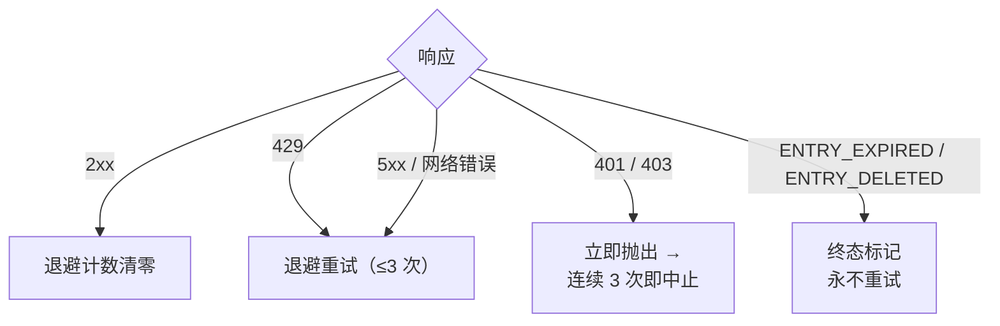

<a id="限频" data-pplx-source-anchor="true"></a>
# レート制限

レート制限戦略の各数値は、すべて同じ目標を達成するために設定されています。アーカイブトラフィックは通常のブラウジングに見える必要があります。
シングルスレッドエクスポートはわずか1～2リクエスト（約1ページビュー）であり、バッチ実行ではこれらのリクエストをランダムな間隔で分散し、同時実行は行いません。これは明確に要求されたアンチレート制限の規律です（`pplx_export/core/throttle.py:1-2`）。調整可能なパフォーマンスパラメータではありません。

<a id="具体数字" data-pplx-source-anchor="true"></a>
## 具体的な数値

| 位置 | ペース | コード |
|---|---|---|
| `batch`：スレッド間 | 10～20秒のランダムな均等間隔（`--delay-min` / `--delay-max`） | `pplx_export/cli.py:126-129`、`pplx_export/core/throttle.py:33-36` |
| `sync-deleted --online`：候補間 | 10～20秒のランダムな均等間隔 | `pplx_export/cli.py:164-167`、`pplx_export/commands/sync_deleted_cmd.py:368-369` |
| `search-mode-backfill`：ネットワークフォールバック | 10～20秒のランダムな均等間隔 | `pplx_export/cli.py:144-147` |
| スレッド内ページ送り / スペースリストページ送り | 各ページ ≥3秒 | `pplx_export/sites/perplexity/rest.py:39,56`、`pplx_export/sites/perplexity/adapter.py:285-309` |
| スキーマ化ブロックの補足取得（computer / deep-research / council / study） | 2回目の取得前に ≥4秒待機 | `pplx_export/sites/perplexity/adapter.py:27-32,88` |
| `spaces --fetch-meta` | スペースごとに3秒 | `pplx_export/commands/spaces_cmd.py:328` |
| `usage-backfill` | スレッドごとに3秒 | `pplx_export/commands/usage_backfill_cmd.py:77` |
| `assets-backfill` オンライン段階 | スレッドごとに3秒 | `pplx_export/commands/assets_backfill_cmd.py:215,456` |
| スレッド内アセットダウンロード | 0.5秒 | `pplx_export/sites/perplexity/assets.py:28,103` |
| `assets-backfill` CDN段階 | 6並列ダウンロード、間隔なし | `pplx_export/commands/assets_backfill_cmd.py:460-475` |
| API同時実行 | なし——常に | — |

<a id="为什么是这个数" data-pplx-source-anchor="true"></a>
## なぜこの数値なのか

- **1回のエクスポート = 1～2リクエスト ≈ 1ページビュー。** searchスレッドは1回の`GET /rest/thread/<uuid>`のみ必要；computer / deep-research / council / studyはスキーマ化ブロック取得が1回追加されるだけです（`pplx_export/sites/perplexity/adapter.py:87-89`）。これはブラウザで1回ページを開くのと同程度のオーバーヘッドであり、アーカイブが日常的な使用に有意義な負荷を追加することはありません。
- **10～20秒のランダム間隔、同時実行なし。** 人間の読むペースに近く、ランダム化によりメトロノームのような規則的なリクエストを回避；シリアル化によりリクエストレートは通常のブラウジング自体よりも低くなります。
- **ページ送り ≥3秒。** 長いスレッド内のページ送りはスクロールと読む時間をシミュレートします。
- **ブロック補足取得前に ≥4秒。** そうしないと、スキーマ化再取得がプレーン取得とバックツーバックでAPIにヒットします；この一時停止は、ページが完全な負荷を再読み込みする前の遅延をシミュレートします。
- **アセットダウンロード 0.5秒。** 静的で小さなファイルであり、API呼び出しよりもはるかにオーバーヘッドが小さいですが、それでもペースはあります。
- **CDN段階のみ緩和。** 署名付きURLダウンロードはPerplexity APIではなくコンテンツ配信ネットワークにヒットするため、ここでのみ6並列が許可されます。

<a id="错误处理与退避" data-pplx-source-anchor="true"></a>
## エラーハンドリングとバックオフ

すべての分類は`CookieTransport._request`（`pplx_export/core/http/cookie_transport.py:63-126`）で行われます；各リクエストは最大`max_retries=3`回試行されます（`cookie_transport.py:48`）。



| レスポンス | 分類 | 処理 |
|---|---|---|
| 2xx | 成功 | バックオフカウンタをリセット（`cookie_transport.py:77`）——カウンタはリクエスト間で累積されません |
| 429 | レート制限 | バックオフして再試行（`cookie_transport.py:86-92`） |
| 500 / 502 / 503 / 504 | サーバー一時的エラー（504はCloudflareの揺れであることが多い） | 少なくとも1回バックオフして再試行してから諦める（`cookie_transport.py:99-107`） |
| ネットワークエラー | 一時的 | バックオフして再試行（`cookie_transport.py:117-125`） |
| 401 / 403 | 認証失敗 | 即座に`AuthTransportError`をスロー——バックオフしない（`cookie_transport.py:82-85`） |
| 400 + `ENTRY_EXPIRED` | プラットフォーム削除 | `EntryExpiredError`——最終状態、決して再試行しない（`cookie_transport.py:96-98`） |
| 400 + `ENTRY_DELETED` | ユーザー/リモート削除 | `EntryDeletedError`——最終状態、決して再試行しない（`cookie_transport.py:93-95`） |
| 404 / その他のステータスコード | 通常のエラー | トランスポート層は再試行しない；**決して**最終状態にマッピングしない（`cookie_transport.py:108-116`） |

**バックオフ式**（`pplx_export/core/throttle.py:38-50`）：
`delay_max × 3^N`、`N`は連続失敗回数（指数関数的に8にクランプ）、±20%のジッターで同期を防止、上限300秒。最後の失敗ではスリープしません；最初の成功で`throttle.reset()`がリセットされます（`throttle.py:52`）。

各ルールの理由：

- **429バックオフ** —— サーバーが明示的に減速を要求しているため、指数関数的に従います。
- **5xx再試行** —— 1回のゲートウェイの揺れでスレッドが失敗するべきではありません。
- **401/403はバックオフしない** —— Cookieが無効になった場合、待っても回復しません。
- **`ENTRY_EXPIRED`は再試行しない** —— プラットフォーム削除（約3か月のウィンドウ）は永続的であり、再試行はリクエストとバックオフ予算を無駄にするだけです。
- **404は決して最終状態にしない** —— `pplx-ask`で新しく作成されたスレッドは伝搬遅延により一時的に404になる可能性があります；最終状態にすると、一時的に見えないだけで生きているスレッドを誤って葬ってしまいます。

<a id="鉴权-fail-fast" data-pplx-source-anchor="true"></a>
## 認証のフェイルファスト

バッチ層は連続認証失敗をカウントします（`_AUTH_FAIL_FAST = 3`、`pplx_export/commands/batch_cmd.py:43`）。サーバーに到達した成功レスポンス（`ENTRY_DELETED` / `ENTRY_EXPIRED`を含む）はCookieが有効であることを証明し、カウンタをリセットします（`batch_cmd.py:170-182`）。連続3回の401/403：状態ファイルを保存して実行を中止します（`batch_cmd.py:190-194`）——Cookieが無効な状態でアイドルを続けると、数百のスレッドがそれぞれ失敗し、数時間を無駄にします。`sync-deleted`も同じ規律に従います（`pplx_export/commands/sync_deleted_cmd.py:111,333-337`）。対処方法：Cookieを更新して再実行し、既にエクスポートされた部分はすべてスキップします。

`batch`はトランスポート層と同じ`Throttle`インスタンスを共有します（`pplx_export/cli.py:280-282`、`batch_cmd.py:101-105`）。バックオフカウンタは層間で分割されません——また、この共有インスタンスはアカウント自動切り替え後も保持されます。

<a id="定时同步" data-pplx-source-anchor="true"></a>
## 定期同期

`pplx-export schedule`は現在の差分計画（新規/更新数）を計算し、cronフラグメントを`<out>/index/cron_snippet.txt`に書き込みます（`pplx_export/commands/misc_cmd.py:86-96`、`pplx_export/hooks/scheduler.py:48-77`）：

```bash
pplx-export schedule --account alice
```

```cron
17 3 * * * cd '<out-parent>' && '/abs/path/to/pplx-export' batch --account 'alice' --out '<out>'
```

- 定期実行は**差分のみ**（早期停止）——全量再取得は行いません（`scheduler.py:4-9`）。
- フラグメントは引用符で囲まれた絶対パスを使用します。cronの作業ディレクトリと`PATH`は予測できないためです（`scheduler.py:63-75`）。
- `crontab -e`でインストール後、必要に応じて時間を調整します；複数アカウントは時間帯をずらします。
- オプションのフォールバック：週次または月次で手動で`pplx-export batch --account alice --full`を1回実行します（[incremental-sync.md](incremental-sync.md)を参照）。

<a id="另见" data-pplx-source-anchor="true"></a>
## 関連項目

- [incremental-sync.md](incremental-sync.md) —— 各定期実行で実際に何がエクスポートされるか
- [pplx-export.md](pplx-export.md) —— `--delay-min` / `--delay-max` およびその他のコマンドオプション
- [troubleshooting.md](troubleshooting.md) —— 認証フェイルファスト中止後の対処方法
- [../architecture/rate-limiting-errors.md](../architecture/rate-limiting-errors.md) —— 完全なエラー分類
- [../reference/api/api-responses-errors.md](../reference/api/api-responses-errors.md) —— プラットフォーム側のエラーセマンティクス（`ENTRY_EXPIRED`、`ENTRY_DELETED`、Cloudflare）
- [../reference/api/api-authentication.md](../reference/api/api-authentication.md) —— Cookieと複数アカウント切り替え
