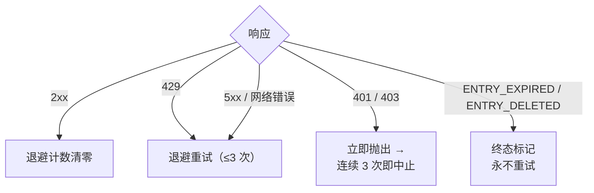

<a id="限频" data-pplx-source-anchor="true"></a>
# 속도 제한

속도 제한 정책의 모든 숫자는 하나의 목표를 위해 존재합니다: 아카이브 트래픽이 일반 브라우징처럼 보여야 한다는 것입니다.
단일 스레드 내보내기는 1–2회의 요청(약 한 번의 페이지 조회)에 불과하며, 배치 실행은 이러한 요청을
무작위 간격으로 분산시키고 동시성을 허용하지 않습니다. 이는 명시적으로 요구되는 안티-봇 규율입니다
(`pplx_export/core/throttle.py:1-2`). 조정 가능한 성능 매개변수가 아닙니다.

<a id="具体数字" data-pplx-source-anchor="true"></a>
## 구체적인 숫자

| 위치 | 템포 | 코드 |
|---|---|---|
| `batch`: 스레드 간 | 10–20초 무작위 균등 간격 (`--delay-min` / `--delay-max`) | `pplx_export/cli.py:126-129`, `pplx_export/core/throttle.py:33-36` |
| `sync-deleted --online`: 후보 간 | 10–20초 무작위 균등 간격 | `pplx_export/cli.py:164-167`, `pplx_export/commands/sync_deleted_cmd.py:368-369` |
| `search-mode-backfill`: 네트워크 폴백 | 10–20초 무작위 균등 간격 | `pplx_export/cli.py:144-147` |
| 스레드 내 페이지 매김 / 공간 목록 페이지 매김 | 페이지당 ≥3초 | `pplx_export/sites/perplexity/rest.py:39,56`, `pplx_export/sites/perplexity/adapter.py:285-309` |
| schematized 블록 재수집 (computer / deep-research / council / study) | 두 번째 수집 전 ≥4초 대기 | `pplx_export/sites/perplexity/adapter.py:27-32,88` |
| `spaces --fetch-meta` | 공간당 3초 | `pplx_export/commands/spaces_cmd.py:328` |
| `usage-backfill` | 스레드당 3초 | `pplx_export/commands/usage_backfill_cmd.py:77` |
| `assets-backfill` 온라인 단계 | 스레드당 3초 | `pplx_export/commands/assets_backfill_cmd.py:215,456` |
| 스레드 내 자산 다운로드 | 0.5초 | `pplx_export/sites/perplexity/assets.py:28,103` |
| `assets-backfill` CDN 단계 | 6-way 병렬 다운로드, 간격 없음 | `pplx_export/commands/assets_backfill_cmd.py:460-475` |
| API 동시성 | 없음 — 항상 없음 | — |

<a id="为什么是这个数" data-pplx-source-anchor="true"></a>
## 이 숫자가 정해진 이유

- **단일 내보내기 = 1–2회 요청 ≈ 한 번의 페이지 조회.** search 스레드는 한 번의
  `GET /rest/thread/<uuid>`만 필요합니다; computer / deep-research / council / study는
  정확히 한 번의 schematized 블록 수집을 추가로 수행합니다
  (`pplx_export/sites/perplexity/adapter.py:87-89`). 이는 브라우저가 페이지를 한 번
  여는 비용과 비슷합니다 — 아카이브가 일상적인 사용 위에 의미 있는 부하를 추가하지 않습니다.
- **10–20초 무작위 간격, 동시성 없음.** 사람의 읽기 리듬에 가깝고, 무작위화는 메트로놈 같은
  규칙적인 요청을 방지합니다; 직렬 처리는 요청 속도를 일반 브라우징 자체보다 낮춥니다.
- **페이지 매김 ≥3초.** 긴 스레드 내 페이지 매김은 스크롤 및 읽기 시간을 시뮬레이션합니다.
- **블록 재수집 전 ≥4초.** 그렇지 않으면 schematized 재수집이 plain 수집과 백투백으로 API에 도달합니다;
  이 지연은 전체 로드 전에 페이지를 다시 로드하는 지연을 시뮬레이션합니다.
- **자산 다운로드 0.5초.** 정적 작은 파일로, API 호출보다 오버헤드가 훨씬 낮지만 — 여전히 리듬이 있습니다.
- **CDN 단계는 유일한 완화입니다.** 서명된 URL 다운로드는 Perplexity API가 아닌
  콘텐츠 전송 네트워크에 도달하므로, 여기서만 6-way 병렬을 허용합니다.

<a id="错误处理与退避" data-pplx-source-anchor="true"></a>
## 오류 처리 및 백오프

모든 분류는 `CookieTransport._request`
(`pplx_export/core/http/cookie_transport.py:63-126`)에서 수행됩니다; 각 요청은 최대
`max_retries=3`회 시도합니다 (`cookie_transport.py:48`).



| 응답 | 분류 | 처리 |
|---|---|---|
| 2xx | 성공 | 백오프 카운터 재설정 (`cookie_transport.py:77`) — 카운터가 요청 간에 누적되지 않음 |
| 429 | 속도 제한 | 백오프 후 재시도 (`cookie_transport.py:86-92`) |
| 500 / 502 / 503 / 504 | 서버 일시적 오류 (504는 종종 Cloudflare 지터) | 포기하기 전에 최소 한 번 백오프 후 재시도 (`cookie_transport.py:99-107`) |
| 네트워크 오류 | 일시적 | 백오프 후 재시도 (`cookie_transport.py:117-125`) |
| 401 / 403 | 인증 실패 | 즉시 `AuthTransportError` 발생 — 백오프 없음 (`cookie_transport.py:82-85`) |
| 400 + `ENTRY_EXPIRED` | 플랫폼 정리 | `EntryExpiredError` — 최종 상태, 절대 재시도하지 않음 (`cookie_transport.py:96-98`) |
| 400 + `ENTRY_DELETED` | 사용자/원격 삭제 | `EntryDeletedError` — 최종 상태, 절대 재시도하지 않음 (`cookie_transport.py:93-95`) |
| 404 / 기타 상태 코드 | 일반 오류 | 전송 계층에서 재시도하지 않음; **절대** 최종 상태로 매핑하지 않음 (`cookie_transport.py:108-116`) |

**백오프 공식** (`pplx_export/core/throttle.py:38-50`):
`delay_max × 3^N`, `N`는 연속 실패 횟수 (지수적으로 8로 클램프), ±20% 지터로 동기화 방지,
최대 300초. 마지막 실패 후에는 불필요한 대기 없음; 첫 번째 성공 시 `throttle.reset()` 재설정
(`throttle.py:52`).

**하트비트 (기본 수준에서 표시됨).** 백오프는 더 이상 조용히 대기하지 않음: 먼저 시작 줄을 출력한 다음, 매
`Throttle.heartbeat_interval` (기본 10초)마다 카운트다운을 출력하며, 분할된 수면의 합은
동일한 총 시간과 같음 — 따라서 템포와 안티-봇 예산은 변경되지 않지만, 표시 가능해짐
(`pplx_export/core/throttle.py`, `Throttle._sleep_with_heartbeat`). 동일한
아이디어가 다른 두 개의 긴 대기 시간을 다룸: 각 진행 중인 요청이 응답 전에 멈출 때 "아직 응답 대기 중"을 출력
(`CookieTransport._open_read`), `pplx-ask`는 심층 연구 / 공동 작업 침묵 중에
"아직 응답 스트림 대기 중"을 출력 (`ask_api.post_stream`). 이들은 `-v`이 필요하지 않음.

각 규칙의 이유:

- **429 백오프** — 서버가 명시적으로 속도 감소를 요청하므로, 지수적으로 따릅니다.
- **5xx 재시도** — 한 번의 게이트웨이 지터로 스레드가 실패해서는 안 됩니다.
- **401/403 백오프 없음** — 쿠키가 만료되었을 때 대기해도 자가 치유되지 않습니다.
- **`ENTRY_EXPIRED` 재시도하지 않음** — 플랫폼 정리 (약 3개월 창)는 영구적이며, 재시도는
  요청과 백오프 예산만 낭비합니다.
- **404 절대 최종 상태로 전환하지 않음** — `pplx-ask` 새로 생성된 스레드는 전파 지연으로 인해 일시적으로 404가 발생할 수 있습니다; 최종 상태로
  표시하면 일시적으로 보이지 않는 활성 스레드를 잘못 폐기할 수 있습니다.

<a id="调用方运行时预算" data-pplx-source-anchor="true"></a>
## 호출자 런타임 예산

위의 백오프 규율은 시계 시간을 계정 안전성과 교환하는 것이므로, 호출자는 이 시간에 대한 예산을 책정해야 합니다:
단일 요청은 최대 3회 시도하며, 시도 간 백오프 대기 — 단일 최대 300초
(`pplx_export/core/throttle.py:38-50`) — 네트워크 문제 시 요청이 합리적으로
10분 정도 소요될 수 있습니다. `index` / `batch` 시작 시 세션 탐색도 있으며, 동일한 규칙을 따릅니다
(`pplx_export/commands/common.py`, `make_transport`); 전달
`--skip-auth-check`는 해당 탐색을 건너뛰고 즉시 시작할 수 있습니다 (참조
[설정](configuration.md)).
긴 침묵은 대기 중이지, 멈춘 것이 아닙니다 — 그리고 이 대기는 이제 기본 수준의 INFO 하트비트로
표시됩니다 (백오프 카운트다운, 진행 중인 요청, SSE 스트림).

에이전트, cron, CI 래퍼 계층을 위한 세 가지 규칙:

1. **한 번 호출에 하나의 계정만 실행.** 여러 계정은 순차적으로 직렬 실행하며, 각각 별도 프로세스 사용; `&&`를 사용하여
   하드 타임아웃이 있는 외부 작업에 연결하지 마십시오 — 첫 번째 계정의 백오프 연쇄가 전체 예산을 소진하여
   이후 계정이 실행될 기회를 얻지 못합니다.
2. **타임아웃 예산 ≥ 15분, 그렇지 않으면 포그라운드에서 분리.** 래퍼 계층에 충분한 타임아웃을 제공하거나, 백그라운드 실행 +
   하트비트 확인 (현재 기본 수준에서; `-v` / `--log-file` 전체 추적 포함)으로 백오프 대기와
   실제 멈춤을 구분합니다.
3. **언제든지 중단해도 안전.** 상태가 원자적으로 기록됨; 재실행은 멱등적이며, 중단으로 인한 간격은 자동으로 복구됨
   (조기 중단/재개 의미론은 [증분 동기화](incremental-sync.md) 참조).

<a id="鉴权-fail-fast" data-pplx-source-anchor="true"></a>
## 인증 fail-fast

배치 계층은 연속 인증 실패 횟수를 계산합니다 (`_AUTH_FAIL_FAST = 3`,
`pplx_export/commands/batch_cmd.py:43`). 서버에 도달하는 모든 성공 응답 —
`ENTRY_DELETED` / `ENTRY_EXPIRED` 포함 — 은 쿠키가 유효함을 증명하고 카운터를 재설정합니다
(`batch_cmd.py:170-182`). 연속 3회 401/403: 상태 파일 저장 후 실행 중단
(`batch_cmd.py:190-194`) — 쿠키가 만료된 상태에서 계속 실행하면 수백 개의 스레드가 각각 실패하여
수 시간을 낭비합니다. `sync-deleted`는 동일한 규율을 따릅니다
(`pplx_export/commands/sync_deleted_cmd.py:111,333-337`). 해결 방법: 쿠키를
업데이트한 후 재실행하면 이미 내보낸 부분은 모두 건너뜁니다.

`batch`는 전송 계층과 동일한 `Throttle` 인스턴스를 공유합니다 (`pplx_export/cli.py:280-282`,
`batch_cmd.py:101-105`), 백오프 카운터가 계층 간에 분할되지 않음 — 그리고 이 공유 인스턴스는 계정
자동 전환 후에도 유지됩니다.

<a id="定时同步" data-pplx-source-anchor="true"></a>
## 예약 동기화

`pplx-export schedule`는 현재 증분 계획 (추가/업데이트 수)을 계산하고, cron 조각을
`<out>/index/cron_snippet.txt`에 씁니다 (`pplx_export/commands/misc_cmd.py:86-96`,
`pplx_export/hooks/scheduler.py:48-77`):

```bash
pplx-export schedule --account alice
```

```cron
17 3 * * * cd '<out-parent>' && '/abs/path/to/pplx-export' batch --account 'alice' --out '<out>'
```

- 주기적 실행은 **증분만 실행** (조기 중단) — 전체 재수집하지 않음 (`scheduler.py:4-9`).
- 조각은 따옴표로 묶인 절대 경로를 사용합니다. cron의 작업 디렉토리와 `PATH`를 예측할 수 없기 때문입니다
  (`scheduler.py:63-75`).
- `crontab -e`로 설치한 후 필요에 따라 시간 조정; 여러 계정은 시간대를 분산.
- 선택적 폴백: 매주 또는 매월 한 번 수동으로
  `pplx-export batch --account alice --full` 실행 (참조
  [incremental-sync.md](incremental-sync.md)).

<a id="另见" data-pplx-source-anchor="true"></a>
## 참고

- [incremental-sync.md](incremental-sync.md) — 각 예약 실행이 실제로 내보내는 내용
- [pplx-export.md](pplx-export.md) — `--delay-min` / `--delay-max` 및 기타 명령 옵션
- [troubleshooting.md](troubleshooting.md) — 인증 fail-fast 중단 후 대처 방법
- [../architecture/rate-limiting-errors.md](../architecture/rate-limiting-errors.md) — 전체 오류 분류
- [../reference/api/api-responses-errors.md](../reference/api/api-responses-errors.md) — 플랫폼 측 오류 의미론 (`ENTRY_EXPIRED`, `ENTRY_DELETED`, Cloudflare)
- [../reference/api/api-authentication.md](../reference/api/api-authentication.md) — 쿠키 및 다중 계정 전환
