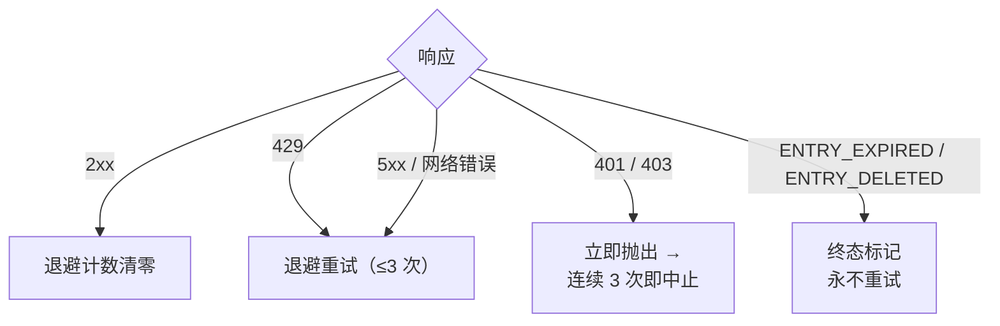

<a id="限频" data-pplx-source-anchor="true"></a>
# 속도 제한

속도 제한 정책의 모든 숫자는 하나의 목표를 위해 존재합니다: 아카이브 트래픽이 일반적인 브라우징처럼 보여야 한다는 것입니다.
단일 스레드 내보내기는 1–2회의 요청만 발생시키며, 이는 대략 한 번의 페이지 조회와 같습니다. 배치 실행은 이러한 요청을 무작위 간격으로 분산시키고 동시성을 허용하지 않습니다. 이는 명시적으로 요구되는 반-봇 규율(`pplx_export/core/throttle.py:1-2`)이며, 조정 가능한 성능 매개변수가 아닙니다.

<a id="具体数字" data-pplx-source-anchor="true"></a>
## 구체적인 숫자

| 위치 | 템포 | 코드 |
|---|---|---|
| `batch`: 스레드 간 | 10–20초 무작위 균등 간격 (`--delay-min` / `--delay-max`) | `pplx_export/cli.py:126-129`, `pplx_export/core/throttle.py:33-36` |
| `sync-deleted --online`: 후보 간 | 10–20초 무작위 균등 간격 | `pplx_export/cli.py:164-167`, `pplx_export/commands/sync_deleted_cmd.py:368-369` |
| `search-mode-backfill`: 네트워크 폴백 | 10–20초 무작위 균등 간격 | `pplx_export/cli.py:144-147` |
| 스레드 내 페이지 매김 / 공간 목록 페이지 매김 | 페이지당 ≥3초 | `pplx_export/sites/perplexity/rest.py:39,56`, `pplx_export/sites/perplexity/adapter.py:285-309` |
| 스키마화된 블록 재수집 (computer / deep-research / council / study) | 두 번째 수집 전 ≥4초 대기 | `pplx_export/sites/perplexity/adapter.py:27-32,88` |
| `spaces --fetch-meta` | 공간당 3초 | `pplx_export/commands/spaces_cmd.py:328` |
| `usage-backfill` | 스레드당 3초 | `pplx_export/commands/usage_backfill_cmd.py:77` |
| `assets-backfill` 온라인 단계 | 스레드당 3초 | `pplx_export/commands/assets_backfill_cmd.py:215,456` |
| 스레드 내 자산 다운로드 | 0.5초 | `pplx_export/sites/perplexity/assets.py:28,103` |
| `assets-backfill` CDN 단계 | 6개 병렬 다운로드, 간격 없음 | `pplx_export/commands/assets_backfill_cmd.py:460-475` |
| API 동시성 | 없음 — 언제나 없음 | — |

<a id="为什么是这个数" data-pplx-source-anchor="true"></a>
## 왜 이 숫자인가

- **단일 내보내기 = 1–2회 요청 ≈ 한 번의 페이지 조회.** search 스레드는 한 번의 `GET /rest/thread/<uuid>`만 필요로 합니다; computer / deep-research / council / study는 정확히 한 번의 스키마화된 블록 수집(`pplx_export/sites/perplexity/adapter.py:87-89`)을 추가로 수행합니다. 이는 브라우저가 페이지를 한 번 여는 오버헤드와 비슷합니다 — 아카이브는 일상적인 사용 위에 의미 있는 부하를 추가하지 않습니다.
- **10–20초 무작위 간격, 동시성 없음.** 사람의 읽기 리듬에 가깝고, 무작위화는 메트로놈 같은 규칙적인 요청을 방지합니다; 직렬화는 요청 속도를 일반적인 브라우징 자체보다 낮춥니다.
- **페이지 매김 ≥3초.** 긴 스레드 내 페이지 매김은 스크롤 및 읽기 시간을 시뮬레이션합니다.
- **블록 재수집 전 ≥4초.** 그렇지 않으면 스키마화된 재수집이 일반 수집과 백투백으로 API에 도달합니다; 이 지연은 무거운 페이지 로드 전의 지연을 시뮬레이션합니다.
- **자산 다운로드 0.5초.** 정적 작은 파일로, 오버헤드가 API 호출보다 훨씬 낮지만 여전히 리듬이 있습니다.
- **CDN 단계는 유일한 완화.** 서명된 URL 다운로드는 Perplexity API가 아닌 콘텐츠 전송 네트워크에 도달하므로, 여기서만 6개 병렬을 허용합니다.

<a id="错误处理与退避" data-pplx-source-anchor="true"></a>
## 오류 처리 및 백오프

모든 분류는 `CookieTransport._request`(`pplx_export/core/http/cookie_transport.py:63-126`)에서 수행됩니다; 각 요청은 최대 `max_retries=3`회 시도(`cookie_transport.py:48`)합니다.



| 응답 | 분류 | 처리 |
|---|---|---|
| 2xx | 성공 | 백오프 카운터 재설정(`cookie_transport.py:77`) — 카운터는 요청 간에 누적되지 않음 |
| 429 | 속도 제한 | 백오프 후 재시도(`cookie_transport.py:86-92`) |
| 500 / 502 / 503 / 504 | 서버 일시적 오류 (504는 종종 Cloudflare 지터) | 포기 전 최소 한 번 백오프 후 재시도(`cookie_transport.py:99-107`) |
| 네트워크 오류 | 일시적 | 백오프 후 재시도(`cookie_transport.py:117-125`) |
| 401 / 403 | 인증 실패 | 즉시 `AuthTransportError` 발생 — 백오프 없음(`cookie_transport.py:82-85`) |
| 400 + `ENTRY_EXPIRED` | 플랫폼 정리 | `EntryExpiredError` — 최종 상태, 재시도 안 함(`cookie_transport.py:96-98`) |
| 400 + `ENTRY_DELETED` | 사용자/원격 삭제 | `EntryDeletedError` — 최종 상태, 재시도 안 함(`cookie_transport.py:93-95`) |
| 404 / 기타 상태 코드 | 일반 오류 | 전송 계층에서 재시도 안 함; **절대** 최종 상태로 매핑하지 않음(`cookie_transport.py:108-116`) |

**백오프 공식**(`pplx_export/core/throttle.py:38-50`):
`delay_max × 3^N`, `N`는 연속 실패 횟수(지수적으로 8로 클램프), ±20% 지터로 동기화 방지, 최대 300초. 마지막 실패 시 더 이상 대기하지 않음; 첫 번째 성공 시 `throttle.reset()`가 재설정됨(`throttle.py:52`).

각 규칙의 이유:

- **429 백오프** — 서버가 명시적으로 속도 감소를 요청하므로 지수적으로 따릅니다.
- **5xx 재시도** — 한 번의 게이트웨이 지터로 스레드가 실패해서는 안 됩니다.
- **401/403 백오프 없음** — 쿠키가 만료되었을 때 대기해도 자가 치유되지 않습니다.
- **`ENTRY_EXPIRED` 재시도 안 함** — 플랫폼 정리(약 3개월 창)는 영구적이며, 재시도는 요청과 백오프 예산만 낭비합니다.
- **404 절대 최종 상태 안 함** — `pplx-ask`에서 새로 생성된 스레드는 전파 지연으로 인해 일시적 404가 발생할 수 있습니다; 최종 상태로 표시하면 일시적으로 보이지 않는 활성 스레드를 잘못 폐기할 수 있습니다.

<a id="鉴权-fail-fast" data-pplx-source-anchor="true"></a>
## 인증 Fail-Fast

배치 계층은 연속 인증 실패 횟수를 계산합니다(`_AUTH_FAIL_FAST = 3`, `pplx_export/commands/batch_cmd.py:43`). 서버에 도달하는 모든 성공 응답 — `ENTRY_DELETED` / `ENTRY_EXPIRED` 포함 — 은 쿠키가 유효함을 증명하고 카운터를 재설정합니다(`batch_cmd.py:170-182`). 연속 3회 401/403: 상태 파일 저장 후 실행 중단(`batch_cmd.py:190-194`) — 쿠키가 만료된 상태에서 계속 실행하면 수백 개의 스레드가 각각 실패하여 수 시간을 낭비합니다. `sync-deleted`는 동일한 규율을 따릅니다(`pplx_export/commands/sync_deleted_cmd.py:111,333-337`). 해결 방법: 쿠키를 업데이트한 후 다시 실행하면 이미 내보낸 부분은 모두 건너뜁니다.

`batch`는 전송 계층과 동일한 `Throttle` 인스턴스를 공유합니다(`pplx_export/cli.py:280-282`, `batch_cmd.py:101-105`). 백오프 카운터는 계층 간에 분할되지 않으며, 공유 인스턴스는 계정 자동 전환 후에도 유지됩니다.

<a id="定时同步" data-pplx-source-anchor="true"></a>
## 예약 동기화

`pplx-export schedule`는 현재 증분 계획(추가/업데이트 수)을 계산하고 cron 조각을 `<out>/index/cron_snippet.txt`에 씁니다(`pplx_export/commands/misc_cmd.py:86-96`, `pplx_export/hooks/scheduler.py:48-77`):

```bash
pplx-export schedule --account alice
```

```cron
17 3 * * * cd '<out-parent>' && '/abs/path/to/pplx-export' batch --account 'alice' --out '<out>'
```

- 주기적 실행은 **증분만** 실행(조기 종료) — 전체 재수집 안 함(`scheduler.py:4-9`).
- 조각은 따옴표가 있는 절대 경로를 사용합니다. cron의 작업 디렉터리와 `PATH`가 예측 불가능하기 때문입니다(`scheduler.py:63-75`).
- `crontab -e`로 설치한 후 필요에 따라 시간을 조정합니다; 여러 계정은 시간대를 분산시킵니다.
- 선택적 폴백: 매주 또는 매월 수동으로 `pplx-export batch --account alice --full`를 한 번 실행합니다([incremental-sync.md](incremental-sync.md) 참조).

<a id="另见" data-pplx-source-anchor="true"></a>
## 같이 보기

- [incremental-sync.md](incremental-sync.md) — 각 예약 실행 시 실제로 내보내는 내용
- [pplx-export.md](pplx-export.md) — `--delay-min` / `--delay-max` 및 기타 명령 옵션
- [troubleshooting.md](troubleshooting.md) — 인증 fail-fast 중단 후 대처 방법
- [../architecture/rate-limiting-errors.md](../architecture/rate-limiting-errors.md) — 전체 오류 분류
- [../reference/api/api-responses-errors.md](../reference/api/api-responses-errors.md) — 플랫폼 측 오류 의미(`ENTRY_EXPIRED`, `ENTRY_DELETED`, Cloudflare)
- [../reference/api/api-authentication.md](../reference/api/api-authentication.md) — 쿠키 및 다중 계정 전환
