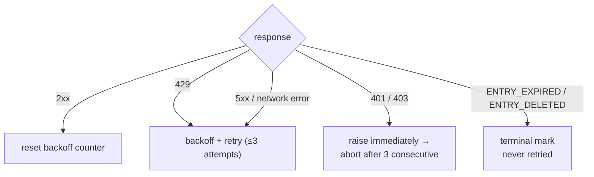

# Rate Limiting

Every number in the pacing policy serves one goal: archive traffic must look
like ordinary browsing. A single-thread export costs 1–2 requests — roughly
one page view — and batch runs spread those requests over randomized intervals
with no concurrency. This is an explicit anti-risk-control requirement
(`pplx_export/core/throttle.py:1-2`), not a tunable performance knob.

## The numbers

| where | pacing | code |
|---|---|---|
| `batch`: between threads | random uniform 10–20 s (`--delay-min` / `--delay-max`) | `pplx_export/cli.py:126-129`, `pplx_export/core/throttle.py:33-36` |
| `sync-deleted --online`: between candidates | random uniform 10–20 s | `pplx_export/cli.py:164-167`, `pplx_export/commands/sync_deleted_cmd.py:368-369` |
| `search-mode-backfill`: online fallback | random uniform 10–20 s | `pplx_export/cli.py:144-147` |
| pagination inside a thread / space listing | ≥3 s between pages | `pplx_export/sites/perplexity/rest.py:39,56`, `pplx_export/sites/perplexity/adapter.py:285-309` |
| schematized-block backfill (computer / deep-research / council / study) | ≥4 s wait before the second fetch | `pplx_export/sites/perplexity/adapter.py:27-32,88` |
| `spaces --fetch-meta` | 3 s per space | `pplx_export/commands/spaces_cmd.py:328` |
| `usage-backfill` | 3 s per thread | `pplx_export/commands/usage_backfill_cmd.py:77` |
| `assets-backfill` online phases | 3 s per thread | `pplx_export/commands/assets_backfill_cmd.py:215,456` |
| asset downloads within a thread | 0.5 s | `pplx_export/sites/perplexity/assets.py:28,103` |
| `assets-backfill` CDN phase | 6 parallel downloads, no delay | `pplx_export/commands/assets_backfill_cmd.py:460-475` |
| API concurrency | none — ever | — |

## Why these numbers

- **Single export = 1–2 requests ≈ one page view.** A search thread costs one
  `GET /rest/thread/<uuid>`; computer / deep-research / council / study add
  exactly one schematized-blocks fetch
  (`pplx_export/sites/perplexity/adapter.py:87-89`). That is about what a
  browser does when you open the page once — the archive adds no meaningful
  load on top of normal usage.
- **10–20 s random interval, no concurrency.** Human reading rhythm, and the
  randomization avoids metronome-perfect timing. Serial requests keep the
  rate below what ordinary browsing already produces.
- **≥3 s page turns.** Pagination inside one long thread mimics scroll and
  reading time.
- **≥4 s before the blocks fetch.** The schematized re-fetch would otherwise
  hit the API back-to-back with the plain fetch; the pause mimics the delay
  before a heavy page loads its full payload.
- **0.5 s asset downloads.** Small static files, far cheaper than API calls —
  but still paced.
- **The CDN phase is the only relaxation.** Signed-URL downloads hit the
  content delivery network, not the Perplexity API, so 6 parallel connections
  are acceptable there and only there.

## Error handling and backoff

All classification happens in `CookieTransport._request`
(`pplx_export/core/http/cookie_transport.py:63-126`); each request gets up to
`max_retries=3` attempts (`cookie_transport.py:48`).



| response | classification | handling |
|---|---|---|
| 2xx | success | backoff counter reset (`cookie_transport.py:77`) — counts never accumulate across requests |
| 429 | rate limited | back off and retry (`cookie_transport.py:86-92`) |
| 500 / 502 / 503 / 504 | transient server error (504 is commonly a Cloudflare blip) | back off and retry at least once before giving up (`cookie_transport.py:99-107`) |
| network error | transient | back off and retry (`cookie_transport.py:117-125`) |
| 401 / 403 | auth failure | `AuthTransportError` raised immediately — no backoff (`cookie_transport.py:82-85`) |
| 400 + `ENTRY_EXPIRED` | platform purge | `EntryExpiredError` — terminal, never retried (`cookie_transport.py:96-98`) |
| 400 + `ENTRY_DELETED` | user/remote deletion | `EntryDeletedError` — terminal, never retried (`cookie_transport.py:93-95`) |
| 404 / other codes | ordinary error | no transport-level retry; **never** mapped to a terminal state (`cookie_transport.py:108-116`) |

**Backoff formula** (`pplx_export/core/throttle.py:38-50`):
`delay_max × 3^N`, where `N` is the consecutive-failure count (exponent
clamped at 8), with ±20% jitter against synchronization, capped at 300 s.
There is no pointless sleep after the final failed attempt, and
`throttle.reset()` clears the counter on the first success
(`throttle.py:52`).

Why each rule exists:

- **429 backoff** — the server explicitly asked to slow down; honor it
  exponentially.
- **5xx retry** — a single gateway blip must not fail a thread.
- **401/403 without backoff** — waiting cannot heal a dead cookie.
- **`ENTRY_EXPIRED` without retry** — the platform purge (~3-month window) is
  permanent; retrying only burns requests and backoff budget.
- **404 never terminal** — a thread created by `pplx-ask` can 404 transiently
  right after creation (propagation delay); a terminal mark would bury a live
  thread that is only briefly invisible.

## Auth fail-fast

The batch layer counts consecutive auth failures (`_AUTH_FAIL_FAST = 3`,
`pplx_export/commands/batch_cmd.py:43`). Any response that reached the server
— including `ENTRY_DELETED` / `ENTRY_EXPIRED` — proves the cookie works and
resets the counter (`batch_cmd.py:170-182`). Three consecutive 401/403 and the
run saves its state file, then aborts (`batch_cmd.py:190-194`): spinning on
with a dead cookie would make hundreds of threads each fail once — hours
wasted. `sync-deleted` applies the same discipline
(`pplx_export/commands/sync_deleted_cmd.py:111,333-337`). The fix is to
refresh the cookie and re-run; everything already exported is skipped.

`batch` and the transport share one `Throttle` instance
(`pplx_export/cli.py:280-282`, `batch_cmd.py:101-105`), so backoff counting
never splits between layers — and the shared instance survives automatic
account switching.

## Scheduling periodic sync

`pplx-export schedule` computes the current incremental plan (new/updated
counts) and writes a cron snippet to `<out>/index/cron_snippet.txt`
(`pplx_export/commands/misc_cmd.py:86-96`,
`pplx_export/hooks/scheduler.py:48-77`):

```bash
pplx-export schedule --account alice
```

```cron
17 3 * * * cd '<out-parent>' && '/abs/path/to/pplx-export' batch --account 'alice' --out '<out>'
```

- Periodic runs are **incremental only** (early stop) — no full re-fetches
  (`scheduler.py:4-9`).
- The snippet uses absolute, quoted paths because cron's working directory and
  `PATH` are unpredictable (`scheduler.py:63-75`).
- Install it with `crontab -e` and adjust the time to taste; stagger multiple
  accounts to different slots.
- Optional backstop: add a weekly or monthly manual sweep with
  `pplx-export batch --account alice --full` (see
  [incremental-sync.md](incremental-sync.md)).

## See also

- [incremental-sync.md](incremental-sync.md) — what each scheduled run actually exports
- [pplx-export.md](pplx-export.md) — `--delay-min` / `--delay-max` and the other command options
- [troubleshooting.md](troubleshooting.md) — what to do after an auth fail-fast abort
- [../architecture/rate-limiting-errors.md](../architecture/rate-limiting-errors.md) — the full error taxonomy
- [../reference/api/api-responses-errors.md](../reference/api/api-responses-errors.md) — platform-side error semantics (`ENTRY_EXPIRED`, `ENTRY_DELETED`, Cloudflare)
- [../reference/api/api-authentication.md](../reference/api/api-authentication.md) — cookies and multi-account switching
