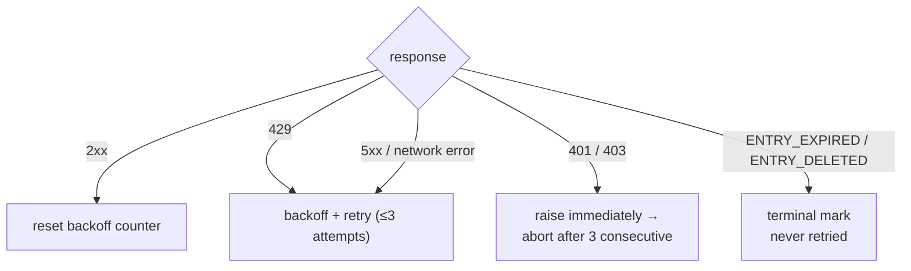

<a id="rate-limiting" data-pplx-source-anchor="true"></a>
# Limitação de Taxa

Cada número na política de ritmo serve a um objetivo: o tráfego de arquivamento deve parecer
navegação comum. Uma exportação de thread única custa 1–2 requisições — aproximadamente
uma visualização de página — e execuções em lote distribuem essas requisições em intervalos
aleatórios sem concorrência. Este é um requisito explícito de anti-controle de risco
(`pplx_export/core/throttle.py:1-2`), não um botão de desempenho ajustável.

<a id="the-numbers" data-pplx-source-anchor="true"></a>
## Os números

| onde | ritmo | código |
|---|---|---|
| `batch`: entre threads | uniforme aleatório 10–20 s (`--delay-min` / `--delay-max`) | `pplx_export/cli.py:126-129`, `pplx_export/core/throttle.py:33-36` |
| `sync-deleted --online`: entre candidatos | uniforme aleatório 10–20 s | `pplx_export/cli.py:164-167`, `pplx_export/commands/sync_deleted_cmd.py:368-369` |
| `search-mode-backfill`: fallback online | uniforme aleatório 10–20 s | `pplx_export/cli.py:144-147` |
| paginação dentro de uma thread / listagem de espaço | ≥3 s entre páginas | `pplx_export/sites/perplexity/rest.py:39,56`, `pplx_export/sites/perplexity/adapter.py:285-309` |
| preenchimento de bloco esquematizado (computer / deep-research / council / study) | ≥4 s de espera antes da segunda busca | `pplx_export/sites/perplexity/adapter.py:27-32,88` |
| `spaces --fetch-meta` | 3 s por espaço | `pplx_export/commands/spaces_cmd.py:328` |
| `usage-backfill` | 3 s por thread | `pplx_export/commands/usage_backfill_cmd.py:77` |
| `assets-backfill` fases online | 3 s por thread | `pplx_export/commands/assets_backfill_cmd.py:215,456` |
| downloads de ativos dentro de uma thread | 0,5 s | `pplx_export/sites/perplexity/assets.py:28,103` |
| `assets-backfill` fase CDN | 6 downloads paralelos, sem atraso | `pplx_export/commands/assets_backfill_cmd.py:460-475` |
| concorrência de API | nenhuma — nunca | — |

<a id="why-these-numbers" data-pplx-source-anchor="true"></a>
## Por que esses números

- **Exportação única = 1–2 requisições ≈ uma visualização de página.** Uma thread de busca custa uma
  `GET /rest/thread/<uuid>`; computer / deep-research / council / study adicionam
  exatamente uma busca de blocos esquematizados
  (`pplx_export/sites/perplexity/adapter.py:87-89`). Isso é aproximadamente o que um
  navegador faz quando você abre a página uma vez — o arquivamento não adiciona carga
  significativa além do uso normal.
- **Intervalo aleatório de 10–20 s, sem concorrência.** Ritmo de leitura humana, e a
  aleatoriedade evita um timing de metrônomo perfeito. Requisições seriais mantêm a
  taxa abaixo do que a navegação comum já produz.
- **≥3 s para virar páginas.** Paginação dentro de uma thread longa imita rolagem e
  tempo de leitura.
- **≥4 s antes da busca de blocos.** A re-busca esquematizada, caso contrário,
  atingiria a API consecutivamente com a busca simples; a pausa imita o atraso
  antes de uma página pesada carregar sua carga completa.
- **0,5 s para downloads de ativos.** Pequenos arquivos estáticos, muito mais baratos que chamadas de API —
  mas ainda ritmados.
- **A fase CDN é a única relaxação.** Downloads de URL assinada atingem a
  rede de entrega de conteúdo, não a API Perplexity, então 6 conexões paralelas
  são aceitáveis lá e apenas lá.

<a id="error-handling-and-backoff" data-pplx-source-anchor="true"></a>
## Tratamento de erros e backoff

Toda classificação ocorre em `CookieTransport._request`
(`pplx_export/core/http/cookie_transport.py:63-126`); cada requisição recebe até
`max_retries=3` tentativas (`cookie_transport.py:48`).



| resposta | classificação | tratamento |
|---|---|---|
| 2xx | sucesso | contador de backoff resetado (`cookie_transport.py:77`) — contagens nunca se acumulam entre requisições |
| 429 | limitado por taxa | backoff e tentar novamente (`cookie_transport.py:86-92`) |
| 500 / 502 / 503 / 504 | erro de servidor transitório (504 é comumente um problema do Cloudflare) | backoff e tentar novamente pelo menos uma vez antes de desistir (`cookie_transport.py:99-107`) |
| erro de rede | transitório | backoff e tentar novamente (`cookie_transport.py:117-125`) |
| 401 / 403 | falha de autenticação | `AuthTransportError` levantado imediatamente — sem backoff (`cookie_transport.py:82-85`) |
| 400 + `ENTRY_EXPIRED` | limpeza da plataforma | `EntryExpiredError` — terminal, nunca repetido (`cookie_transport.py:96-98`) |
| 400 + `ENTRY_DELETED` | exclusão de usuário/remoto | `EntryDeletedError` — terminal, nunca repetido (`cookie_transport.py:93-95`) |
| 404 / outros códigos | erro comum | sem repetição em nível de transporte; **nunca** mapeado para um estado terminal (`cookie_transport.py:108-116`) |

**Fórmula de backoff** (`pplx_export/core/throttle.py:38-50`):
`delay_max × 3^N`, onde `N` é a contagem de falhas consecutivas (expoente
limitado a 8), com jitter de ±20% contra sincronização, limitado a 300 s.
Não há espera inútil após a tentativa final falha, e
`throttle.reset()` limpa o contador no primeiro sucesso
(`throttle.py:52`).

Por que cada regra existe:

- **Backoff 429** — o servidor explicitamente pediu para desacelerar; honre-o
  exponencialmente.
- **Repetição 5xx** — um único problema de gateway não deve falhar uma thread.
- **401/403 sem backoff** — esperar não pode curar um cookie morto.
- **`ENTRY_EXPIRED` sem repetição** — a limpeza da plataforma (janela de ~3 meses) é
  permanente; repetir apenas queima requisições e orçamento de backoff.
- **404 nunca terminal** — uma thread criada por `pplx-ask` pode dar 404 transitoriamente
  logo após a criação (atraso de propagação); uma marca terminal enterraria uma thread
  viva que está apenas brevemente invisível.

<a id="runtime-budget-for-callers" data-pplx-source-anchor="true"></a>
## Orçamento de tempo de execução para chamadores

A disciplina de backoff acima troca tempo de relógio por segurança da conta, e
os chamadores devem orçar esse tempo: uma única requisição faz até 3 tentativas
com um sono de backoff entre elas — até 300 s cada
(`pplx_export/core/throttle.py:38-50`) — então, enquanto a rede oscila, uma
requisição pode legitimamente ocupar cerca de 10 minutos. `index` / `batch`
também começam com uma sonda de sessão que segue as mesmas regras
(`pplx_export/commands/common.py:126`). Um longo silêncio significa que uma espera de backoff está
em andamento, não um travamento.

Três regras para agentes, tarefas cron e wrappers de CI:

1. **Uma conta por invocação.** Execute contas serialmente como processos
   separados; nunca as encadeie com `&&` dentro de uma tarefa externa que imponha um
   tempo limite rígido — a cascata de backoff da primeira conta consome todo o orçamento
   e a conta encadeada nunca é executada.
2. **Orçamento ≥ 15 minutos, ou desanexe.** Dê aos wrappers um tempo limite generoso, ou
   execute em segundo plano e observe o log (`-v` / `--log-file`) para distinguir
   esperas de backoff de travamentos reais.
3. **Interromper é sempre seguro.** O estado é escrito atomicamente; uma re-execução é
   idempotente e repara qualquer lacuna que a interrupção deixou (semântica de parada antecipada e
   retomada: [Sincronização incremental](incremental-sync.md)).

<a id="auth-fail-fast" data-pplx-source-anchor="true"></a>
## Falha rápida de autenticação

A camada de lote conta falhas consecutivas de autenticação (`_AUTH_FAIL_FAST = 3`,
`pplx_export/commands/batch_cmd.py:43`). Qualquer resposta que chegou ao servidor
— incluindo `ENTRY_DELETED` / `ENTRY_EXPIRED` — prova que o cookie funciona e
reseta o contador (`batch_cmd.py:170-182`). Três 401/403 consecutivos e a
execução salva seu arquivo de estado e então aborta (`batch_cmd.py:190-194`): continuar
com um cookie morto faria centenas de threads falharem cada uma uma vez — horas
desperdiçadas. `sync-deleted` aplica a mesma disciplina
(`pplx_export/commands/sync_deleted_cmd.py:111,333-337`). A correção é
atualizar o cookie e re-executar; tudo já exportado é pulado.

`batch` e o transporte compartilham uma instância `Throttle`
(`pplx_export/cli.py:280-282`, `batch_cmd.py:101-105`), então a contagem de backoff
nunca se divide entre camadas — e a instância compartilhada sobrevive à troca automática
de conta.

<a id="scheduling-periodic-sync" data-pplx-source-anchor="true"></a>
## Agendamento de sincronização periódica

`pplx-export schedule` calcula o plano incremental atual (contagens de novos/atualizados)
e escreve um trecho de cron em `<out>/index/cron_snippet.txt`
(`pplx_export/commands/misc_cmd.py:86-96`,
`pplx_export/hooks/scheduler.py:48-77`):

```bash
pplx-export schedule --account alice
```

```cron
17 3 * * * cd '<out-parent>' && '/abs/path/to/pplx-export' batch --account 'alice' --out '<out>'
```

- Execuções periódicas são **apenas incrementais** (parada antecipada) — sem re-buscas completas
  (`scheduler.py:4-9`).
- O trecho usa caminhos absolutos e entre aspas porque o diretório de trabalho do cron e
  `PATH` são imprevisíveis (`scheduler.py:63-75`).
- Instale-o com `crontab -e` e ajuste o horário a gosto; distribua várias contas
  em slots diferentes.
- Opcional de segurança: adicione uma varredura manual semanal ou mensal com
  `pplx-export batch --account alice --full` (veja
  [incremental-sync.md](incremental-sync.md)).

<a id="see-also" data-pplx-source-anchor="true"></a>
## Veja também

- [incremental-sync.md](incremental-sync.md) — o que cada execução agendada realmente exporta
- [pplx-export.md](pplx-export.md) — `--delay-min` / `--delay-max` e as outras opções de comando
- [troubleshooting.md](troubleshooting.md) — o que fazer após uma abortagem por falha rápida de autenticação
- [../architecture/rate-limiting-errors.md](../architecture/rate-limiting-errors.md) — a taxonomia completa de erros
- [../reference/api/api-responses-errors.md](../reference/api/api-responses-errors.md) — semântica de erros do lado da plataforma (`ENTRY_EXPIRED`, `ENTRY_DELETED`, Cloudflare)
- [../reference/api/api-authentication.md](../reference/api/api-authentication.md) — cookies e troca de múltiplas contas
