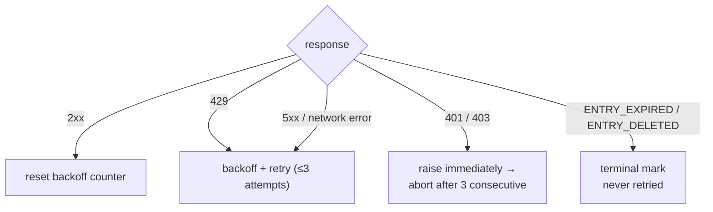

<a id="rate-limiting" data-pplx-source-anchor="true"></a>
# Ограничение скорости

Каждое число в политике темпа служит одной цели: трафик архива должен выглядеть как обычный просмотр. Однопоточный экспорт стоит 1–2 запроса — примерно один просмотр страницы — а пакетные запуски распределяют эти запросы по случайным интервалам без параллелизма. Это явное требование для снижения рисков (`pplx_export/core/throttle.py:1-2`), а не настраиваемая ручка производительности.

<a id="the-numbers" data-pplx-source-anchor="true"></a>
## Цифры

| где | темп | код |
|---|---|---|
| `batch`: между потоками | случайный равномерный 10–20 с (`--delay-min` / `--delay-max`) | `pplx_export/cli.py:126-129`, `pplx_export/core/throttle.py:33-36` |
| `sync-deleted --online`: между кандидатами | случайный равномерный 10–20 с | `pplx_export/cli.py:164-167`, `pplx_export/commands/sync_deleted_cmd.py:368-369` |
| `search-mode-backfill`: онлайн-запасной вариант | случайный равномерный 10–20 с | `pplx_export/cli.py:144-147` |
| пагинация внутри потока / списка пространств | ≥3 с между страницами | `pplx_export/sites/perplexity/rest.py:39,56`, `pplx_export/sites/perplexity/adapter.py:285-309` |
| обратное заполнение схематизированных блоков (computer / deep-research / council / study) | ≥4 с ожидания перед вторым запросом | `pplx_export/sites/perplexity/adapter.py:27-32,88` |
| `spaces --fetch-meta` | 3 с на пространство | `pplx_export/commands/spaces_cmd.py:328` |
| `usage-backfill` | 3 с на поток | `pplx_export/commands/usage_backfill_cmd.py:77` |
| `assets-backfill` онлайн-фазы | 3 с на поток | `pplx_export/commands/assets_backfill_cmd.py:215,456` |
| загрузка ресурсов внутри потока | 0,5 с | `pplx_export/sites/perplexity/assets.py:28,103` |
| `assets-backfill` фаза CDN | 6 параллельных загрузок, без задержки | `pplx_export/commands/assets_backfill_cmd.py:460-475` |
| параллелизм API | нет — никогда | — |

<a id="why-these-numbers" data-pplx-source-anchor="true"></a>
## Почему такие цифры

- **Один экспорт = 1–2 запроса ≈ один просмотр страницы.** Поисковый поток стоит одного `GET /rest/thread/<uuid>`; computer / deep-research / council / study добавляют ровно один запрос схематизированных блоков (`pplx_export/sites/perplexity/adapter.py:87-89`). Это примерно то, что делает браузер, когда вы открываете страницу один раз — архив не добавляет значимой нагрузки сверх обычного использования.
- **Случайный интервал 10–20 с, без параллелизма.** Ритм чтения человека, а рандомизация избегает метрономно-идеального времени. Последовательные запросы удерживают скорость ниже того, что уже производит обычный просмотр.
- **≥3 с перелистывания страниц.** Пагинация внутри одного длинного потока имитирует прокрутку и время чтения.
- **≥4 с перед запросом блоков.** Иначе схематизированный повторный запрос попал бы в API сразу за обычным запросом; пауза имитирует задержку перед загрузкой полной полезной нагрузки тяжелой страницы.
- **0,5 с загрузки ресурсов.** Небольшие статические файлы, гораздо дешевле вызовов API — но все же с темпом.
- **Фаза CDN — единственное послабление.** Загрузки по подписанным URL попадают в сеть доставки контента, а не в API Perplexity, поэтому 6 параллельных соединений допустимы там и только там.

<a id="error-handling-and-backoff" data-pplx-source-anchor="true"></a>
## Обработка ошибок и откат

Вся классификация происходит в `CookieTransport._request` (`pplx_export/core/http/cookie_transport.py:63-126`); каждый запрос получает до `max_retries=3` попыток (`cookie_transport.py:48`).



| ответ | классификация | обработка |
|---|---|---|
| 2xx | успех | сброс счетчика отката (`cookie_transport.py:77`) — счетчики никогда не накапливаются между запросами |
| 429 | ограничение скорости | откат и повтор (`cookie_transport.py:86-92`) |
| 500 / 502 / 503 / 504 | временная ошибка сервера (504 часто является сбоем Cloudflare) | откат и повтор хотя бы один раз перед отказом (`cookie_transport.py:99-107`) |
| сетевая ошибка | временная | откат и повтор (`cookie_transport.py:117-125`) |
| 401 / 403 | ошибка аутентификации | `AuthTransportError` вызывается немедленно — без отката (`cookie_transport.py:82-85`) |
| 400 + `ENTRY_EXPIRED` | очистка платформы | `EntryExpiredError` — терминальная, никогда не повторяется (`cookie_transport.py:96-98`) |
| 400 + `ENTRY_DELETED` | удаление пользователем/удаленно | `EntryDeletedError` — терминальная, никогда не повторяется (`cookie_transport.py:93-95`) |
| 404 / другие коды | обычная ошибка | без повторения на транспортном уровне; **никогда** не отображается в терминальное состояние (`cookie_transport.py:108-116`) |

**Формула отката** (`pplx_export/core/throttle.py:38-50`):
`delay_max × 3^N`, где `N` — количество последовательных сбоев (экспонента ограничена 8), с ±20% джиттером против синхронизации, ограничено 300 с. Нет бессмысленного сна после последней неудачной попытки, и `throttle.reset()` сбрасывает счетчик при первом успехе (`throttle.py:52`).

**Heartbeats (видимы при уровне детализации по умолчанию).** Откат больше не ждет в тишине: он печатает начальную строку, а затем обратный отсчет каждые `Throttle.heartbeat_interval` (по умолчанию 10 с), засыпая частями, сумма которых равна тому же общему времени — поэтому темп и бюджет снижения рисков не меняются, только становятся видимыми (`pplx_export/core/throttle.py`, `Throttle._sleep_with_heartbeat`). Та же идея охватывает два других долгих ожидания: каждый выполняющийся запрос выдает тик "все еще жду ответа", пока он застрял перед ответом (`CookieTransport._open_read`), и `pplx-ask` потоки выдают тик "все еще жду потока ответа", пока deep-research / council запуск молчит (`ask_api.post_stream`). Ни одно из них не требует `-v`.

Почему существует каждое правило:

- **Откат 429** — сервер явно попросил замедлиться; выполняйте это экспоненциально.
- **Повтор 5xx** — единичный сбой шлюза не должен приводить к сбою потока.
- **401/403 без отката** — ожидание не восстановит мертвый cookie.
- **`ENTRY_EXPIRED` без повтора** — очистка платформы (~3-месячное окно) постоянна; повтор только сжигает запросы и бюджет отката.
- **404 никогда не терминальный** — поток, созданный `pplx-ask`, может временно выдавать 404 сразу после создания (задержка распространения); терминальная отметка похоронила бы живой поток, который лишь ненадолго невидим.

<a id="runtime-budget-for-callers" data-pplx-source-anchor="true"></a>
## Бюджет времени для вызывающих

Дисциплина отката выше обменивает астрономическое время на безопасность учетной записи, и вызывающие должны учитывать это время: один запрос делает до 3 попыток с откатом между ними — до 300 с каждая (`pplx_export/core/throttle.py:38-50`) — поэтому, пока сеть колеблется, один запрос может законно занимать порядка 10 минут. `index` / `batch` также начинаются с зонда сессии, который следует тем же правилам (`pplx_export/commands/common.py`, `make_transport`); передайте `--skip-auth-check`, чтобы пропустить этот зонд и начать работу немедленно (см. [Configuration](configuration.md)).
Долгое молчание означает, что идет ожидание, а не зависание — и это ожидание теперь отображается INFO heartbeats при уровне детализации по умолчанию (обратный отсчет отката, выполняющийся запрос и поток SSE).

Три правила для агентов, заданий cron и оберток CI:

1. **Одна учетная запись на вызов.** Запускайте учетные записи последовательно как отдельные процессы; никогда не объединяйте их с `&&` внутри внешней задачи, которая применяет жесткий тайм-аут — каскад отката первой учетной записи съест весь бюджет, и связанная учетная запись никогда не запустится.
2. **Бюджет ≥ 15 минут или отсоединитесь.** Дайте оберткам щедрый тайм-аут или запускайте в фоне и следите за heartbeats (теперь при уровне детализации по умолчанию; `-v` / `--log-file` добавляют полную трассировку), чтобы отличить ожидания отката от реальных зависаний.
3. **Прерывание всегда безопасно.** Состояние записывается атомарно; повторный запуск идемпотентен и исправляет любой пробел, оставленный прерыванием (семантика ранней остановки и возобновления: [Incremental sync](incremental-sync.md)).

<a id="auth-fail-fast" data-pplx-source-anchor="true"></a>
## Быстрый отказ аутентификации

Пакетный слой подсчитывает последовательные сбои аутентификации (`_AUTH_FAIL_FAST = 3`, `pplx_export/commands/batch_cmd.py:43`). Любой ответ, достигший сервера — включая `ENTRY_DELETED` / `ENTRY_EXPIRED` — доказывает, что cookie работает, и сбрасывает счетчик (`batch_cmd.py:170-182`). Три последовательных 401/403, и запуск сохраняет свой файл состояния, затем прерывается (`batch_cmd.py:190-194`): продолжение с мертвым cookie заставило бы сотни потоков каждый раз терпеть неудачу — часы потрачены впустую. `sync-deleted` применяет ту же дисциплину (`pplx_export/commands/sync_deleted_cmd.py:111,333-337`). Исправление состоит в том, чтобы обновить cookie и запустить заново; все уже экспортированное пропускается.

`batch` и транспорт используют один экземпляр `Throttle` (`pplx_export/cli.py:280-282`, `batch_cmd.py:101-105`), поэтому подсчет отката никогда не разделяется между слоями — и общий экземпляр переживает автоматическое переключение учетных записей.

<a id="scheduling-periodic-sync" data-pplx-source-anchor="true"></a>
## Планирование периодической синхронизации

`pplx-export schedule` вычисляет текущий инкрементальный план (количество новых/обновленных) и записывает фрагмент cron в `<out>/index/cron_snippet.txt` (`pplx_export/commands/misc_cmd.py:86-96`, `pplx_export/hooks/scheduler.py:48-77`):

```bash
pplx-export schedule --account alice
```

```cron
17 3 * * * cd '<out-parent>' && '/abs/path/to/pplx-export' batch --account 'alice' --out '<out>'
```

- Периодические запуски являются **только инкрементальными** (ранняя остановка) — без полных повторных выборок (`scheduler.py:4-9`).
- Фрагмент использует абсолютные, заключенные в кавычки пути, потому что рабочая директория cron и `PATH` непредсказуемы (`scheduler.py:63-75`).
- Установите его с помощью `crontab -e` и настройте время по вкусу; разнесите несколько учетных записей по разным слотам.
- Необязательная подстраховка: добавьте еженедельную или ежемесячную ручную проверку с `pplx-export batch --account alice --full` (см. [incremental-sync.md](incremental-sync.md)).

<a id="see-also" data-pplx-source-anchor="true"></a>
## См. также

- [incremental-sync.md](incremental-sync.md) — что именно экспортирует каждый запланированный запуск
- [pplx-export.md](pplx-export.md) — `--delay-min` / `--delay-max` и другие параметры команды
- [troubleshooting.md](troubleshooting.md) — что делать после быстрого отказа аутентификации
- [../architecture/rate-limiting-errors.md](../architecture/rate-limiting-errors.md) — полная таксономия ошибок
- [../reference/api/api-responses-errors.md](../reference/api/api-responses-errors.md) — семантика ошибок на стороне платформы (`ENTRY_EXPIRED`, `ENTRY_DELETED`, Cloudflare)
- [../reference/api/api-authentication.md](../reference/api/api-authentication.md) — cookies и переключение между несколькими учетными записями
