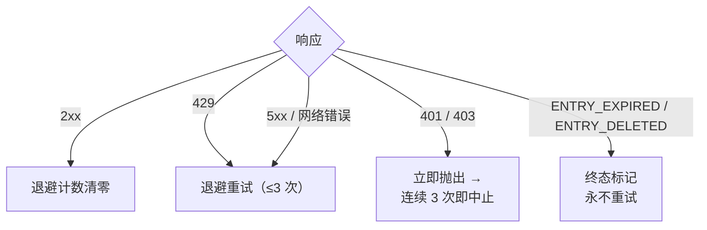

# 限频

限速策略里的每个数字都服务于同一个目标：归档流量必须看起来像普通浏览。
单线程导出只有 1–2 次请求——约等于一次页面浏览——batch 运行再把这些请求
摊到随机间隔上，且无并发。这是明确要求的反风控纪律
（`pplx_export/core/throttle.py:1-2`），不是可调的性能参数。

## 具体数字

| 位置 | 节奏 | 代码 |
|---|---|---|
| `batch`：线程之间 | 10–20 s 随机均匀间隔（`--delay-min` / `--delay-max`） | `pplx_export/cli.py:125-128`，`pplx_export/core/throttle.py:33-36` |
| `sync-deleted --online`：候选之间 | 10–20 s 随机均匀间隔 | `pplx_export/cli.py:163-166`，`pplx_export/commands/sync_deleted_cmd.py:368-369` |
| `search-mode-backfill`：联网兜底 | 10–20 s 随机均匀间隔 | `pplx_export/cli.py:143-146` |
| 线程内翻页 / 空间列表翻页 | 每页 ≥3 s | `pplx_export/sites/perplexity/rest.py:38,55`，`pplx_export/sites/perplexity/adapter.py:288-312` |
| schematized 块补抓（computer / deep-research / council / study） | 第二次抓取前等 ≥4 s | `pplx_export/sites/perplexity/adapter.py:27-32,88` |
| `spaces --fetch-meta` | 每空间 3 s | `pplx_export/commands/spaces_cmd.py:328` |
| `usage-backfill` | 每线程 3 s | `pplx_export/commands/usage_backfill_cmd.py:77` |
| `assets-backfill` 在线阶段 | 每线程 3 s | `pplx_export/commands/assets_backfill_cmd.py:215,455` |
| 线程内资产下载 | 0.5 s | `pplx_export/sites/perplexity/assets.py:28,103` |
| `assets-backfill` CDN 阶段 | 6 路并行下载，无间隔 | `pplx_export/commands/assets_backfill_cmd.py:459-474` |
| API 并发 | 无——任何时候都没有 | — |

## 为什么是这个数

- **单次导出 = 1–2 次请求 ≈ 一次页面浏览。** search 线程只需一次
  `GET /rest/thread/<uuid>`；computer / deep-research / council / study
  恰好再加一次 schematized 块抓取
  （`pplx_export/sites/perplexity/adapter.py:87-89`）。这与浏览器打开一次
  页面的开销相当——归档不会在日常使用之上增加有意义的负载。
- **10–20 s 随机间隔、无并发。** 贴近人的阅读节奏，随机化避免节拍器式的
  规律请求；串行让请求速率低于普通浏览本身。
- **翻页 ≥3 s。** 长线程内的翻页模拟滚动与阅读时间。
- **块补抓前 ≥4 s。** 否则 schematized 重抓会与 plain 抓取背靠背打到 API；
  这段停顿模拟重页面加载完整负载前的延迟。
- **资产下载 0.5 s。** 静态小文件，开销远低于 API 调用——但仍然有节奏。
- **CDN 阶段是唯一的放宽。** 签名 URL 下载打到的是内容分发网络而非
  Perplexity API，因此仅在此处允许 6 路并行。

## 错误处理与退避

所有分类都在 `CookieTransport._request`
（`pplx_export/core/http/cookie_transport.py:63-126`）完成；每个请求最多
`max_retries=3` 次尝试（`cookie_transport.py:48`）。



| 响应 | 分类 | 处理 |
|---|---|---|
| 2xx | 成功 | 退避计数清零（`cookie_transport.py:77`）——计数不跨请求累积 |
| 429 | 限流 | 退避重试（`cookie_transport.py:86-92`） |
| 500 / 502 / 503 / 504 | 服务器瞬态错误（504 常为 Cloudflare 抖动） | 至少退避重试一次再放弃（`cookie_transport.py:99-107`） |
| 网络错误 | 瞬态 | 退避重试（`cookie_transport.py:117-125`） |
| 401 / 403 | 鉴权失败 | 立即抛 `AuthTransportError`——不退避（`cookie_transport.py:82-85`） |
| 400 + `ENTRY_EXPIRED` | 平台清除 | `EntryExpiredError`——终态，永不重试（`cookie_transport.py:96-98`） |
| 400 + `ENTRY_DELETED` | 用户/远端删除 | `EntryDeletedError`——终态，永不重试（`cookie_transport.py:93-95`） |
| 404 / 其他状态码 | 普通错误 | 传输层不重试；**绝不**映射为终态（`cookie_transport.py:108-116`） |

**退避公式**（`pplx_export/core/throttle.py:38-50`）：
`delay_max × 3^N`，`N` 为连续失败次数（指数钳制到 8），±20% 抖动防同步，
封顶 300 s。最后一次失败不再白睡；首次成功即 `throttle.reset()` 清零
（`throttle.py:52`）。

**心跳（默认档即可见）。** 退避不再静默等待：先打一条起始行，随后每
`Throttle.heartbeat_interval`（默认 10 s）打一次倒计时，分片睡眠之和等于
同一总时长——所以节奏与反风控预算不变，只是变得可见
（`pplx_export/core/throttle.py`，`Throttle._sleep_with_heartbeat`）。同样的
思路覆盖另外两处长等待：每个在途请求在响应前卡住时会打「仍在等待响应」
（`CookieTransport._open_read`），`pplx-ask` 在深研 / 联席静默期间会打
「仍在等待响应流」（`ask_api.post_stream`）。这些都无需 `-v`。

每条规则的理由：

- **429 退避** —— 服务器明确要求减速，指数式地照办。
- **5xx 重试** —— 一次网关抖动不该让一个线程失败。
- **401/403 不退避** —— cookie 失效时等待无法自愈。
- **`ENTRY_EXPIRED` 不重试** —— 平台清除（约 3 个月窗口）是永久的，重试只会
  白费请求与退避预算。
- **404 永不进终态** —— `pplx-ask` 新建的线程可能因传播延迟瞬态 404；打上
  终态会把只是暂时不可见的活线程误葬。

## 调用方运行时预算

上文的退避纪律是拿时钟时间换账号安全，调用方必须为这份时间留出预算：
单个请求最多 3 次尝试，尝试之间退避等待——单次封顶 300 s
（`pplx_export/core/throttle.py:38-50`）——网络翻覆时一个请求合理地
占用 10 分钟量级。`index` / `batch` 起步还有 session 探测，同样走这套
规则（`pplx_export/commands/common.py`，`make_transport`）；传
`--skip-auth-check` 可跳过该探测、立即开工（见
[配置](configuration.md)）。
长时间静默是等待中、不是卡死——而且该等待现在已由默认档的 INFO 心跳
呈现（退避倒计时、在途请求、SSE 流）。

面向 agent、cron、CI 包装层的三条守则：

1. **一次调用只跑一个账户。** 多账户逐个串行、各起一个进程；不要用 `&&`
   串联进带硬超时的外层任务——第一个账户的退避级联会吃光整个预算，
   后面的账户根本没机会跑。
2. **超时预算 ≥ 15 分钟，否则脱离前台。** 给包装层留足超时，或后台运行 +
   看心跳（现已在默认档；`-v` / `--log-file` 附完整追踪）区分退避等待与
   真卡死。
3. **随时中断都安全。** 状态原子落盘；重跑幂等，中断留下的缺口自动修复
   （早停/续跑语义见[增量同步](incremental-sync.md)）。

## 鉴权 fail-fast

batch 层对连续鉴权失败计数（`_AUTH_FAIL_FAST = 3`，
`pplx_export/commands/batch_cmd.py:43`）。任何成功到达服务器的响应——包括
`ENTRY_DELETED` / `ENTRY_EXPIRED`——都证明 cookie 有效并将计数清零
（`batch_cmd.py:170-182`）。连续 3 次 401/403：保存状态文件后中止运行
（`batch_cmd.py:190-194`）——cookie 失效还继续空转，只会让数百个线程各失败
一遍，浪费数小时。`sync-deleted` 遵循同一纪律
（`pplx_export/commands/sync_deleted_cmd.py:111,333-337`）。处理办法：更新
cookie 后重跑，已导出的部分全部跳过。

`batch` 与传输层共享同一个 `Throttle` 实例（`pplx_export/cli.py:279-281`，
`batch_cmd.py:101-105`），退避计数不在层间分裂——且该共享实例在账户自动
切换后依然保留。

## 定时同步

`pplx-export schedule` 计算当前增量计划（新增/更新数量），并把 cron 片段
写入 `<out>/index/cron_snippet.txt`（`pplx_export/commands/misc_cmd.py:86-96`，
`pplx_export/hooks/scheduler.py:48-77`）：

```bash
pplx-export schedule --account alice
```

```cron
17 3 * * * cd '<out-parent>' && '/abs/path/to/pplx-export' batch --account 'alice' --out '<out>'
```

- 周期运行**只跑增量**（早停）——不做全量重抓（`scheduler.py:4-9`）。
- 片段使用加引号的绝对路径，因为 cron 的工作目录与 `PATH` 不可预期
  （`scheduler.py:63-75`）。
- 用 `crontab -e` 安装后按需调整时间；多账户错开时段。
- 可选兜底：每周或每月手动跑一次
  `pplx-export batch --account alice --full`（见
  [incremental-sync.md](incremental-sync.md)）。

## 另见

- [incremental-sync.md](incremental-sync.md) —— 每轮定时运行实际导出什么
- [pplx-export.md](pplx-export.md) —— `--delay-min` / `--delay-max` 及其他命令选项
- [troubleshooting.md](troubleshooting.md) —— 鉴权 fail-fast 中止后怎么办
- [../architecture/rate-limiting-errors.md](../architecture/rate-limiting-errors.md) —— 完整错误分类
- [../reference/api/api-responses-errors.md](../reference/api/api-responses-errors.md) —— 平台侧错误语义（`ENTRY_EXPIRED`、`ENTRY_DELETED`、Cloudflare）
- [../reference/api/api-authentication.md](../reference/api/api-authentication.md) —— cookie 与多账户切换
