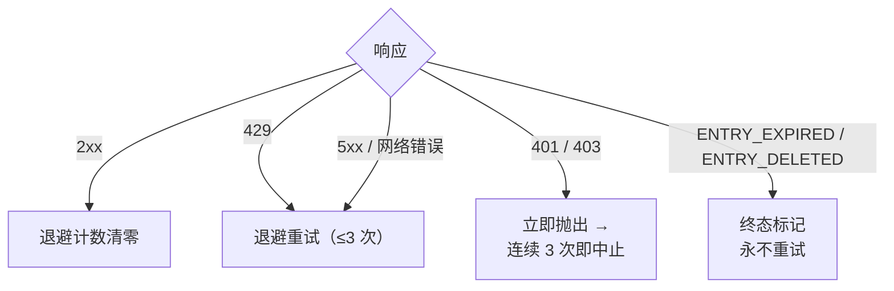

<a id="限频" data-pplx-source-anchor="true"></a>
# 限頻

限速策略裡的每個數字都服務於同一個目標：歸檔流量必須看起來像普通瀏覽。
單執行緒導出只有 1–2 次請求——約等於一次頁面瀏覽——batch 運行再把這些請求
攤到隨機間隔上，且無並發。這是明確要求的反風控紀律
（`pplx_export/core/throttle.py:1-2`），不是可調的性能參數。

<a id="具体数字" data-pplx-source-anchor="true"></a>
## 具體數字

| 位置 | 節奏 | 程式碼 |
|---|---|---|
| `batch`：執行緒之間 | 10–20 s 隨機均勻間隔（`--delay-min` / `--delay-max`） | `pplx_export/cli.py:126-129`，`pplx_export/core/throttle.py:33-36` |
| `sync-deleted --online`：候選之間 | 10–20 s 隨機均勻間隔 | `pplx_export/cli.py:164-167`，`pplx_export/commands/sync_deleted_cmd.py:368-369` |
| `search-mode-backfill`：聯網兜底 | 10–20 s 隨機均勻間隔 | `pplx_export/cli.py:144-147` |
| 執行緒內翻頁 / 空間列表翻頁 | 每頁 ≥3 s | `pplx_export/sites/perplexity/rest.py:39,56`，`pplx_export/sites/perplexity/adapter.py:285-309` |
| schematized 塊補抓（computer / deep-research / council / study） | 第二次抓取前等 ≥4 s | `pplx_export/sites/perplexity/adapter.py:27-32,88` |
| `spaces --fetch-meta` | 每空間 3 s | `pplx_export/commands/spaces_cmd.py:328` |
| `usage-backfill` | 每執行緒 3 s | `pplx_export/commands/usage_backfill_cmd.py:77` |
| `assets-backfill` 在線階段 | 每執行緒 3 s | `pplx_export/commands/assets_backfill_cmd.py:215,456` |
| 執行緒內資產下載 | 0.5 s | `pplx_export/sites/perplexity/assets.py:28,103` |
| `assets-backfill` CDN 階段 | 6 路並行下載，無間隔 | `pplx_export/commands/assets_backfill_cmd.py:460-475` |
| API 並發 | 無——任何時候都沒有 | — |

<a id="为什么是这个数" data-pplx-source-anchor="true"></a>
## 為什麼是這個數

- **單次導出 = 1–2 次請求 ≈ 一次頁面瀏覽。** search 執行緒只需一次
  `GET /rest/thread/<uuid>`；computer / deep-research / council / study
  恰好再加一次 schematized 塊抓取
  （`pplx_export/sites/perplexity/adapter.py:87-89`）。這與瀏覽器打開一次
  頁面的開銷相當——歸檔不會在日常使用之上增加有意義的負載。
- **10–20 s 隨機間隔、無並發。** 貼近人的閱讀節奏，隨機化避免節拍器式的
  規律請求；串行讓請求速率低於普通瀏覽本身。
- **翻頁 ≥3 s。** 長執行緒內的翻頁模擬滾動與閱讀時間。
- **塊補抓前 ≥4 s。** 否則 schematized 重抓會與 plain 抓取背靠背打到 API；
  這段停頓模擬重頁面加載完整負載前的延遲。
- **資產下載 0.5 s。** 靜態小檔案，開銷遠低於 API 調用——但仍然有節奏。
- **CDN 階段是唯一的放寬。** 簽名 URL 下載打到的是內容分發網絡而非
  Perplexity API，因此僅在此處允許 6 路並行。

<a id="错误处理与退避" data-pplx-source-anchor="true"></a>
## 錯誤處理與退避

所有分類都在 `CookieTransport._request`
（`pplx_export/core/http/cookie_transport.py:63-126`）完成；每個請求最多
`max_retries=3` 次嘗試（`cookie_transport.py:48`）。



| 響應 | 分類 | 處理 |
|---|---|---|
| 2xx | 成功 | 退避計數清零（`cookie_transport.py:77`）——計數不跨請求累積 |
| 429 | 限流 | 退避重試（`cookie_transport.py:86-92`） |
| 500 / 502 / 503 / 504 | 伺服器瞬態錯誤（504 常為 Cloudflare 抖動） | 至少退避重試一次再放棄（`cookie_transport.py:99-107`） |
| 網路錯誤 | 瞬態 | 退避重試（`cookie_transport.py:117-125`） |
| 401 / 403 | 鑑權失敗 | 立即拋 `AuthTransportError`——不退避（`cookie_transport.py:82-85`） |
| 400 + `ENTRY_EXPIRED` | 平台清除 | `EntryExpiredError`——終態，永不重試（`cookie_transport.py:96-98`） |
| 400 + `ENTRY_DELETED` | 用戶/遠端刪除 | `EntryDeletedError`——終態，永不重試（`cookie_transport.py:93-95`） |
| 404 / 其他狀態碼 | 普通錯誤 | 傳輸層不重試；**絕不**映射為終態（`cookie_transport.py:108-116`） |

**退避公式**（`pplx_export/core/throttle.py:38-50`）：
`delay_max × 3^N`，`N` 為連續失敗次數（指數鉗制到 8），±20% 抖動防同步，
封頂 300 s。最後一次失敗不再白睡；首次成功即 `throttle.reset()` 清零
（`throttle.py:52`）。

每條規則的理由：

- **429 退避** —— 伺服器明確要求減速，指數式地照辦。
- **5xx 重試** —— 一次閘道抖動不該讓一個執行緒失敗。
- **401/403 不退避** —— cookie 失效時等待無法自癒。
- **`ENTRY_EXPIRED` 不重試** —— 平台清除（約 3 個月窗口）是永久的，重試只會
  白費請求與退避預算。
- **404 永不進終態** —— `pplx-ask` 新建的執行緒可能因傳播延遲瞬態 404；打上
  終態會把只是暫時不可見的活執行緒誤葬。

<a id="调用方运行时预算" data-pplx-source-anchor="true"></a>
## 調用方運行時預算

上文的退避紀律是拿時鐘時間換帳號安全，調用方必須為這份時間留出預算：
單個請求最多 3 次嘗試，嘗試之間退避等待——單次封頂 300 s
（`pplx_export/core/throttle.py:38-50`）——網路翻覆時一個請求合理地
佔用 10 分鐘量級。`index` / `batch` 起步還有 session 探測，同樣走這套
規則（`pplx_export/commands/common.py:126`）。長時間靜默是退避等待中，
不是卡死。

面向 agent、cron、CI 包裝層的三條守則：

1. **一次調用只跑一個帳戶。** 多帳戶逐個串行、各起一個進程；不要用 `&&`
   串聯進帶硬超時的外層任務——第一個帳戶的退避級聯會吃光整個預算，
   後面的帳戶根本沒機會跑。
2. **超時預算 ≥ 15 分鐘，否則脫離前台。** 給包裝層留足超時，或後台運行 +
   看日誌（`-v` / `--log-file`）區分退避等待與真卡死。
3. **隨時中斷都安全。** 狀態原子落盤；重跑冪等，中斷留下的缺口自動修復
   （早停/續跑語義見[增量同步](incremental-sync.md)）。

<a id="鉴权-fail-fast" data-pplx-source-anchor="true"></a>
## 鑑權 fail-fast

batch 層對連續鑑權失敗計數（`_AUTH_FAIL_FAST = 3`，
`pplx_export/commands/batch_cmd.py:43`）。任何成功到達伺服器的響應——包括
`ENTRY_DELETED` / `ENTRY_EXPIRED`——都證明 cookie 有效並將計數清零
（`batch_cmd.py:170-182`）。連續 3 次 401/403：保存狀態檔案後中止運行
（`batch_cmd.py:190-194`）——cookie 失效還繼續空轉，只會讓數百個執行緒各失敗
一遍，浪費數小時。`sync-deleted` 遵循同一紀律
（`pplx_export/commands/sync_deleted_cmd.py:111,333-337`）。處理辦法：更新
cookie 後重跑，已導出的部分全部跳過。

`batch` 與傳輸層共享同一個 `Throttle` 實例（`pplx_export/cli.py:280-282`，
`batch_cmd.py:101-105`），退避計數不在層間分裂——且該共享實例在帳戶自動
切換後依然保留。

<a id="定时同步" data-pplx-source-anchor="true"></a>
## 定時同步

`pplx-export schedule` 計算當前增量計劃（新增/更新數量），並把 cron 片段
寫入 `<out>/index/cron_snippet.txt`（`pplx_export/commands/misc_cmd.py:86-96`，
`pplx_export/hooks/scheduler.py:48-77`）：

```bash
pplx-export schedule --account alice
```

```cron
17 3 * * * cd '<out-parent>' && '/abs/path/to/pplx-export' batch --account 'alice' --out '<out>'
```

- 週期運行**只跑增量**（早停）——不做全量重抓（`scheduler.py:4-9`）。
- 片段使用加引號的絕對路徑，因為 cron 的工作目錄與 `PATH` 不可預期
  （`scheduler.py:63-75`）。
- 用 `crontab -e` 安裝後按需調整時間；多帳戶錯開時段。
- 可選兜底：每週或每月手動跑一次
  `pplx-export batch --account alice --full`（見
  [incremental-sync.md](incremental-sync.md)）。

<a id="另见" data-pplx-source-anchor="true"></a>
## 另見

- [incremental-sync.md](incremental-sync.md) —— 每輪定時運行實際導出什麼
- [pplx-export.md](pplx-export.md) —— `--delay-min` / `--delay-max` 及其他命令選項
- [troubleshooting.md](troubleshooting.md) —— 鑑權 fail-fast 中止後怎麼辦
- [../architecture/rate-limiting-errors.md](../architecture/rate-limiting-errors.md) —— 完整錯誤分類
- [../reference/api/api-responses-errors.md](../reference/api/api-responses-errors.md) —— 平台側錯誤語義（`ENTRY_EXPIRED`、`ENTRY_DELETED`、Cloudflare）
- [../reference/api/api-authentication.md](../reference/api/api-authentication.md) —— cookie 與多帳戶切換
