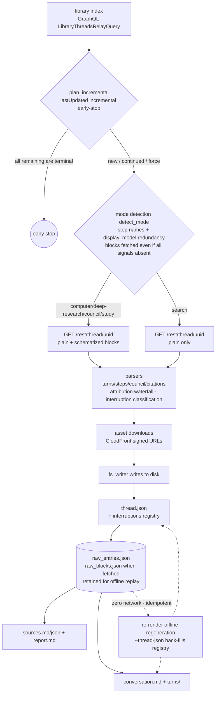
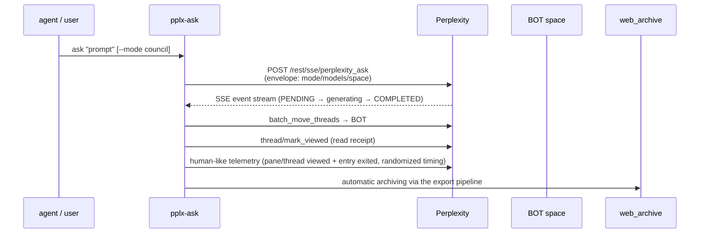

# pplx_export — Perplexity conversation export framework

[中文文档](README.zh-CN.md)

An object-oriented conversation export framework designed to survive upstream
data-structure changes.

## Architecture layers

```
config.py    Single source of truth for site constants & default paths
             (PPLX_DOMAIN / SESSION_URL / DEFAULT_ARCHIVE_ROOT)
             + user-level config loading (account registry / BOT space externalized:
             --config > PPLX_EXPORT_CONFIG > ~/.config/pplx-export/config.toml;
             template: config.example.toml)
core/        Domain models, errors, throttling, dual-channel transport, credentials,
             checkpoints, relation graph, registry
  models.py    Domain models (Account/Space/Conversation/Turn/Step/Citation/Asset/SubAgent/RelationEdge)
  errors.py    Error types
  throttle.py  Randomized intervals / 429 backoff (anti rate-limit)
  logging.py   Central logging (leveled console + full --log-file output)
  state.py     batch_state resumable checkpoints (atomic writes)
  cookies.py   Browser cookie import (incl. multi-account token enumeration
               from_browser_raw/list_account_tokens)
  auth.py      [Reserved/degradation chain] WebBridge fallback cookie retrieval
               (only used by cookies.from_webbridge)
  relations.py Conversation relation graph (RelationEdge → edges.jsonl + graph.md)
  http/        Transport ABC + CookieTransport (direct urllib) + WebBridgeTransport
               (page context)
               + FallbackTransport [reserved: cookie failure → refresh → degrade,
               not wired in]
               + BrowserAutomationTransport [reserved: heavyweight browser
               automation placeholder, not implemented]
sites/       SiteAdapter interface and per-site adapters
  base.py      SiteAdapter ABC (list_threads/get_thread/get_report/get_assets/relations)
  perplexity/  Perplexity adapter: graphql / rest / parsers / normalize / assets / render
               / ask_api (interactive queries: envelope/SSE stream/read receipts/
               space ops/human-like telemetry)
               / fs_writer (web_archive layout on disk: threads/sources/report/
               assets/raw + spaces index)
writers/     Output writer interface
  base.py      Writer ABC (the web_archive layout implementation moved into
               sites/perplexity/fs_writer.py)
hooks/       Hook system
  incremental.py Incremental early-stop (pure function plan_incremental + thin
               IncrementalHook shell)
  relations_hook.py Rebuild relation edges after export
  scheduler.py   Periodic incremental plan + cron snippet
commands/    Command implementation layer (shared by cli.py/ask_cli.py)
  common.py    Account mapping, make_transport, shared parameters, log & cookie
               cache paths (follow --out)
  index_cmd / export_cmd / batch_cmd / spaces_cmd / misc_cmd / rerender_cmd /
  assets_backfill_cmd / usage_backfill_cmd
cli.py       pplx-export entry point (argparse + dispatch)
ask_cli.py   pplx-ask entry point (interactive queries)
tests/       pytest: render snapshot regression (five-mode fixtures + defect
             scenarios) + core unit tests
```

## User-level configuration (accounts / BOT space, externalized)

The account registry (display name / email / user_id) and the BOT space are
personal data and are **not committed to the repo**; they live in an external TOML
file. Load priority: `--config PATH` > `PPLX_EXPORT_CONFIG` environment variable >
the default `~/.config/pplx-export/config.toml`. Template: `config.example.toml`
(copy it to the default path, fill in real values, and `chmod 600` it).

Behavior when the config is missing: commands without `--account` run in a degraded
mode (email ownership check is skipped with a warning; offline commands are
unaffected); an explicit `--account` raises an error pointing at
`config.example.toml`. When `--account` is omitted, `default_account` from the
config is used.

## Data paths (Perplexity)

> Full field-tested reference of endpoints / responses / error semantics:
> `docs/reference/api/index.md` at the repo root.

**Archive export pipeline (pplx-export):**



**Interactive query flow (pplx-ask):**



- List: `POST /rest/perplexity_ask/graphql` (LibraryThreadsRelayQuery + cursor pagination)
- Thread: `GET /rest/thread/<uuid>` (plain + schematized + pagination + background_entries)
- Spaces: `GET /rest/collections/get_collection` (owner/members), `list_collection_threads` (offset pagination)
- Assets/reports: CloudFront signed URLs in the schematized response, downloaded directly via urllib
- Sub-agents: `workflow_payload.objective_chunks` (prompt) + `background_entries` (steps/conclusion)

## Resilience to data-structure changes

- All field extraction is centralized in `sites/perplexity/parsers.py` (versioned
  schemas + graceful degradation); if Perplexity changes its structure, only this
  one place needs updating.
- Successful exports retain `raw_*.json` → parsing/rendering can be re-run
  offline without refetching.
- Mode detection takes the entry-level `search_mode` (the platform's self-reported
  conversation type) as the highest-priority signal, with step names
  (`RESEARCH_ANSWER` etc.) and `display_model` as redundant fallbacks — it does not
  rely on fragile localized labels; blocks are fetched even when every detection
  signal is absent.

## Answer-rewrite variant detection (answer_variants)

Alternate answers replaced by the platform's "answer rewrite / A-B experiments" are
invisible on the API side and may eventually be purged by the platform (dead
sibling links have been observed). The tool detects traces of
`entries[].side_by_side_metadata` (narrowed criteria) on both the export and the
offline re-render paths; on a hit it:

- emits a WARNING-level single-line log with the uniform grep-able marker
  **`ANSWER_VARIANT_DETECTED`** (full locating fields: thread uuid/uuid8,
  entry_uuid, sibling_uuid, selection_status, plus handling guidance); the batch
  summary additionally appends a ⚠ hit reminder;
- registers `thread.json.answer_variants` and appends centrally to
  `web_archive/index/answer_variants_log.jsonl` (deduplicated by thread+entry,
  idempotent);
- re-render `--thread-json` syncs the key offline, alerting only on content changes
  so full-archive reruns stay quiet.

On a hit, manually verify and backfill the alternate answer as soon as possible.
Criteria, dead-link evidence, and the handling procedure: `docs/reference/api/api-responses-errors.md`
§5.2; detection-chain implementation: `docs/architecture/offline-operations.md` §18.

## Dual channels (moving out of the browser)

- **Preferred**: `CookieTransport` (fetch cookies once, then talk directly via
  urllib — no browser driver needed).
- **Fallback**: `WebBridgeTransport` (fetch in the page context).
- **Auth failure**: the default `CookieTransport` fails fast on 401/403 (no
  backoff, no refresh; the batch layer aborts after consecutive auth failures).
  The actual cookie-refresh mechanisms are: re-import from the browser cookie
  store after the 12h cache expires (auto-detect), and automatic switch probing on
  account mismatch (enumerating `__Secure-pplx.session.*` tokens). Automatic
  refresh on 401/403 only exists when FallbackTransport is enabled (see below —
  currently not wired in).
- **Reserved / degradation chain (not wired in)**: `FallbackTransport` (cookie
  failure → refresh → degrade) and `BrowserAutomationTransport` (heavyweight
  browser automation placeholder) are architectural reservations with no callers
  today; bridge error classification already matches CookieTransport
  (401/403 → Auth, 400+ENTRY_EXPIRED → Expired, 5xx backoff-retry), so enabling
  the fallback introduces no additional detection gaps.

## Installation & usage

**Install globally as a uv tool** (recommended), from the repo root:

```bash
uv tool install .                # or: uvx --from . pplx-export
pplx-export --help               # overview (with examples); each subcommand has its own help
pplx-export batch --help         # subcommand-specific parameters
pplx-export --version            # version
pplx-export batch -v             # debug output (request tracing / internal decisions)
pplx-export batch --log-file     # full logs to disk (default web_archive/index/logs/)
```

**Cookie sources (WebBridge is not used by default)**:

```bash
# default: auto-detect browser store and import cookies (edge→chrome→firefox→safari)
pplx-export export <thread_url>

# import from a specific browser
pplx-export export <thread_url> --cookies-from edge

# use a cookie file
pplx-export export <thread_url> --cookies /path/to/cookies.txt

# explicitly use the WebBridge page context (fallback channel, must be explicit)
pplx-export export <thread_url> --transport webbridge
```

After cookies are obtained, the tool calls `/api/auth/session` and prints the
current account email so you can confirm the right account is in use (watch out if
`--account` disagrees with the cookie account).

**pplx-ask (interactive queries)**:

```bash
pplx-ask models                          # models available per mode (models/config/v2)
pplx-ask ask "<prompt>"                  # search-mode query (SSE streaming)
pplx-ask ask "<prompt>" --mode council   # model council (three models by default; --models to change)
pplx-ask ask "<prompt>" --mode deep-research --space <slug>  # create in a given space, moved to BOT on completion
pplx-ask ask "<prompt>" --mark-read      # send a read receipt on completion (thread viewed)
pplx-ask mark-read <thread_url|uuid>     # send a read receipt standalone
pplx-ask space-create "<title>"          # create a space (create_collection)
```

After a query: streaming progress → auto-move into the BOT space → optional read
receipt → automatic archiving into web_archive. The output ends with
machine-readable JSON (thread_url/context_uuid/files on disk) for other agents to
consume.

**Subcommands**:

```bash
pplx-export index --account alice             # fetch the library list
pplx-export space-index <space_url>           # space thread list (direct REST; --transport webbridge falls back to browser rendering)
pplx-export export <thread_url>               # export a single thread
pplx-export batch --account bob               # batch (resumable checkpoints)
pplx-export batch --account bob --mode council  # export one mode only (search/deep-research/computer/council/study; index rows with search_mode use the authoritative SEARCH_MODE_MAP, others fall back to heuristics)
pplx-export spaces                            # rebuild the space index
pplx-export sync-space                        # sync thread.json space attribution (purely local, zero network; run index first)
pplx-export relations                         # rebuild the conversation relation graph (four edge types: same_space/subagent_of/same_prompt/references; rebuilt offline from local raw)
pplx-export schedule --account alice          # incremental plan + cron snippet
pplx-export usage-backfill --account alice    # backfill credit-usage records → index/credit_usage_<account>.json
pplx-export search-mode-backfill [--offline]  # backfill index-row search_mode (local raw first, online fallback; idempotent & resumable)
pplx-export sync-deleted [--online]           # identify remotely deleted threads (default: offline dry-run listing candidates; --online verifies then marks deleted terminal state + thread.json tombstone; local archives are kept)
pplx-export re-render [--limit N] [--dry-run]  # offline re-render of conversation.md + turns/ (zero network, other files untouched)
pplx-export assets-backfill [--fetch-blocks] [--online]  # asset remediation (refetch blocks + inline extraction + optional online refresh)
```

## Testing

```bash
uv run pytest        # fully offline (snapshot fixtures are committed; zero network)
```

- `tests/test_render_snapshots.py`: render snapshot regression — five-mode fixtures
  (under `fixtures/`; provenance and trimming notes in `fixtures/README.md`) are
  re-rendered end-to-end and compared byte-for-byte against archived goldens; plus
  five trimmed defect scenarios (computer answer fallback / sub-agent fallback /
  USER_RESPONSE Q-A pairs / stub-turn association / nested workflow folding).
- `tests/test_units.py`: unit tests for `core/state.py`, `core/throttle.py`,
  `hooks/incremental.py`, asset naming (`_final_name` double-extension guard),
  formula normalization (`normalize_math_delims` fence/inline-code protection),
  mode detection (`search_mode` signal), directory-name cleanup, external
  review fix regressions, and more.
- `tests/test_interruptions.py` / `tests/test_stub_workflows.py`: interruption
  semantics (`classify_wf_status` classification, attribution-waterfall appendix,
  render annotation & registration) and stub-turn association
  (`match_stub_workflows` time window, nested-render recursion guard) scenarios.
- `tests/test_fix_n*.py` / `tests/test_fix_v3*.py` / `tests/test_fix_v4*.py`:
  fix-by-fix regressions from the 2nd, 3rd, and 4th external review rounds (inline
  asset persistence, spaces back-links, cookie domain matching, error
  classification, table headers, batch accounting, nested SOURCES bodies,
  export-only artifacts, handle-type asset persistence idempotency, etc., added as
  fixes landed); each file's header docstring restates the corresponding finding.
- Test-file grouping and the full list: `docs/development/testing-architecture.md` §13; case counts are
  whatever the actual test run reports.

## Adding a new site adapter

Implement `sites/base.py:SiteAdapter`
(list_threads/get_thread/get_report/get_assets/relations), register it via
`core.registry.register("<site>", YourAdapter)`, and the core layer (throttling /
checkpoints / writers / relation graph / hooks) is reused as-is.

## Notes

- Cookie decryption uses `browser_cookie3`; `rookiepy` is currently uninstallable
  due to broken sdist metadata (2026-07).
- Heavyweight browser automation (Playwright/Selenium) has a reserved interface in
  `core/http/browser_automation_transport.py`, not implemented.
