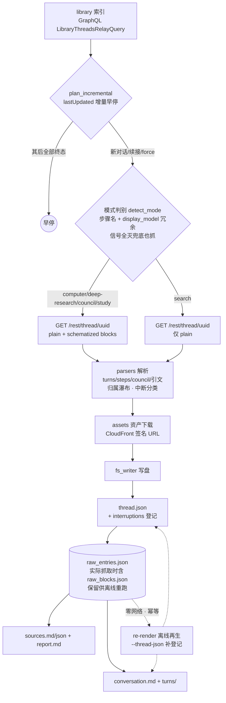
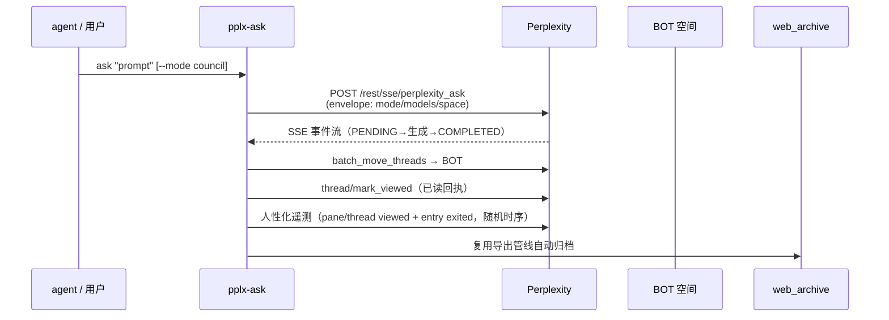

# pplx_export — Perplexity 对话导出框架

[English README](README.md)

面向对象、可抗数据结构变更的对话记录导出框架。

## 架构分层

```
config.py    站点常量与默认路径单一来源（PPLX_DOMAIN / SESSION_URL / DEFAULT_ARCHIVE_ROOT）
             + 用户级配置加载（账户表 / BOT 空间外置：--config > PPLX_EXPORT_CONFIG
             > ~/.config/pplx-export/config.toml；模板 config.example.toml）
core/        领域模型、错误、限频、双通道 transport、凭证、断点、关系图、注册表
  models.py    领域模型（Account/Space/Conversation/Turn/Step/Citation/Asset/SubAgent/RelationEdge）
  errors.py    错误类型
  throttle.py  随机间隔 / 429 退避（防风控）
  logging.py   中央日志（console 分级 + --log-file 全量落盘）
  state.py     batch_state 断点续跑（原子写入）
  cookies.py   浏览器 cookie 导入（含多账户令牌枚举 from_browser_raw/list_account_tokens）
  auth.py      【预留/降级链】WebBridge 兜底取 cookie（仅 cookies.from_webbridge 用）
  relations.py 对话关系图（RelationEdge → edges.jsonl + graph.md）
  http/        Transport ABC + CookieTransport（urllib 直连）+ WebBridgeTransport（页面上下文）
               + FallbackTransport【预留：cookie 失败→刷新→降级，未接线】
               + BrowserAutomationTransport【预留：重量级浏览器自动化占位，未实现】
sites/       SiteAdapter 接口与各站点适配
  base.py      SiteAdapter ABC（list_threads/get_thread/get_report/get_assets/relations）
  perplexity/  Perplexity 适配：graphql / rest / parsers / normalize / assets / render
               / ask_api（交互查询：envelope/SSE 流/已读回执/空间操作/人性化遥测）
               / fs_writer（web_archive 布局落盘：threads/sources/report/assets/raw + spaces 索引）
writers/     输出落盘接口
  base.py      Writer ABC（web_archive 布局实现已迁入 sites/perplexity/fs_writer.py）
hooks/       Hook 系统
  incremental.py 增量早停（纯函数 plan_incremental + IncrementalHook 薄壳）
  relations_hook.py 导出后重建关系边
  scheduler.py   周期增量计划 + cron 片段
commands/    命令实现层（cli.py/ask_cli.py 共用）
  common.py    账户映射、make_transport、通用参数、日志与 cookie 缓存路径（跟随 --out）
  index_cmd / export_cmd / batch_cmd / spaces_cmd / misc_cmd / rerender_cmd /
  assets_backfill_cmd / usage_backfill_cmd
cli.py       pplx-export 入口（argparse + 分发）
ask_cli.py   pplx-ask 入口（交互式查询）
tests/       pytest：渲染快照回归（五模式 fixture + 缺陷场景）+ 核心单测
```

## 用户级配置（账户 / BOT 空间，外置）

账户注册表（显示名/email/user_id）与 BOT 空间属个人隐私，**不入库**，
外置为 TOML 配置，加载优先级：`--config PATH` > 环境变量 `PPLX_EXPORT_CONFIG`
> 默认 `~/.config/pplx-export/config.toml`。模板见 `config.example.toml`
（复制到默认路径并填入真实值，建议 `chmod 600`）。

配置缺失时的行为：未指定 `--account` 的命令以降级模式运行（email 归属校验
跳过并 warning，离线命令不受影响）；显式 `--account` 则报错并指向
`config.example.toml`。`--account` 未给时取配置中的 `default_account`。

## 数据通路（Perplexity）

> 端点/响应/错误语义的完整实测参考：仓库根 `docs/reference/api/index.md`。

**归档导出管线（pplx-export）：**



**交互式查询流程（pplx-ask）：**



- 列表：`POST /rest/perplexity_ask/graphql`（LibraryThreadsRelayQuery + cursor 分页）
- 线程：`GET /rest/thread/<uuid>`（普通 + schematized + 翻页 + background_entries）
- 空间：`GET /rest/collections/get_collection`（所有者/成员）、`list_collection_threads`（offset 分页）
- 资产/报告：schematized 响应中的 CloudFront 签名 URL，urllib 直连下载
- 子代理：`workflow_payload.objective_chunks`（prompt）+ `background_entries`（步骤/结论）

## 抗数据结构变更

- 所有字段提取集中在 `sites/perplexity/parsers.py`（schema 版本化 + 优雅降级）；
  Perplexity 改结构只需改这一处。
- 成功导出会保留 `raw_*.json` → 解析/渲染可离线重跑，不重抓。
- 模式判别以 entry 级 `search_mode`（平台自报会话类型）为最高优先级信号，
  步骤名（`RESEARCH_ANSWER` 等）与 `display_model` 冗余兜底，不依赖脆弱的中文标签；
  判别信号全灭时兜底也抓 blocks。

## 答案重写变体检测（answer_variants）

平台「答案重写 / A-B 实验」中被替换的备选答案在 API 侧不可见，且或将被平台清理
（sibling 死链已实证）。工具在导出与离线 re-render 两条路径上检测
`entries[].side_by_side_metadata` 痕迹（收窄判据），命中即：

- 抛出 WARNING 级单行日志，统一可 grep 标记 **`ANSWER_VARIANT_DETECTED`**
  （含 thread uuid/uuid8、entry_uuid、sibling_uuid、selection_status 等全量定位字段
  与处置指引）；batch 末尾摘要另附 ⚠ 命中提醒；
- 登记 `thread.json.answer_variants`，并集中追加到
  `web_archive/index/answer_variants_log.jsonl`（按 thread+entry 去重，幂等）；
- re-render `--thread-json` 离线同步该键，仅内容变化时告警，全库重跑不刷屏。

命中后请第一时间人工确认备选答案并补录；判据、死链取证与处置流程详见
`docs/reference/api/api-responses-errors.md` §5.2，检测链实现见 `docs/architecture/offline-operations.md` §18。

## 双通道（迁出浏览器）

- **优先**：`CookieTransport`（取一次 cookie 后 urllib 直连，无需浏览器驱动）。
- **回退**：`WebBridgeTransport`（页面上下文 fetch）。
- **鉴权失败**：默认 `CookieTransport` 遇 401/403 立即抛错 fail-fast（不退避不刷新；
  batch 层连续鉴权失败即中止）。cookie 的实际更新机制是 12h 缓存过期后从浏览器
  cookie 库重取（auto-detect），以及账户不匹配时的自动切换探测（枚举
  `__Secure-pplx.session.*` 令牌）；401/403 自动刷新仅 FallbackTransport 启用时
  才存在（见下条，当前未接线）。
- **预留/降级链（未接线）**：`FallbackTransport`（cookie 失败→刷新→降级）与
  `BrowserAutomationTransport`（重量级浏览器自动化占位）属架构预留，当前无调用方；
  bridge 错误分类已对齐 CookieTransport（401/403→Auth、400+ENTRY_EXPIRED→Expired、
  5xx 退避重试），fallback 启用无额外检测缺口。

## 安装与用法

**作为 uv tool 全局安装**（推荐），在仓库根目录执行：

```bash
uv tool install .              # 或 uvx --from . pplx-export
pplx-export --help             # 总览（含示例）；每个子命令另有专属帮助
pplx-export batch --help       # 子命令专属参数说明
pplx-export --version          # 版本号
pplx-export batch -v           # 调试输出（请求追踪/内部判定）
pplx-export batch --log-file   # 全量日志落盘（默认 web_archive/index/logs/）
```

**cookie 来源（默认不经 WebBridge）**：

```bash
# 默认：auto-detect 浏览器库导入 cookie（edge→chrome→firefox→safari）
pplx-export export <thread_url>

# 指定从某个浏览器导入
pplx-export export <thread_url> --cookies-from edge

# 用 cookie 文件
pplx-export export <thread_url> --cookies /path/to/cookies.txt

# 显式走 WebBridge 页面上下文（回退通道，需显式指定）
pplx-export export <thread_url> --transport webbridge
```

取到 cookie 后会调用 `/api/auth/session` 打印当前账户邮箱，便于确认账户是否正确
（`--account` 与 cookie 账户不一致时请留意）。

**pplx-ask（交互式查询，2026-07-21 新增）**：

```bash
pplx-ask models                          # 各模式可选模型（models/config/v2）
pplx-ask ask "<prompt>"                  # 搜索模式发问（SSE 流式）
pplx-ask ask "<prompt>" --mode council   # 模型委员会（默认三模型，--models 可换）
pplx-ask ask "<prompt>" --mode deep-research --space <slug>  # 在指定空间创建，完成后移入 BOT
pplx-ask ask "<prompt>" --mark-read      # 完成后发已读回执（thread viewed）
pplx-ask mark-read <thread_url|uuid>     # 单独发已读回执
pplx-ask space-create "<title>"          # 创建空间（create_collection）
```

发问后：流式显示进度 → 自动移入 BOT 空间 → 可选已读回执 → 自动归档到 web_archive。
末尾输出机器可读 JSON（thread_url/context_uuid/落盘），供其他 agent 消费。

**子命令**：

```bash
pplx-export index --account alice             # 提取列表
pplx-export space-index <space_url>           # 空间会话列表（REST 直连；--transport webbridge 回退浏览器渲染）
pplx-export export <thread_url>               # 导出单线程
pplx-export batch --account bob               # 批量（断点续跑）
pplx-export batch --account bob --mode council  # 只导出指定模式（search/deep-research/computer/council/study；索引行有 search_mode 走 SEARCH_MODE_MAP 权威映射，无则回落启发式）
pplx-export spaces                            # 重建空间索引
pplx-export sync-space                        # 同步 thread.json 空间归属（纯本地零网络；前置先跑 index）
pplx-export relations                         # 重建对话关系图（same_space/subagent_of/same_prompt/references 四种边；纯本地 raw 离线重建）
pplx-export schedule --account alice          # 增量计划 + cron 片段
pplx-export usage-backfill --account alice    # 补全积分用量记录 → index/credit_usage_<account>.json
pplx-export search-mode-backfill [--offline]  # 补全索引行 search_mode（本地 raw 优先，联网兜底；幂等可续跑）
pplx-export sync-deleted [--online]           # 识别远端已删除线程（默认离线 dry-run 列候选；--online 验证后标 deleted 终态 + thread.json 墓碑；本地归档保留）
pplx-export re-render [--limit N] [--dry-run]  # 离线重渲 conversation.md + turns/（零网络，不动其他文件）
pplx-export assets-backfill [--fetch-blocks] [--online]  # 资产补救（补抓 blocks + 内联提取 + 可选在线刷新）
```

## 测试

```bash
uv run pytest        # 全离线（快照 fixture 已入库，零网络）
```

- `tests/test_render_snapshots.py`：渲染快照回归——五种模式 fixture（fixtures/，来源与裁剪说明见
  `fixtures/README.md`）全链路重渲与归档 golden 逐字节比对；外加五个裁剪缺陷场景
  （computer 答案兜底 / 子代理 fallback / USER_RESPONSE 问答对 / 桩轮关联 / 嵌套工作流折叠）。
- `tests/test_units.py`：`core/state.py`、`core/throttle.py`、`hooks/incremental.py`、
  资产命名（`_final_name` 双扩展名防护）、公式规范化（`normalize_math_delims` 围栏/行内码保护）、
  模式判别（`search_mode` 信号）、目录名清理、外部审查修复回归等单测。
- `tests/test_interruptions.py` / `tests/test_stub_workflows.py`：中断语义
  （`classify_wf_status` 分类、归属瀑布附录、渲染加注与登记）与桩轮关联
  （`match_stub_workflows` 时间窗、嵌套渲染递归守卫）场景测试。
- `tests/test_fix_n*.py` / `tests/test_fix_v3*.py` / `tests/test_fix_v4*.py`：第二、三、四轮
  外部审查的逐条修复回归（内联资产落盘、spaces 反链、cookie 域匹配、错误分类、表格列头、
  batch 口径、嵌套 SOURCES 正文、导出专属产物、句柄类资产落盘幂等等，随修复落地增补）；
  各文件头 docstring 复述对应发现。
- 测试文件分组与完整清单见 `docs/development/testing-architecture.md` §13；用例数量以实测输出为准。

## 适配新站点

实现 `sites/base.py:SiteAdapter`（list_threads/get_thread/get_report/get_assets/relations），
经 `core.registry.register("<site>", YourAdapter)` 注册后，即可复用核心层
（限频/断点/写盘/关系图/Hook）。

## 备注

- cookie 解密用 `browser_cookie3`；`rookiepy` 因其 sdist 元数据损坏暂不可装（2026-07）。
- 重量级浏览器自动化（Playwright/Selenium）接口预留于 `core/http/browser_automation_transport.py`，未实现。
